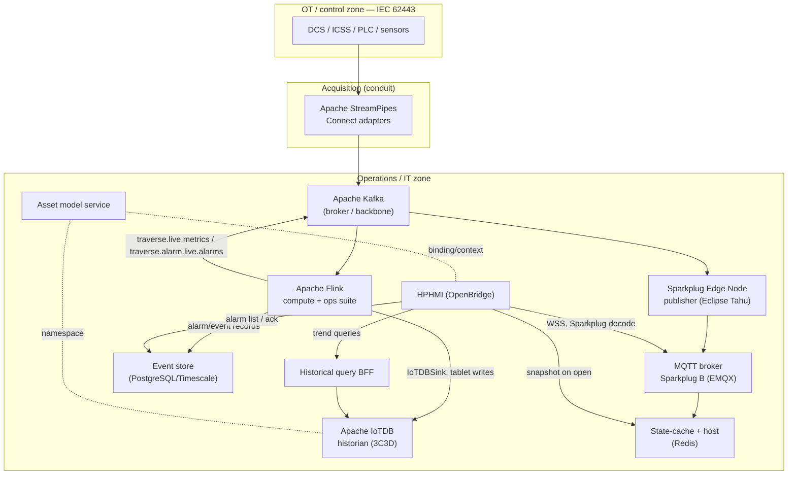

# Traverse Edge — Operations Platform
## Software Design & Integration Specification

**Document type:** Development specification (build-against)
**Audience:** Platform engineering, streaming engineering, frontend (HPHMI), DevOps/SRE
**Status:** Baseline for build — open decisions tracked in §13
**Architecture principle:** COTS-first / configuration over code; custom code only where genuinely unavoidable

---

## 1. Purpose and scope

This document specifies the build of the Traverse Edge operations platform: an open-source industrial data and operations stack that ingests OT telemetry, computes operations analytics in stream, persists history, and serves a High-Performance HMI (HPHMI) to operators with both real-time and historical data, plus an operations suite (alarm management, loop performance, asset performance, instrument diagnostics).

The defining engineering constraint is **read/write separation (CQRS)**: the current value of a tag is never read from the historian, and the operator UI never connects to the historian directly. This is the same separation every mature historian uses (snapshot vs archive; push channel vs query API) and is what makes the platform serve thousands of concurrent operators.

In scope: ingestion contract, stream compute, historian, real-time distribution (MQTT Sparkplug B), historical query interface, event store, asset model, and the HPHMI client. Out of scope (this revision): the StreamPipes adapter configuration per data source (operational task, not a build task), and supervisory write-back beyond the conditional module in §8.6.

---

## 2. Architecture overview

**Three planes:**

- **Write/compute plane** — StreamPipes → Kafka → Flink → IoTDB. Established baseline; Flink is the single stateful compute layer.
- **Real-time read plane (push)** — Flink → Kafka live topics → Sparkplug Edge Node → MQTT broker → HPHMI. Current values and live alarm state, fan-out to many subscribers.
- **Historical read plane (pull)** — HPHMI → Query BFF → IoTDB decimated queries. Trends and history, bounded result sets.

---

## 3. Technology stack and rationale

| Layer | Technology | Role | License | Build posture |
|---|---|---|---|---|
| Adapters | Apache StreamPipes Connect | OT protocol ingestion → Kafka | Apache 2.0 | Configure |
| Broker / backbone | Apache Kafka | Durable event backbone | Apache 2.0 | Configure |
| Stream compute | Apache Flink (+ flink-cep, Flink SQL) | Ops suite + transforms | Apache 2.0 | Custom jobs (minimised via SQL/CEP) |
| Flink→historian | flink-iotdb-connector 2.0.3 | Tablet writes to IoTDB | Apache 2.0 | Configure (existing artifact) |
| Historian | Apache IoTDB (tree model, 3C3D) | Time-series store | Apache 2.0 | Configure |
| Real-time encode | Eclipse Tahu (Sparkplug B) | NBIRTH/DBIRTH/NDATA/DDATA | EPL / Apache | Library (thin service) |
| Real-time broker | EMQX (or HiveMQ CE) | Sparkplug-aware MQTT + WSS | Apache 2.0 (OSS) | Configure |
| State cache / host | Redis + Tahu host (or EMQX rule) | Snapshot + alias registry | BSD / Apache | Thin service or broker rule |
| Event store | PostgreSQL (+ TimescaleDB optional) | Alarms, events, cases, ack | PostgreSQL / Apache | Configure + schema |
| Asset model | Service (StreamPipes asset mgmt reusable) | AF-equivalent context | Apache 2.0 | Custom (product IP) |
| Historical API | Query BFF (IoTDB Session/REST) | Decimated trend serving | n/a | Thin service |
| HMI | OpenBridge web components (+ React) | HPHMI | AGPL→Apache (see §12) | Custom UI on library |
| Operator viz (eng.) | Grafana + IoTDB plugin | Engineering/ops dashboards | AGPL/Apache | Configure |

**Minimise-custom-code matrix** — what is configured vs built:

- **Configure only:** StreamPipes adapters, Kafka, Flink runtime, flink-iotdb-connector, IoTDB cluster, MQTT broker, Redis, PostgreSQL, Grafana.
- **Library use (not built):** Eclipse Tahu (Java + JS `sparkplug-payload`), MQTT.js (browser), OpenBridge components, IoTDB Session/REST SDK.
- **Genuinely custom (minimal):** (a) Flink operations-suite jobs — irreducible business logic, but expressed in Flink SQL + MATCH_RECOGNIZE / CEP wherever possible; (b) Sparkplug Edge Node publisher — thin Tahu wrapper around a Kafka consumer; (c) State-cache host — thin, or eliminated by an EMQX rule that decodes Sparkplug into Redis; (d) Historical Query BFF — thin decimation/auth gateway; (e) Asset Model service — the differentiated product IP; (f) HPHMI application.

---

## 4. Ingestion — StreamPipes → Kafka

**Responsibility:** Connect OT sources, harmonise units/timestamps, publish to Kafka.

- Deploy StreamPipes with the **Kafka** profile (`docker-compose.kafka.yml`); the internal messaging default is now NATS, so the Kafka deployment must be selected explicitly.
- Use Connect adapters (OPC UA, MQTT, PLC4X for S7/Modbus, WinCC) configured from the UI. Adapters run as edge-side worker microservices; core/UI stay central.
- Apply harmonisation rules at the adapter: mark timestamp field, set engineering unit and target unit conversion, set semantic type. **The source/device timestamp is the event time** carried end-to-end.
- **Do not** use the StreamPipes Flink wrapper (deprecated). StreamPipes is used for adapters only; the platform runs its own Flink cluster.

**Kafka topic contract (ingestion):**

- `raw.telemetry.<site>` — harmonised samples. Key = asset/series id. Value = Avro or JSON: `{ seriesId, ts (epoch ms, source time), value, quality, unit }`.
- Use a schema registry (Avro) to lock the contract. Partition by `seriesId` hash for ordering per series.

---

## 5. Stream compute — Apache Flink

**Responsibility:** Event-time processing, persistence to IoTDB, live-state publication, and the operations suite.

**Runtime & guarantees:**
- Event time with watermarks using the source timestamp; allowed lateness sized to the worst store-and-forward gap (e.g. 30 s default, configurable per stream).
- Checkpointing on for exactly-once internal state; the IoTDB sink is at-least-once but made **effectively idempotent** by IoTDB's `(series, timestamp)` overwrite semantics — replays do not duplicate.
- Keyed streams by asset/loop id so all ops-suite state is per equipment item.

**Core jobs:**

1. **Persistence job** — writes all (and derived) series to IoTDB via `flink-iotdb-connector` (`IoTDBSink`), batched `Tablet` inserts, server `enable_auto_create_schema=true`, schema/device templates registered for cardinality control. Tree paths follow §7.
2. **Live-state job** — emits current value + quality per series to Kafka topic `traverse.live.metrics`, and current alarm state to `traverse.alarm.live.alarms`. Report-by-exception (only on change beyond deadband) to bound MQTT volume.
3. **Operations suite jobs** — §9.

**Minimise code:** Prefer **Flink SQL** for threshold logic, deadbands, aggregations, and rollups; **MATCH_RECOGNIZE / flink-cep** for sequential alarm and predictive patterns; reserve Java DataStream + UDF/UDAF for stateful KPIs that SQL cannot express (e.g. Harris index). `flink-cep` version must match the deployed Flink version.

---

## 6. Historian — Apache IoTDB

Per the cluster specification already agreed: tree model, 3C3D topology (3 ConfigNodes Ratis + schema replica 3; 3 DataNodes IoTConsensus + data replica 2), multi-disk-group DataNodes, OSS build from the Apache release channel (no license/activation). See the cluster topology diagram delivered separately.

**Read interfaces exposed:**
- **Session API (Java)** — used by the Query BFF (high performance).
- **REST API (v2)** — optional direct path for lightweight consumers.
- **JDBC** — ad-hoc / BI.
- **Grafana IoTDB plugin** — engineering and ops-management dashboards (not the operator HMI).

**Query shapes the BFF uses:**
- **Last value** — current reading (rarely needed; HMI uses the cache instead).
- **Decimated/aggregated** — `GROUP BY ([start,end), interval)` sized to trend pixel width; IoTDB downsamples in real time at arbitrary granularity, so no precomputed rollups are required.
- **Raw recorded** — bounded window for zoom/export.

---

## 7. Namespace and data model (critical — single source of truth)

One identity must map cleanly across three representations. Define this mapping once in the Asset Model service and generate the others.

| Representation | Pattern | Example |
|---|---|---|
| IoTDB tree path | `root.<site>.<area>.<unit>.<device>.<measurement>` | `root.site1.u200.p101.disch_press` |
| Sparkplug topic | `spBv1.0/<group_id>/<verb>/<edge_node_id>/<device_id>` | `spBv1.0/site1_u200/DDATA/edge1/p101` |
| Sparkplug metric | `<device>/<measurement>` (+ integer alias) | `p101/disch_press` (alias 1042) |

- The IoTDB tree is a **structural** namespace; the Asset Model service supplies the **semantic** layer (templates, KPI definitions, faceplate bindings) — the AF-equivalent. **Reuse StreamPipes asset/UNS management** for asset/site/location registry to reduce custom build; extend only for HMI binding and KPI definitions.
- Align the Sparkplug group/edge/device hierarchy to the ISA-95 asset hierarchy so the UNS is consistent across planes.

---

## 8. Integration interface contracts (primary focus)

### 8.1 Flink → IoTDB (write)
- Connector: `org.apache.iotdb:flink-iotdb-connector:2.0.3`, `IoTDBSink` with `withBatchSize(n)` (n in low thousands), `IoTSerializationSchema` mapping fields to tree paths.
- Server: `enable_auto_create_schema=true`; pre-register device templates for high-cardinality assets.
- Idempotency via source-timestamp event time.

### 8.2 Flink → Sparkplug Edge Node (live hand-off)
- Transport: Kafka topics `traverse.live.metrics`, `traverse.alarm.live.alarms` (report-by-exception, deadbanded).
- Payload (JSON/Avro): `{ groupId, edgeNodeId, deviceId, metric, alias?, ts, value, quality, dataType }`.
- Rationale for the hop: keeps Sparkplug lifecycle/sequence state out of Flink and isolated in one place.

### 8.3 Sparkplug Edge Node publisher → MQTT broker
- Implementation: thin Java service using **Eclipse Tahu**. One logical Edge Node per `group_id/edge_node_id`.
- Lifecycle: on connect, publish `NBIRTH` (+ `DBIRTH` per device) declaring every metric with **name, dataType, integer alias, initial value**; thereafter publish `NDATA`/`DDATA` by exception using **alias only** (80–90% payload reduction). Maintain per-edge **sequence numbers**; register `NDEATH` as the MQTT Last-Will so ungraceful disconnects are signalled.
- Constraints (per spec): QoS 0 and **no retained messages** for data/birth. This is why §8.5 exists.
- Commands: subscribe to `NCMD` for `Node Control/Rebirth` to re-issue births on demand.

### 8.4 MQTT broker
- EMQX (recommended) or HiveMQ CE. Enable **MQTT over WebSocket (WSS)** for the browser HMI. TLS mandatory; per-client ACLs scoping subscriptions to authorised group/edge topics.
- If using EMQX: enable the rule-engine `spb_decode` with **alias mapping** so decoded streams carry restored metric names for the state cache (removes custom decode code).

### 8.5 State-cache + Sparkplug host (snapshot-on-open)
- Because Sparkplug is RBE/QoS 0/no-retain, a newly opened screen has no current value until the next change, and a late subscriber lacks the alias map. Solution:
  - A host consumer (Tahu, or the EMQX `spb_decode` rule) ingests all births/data and maintains in **Redis**: `current value + quality + ts` per metric, the **alias→name registry**, and **live alarm state**.
  - Exposes `GET /snapshot?assets=...` returning resolved name/value/quality for instant HMI paint.
- This avoids rebirth storms (do not have thousands of clients issue `NCMD` rebirth).

### 8.6 HPHMI ↔ real-time (MQTT Sparkplug)
- Browser uses **MQTT.js over WSS** + **`sparkplug-payload`** to decode protobuf.
- On screen open: (1) `GET /snapshot` from state cache → paint immediately; (2) subscribe to the relevant `spBv1.0/<group>/+/<edge>/#` topics for live `DDATA`; (3) resolve aliases via the registry from snapshot/birth. Update OpenBridge components on each delta (~1 s).
- Subscribe **only** to tags on currently-open screens; unsubscribe on navigation. This is what bounds fan-out cost.

### 8.7 HPHMI ↔ historical (Query BFF)
- `GET /trend?series=[...]&start=&end=&width=<px>` → BFF issues IoTDB `GROUP BY` decimation sized to `width`; returns ≤ ~width points per series regardless of range.
- `GET /raw?series=&start=&end=&maxCount=` for zoom/export.
- BFF responsibilities: asset-model binding (resolve HMI tag → IoTDB path), authz, short-TTL result cache for hot "last N hours of unit X" queries, IoTDB session pooling. Stateless and horizontally scaled behind a load balancer.

### 8.8 Alarm acknowledge / write-back (conditional — see §13)
- **Alarm ack (to event store):** `POST /alarms/{id}/ack` → update PostgreSQL state → republish updated alarm state to `traverse.alarm.live.alarms` → HMI banner updates via §8.6. No control-system contact.
- **Supervisory write-back (setpoint/mode):** if in scope, this is a **separate, authenticated, audited OPC UA channel** back to the control system across the IEC 62443 conduit. It **must not** traverse the historian, Kafka analytics topics, or the MQTT monitoring broker. Treated as a distinct module with its own threat model.

---

## 9. Operations suite (Flink jobs)

Each job is keyed by asset/loop, consumes the harmonised stream, and routes outputs to three sinks: **derived series → IoTDB**, **events/alarms → event store**, **live state → live topics → HMI**.

| Module | Computation | Standards | Primary sink |
|---|---|---|---|
| Alarm management | ISA-18.2 state model (active/ack/shelved/suppressed); CEP for flood, chattering/fleeting suppression, first-out; EEMUA 191 KPIs | ISA-18.2, EEMUA 191 | Event store + live |
| Loop performance | Variability, oscillation index, % time in manual, valve travel/reversals, Harris/minimum-variance index on PV/SP/OP | ISA control-loop KPIs | Derived series (IoTDB) |
| Asset performance | Condition-monitoring rules for rotating/static equipment; vibration trend rules | ISO 13374 / templates | Derived series + events |
| Instrument diagnostics | HART/valve-signature analysis; drift, stiction, saturation detection | NAMUR NE107 status | Events + live |

- Express threshold/deadband/aggregation rules and sequential patterns in **Flink SQL / MATCH_RECOGNIZE**; reserve Java for stateful KPI math (loop indices).
- Predictive maintenance = multi-sensor CEP signature (e.g. temperature rise → rising vibration → pressure deviation) rather than single-sensor thresholds.

**Event store schema (core tables):** `alarm_event` (id, series_id, asset_id, priority, state, raised_ts, ack_ts, ack_user, cleared_ts), `event_frame` (id, type, asset_id, start_ts, end_ts, attributes jsonb), `loop_kpi_snapshot`, `shelving`, `suppression_rule`. Time-series stays in IoTDB; lifecycle/relational data here — the same division PI draws between the Data Archive and AF/Event Frames.

---

## 10. HPHMI client (OpenBridge)

- **Stack:** Next.js/React consuming **OpenBridge** web components via the React wrapper (`@oicl/openbridge-webcomponents` + React bindings; Lit web components, Node 20+). Use the **Automation Library** components for IAS/control-room patterns. AG Grid for alarm/event lists.
- **Data binding:**
  - Real-time: MQTT.js (WSS) + `sparkplug-payload`; bind decoded metrics to component attributes (OpenBridge components re-render on attribute change).
  - Snapshot: `/snapshot` on screen open.
  - Historical: `/trend` and `/raw` from the BFF for trend components.
  - Alarms: list/ack via the event-store API; live banner via `traverse.alarm.live.alarms`.
- **HPHMI design:** ISA-101 display hierarchy (Level 1 overview → Level 4 detail/faceplate), situational-awareness palette (muted base, colour reserved for abnormal), grey-scale process graphics, alarm prioritisation per ISA-18.2. OpenBridge aligns with these conventions and adds approval-oriented patterns.
- **Performance:** subscribe per open screen only; virtualise long alarm/trend lists; cap live update rate to the display refresh (~1 s) regardless of underlying RBE rate.

---

## 11. Non-functional requirements

- **Concurrency:** target thousands of concurrent operators. Read load on IoTDB is bounded by construction — current values served from cache (O(1), MQTT fan-out), trends decimated to fixed size. Scale the BFF, state cache, and broker horizontally; size IoTDB for the write path (~1M pts/s) plus decimated read load.
- **Latency:** field-to-HMI live ≤ ~1.5 s (StreamPipes → Kafka → Flink RBE → Edge Node → broker → HMI). Trend query p95 < 1 s for a decimated year.
- **Availability/DR:** IoTDB 3C3D HA; async pipe replication to a standby cluster (eventual consistency); Kafka replication factor ≥ 3; broker clustering; stateless services replicated.
- **Security (IEC 62443):** monitoring plane in the IT/operations zone; StreamPipes adapters the only components touching the OT conduit; TLS + mTLS between services; MQTT per-client ACLs; RBAC at BFF and event store; no monitoring-plane component may initiate writes into the control network (§8.8).
- **Observability:** Prometheus + Grafana for IoTDB, Kafka, Flink, broker; Flink job metrics and checkpoint health; alarm-pipeline lag SLOs.

---

## 12. Licensing and risk register

- **OpenBridge delayed license:** current releases are AGPL for 6 months, then Apache 2.0. For a commercial Traverse product, build on Apache-aged releases or obtain member early-access; do not ship AGPL-current code without legal review.
- **IoTDB OSS:** clustering is Apache 2.0; source binaries from the Apache channel to avoid the TimechoDB activation path. Enterprise features (dual-active DR, GUI, tiered storage) are out of scope by choice — owned operationally as config-as-code.
- **EMQX Sparkplug decode:** alias-restore `spb_decode` features have edition/version constraints — confirm against the chosen EMQX edition before relying on it; fallback is a Tahu-based host service.
- **Sparkplug QoS/retain limits:** designed around via the state cache (§8.5) — do not attempt to use retained messages for current state.

---

## 13. Open decisions / assumptions

1. **Write-back scope** — assumed read-only monitoring with alarm-ack to the event store. Supervisory setpoint/mode write-back is specified as a conditional, segregated OPC UA module (§8.6/§8.8) pending confirmation.
2. **Deployment footprint** — assumed edge stack per site with async sync/aggregation to a central tier. Single-site vs fleet changes Kafka/broker placement and cache topology.
3. **HMI client** — assumed your own OpenBridge web HMI (confirmed direction).

---

## 14. Build sequence (phased)

1. **Spine PoC:** StreamPipes→Kafka→Flink→IoTDB; BFF `/trend`; minimal HMI trend on OpenBridge. Validate ~1M pts/s and decimation.
2. **Real-time plane:** live-state job → Edge Node (Tahu) → EMQX → state cache → HMI live faceplates. Validate snapshot-on-open + live deltas + alias handling under load.
3. **Operations suite:** alarm management (ISA-18.2) first, then loop performance, asset performance, instrument diagnostics; event store + alarm UI.
4. **Hardening:** HA/DR (pipe replication), 62443 segmentation, observability SLOs, concurrency load test to target operator count.
5. **Conditional:** supervisory write-back module if confirmed in scope.

---

## 15. Standards references

ISA-101 (HMI), ISA-18.2 + EEMUA 191 (alarm management), ISA-95 (hierarchy/UNS), IEC 62443 (zones/conduits), NAMUR NOA / O-PAS (second-channel architecture), NAMUR NE107 (instrument status), Eclipse Sparkplug 3.0 (real-time namespace).
