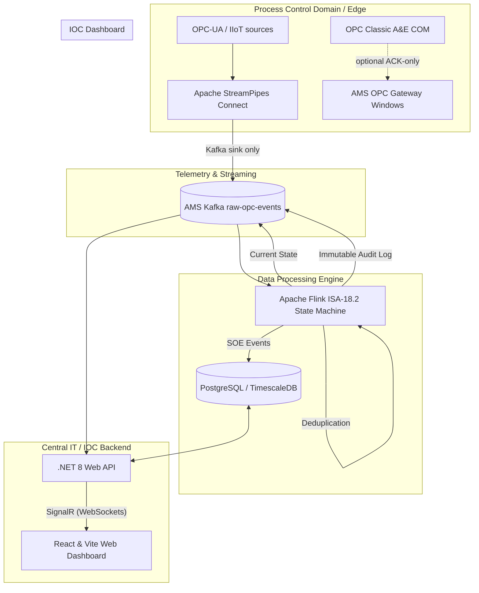

# Consolidated Alarm Solution (CAS) - Enterprise Architecture Document

## 1. Executive Summary
The Consolidated Alarm Solution (CAS) is an enterprise-grade, ISA-18.2 compliant industrial alarm management platform. It is engineered to aggregate, normalize, and manage real-time alarms from disparate, multi-vendor DCS/OPC servers across 74 distributed sites. By explicitly rejecting legacy DCOM architecture and third-party OPC tunnelers, the platform establishes a modern, highly secure edge-to-broker telemetry pattern. It provides a unified, high-performance web dashboard for operators and engineers at the Integrated Operations Centre (IOC).

## 2. High-Level Architecture

## 3. Core System Components

### 3.1 Edge Connectivity (StreamPipes → Kafka, single ingest path)

**Target architecture (preferred):**

- **Role:** Industrial connectivity via **Apache StreamPipes** as a Docker microservice on the AMS network (`docker-compose.streampipes.yml`).
- **Path:** OPC-UA (and other IIoT adapters) → StreamPipes pipeline → **Kafka sink** → `ams-kafka:29092` / `raw-opc-events` only.
- **Docs:** `docs/streampipes-connectivity.md`
- **Sole telemetry authority:** Apache StreamPipes (OPC UA) → `raw-opc-events` (schema v2). Zero QuickOPC/OpcLabs/COM/DCOM runtime dependencies.

**ACK control plane (optional Windows service):**

- **Role:** Consume `ack-writeback`, publish `ack-results` / lifecycle (no telemetry publish).
- **Implementation:** `AMS.OpcGateway` ACK-only; OPC UA DCS writeback is the planned replacement for Classic A&E ACK.
- Python simulators (`storm_generator.py`) remain for load testing only, not production.

**Responsibilities (StreamPipes path):**

- Adapter configuration and harmonization in StreamPipes UI.
- Publish AMS-schema JSON to `raw-opc-events` (see `docs/streampipes-connectivity.md`).
- Suppression/filtering via StreamPipes processors where needed.

### 3.2 Message Broker (Apache Kafka)
- **Role:** The high-throughput, fault-tolerant telemetry backbone bridging the PCD and the IOC.
- **Key Topics:** 
  - `raw-opc-events`: High-velocity ingestion of raw alarms from the edge.
  - `current-alarm-state`: An upsert topic maintaining the precise, real-time state of all active alarms.
  - `audit-events`: An append-only log recording every state transition, operator acknowledgment, and system configuration change.

### 3.3 Stream Processing Engine (Apache Flink)
- **Role:** The core stateful correlation and alarm lifecycle engine designed to process events exactly-once.
- **Job:** `AMS - Event-Sourced Alarm State Machine` (`OpcEventStreamJob.java`) with per-stage parallelism (ingest, dedup, ACK, ack-results, sinks).
- **Ingest:** `raw-opc-events` → normalize → dedupe → `current-alarm-state`
- **ACK commands:** `operator-actions` → Flink ACK Orchestrator → `ack-writeback` + `lifecycle-events` + `current-alarm-state` → OPC Gateway → DCS → `ack-results` reconciliation
- **.NET fallback:** When `Kafka:UseFlinkOrchestration` is `false`, `AlarmStreamProcessorService` performs the same orchestration.

### 3.4 Central Backend (.NET 8 Web API)
- **Role:** Serves as the API gateway, business logic executor, and real-time distribution node for the operator clients.
- **Stack:** ASP.NET Core Web API, Entity Framework (EF) Core, Npgsql (PostgreSQL driver), Serilog.
- **Features:** 
  - **Real-Time Distribution:** Utilizes `SignalR` hubs (`NotificationHub`, `AlarmHub`) to push state changes instantaneously to connected browsers via WebSockets.
  - **Background Workers:** Hosts automated services like the `ShelveExpiryService`, which polls the database to automatically unshelve alarms that exceed their operator-defined maximum shelving duration.
  - **RESTful Endpoints:** Provides queries for Historical SOE (Sequence of Events), Analytics KPIs, and OPC server configurations.

### 3.5 Storage Layer (PostgreSQL / TimescaleDB)
- **Role:** The authoritative persistent data store handling both relational configuration data and time-series event data.
- **Schema & Integration:** Managed strictly via EF Core Migrations (`AmsDbContext.cs`). Maps complex entities, manages standard naming conventions, and handles structured JSON payloads for rapid querying.

### 3.6 Control Loop Performance Service (`cplm-api`, .NET 8)
- **Role:** Owns control-loop performance monitoring end to end — a separate deploy unit from the alarm backend so loop analytics can scale and release independently. Port **5006**; nginx proxies `/api/v1/cpm/*` to it.
- **Boundary:** Its own logical database, `traverse_cplm` (schemas `analytics.*`, `cpm.*`), in the shared Postgres cluster. **No query joins CPLM data to alarm-core tables** — the two systems meet over Kafka and HTTP, never in SQL.
- **Kafka (async data plane):** consumes `clpm.gate.results.v1`, `clpm.feature.short.v1`, `clpm.feature.long.v1`; produces `ams.metadata.updates` (loop evidence that makes G13 evaluable) and `audit-events`. It owns the consumer groups `ams-api-cplm-results` and `ams-api-cplm-results-frames` — **exactly one member process, ever** (see `docs/cplm-consumer-cutover-runbook.md`).
- **HTTP (sync control plane):** asset-model for peer-link projection, Flink REST for A8 batch recompute and pipeline metrics, binding-resolver for readiness provenance.
- **Dual persistence:** gate/feature results into Postgres (idempotent upsert on `loop_id, window_kind, window_end, source`), KPI series into IoTDB at `root.site1.cpm.<loop>.kpi.<family>`.
- **Not here:** `RawLoopIotDbConsumer` (raw loop samples → IoTDB historian) stays in the alarm backend with its own consumer group.

### 3.7 IOC Dashboard (React & Vite)
- **Role:** The single pane of glass providing total situational awareness to plant operators.
- **Stack:** React 18, Vite, TypeScript, and a highly customized Glassmorphism CSS design system.
- **Features:**
  - **Live Event Stream:** A dynamic, color-coded feed showing alarms as they occur in real-time, grouped by priority and severity.
  - **Administration & Rationalization:** dedicated panels (`AlarmRulesConfig.tsx`, `OpcServerConfig.tsx`) for managing flood detection thresholds, chattering time windows, and remote OPC connections.
  - **Performance:** Optimized rendering using efficient state management (Zustand) to handle thousands of simultaneous UI updates without freezing the browser thread.

## 4. End-to-End Data Lifecycle
1. **Trigger:** A field sensor exceeds a parameter limit, generating a hardware event in the local DCS.
2. **Extraction:** The Edge Agent captures the COM event locally, translates it to JSON, applies initial diagnostic suppression rules, and publishes it securely to Kafka.
3. **Correlation:** Flink consumes the raw event from Kafka, normalizes it, enriches it with asset data, and advances its internal ISA-18.2 state machine to `ACTIVE-UNACKNOWLEDGED`.
4. **Persistence & Routing:** Flink routes the confirmed state transition to the PostgreSQL database and pushes a notification back to Kafka.
5. **Distribution:** The .NET 8 Web API detects the change and immediately broadcasts the payload via SignalR WebSockets.
6. **Visualization:** The React dashboard instantly receives the WebSocket frame, rendering the new alarm with a flashing neon indicator in the live event sidebar.

## 5. Security & Compliance Mandates
- **Zero DCOM Exposure:** Fully complies with strict PCD cybersecurity policies by isolating all vulnerable COM traffic to the local edge machine, transmitting only secured, outbound telemetry.
- **Standardized Processing:** The entire data path strictly adheres to EEMUA 191 and ISA-18.2 standards, ensuring that alarm rationalization, prioritization, and lifecycle management meet global industrial safety benchmarks.
