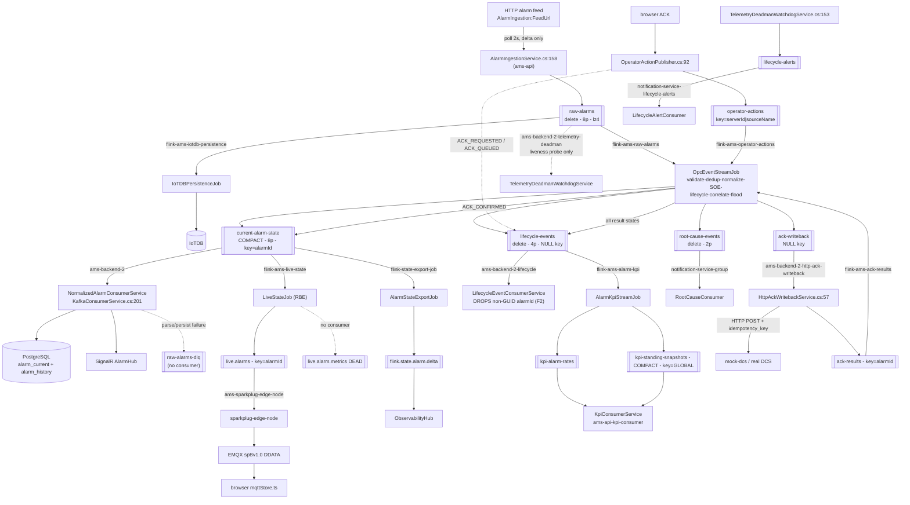
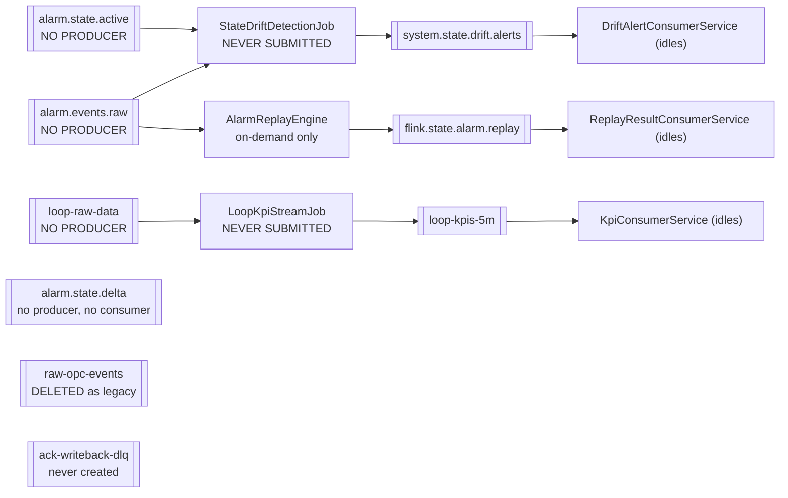

# 04 — Kafka Architecture Census (Alarm Domain)

**Scope:** every Kafka producer and consumer call site in the alarm domain, derived from code
(C#, Java, TypeScript, Python, shell, YAML), not from documentation.
**Excluded:** `src/xmlgraphics-batik-main ScreeN Import/` (retired reference app). `CPA/CPAMAIN/`
is a vendored intake copy of the legacy CPA repo — it has its own duplicate `OpcEventStreamJob`,
`FlinkDeployService`, etc., is not built or mounted by `infra/docker/docker-compose.yml`, and is
excluded from all counts below. Where a CPA path is cited it is labelled as such.

**Method:** call-site grep for `KafkaSource`/`KafkaSink`/`setTopics`/`setTopic`/`IProducer<`/
`IConsumer<`/`ProduceAsync`/`Produce(`/`Subscribe(`/`GroupId`/`subscribe(`/`--topic`, plus
`Kafka*` config sections in `appsettings*.json`, `docker-compose.yml` and the `.ps1`/`.sh`/`.py`
tooling. Config indirection is resolved to the literal default **and** the environment override.

---

## 0. Headline findings

| # | Finding | Evidence |
|---|---|---|
| **F1** | **`raw-opc-events` is dead configuration.** The alarm state machine subscribes to `raw-alarms`, not `raw-opc-events`. `raw-opc-events` has **no producer and no consumer anywhere in code**, and the topic-reset script explicitly *deletes* it as legacy on every stack start. It survives only in `architecture_document.md` and ~12 validation scripts, which therefore assert on a topic that cannot exist. | `src/flink/src/main/java/com/ams/flink/OpcEventStreamJob.java:54`; `scripts/kafka-reset-lab-topics.ps1:86`; `architecture_document.md:60,66,73`; `scripts/e2e-full-system-test.ps1:75`, `scripts/production-acceptance-test.ps1:51`, `scripts/test-full-pipeline-e2e.ps1:90`, `scripts/qa-production-real-ack.ps1:115`, `scripts/diagnose-kafka-pipeline.ps1:61`, `scripts/lib/AmsContractChecks.ps1:35,210,275` |
| **F2** | **Flink-emitted `lifecycle-events` are silently discarded by `ams-api`** for every feed-originated alarm: Flink writes `alarmId` as the raw feed string (`"BB26-BF402\|Alarm high"`), the consumer requires `Guid.TryParse` and `continue`s otherwise. | producer `src/flink/src/main/java/com/ams/flink/PipelineOperators.java:400-411` + `:57-60`; consumer `src/backend/AMS.Infrastructure/Kafka/LifecycleEventConsumerService.cs:57`; contrast `src/backend/AMS.Infrastructure/Kafka/NormalizedAlarmIngestor.cs:270-281` which *does* accept a non-GUID id |
| **F3** | **The declared `raw-alarms` contract is not the one on the wire.** `RawAlarmStreamEvent` (schemaVersion 2, `RAW_ALARM_EVENT` envelope) has **zero producers**; the only live producer emits an untyped anonymous object with no envelope. | contract `src/backend/AMS.Infrastructure/Kafka/StreamMessages.cs:119-149`; actual producer `src/backend/AMS.Api/BackgroundServices/AlarmIngestionService.cs:144-158` |
| **F4** | **`ack-writeback-dlq` is a stub.** Declared in options and appsettings, never referenced by any producer or consumer, and **not created** by the topic script while broker auto-create is off — so it does not exist on the broker. | `src/backend/AMS.Infrastructure/Kafka/KafkaConsumerService.cs:32`; `src/backend/AMS.Api/appsettings.json:16`; absent from `scripts/kafka-reset-lab-topics.ps1:18-83`; `infra/docker/docker-compose.yml:385` (`KAFKA_AUTO_CREATE_TOPICS_ENABLE: "false"`) |
| **F5** | **No Flink job has any DLQ.** Every parse failure returns `null`/`""` and is dropped by the following `.filter(...)`, with no counter and no dead-letter path. | `PipelineOperators.java:94-96` + `OpcEventStreamJob.java:69`; `OpcEventStreamJob.java:239-241,250,273-275,311-313` with filters at `:161,175,184` |
| **F6** | **The pipeline is at-least-once, not exactly-once**, despite `CheckpointingMode.EXACTLY_ONCE`: every Flink Kafka sink is built with `DeliveryGuarantee.AT_LEAST_ONCE`. | `src/flink/src/main/java/com/ams/flink/KafkaSinks.java:55`; checkpoint mode `OpcEventStreamJob.java:32` |
| **F7** | **`lifecycle-events` carries three mutually incompatible JSON shapes** written by three different producers under one topic and one contract class. | `LifecycleEventPublisher.cs:33-48` vs `PipelineOperators.java:400-411` vs `OpcEventStreamJob.java:253-276` |
| **F8** | `docs/alarm-history-flink-sink-stuck.md`'s compaction rule is **implemented and current**: `KafkaSinks.java` exists, `valueOnly` is documented as delete-policy-only, and every compacted-topic sink uses a keyed builder. Verified against code, not the doc. | `KafkaSinks.java:16-20,30-43,84-86`; keyed sinks at `OpcEventStreamJob.java:148,185`, `AlarmKpiStreamJob.java:100-104`, `LiveStateJob.java:79,100` |

---

## 1. Master topic table (alarm domain)

Legend — **Active?**: OK = live producer *and* live consumer both reachable in the default compose
stack; PARTIAL = partially live; DEAD = dead.

| Topic | Producer (file:line) | Consumer (file:line) | Consumer group | Policy / Parts | Active? |
|---|---|---|---|---|---|
| `raw-alarms` | `src/backend/AMS.Api/BackgroundServices/AlarmIngestionService.cs:158` (C#) | `src/flink/src/main/java/com/ams/flink/OpcEventStreamJob.java:52-55` (Java) `src/flink/src/main/java/com/ams/flink/IoTDBPersistenceJob.java:47-50` (Java) `src/backend/AMS.Infrastructure/Kafka/TelemetryDeadmanWatchdogService.cs:57` (C#) | `flink-ams-raw-alarms` `flink-ams-iotdb-persistence` `ams-backend-2-telemetry-deadman` | delete / 8 / 7 d / lz4 | OK |
| `current-alarm-state` | `OpcEventStreamJob.java:148` (projection) `OpcEventStreamJob.java:185` (ACK confirm) | `src/backend/AMS.Infrastructure/Kafka/KafkaConsumerService.cs:201` (C#) `src/flink/src/main/java/com/ams/flink/LiveStateJob.java:53-56` `src/flink/src/main/java/com/ams/flink/AlarmStateExportJob.java:44-47` | `ams-backend-2` `flink-ams-live-state` `flink-state-export-job` | **compact** / 8 | OK |
| `lifecycle-events` | `OpcEventStreamJob.java:135` (lifecycle) `OpcEventStreamJob.java:176` (ACK result) `src/backend/AMS.Infrastructure/Kafka/LifecycleEventPublisher.cs:54` (C#) | `src/backend/AMS.Infrastructure/Kafka/LifecycleEventConsumerService.cs:43` (C#) `src/flink/src/main/java/com/ams/flink/AlarmKpiStreamJob.java:42-45` | `ams-backend-2-lifecycle` `flink-ams-alarm-kpi` | delete / 4 | PARTIAL (see F2) |
| `operator-actions` | `src/backend/AMS.Infrastructure/Kafka/OperatorActionPublisher.cs:92-95` (C#) | `OpcEventStreamJob.java:154` | `flink-ams-operator-actions` | delete / 4 | OK |
| `ack-writeback` | `OpcEventStreamJob.java:162` | `src/backend/AMS.Api/BackgroundServices/HttpAckWritebackService.cs:57` (C#) *(test)* `scripts/reconcile_mock_ack.py:15,19` | `ams-backend-2-http-ack-writeback` `mock-ack-reconciler-group` | delete / 2 | OK |
| `ack-results` | `HttpAckWritebackService.cs:174` (C#) *(test)* `scripts/reconcile_mock_ack.py:79` | `OpcEventStreamJob.java:165` | `flink-ams-ack-results` | delete / 2 | OK |
| `raw-alarms-dlq` | `src/backend/AMS.Infrastructure/Kafka/KafkaConsumerService.cs:413` (C#) | **none in code**; operator tool `scripts/replay-kafka-dlq.ps1:142` | — | delete / 2 | PARTIAL producer-only |
| `root-cause-events` | `OpcEventStreamJob.java:119` | `src/services/notification-service/Consumers/RootCauseConsumer.cs:45` (C#) | `notification-service-group` | delete / 2 | OK |
| `lifecycle-alerts` | `src/backend/AMS.Infrastructure/Kafka/TelemetryDeadmanWatchdogService.cs:153` (C#) *(unregistered)* `AckSlaWatchdogService.cs:161` | `src/services/notification-service/Consumers/LifecycleAlertConsumer.cs:64` (C#) | `notification-service-lifecycle-alerts` | delete / 4 (ensure-only) | OK |
| `kpi-alarm-rates` | `src/flink/src/main/java/com/ams/flink/AlarmKpiStreamJob.java:86` | `src/backend/AMS.Api/BackgroundServices/KpiConsumerService.cs:46` | `ams-api-kpi-consumer` | delete / 4 | OK |
| `kpi-standing-snapshots` | `AlarmKpiStreamJob.java:104` (fixed key `GLOBAL`) | `KpiConsumerService.cs:46` | `ams-api-kpi-consumer` | **compact** / 2 | OK |
| `kpi-bad-actors` | **none** | `KpiConsumerService.cs:46` | `ams-api-kpi-consumer` | delete / 4 | DEAD consumer-only |
| `kpi-health-scores` | **none** | `KpiConsumerService.cs:46` | `ams-api-kpi-consumer` | delete / 2 | DEAD consumer-only |
| `live.alarms` | `src/flink/src/main/java/com/ams/flink/LiveStateJob.java:79` | `src/services/sparkplug-edge-node/src/main/java/com/ams/sparkplug/AlarmMetricPublisher.java:118` (Java) | `ams-sparkplug-edge-node` | delete / 4 / lz4 | OK |
| `live.alarm.metrics` | `LiveStateJob.java:100` | **none** | — | delete / 4 / lz4 | DEAD producer-only |
| `live.metrics` | **none in any service** — only `scripts/sim/process_value_sim.py:38,149` | `AlarmMetricPublisher.java:118` | `ams-sparkplug-edge-node` | delete / 8 / lz4 | PARTIAL sim-only producer |
| `flink.state.alarm.delta` | `AlarmStateExportJob.java:61-67` | `src/backend/AMS.Api/BackgroundServices/AlarmStateDeltaConsumerService.cs:39` | `ams-delta-consumer-ui` | delete / 4 | OK |
| `flink.state.alarm.replay` | `src/flink/src/main/java/com/ams/flink/AlarmReplayEngine.java:107-115` | `src/backend/AMS.Api/BackgroundServices/ReplayResultConsumerService.cs:39` | `ams-replay-ui-consumer` | delete / 2 | PARTIAL on-demand job only |
| `system.state.drift.alerts` | `src/flink/src/main/java/com/ams/flink/StateDriftDetectionJob.java:59-67` | `src/backend/AMS.Api/BackgroundServices/DriftAlertConsumerService.cs:39` | `ams-drift-consumer-ui` | delete / 2 | DEAD job never submitted |
| `alarm.events.raw` | **none** | `AlarmReplayEngine.java:39` `StateDriftDetectionJob.java:32` | `ams-replay-cg-<replayId>` `flink-drift-detector` | delete / 8 | DEAD consumer-only |
| `alarm.state.active` | **none** | `StateDriftDetectionJob.java:41` | `flink-drift-detector` | **compact** / 4 | DEAD consumer-only |
| `alarm.state.delta` | **none** | **none** | — | delete / 4 | DEAD fully orphaned |
| `raw-opc-events` | **none** | **none** | — | *deleted as legacy* | DEAD dead config (F1) |
| `ack-writeback-dlq` | **none** | **none** | — | *never created* | DEAD stub (F4) |
| `loop-raw-data` | **none** | `src/flink/src/main/java/com/ams/flink/LoopKpiStreamJob.java:38` | `flink-ams-loop-kpi` | delete / 16 | DEAD job never submitted |
| `loop-kpis-5m` | `LoopKpiStreamJob.java:72` | `KpiConsumerService.cs:46` | `ams-api-kpi-consumer` | delete / 8 | DEAD producer job never submitted |

**Adjacent (non-alarm) topics, listed for broker/group-hazard completeness**

| Topic | Producer | Consumer | Group | Note |
|---|---|---|---|---|
| `audit-events` | `src/services/display-service/Services/AuditEmitter.cs:60`, `src/services/cplm-api/Services/CplmAuditEmitter.cs:68`, `src/services/ingestion-service/Services/AuditEmitter.cs:61` | `src/services/audit-service/Consumers/AuditEventConsumer.cs:40` | `audit-service-group` | Governance. All three producers use `Message<Null,string>` → **null key**; safe only because policy is `delete` (`kafka-reset-lab-topics.ps1:81`). Never make this topic compacted. |
| `analysis.executions` | `src/services/analysis-service/Program.cs:286` | `src/flink/src/main/java/com/ams/flink/AnalysisExecutionJob.java:43` | `flink-analysis-execution` | Analysis domain. |
| `analysis.results` | `AnalysisExecutionJob.java:62` | `src/services/analysis-service/Consumers/AnalysisResultConsumer.cs:54` | `analysis-service-results` | Analysis domain. |
| `analysis.commands` | `src/services/analysis-service/Program.cs:514` | **none** | — | Orphan **and not created** by `kafka-reset-lab-topics.ps1` with auto-create off → the produce fails. |
| `loop.samples.v1`, `clpm.feature.short.v1`, `clpm.feature.long.v1`, `clpm.gate.results.v1`, `live.loop.metrics`, `ams.metadata.updates`, `context.parameter-set.v1` | CPLM jobs / `cplm-api` | `cplm-api`, `ams-api RawLoopIotDbConsumer`, edge node | `flink-ams-cplm*`, `ams-api-cplm-results(-frames)`, `ams-iotdb-raw-loop`, `ams-sparkplug-edge-node` | **Out of alarm scope.** Group hazard: `ams-api-cplm-results` / `-frames` must have exactly one member (`src/services/cplm-api/Services/SingleMemberGuard.cs`, `docs/cplm-consumer-cutover-runbook.md`). Shares the broker and the `ams-sparkplug-edge-node` group with `live.alarms`. |

---

## 2. Detail per alarm topic

### 2.1 `raw-alarms` — pipeline ingress

* **Config key / default:** `Kafka:RawAlarmsTopic` → `"raw-alarms"`
  (`src/backend/AMS.Infrastructure/Kafka/KafkaConsumerService.cs:25`,
  `src/backend/AMS.Api/appsettings.json:8`). Compose sets it explicitly:
  `Kafka__RawAlarmsTopic: raw-alarms` (`infra/docker/docker-compose.yml:702`).
  On the Flink side the topic name is a **hardcoded literal**, not configurable
  (`OpcEventStreamJob.java:54`, `IoTDBPersistenceJob.java:49`); only the starting offset is a flag
  (`--raw-alarms.starting-offsets`, `PipelineConfig.java:67`, default `earliest`, compose supervisor
  default `earliest` at `infra/docker/flink-job-supervisor.sh:23`).
* **Producer:** `AlarmIngestionService.cs:158` (C#, `AlarmEventProducer.PublishAsync`).
  Trigger: an HTTP poll loop against `AlarmIngestion:FeedUrl`
  (compose: `http://192.168.1.51:8010/api/current-alarms`, `docker-compose.yml:704`) every
  `PollIntervalMs` (2000 ms), publishing **only changed snapshots** plus synthetic `CLEARED`
  records for alarms that disappeared from the feed (`AlarmIngestionService.cs:104-140`).
  Enabled by `AlarmIngestion__Enabled: "true"` (`docker-compose.yml:703`).
  Test producers: `ams-sims/sim_alarm_feed.py:107`, `ams-sims/sim_ack_lifecycle.py:43`,
  `scripts/inject-sample-alarms-e2e.ps1:102`.
* **Consumers:**
  * `OpcEventStreamJob.java:52-60` — group `flink-ams-raw-alarms`, offsets resolved at `:42-50`
    (`latest` / `committed`-with-earliest-fallback / `earliest`).
  * `IoTDBPersistenceJob.java:47-56` — group `flink-ams-iotdb-persistence`, committed offsets.
  * `TelemetryDeadmanWatchdogService.cs:57` — group `${Kafka:ConsumerGroupId}-telemetry-deadman`
    = `ams-backend-2-telemetry-deadman`; a liveness probe only, emits `TELEMETRY_STALLED` to
    `lifecycle-alerts` after `TelemetryStallThresholdSeconds` (60 s) of silence.
* **Serialized fields (actual):** `AlarmIngestionService.cs:144-156` writes
  `alarmId, sourceName, sourceEventId, message, priority, condition, state, timestamp,
  acknowledged, rawPayload`. `AlarmEventProducer.PublishAsync` serialises with
  `JsonNamingPolicy.CamelCase` (`KafkaConsumerService.cs:528`); the payload is already camelCase.
  **Absent:** `schemaVersion`, `eventType`, `serverId`, `severity`, `conditionName`,
  `subConditionName`, `conditionActive`, `cookieOffset`, `eventTimeEpochMs`, `activeTimeEpochMs`,
  `ackRequired`, `quality`.
* **Key:** `snapshot.AlarmId` (the feed correlation id, or `"<tagName>|<condition>"`).
  Ordering assumption: all events for one alarm land on one of 8 partitions, so the Flink
  `keyBy(getAlarmKey)` dedup/lifecycle state sees them in order. Note the Kafka key
  (`alarmId`) and the Flink key (`serverId|source|condition|subCondition`,
  `AlarmKeys.java:11-13`) are **different functions** — Kafka ordering is per feed-alarmId,
  Flink state is per alarm-key; they coincide only because the feed emits one alarmId per
  (tag, condition).
* **Hop chain:** HTTP alarm feed → `AlarmIngestionService` → **`raw-alarms`** →
  `OpcEventStreamJob` (validate → dedup → normalise → SOE → lifecycle → correlate → flood) →
  `current-alarm-state` / `lifecycle-events` / `root-cause-events`; in parallel →
  `IoTDBPersistenceJob` → IoTDB.
* **Topic config:** `scripts/kafka-reset-lab-topics.ps1:19` — 8 partitions,
  `cleanup.policy=delete`, `retention.ms=604800000` (7 d), `segment.ms=3600000`,
  `compression.type=lz4`, `min.insync.replicas=$env:KAFKA_TOPIC_MIN_ISR` (lab 1, prod 2).
  RF from `$env:KAFKA_TOPIC_RF` (lab 1, prod 3) — `kafka-reset-lab-topics.ps1:15-16`.
* **Error/DLQ:** **none.** `ValidationMap` returns `null` on any exception or on missing
  source/condition (`PipelineOperators.java:40,94-96`) and the record is dropped by
  `.filter(e -> e != null)` (`OpcEventStreamJob.java:69`). The `records_in`/`records_out`
  counters (`PipelineOperators.java:29-30`) are the only signal. `raw-alarms-dlq` is *not* used
  for this — see §2.7.
* **Delivery semantics:** Flink source offsets are committed on checkpoint (30 s,
  `OpcEventStreamJob.java:32`) — at-least-once through the job; the sink is
  `AT_LEAST_ONCE` (`KafkaSinks.java:55`), so duplicates are possible on recovery.

### 2.2 `current-alarm-state` — materialised projection (COMPACTED)

* **Config key / default:** `Kafka:NormalizedAlarmsTopic` → `"current-alarm-state"`
  (`KafkaConsumerService.cs:33`, `appsettings.json:19`). No compose override. Hardcoded on the
  Flink side (`OpcEventStreamJob.java:148,185`, `LiveStateJob.java:55`, `AlarmStateExportJob.java:46`).
* **Producers (both Flink, both keyed):**
  * `OpcEventStreamJob.java:137-151` — `ALARM_STATE_UPSERT` (`PipelineOperators.java:413-440`)
    or `ALARM_STATE_DELETE` when `conditionActive == false`
    (`PipelineOperators.java:443-456`), keyed by `alarmId`.
  * `OpcEventStreamJob.java:181-188` — `ACK_STATE_UPDATE` on `ACK_CONFIRMED`
    (`OpcEventStreamJob.java:278-314`), keyed by `alarmId`.
* **Consumers:**
  * `NormalizedAlarmConsumerService` — `KafkaConsumerService.cs:201`, group
    `Kafka:ConsumerGroupId` = **`ams-backend-2`** in compose (`docker-compose.yml:701`),
    `ams-backend` by appsettings default (`appsettings.json:5`). Writes `alarms.alarm_current`
    + `alarm_history` and pushes SignalR.
  * `LiveStateJob.java:53-61`, group `flink-ams-live-state`, offsets **`latest`**.
  * `AlarmStateExportJob.java:44-50`, group `flink-state-export-job`, offsets **`latest`**.
* **UPSERT schema (`PipelineOperators.java:414-439`):** `schemaVersion(1)`, `eventType`,
  `eventId` (= `"<alarmId>:<eventTimeEpochMs>"`), `alarmId`, `serverId`, `sourceName`,
  `conditionName`, `subConditionName`*(optional)*, `message`, `severity`, `priority`, `category`,
  `alarmEventKind`, `conditionActive`, `acknowledged`, `quality(192)`, `eventTimeEpochMs`,
  `activeTimeEpochMs`, `serverReceivedEpochMs`, `cookieOffset`, `opcAttributes` (nested object
  built at `PipelineOperators.java:166-184`: `cookieOffset, activeTimeEpochMs, activeFileTime,
  ackRequired, opcDcsAcknowledged, acknowledged, opcAckWriteable, feed, ackPath, sourceEventId,
  alarmEventKind`).
* **DELETE schema (`PipelineOperators.java:444-455`):** `schemaVersion, eventType, alarmId,
  serverId, sourceName, conditionName, conditionActive(false), acknowledged, eventTimeEpochMs,
  serverReceivedEpochMs` — 10 fields only.
* **ACK_STATE_UPDATE schema (`OpcEventStreamJob.java:281-310`):** `schemaVersion, eventType,
  eventId(=commandId), commandId, correlationId, lifecycleId, alarmId, serverId, sourceName,
  conditionName, severity(**hardcoded 100**), priority(**hardcoded "LOW"**),
  category(**hardcoded "PROCESS"**), alarmEventKind, acknowledged(true),
  ackLifecycleState("ACK_CONFIRMED"), quality(192), eventTimeEpochMs, activeTimeEpochMs,
  serverReceivedEpochMs, opcAttributes{feed,ackPath,opcAckWriteable,alarmEventKind}`.
  The hardcoded severity/priority are harmless **only** because
  `NormalizedAlarmIngestor.cs:117` gates every field write behind `!isAckStateUpdate` — the ack
  branch calls `ApplyAckLifecycle` alone (`NormalizedAlarmIngestor.cs:105-116`). This is a
  latent trap: any future consumer that reads severity from this topic will read `100`.
* **Key & ordering:** record key = the JSON `alarmId` field
  (`KafkaSinks.keyedByJsonField`, `KafkaSinks.java:36-38,65-88`). Two hard dependencies:
  (a) compaction requires a non-null key — the fallback at `KafkaSinks.java:84-86` uses the whole
  value as key rather than emit null; (b) one alarm pins to one of 8 partitions, which is the
  only thing giving `NormalizedAlarmConsumerService` per-alarm ordering (stated at
  `KafkaSinks.java:22-23`).
* **Hop chain:** `raw-alarms`/`ack-results` → `OpcEventStreamJob` → **`current-alarm-state`** →
  (a) `ams-api` → PostgreSQL `alarm_current` + `alarm_history` → SignalR `AlarmHub`;
  (b) `LiveStateJob` → `live.alarms` → `sparkplug-edge-node` → Sparkplug DDATA → EMQX → browser
  (`src/frontend-ob/src/store/mqttStore.ts`);
  (c) `AlarmStateExportJob` → `flink.state.alarm.delta` → `ams-api` → `ObservabilityHub`.
* **Topic config:** `kafka-reset-lab-topics.ps1:21` — 8 partitions, **`cleanup.policy=compact`**,
  `retention.ms=604800000`, `segment.ms=3600000`.
* **Error/DLQ:** real, and the only real one. `KafkaConsumerService.cs:220-242` sends
  unparseable records straight to `raw-alarms-dlq` and only commits once the DLQ write is
  acknowledged; `:340-382` retries persistence 4x with exponential backoff, then DLQs the batch
  and commits **only if every DLQ write was acknowledged** (`:369-380`). Prometheus counters
  `ams_projection_dlq_events_total`, `ams_projection_flush_retries_total`
  (`KafkaConsumerService.cs:114-122`).
* **Delivery semantics — correct.** `EnableAutoCommit = false` (`KafkaConsumerService.cs:161`),
  `IsolationLevel.ReadCommitted` (`:166`), commit strictly after `SaveChangesAsync`
  (`:310-333`), and the partitions-revoked handler *drains* rather than bare-commits
  (`:176-197`).

### 2.3 `lifecycle-events` — append-only transition log

* **Config key / default:** `Kafka:LifecycleEventsTopic` → `"lifecycle-events"`
  (`KafkaConsumerService.cs:28`, `appsettings.json:11`). Hardcoded in Flink
  (`OpcEventStreamJob.java:135,176`, `AlarmKpiStreamJob.java:44`).
* **Producers — three, with three different shapes:**
  1. `OpcEventStreamJob.java:131-135` via `PipelineOperators.toLifecycleJson`
     (`PipelineOperators.java:400-411`) — one record per surviving alarm event.
     Fields: `schemaVersion, alarmId, serverId, sourceName, conditionName, lifecycleState,
     transitionType, timestampEpochMs`.
  2. `OpcEventStreamJob.java:173-179` via `toAckLifecycleEvent`
     (`OpcEventStreamJob.java:253-276`) — one per `ack-results` record.
     Fields: `schemaVersion, eventType("LIFECYCLE_EVENT"), alarmId, serverId, sourceName,
     conditionName, commandId, correlationId, lifecycleId, lifecycleState, detail,
     timestampEpochMs`.
  3. `LifecycleEventPublisher.cs:54` (C#) — emitted twice per operator ACK
     (`OperatorActionPublisher.cs:61-64` `ACK_REQUESTED`, `:97-101` `ACK_QUEUED`).
     Fields (`StreamMessages.cs:4-26`, camelCased): `schemaVersion, eventType, commandId,
     correlationId, lifecycleId, dcsSequenceId, actionId, eventId, alarmId, lifecycleState,
     previousState, detail, timestampEpochMs`.
* **Consumers:**
  * `LifecycleEventConsumerService.cs:43` — group `${ConsumerGroupId}-lifecycle` =
    `ams-backend-2-lifecycle`. Applies `ApplyAckLifecycle` to `alarm_current` and pushes
    `PublishAckLifecycleAsync` over SignalR.
  * `AlarmKpiStreamJob.java:42-50` — group `flink-ams-alarm-kpi`, offsets `latest`, event-time
    from `timestampEpochMs` (`:52-61`), filters `lifecycleState == "ACTIVE"` (`:71-76`).
  * *(dead)* `AckSlaWatchdogService.cs:58`, group `${ConsumerGroupId}-ack-sla-watchdog` — the
    class is `[Obsolete]` (`AckSlaWatchdogService.cs:13`) and **not registered** in
    `src/backend/AMS.Api/Program.cs:130-135,146-163`, so this group never exists.
* **Key:** producer 3 keys by `AlarmPartitionKeys.AssetKey(serverId, sourceName)`
  (`OperatorActionPublisher.cs:56,61`, `AlarmPartitionKeys.cs:17-21`). Producers 1 and 2 use
  `KafkaSinks.valueOnly` (`OpcEventStreamJob.java:209-211`) → **null key, round-robin
  partitioning**. Consequence: for Flink-emitted lifecycle records there is **no per-alarm
  ordering guarantee across the 4 partitions**, and `LifecycleEventConsumerService.cs:67-72`
  relies on an explicit terminal-state guard to compensate. Legal only because the topic is
  `cleanup.policy=delete`.
* **Topic config:** `kafka-reset-lab-topics.ps1:25` — 4 partitions, `delete`, 7 d.
* **Error/DLQ:** none on either side. The consumer catches and logs
  (`LifecycleEventConsumerService.cs:107-116`) and moves on.
* **Delivery semantics — at-most-once.** `EnableAutoCommit = true` with
  `AutoOffsetReset.Latest` (`LifecycleEventConsumerService.cs:38-39`). The librdkafka
  auto-commit timer advances offsets independently of whether `SaveChangesAsync` (`:83`) ran,
  so a crash inside the 5 s window silently loses ACK-lifecycle DB writes and SignalR pushes.
  This is the one alarm-path consumer that regressed relative to the STR-10 fix applied to
  `HttpAckWritebackService`.

### 2.4 `operator-actions` — UI → ACK orchestrator

* **Config key / default:** `Kafka:OperatorActionsTopic` → `"operator-actions"`
  (`KafkaConsumerService.cs:26`, `appsettings.json:9`); hardcoded at `OpcEventStreamJob.java:154`.
* **Producer:** `OperatorActionPublisher.cs:92-95`, triggered by the ACK command handler
  (`src/backend/AMS.Application/Alarms/Commands/AlarmCommands.cs` → `IOperatorActionPublisher`,
  registered `src/backend/AMS.Api/Program.cs:114`). Gated by
  `OpcCookieHelper.IsWritebackAckEligible` (`OperatorActionPublisher.cs:41-47`).
* **Consumer:** `OpcEventStreamJob.java:154` — group `flink-ams-operator-actions`, committed
  offsets with earliest fallback (`OpcEventStreamJob.java:193-207`, comment at `:198-200`
  explains why: a fresh submit must not re-dispatch historical ACK writebacks).
* **Schema (`OperatorActionMessage`, `StreamMessages.cs:54-85`, camelCased):** `schemaVersion,
  eventType("OPERATOR_ACK_COMMAND"), commandId, correlationId, lifecycleId, dcsSequenceId,
  actionId, alarmId, sourceAlarmId, sourceEventId, actionType, userId, username, comment,
  actionTimeEpochMs, serverId, sourceName, conditionName, subConditionName, activeTimeEpochMs,
  activeFileTime, cookieOffset, operatorStation`.
* **Key:** `AlarmPartitionKeys.AssetKey(alarm.ServerId, alarm.SourceName)`
  (`OperatorActionPublisher.cs:94`) → `"<serverGuid>|<sourceName>"`. **Note the inconsistency:**
  the lifecycle emit two lines earlier uses `AssetKey(serverId, …)` where `serverId` is the
  *resolved* OPC server id (`:50,56`) while the topic publish uses `alarm.ServerId`. When
  `OpcCookieHelper.ResolveServerId` falls back to `OpcGateway:DefaultServerId` the two keys
  differ, splitting an alarm's `operator-actions` and `lifecycle-events` across partitions.
* **Hop chain:** browser → `POST /api/v1/alarms/acknowledge` → `OperatorActionPublisher` →
  **`operator-actions`** → `OpcEventStreamJob.toAckWriteback` → `ack-writeback`.
* **Topic config:** `kafka-reset-lab-topics.ps1:22` — 4 partitions, `delete`, 7 d.
* **Error/DLQ:** `toAckWriteback` returns `""` on any parse failure
  (`OpcEventStreamJob.java:239-241`); the following `.filter` (`:161`) drops it. **An operator
  acknowledgement can be silently lost here with no log, no metric and no DLQ.**

### 2.5 `ack-writeback` — orchestrator → DCS gateway

* **Config key / default:** `Kafka:AckWritebackTopic` → `"ack-writeback"`
  (`KafkaConsumerService.cs:27`, `appsettings.json:10`); hardcoded `OpcEventStreamJob.java:162`.
* **Producer:** `OpcEventStreamJob.java:162` (`KafkaSinks.valueOnly` → **null key**).
* **Consumers:** `HttpAckWritebackService.cs:57`, group
  `${ConsumerGroupId}-http-ack-writeback` = `ams-backend-2-http-ack-writeback`.
  Test double: `scripts/reconcile_mock_ack.py:15,19`, group `mock-ack-reconciler-group` — a
  *separate* group, so running it alongside `ams-api` double-processes every writeback and
  produces two `ack-results` per ACK.
* **Schema (`OpcEventStreamJob.java:218-238`):** `schemaVersion, eventType,
  commandId, correlationId, lifecycleId, alarmId, sourceAlarmId, sourceEventId, serverId,
  sourceName, conditionName, subConditionName*(conditional)*, username, activeTimeEpochMs,
  activeFileTime, cookieOffset, ackState("ACK_DISPATCHED"), lifecycleState("ACK_DISPATCHED")`.
  Read into `AckWritebackMessage` (`StreamMessages.cs:88-116`) with
  `PropertyNameCaseInsensitive = true` (`HttpAckWritebackService.cs:13`).
  **Dropped in transit:** `dcsSequenceId` and `comment` exist on the C# record but Flink never
  writes them → always null downstream.
* **Key:** none (null). Legal — `cleanup.policy=delete`. Ordering across the 2 partitions is
  not guaranteed, which is acceptable because each writeback is independent and carries an
  `idempotency_key` (`HttpAckWritebackService.cs:104-106`).
* **Hop chain:** `operator-actions` → Flink → **`ack-writeback`** → `HttpAckWritebackService`
  → `POST {AlarmIngestion:AckWritebackUrl}` (compose: `http://mock-dcs:8010/api/alarms/acknowledge`,
  `docker-compose.yml:710`) → `ack-results`.
* **Topic config:** `kafka-reset-lab-topics.ps1:23` — 2 partitions, `delete`, 7 d.
* **Error/DLQ:** the declared `ack-writeback-dlq` is **never used** (F4). Poison records are
  committed and skipped (`HttpAckWritebackService.cs:84-86`); an HTTP failure is *not* a
  message failure — it becomes an `ACK_FAILED` `ack-results` record (`:135-141,164-165`).
* **Delivery semantics — correct at-least-once.** `EnableAutoCommit = false`
  (`HttpAckWritebackService.cs:53`, with the STR-10 rationale in the comment at `:48-52`);
  commit happens only after the `ack-results` publish succeeds (`:174-175`), and the DCS payload
  carries `idempotency_key` so redelivery is a no-op.

### 2.6 `ack-results` — DCS outcome → reconciliation

* **Config key / default:** `Kafka:AckResultsTopic` → `"ack-results"`
  (`KafkaConsumerService.cs:30`, `appsettings.json:12`); hardcoded `OpcEventStreamJob.java:165`.
* **Producers:** `HttpAckWritebackService.cs:174` (key = `writeback.AlarmId`);
  test: `scripts/reconcile_mock_ack.py:79`, `ams-sims/sim_ack_lifecycle.py:200`.
* **Consumer:** `OpcEventStreamJob.java:165` — group `flink-ams-ack-results`, committed offsets.
* **Schema (`AckResultMessage`, `StreamMessages.cs:29-51`, camelCased):** `schemaVersion,
  eventType("ACK_RESULT"), commandId, correlationId, lifecycleId, dcsSequenceId, actionId,
  alarmId, serverId, sourceName, conditionName, activeTimeEpochMs, cookieOffset, resultState,
  errorMessage, timestampEpochMs`.
* **Key:** `alarmId` — pins a single alarm's results to one of 2 partitions, which the Flink
  ack path does not strictly require, but keeps ordering for the
  `ACK_CONFIRMED` → `current-alarm-state` fan-out.
* **Fan-out:** `OpcEventStreamJob.java:173-188` splits into `lifecycle-events`
  (all result states) and `current-alarm-state` (`ACK_CONFIRMED` only, `isAckConfirmed` at
  `:244-251`).
* **Topic config:** `kafka-reset-lab-topics.ps1:24` — 2 partitions, `delete`, 7 d.
* **Error/DLQ:** none; both mappers return `""` on failure (`:273-275`, `:311-313`) and are
  filtered out (`:175,184`).

### 2.7 `raw-alarms-dlq` — the one real dead-letter topic (misnamed)

* **Config key / default:** `Kafka:RawAlarmsDlqTopic` → `"raw-alarms-dlq"`
  (`KafkaConsumerService.cs:31`, `appsettings.json:15`).
* **Producer:** `KafkaConsumerService.cs:413`. Despite the name it is the DLQ for the
  **`current-alarm-state` projection consumer**, not for `raw-alarms`: the envelope's
  `SourceTopic` defaults to `_opts.NormalizedAlarmsTopic` (`KafkaConsumerService.cs:405`).
* **Envelope (`DeadLetterEnvelope`, `KafkaConsumerService.cs:462-469`, camelCased by
  `AlarmEventProducer`):** `key, reason, sourceTopic, sourcePartition, sourceOffset,
  failedAtUtc, payload`.
* **Key:** `evt.EventId` or the source record key (`:361,413`).
* **Consumer:** none in code. Only the manual operator tool `scripts/replay-kafka-dlq.ps1`
  (which re-derives a partition key from the payload at `:50-58` and replays via
  `kafka-console-producer` at `:142`) and the host connectivity probe
  `ams-sims/_host_kafka_check.py:22`.
* **Topic config:** `kafka-reset-lab-topics.ps1:20` — 2 partitions, `delete`, 7 d.

### 2.8 `root-cause-events`

* Producer `OpcEventStreamJob.java:119` (null key, `valueOnly`), fed by
  `PipelineOperators.RootCauseMap` (`:297-334`) which fires only for sources whose name contains
  `CRUSHER|CONVEYOR|FEEDER|MOTOR` (`:320`) — i.e. a hardcoded demo rule, not a configured
  correlation model.
* Schema (`PipelineOperators.java:323-332`): `alarmId, rootCause, suppressed[], eventTime` (ISO-8601).
* Consumer `src/services/notification-service/Consumers/RootCauseConsumer.cs:45`, group
  `notification-service-group`, `EnableAutoCommit = false` with manual `Commit(cr)` after
  dispatch (`:65`) — correct at-least-once.
* Topic: 2 partitions, `delete`, 7 d (`kafka-reset-lab-topics.ps1:26`).

### 2.9 `lifecycle-alerts`

* **Config key / default:** `Kafka:LifecycleAlertsTopic` → `"lifecycle-alerts"`
  (`KafkaConsumerService.cs:29`, `appsettings.json:20`); notification-service reads the same key
  (`LifecycleAlertConsumer.cs:44`) and compose sets it explicitly
  (`docker-compose.yml:1196`).
* **Producers:** `TelemetryDeadmanWatchdogService.cs:153` (key `"telemetry-deadman"`, event
  `TELEMETRY_STALLED`; fields `schemaVersion, eventType, topic, ingestAuthority,
  stallThresholdSeconds, secondsSinceLastEvent, timestampEpochMs, severity, detail` —
  `:141-152`). `AckSlaWatchdogService.cs:161` (`ACK_SLA_BREACH`) is **unreachable** — the class
  is unregistered (`Program.cs:130-135`).
* **Consumer:** `LifecycleAlertConsumer.cs:64`, group `notification-service-lifecycle-alerts`,
  `AutoOffsetReset.Earliest`, `EnableAutoCommit = false` with manual commits at `:85,91,114` —
  correct.
* Topic: 4 partitions, `delete`, ensure-only (never wiped) — `kafka-reset-lab-topics.ps1:82`.

### 2.10 KPI topics

* `kpi-alarm-rates` ← `AlarmKpiStreamJob.java:82-91` (null key, `delete` policy — legal).
  `kpi-standing-snapshots` ← `AlarmKpiStreamJob.java:103-106` via
  `KafkaSinks.fixedKey(..., "GLOBAL")` — required because the topic is **compacted**
  (`kafka-reset-lab-topics.ps1:31`); the key matches the `keyBy(json -> "GLOBAL")` at `:95`.
* Schema `AlarmKpiResult.toJson()` (`AlarmKpiResult.java:34-56`): always
  `schemaVersion, kpiType, windowStartMs, windowEndMs`, then **only the fields for that
  `kpiType`** — `ALARM_RATE` → `alarmCount, floodStatus`; `STANDING_ALARM_SNAPSHOT` →
  `standingCount, oldestStandingDurationMs`.
* Consumer `KpiConsumerService.cs:46` subscribes to **five** topics
  (`:17-24`), group `ams-api-kpi-consumer`, `EnableAutoCommit = true` (`:39`) —
  acceptable for KPI. Two of the five (`kpi-bad-actors`, `kpi-health-scores`) have no producer
  anywhere; `loop-kpis-5m`'s producer (`LoopKpiStreamJob`) is never submitted (§4).
* Deserialised into the positional record `AlarmKpiPayload` (`KpiConsumerService.cs:100-113`)
  which declares `Area` and `Priority` — neither is ever produced.

### 2.11 Live / edge topics

* `live.alarms` ← `LiveStateJob.java:79` keyed by `alarmId` (PIPE-010 rationale at `:71-72`).
  Schema `LiveStateJob.java:163-177`: `alarmId, state, severity, acknowledged, conditionActive,
  priority, sourceName, conditionName, message, rbeTs, eventTimeEpochMs`. Report-by-exception
  fingerprint = `state|severity|ack|active|priority` (`:156`).
  Consumer `AlarmMetricPublisher.java:118` (group `ams-sparkplug-edge-node`,
  `SparkplugConfig.java:74`), branch `processRecord` (`:167,245`). Field names verified to match
  one-for-one at `AlarmMetricPublisher.java:500-501,523-529,556-561`.
  **Manual commit after MQTT delivery** (`AlarmMetricPublisher.java:110,169,190-198`) with
  `consumer.seek` on MQTT failure — correct at-least-once.
* `live.alarm.metrics` ← `LiveStateJob.java:100`. **No consumer** — the edge node subscribes to
  exactly three topics (`AlarmMetricPublisher.java:118`; defaults `SparkplugConfig.java:71-73`)
  and this is not one of them. The job's own comment admits it (`LiveStateJob.java:91-93`).
* `live.metrics` — consumed by the edge node's `processMetricRecord` branch
  (`AlarmMetricPublisher.java:165-166`) but **produced by no service**; the only producer in the
  repo is the simulator `scripts/sim/process_value_sim.py:38,149`.

### 2.12 Observability topics

* `flink.state.alarm.delta` ← `AlarmStateExportJob.java:61-70` (**unkeyed** — legal, `delete`
  policy). Schema `AlarmStateExportJob.java:122-146`: `correlation_id, timestamp, change_type
  (INSERT|UPDATE|REMOVE), previous_state, current_state` — **snake_case**.
  Consumer `AlarmStateDeltaConsumerService.cs:39`, group `ams-delta-consumer-ui`; the DTO
  carries matching `[JsonPropertyName]` snake_case attributes
  (`src/backend/AMS.Api/Hubs/ObservabilityHub.cs:28-34`) so this pairing is correct despite the
  consumer using default (case-sensitive) serializer options
  (`AlarmStateDeltaConsumerService.cs:54`).
  Note `extractId` (`AlarmStateExportJob.java:82-94`) now reads `alarmId` first with `Id`/`id`
  as fallback — the STR-08 single-partition bug described at `:75-81` is fixed in code.
* `flink.state.alarm.replay` ← `AlarmReplayEngine.java:107-115`. Schema `:88-101`: `replay_id,
  correlation_id, timestamp, change_type, current_state` (snake_case; DTO matches at
  `ObservabilityHub.cs:14-20`). Consumer `ReplayResultConsumerService.cs:39`, group
  `ams-replay-ui-consumer`. Submitted on demand by `src/backend/AMS.Api/Services/FlinkRestClient.cs:33`
  — which picks a JAR by `Files.FirstOrDefault(f => f.Name.Contains("ams-flink")) ?? Files.First()`
  (`:27-28`) and therefore throws if `/jars` is empty (the JAR is bind-mounted, not uploaded).
  **Requires verification against a running cluster.**
* `system.state.drift.alerts` ← `StateDriftDetectionJob.java:59-67`. Schema `:113-114`:
  `{alarmId, type:"DRIFT_MISSING_STATE", timestamp}`; DTO `ObservabilityHub.cs:22-26`.
  Consumer `DriftAlertConsumerService.cs:39`, group `ams-drift-consumer-ui`. The producing job
  reads two topics that have no producers and **is not in either submission list** (§4) — the
  consumer idles forever.

---

## 3. Alarm event flow (from evidence)

**Never-executing branches:**

---

## 4. Which Flink jobs actually run

Standing jobs are (re)submitted every 60 s by `infra/docker/flink-job-supervisor.sh:90-135`
(the authoritative list; `scripts/ensure_flink_jobs.py:83-190` mirrors it but is only invoked by
validation scripts — see the STR-07 note at `flink-job-supervisor.sh:122-127`).

| Job | Submitted? | Evidence | Alarm topics |
|---|---|---|---|
| `OpcEventStreamJob` | yes | `flink-job-supervisor.sh:92-98`; also one-shot `infra/docker/flink-submit-raw-alarms.sh:41-58` | in `raw-alarms`, `operator-actions`, `ack-results`; out `current-alarm-state`, `lifecycle-events`, `ack-writeback`, `root-cause-events` |
| `IoTDBPersistenceJob` | yes | `flink-job-supervisor.sh:99-101` | in `raw-alarms` |
| `LiveStateJob` | yes | `:102-103` | in `current-alarm-state`; out `live.alarms`, `live.alarm.metrics` |
| `AlarmKpiStreamJob` | yes | `:131-132` | in `lifecycle-events`; out `kpi-alarm-rates`, `kpi-standing-snapshots` |
| `AlarmStateExportJob` | yes | `:133-134` | in `current-alarm-state`; out `flink.state.alarm.delta` |
| `AnalysisExecutionJob` | yes | `:126-127` | analysis domain |
| CPLM short/long/fusion/live-RBE | yes | `:104-121` | CPLM domain |
| `StateDriftDetectionJob` | **no** | absent from `flink-job-supervisor.sh` and `ensure_flink_jobs.py`; only `scripts/lib/AmsFlinkJob.ps1:341` (a helper never called by stack startup) | `system.state.drift.alerts` dead |
| `AlarmReplayEngine` | on demand | `src/backend/AMS.Api/Services/FlinkRestClient.cs:33` | `flink.state.alarm.replay` |
| `LoopKpiStreamJob` | **no** | only `scripts/lib/AmsFlinkJob.ps1:164` | `loop-kpis-5m` dead |
| `CplmGateStreamJob` | **no, deliberately** | `infra/docker/flink-submit-cplm.sh:10`, `scripts/ensure_flink_jobs.py:132` — would double-produce gate results | CPLM domain |

---

## 5. Consumer groups

| Group | Topic(s) | Owner process | Commit mode |
|---|---|---|---|
| `flink-ams-raw-alarms` | raw-alarms | `OpcEventStreamJob` | checkpoint |
| `flink-ams-iotdb-persistence` | raw-alarms | `IoTDBPersistenceJob` | checkpoint |
| `flink-ams-operator-actions` | operator-actions | `OpcEventStreamJob` | checkpoint |
| `flink-ams-ack-results` | ack-results | `OpcEventStreamJob` | checkpoint |
| `flink-ams-live-state` | current-alarm-state | `LiveStateJob` | checkpoint |
| `flink-state-export-job` | current-alarm-state | `AlarmStateExportJob` | checkpoint |
| `flink-ams-alarm-kpi` | lifecycle-events | `AlarmKpiStreamJob` | checkpoint |
| `flink-drift-detector` | **alarm.events.raw + alarm.state.active** | `StateDriftDetectionJob` (dead) | — |
| `ams-replay-cg-<replayId>` | alarm.events.raw | `AlarmReplayEngine` (per run) | — |
| `ams-backend-2` | current-alarm-state | ams-api `NormalizedAlarmConsumerService` | **manual, post-persist** |
| `ams-backend-2-lifecycle` | lifecycle-events | ams-api `LifecycleEventConsumerService` | **auto (at-most-once)** |
| `ams-backend-2-http-ack-writeback` | ack-writeback | ams-api `HttpAckWritebackService` | **manual, post-publish** |
| `ams-backend-2-telemetry-deadman` | raw-alarms | ams-api `TelemetryDeadmanWatchdogService` | probe |
| `ams-backend-2-ack-sla-watchdog` | lifecycle-events | **never instantiated** (`Program.cs:130-135`) | — |
| `ams-api-kpi-consumer` | 5 KPI topics | ams-api `KpiConsumerService` | auto |
| `ams-delta-consumer-ui` | flink.state.alarm.delta | ams-api | auto |
| `ams-replay-ui-consumer` | flink.state.alarm.replay | ams-api | auto |
| `ams-drift-consumer-ui` | system.state.drift.alerts | ams-api | auto |
| `ams-health-lag-<guid>` | ad hoc | `PipelineHealthService.cs:460` — **new group per probe**, leaks `__consumer_offsets` entries | — |
| `ams-sparkplug-edge-node` | live.alarms, live.metrics, live.loop.metrics | sparkplug-edge-node | **manual commitSync** |
| `notification-service-group` | root-cause-events | notification-service | manual |
| `notification-service-lifecycle-alerts` | lifecycle-alerts | notification-service | manual |
| `audit-service-group` | audit-events | audit-service | manual |
| `mock-ack-reconciler-group` | ack-writeback | `scripts/reconcile_mock_ack.py` (test) | auto |

**Groups shared by more than one process:** none in the alarm domain — every group has exactly
one owning process. Three adjacent hazards:

1. **Flink `KafkaSource` does not use consumer-group coordination at all.** Two copies of the
   same job each assign themselves *every* partition and clobber each other's committed
   offsets; the supervisor guards against this explicitly
   (`infra/docker/flink-job-supervisor.sh:69-79`). The group id is a bookkeeping label only.
2. `StateDriftDetectionJob` reuses **one group id for two different topics**
   (`StateDriftDetectionJob.java:33,42`). Harmless per (1), but it means the two sources'
   committed offsets are indistinguishable in `kafka-consumer-groups --describe`.
3. Outside the alarm domain, `ams-api-cplm-results` / `ams-api-cplm-results-frames` **must**
   stay single-member — enforced by `GroupInstanceId` static membership
   (`src/services/cplm-api/BackgroundServices/CplmResultConsumerService.cs:73`,
   `CplmEventFrameService.cs:68`) plus `SingleMemberGuard.cs`.

---

## 6. Orphans & redundancy

### 6.1 Producer with no consumer
| Topic | Producer | Note |
|---|---|---|
| `live.alarm.metrics` | `LiveStateJob.java:100` | Edge node subscribes to 3 topics, not this one (`AlarmMetricPublisher.java:118`). The job comments this is a removal candidate (`LiveStateJob.java:91-93`). Its payload is a strict subset of `live.alarms`. |
| `raw-alarms-dlq` | `KafkaConsumerService.cs:413` | No programmatic consumer; only the manual `scripts/replay-kafka-dlq.ps1`. Acceptable for a DLQ, but nothing alerts on depth except the Prometheus counter. |
| `analysis.commands` | `analysis-service/Program.cs:514` | *(adjacent)* Not created by the topic script; with auto-create off the produce fails. |

### 6.2 Consumer with no producer
| Topic | Consumer | Note |
|---|---|---|
| `alarm.events.raw` | `AlarmReplayEngine.java:39`, `StateDriftDetectionJob.java:32` | Created by `kafka-reset-lab-topics.ps1:33` but nothing ever writes to it. Replay and drift detection therefore cannot work as written. |
| `alarm.state.active` | `StateDriftDetectionJob.java:41` | Same. Compacted (`:35`) — if anything ever produces here it **must** use a keyed sink. |
| `kpi-bad-actors` | `KpiConsumerService.cs:22` | No Flink job emits `BAD_ACTOR`. |
| `kpi-health-scores` | `KpiConsumerService.cs:23` | No Flink job emits `HEALTH_SCORE`. |
| `loop-raw-data` | `LoopKpiStreamJob.java:38` | No producer; job also never submitted. |
| `loop-kpis-5m` | `KpiConsumerService.cs:19` | Producer job never submitted. |
| `live.metrics` | `AlarmMetricPublisher.java:118` | Only a simulator produces (`scripts/sim/process_value_sim.py`). |

### 6.3 Neither producer nor consumer
* `alarm.state.delta` — created by `kafka-reset-lab-topics.ps1:34`, referenced nowhere in code.
* `ack-writeback-dlq` — declared in options/appsettings, never created, never used (F4).
* `raw-opc-events`, `raw-opc-events-dlq`, `current-opc-state`, `opc-events`, `opc-ack`,
  `alarm-created`, `alarm-updated`, `alarm-cleared`, `alarm-acknowledged` — the explicit legacy
  delete list at `scripts/kafka-reset-lab-topics.ps1:86-88`.

### 6.4 Redundant / duplicated payloads
| Pair | Overlap | Evidence |
|---|---|---|
| `current-alarm-state` vs `alarm.state.active` | Both are the compacted active-state projection. One is live, one has no producer. Two competing naming taxonomies (dash-case vs dot-case) coexist with no convention. | `kafka-reset-lab-topics.ps1:21` vs `:35`; taxonomy note `docs/cplm-intake/traverse-cplm-decision-record.md:161` |
| `flink.state.alarm.delta` vs `alarm.state.delta` | Same intended payload, two names; only the first has a producer. | `:34` vs `:36` |
| `raw-alarms` vs `alarm.events.raw` | Same intended ingress; only the first is live. | `:19` vs `:33` |
| `live.alarms` vs `live.alarm.metrics` | The metrics payload (`alarmId, severity, state, priority, conditionActive, rbeTs`) is a strict subset of the alarms envelope. | `LiveStateJob.java:163-177` vs `:230-250` |
| `kpi-alarm-rates` / `kpi-standing-snapshots` / `kpi-bad-actors` / `kpi-health-scores` | Four topics for one `AlarmKpiResult` union type discriminated by `kpiType`; one consumer with one handler. Two of the four have no producer. | `AlarmKpiResult.java:34-56`, `KpiConsumerService.cs:17-24,67-73` |

### 6.5 Referenced only in docs / scripts / tests (dead configuration)
* `raw-opc-events` — `architecture_document.md:60,66,73`; `docs/ams-alarm-architecture.md`;
  `docs/INSTALL.md:48`; `scripts/e2e-full-system-test.ps1:75,163,227`;
  `scripts/production-acceptance-test.ps1:51`; `scripts/production-validation-report.ps1:56-70`
  (asserts on group `flink-ams-raw-opc-events`, which no code creates);
  `scripts/test-full-pipeline-e2e.ps1:86-92`; `scripts/qa-production-real-ack.ps1:115`;
  `scripts/diagnose-kafka-pipeline.ps1:61,78`; `scripts/autonomous-ams-validation.ps1:101,193`;
  `scripts/lib/AmsContractChecks.ps1:35,210,275`; `scripts/lib/AmsReadinessScore.ps1:105,109`;
  `scripts/ams-contract-validation-agent.ps1:71,78`.
  **Every one of these checks passes vacuously or fails permanently.**
* `raw-opc-events-dlq` — `scripts/lib/AmsContractChecks.ps1:37,210`; `docs/e2e-testing-plan.md:65`.
* `active-alarms` — `KafkaConsumerService.cs:38` (unused option) and
  `scripts/validation/load_test_863k.py:202` (a load test that subscribes to a topic nothing
  produces to, so its latency measurement can never complete).
* `historical-alarms`, `alarm-analytics`, `soe-events`, `notification-events`,
  `dead-letter-events` — `KafkaConsumerService.cs:39-43`. Declared options, zero references
  anywhere else in the repo. `soe-events` is additionally advertised in
  `docs/flink-only-orchestration.md:12` and `docs/INSTALL.md:49`.
* `alarm-created` — `scripts/test-ui-production-readiness.ps1:107` produces to it; it is in the
  legacy-delete list.
* `normalized-alarms`, `flood-events`, `alarm-history` — **not Kafka topics at all.**
  `alarm-history` is a PostgreSQL table (`KafkaConsumerService.cs:324,329`) and a frontend export
  filename (`src/frontend-ob/src/components/HistoricalViewer/HistoricalViewer.tsx:128`).
  `normalized-alarms` appears only in `docs/INSTALL.md:48`.

---

## 7. Serialization mismatches (field-by-field)

### M1 — `lifecycle-events` - `alarmId` identity mismatch - **HIGH, live data loss**

| | Producer | Consumer |
|---|---|---|
| Site | `PipelineOperators.java:403` `out.put("alarmId", evt.alarmId)` | `LifecycleEventConsumerService.cs:57` `if (evt is null \|\| !Guid.TryParse(evt.AlarmId, out var alarmId)) continue;` |
| Value on the HTTP-feed path | `evt.alarmId` = the feed's own id, e.g. `"BB26-BF402\|Alarm high"` (`PipelineOperators.java:57-60`, fed by `AlarmIngestionService.cs:114-117`) | rejected → record silently skipped |
| Value on the OPC path | `AlarmKeys.stableAlarmId(alarmKey)` = a UUID string (`AlarmKeys.java:15-27`) | accepted |

The *other* consumer of the same identity accepts both:
`NormalizedAlarmIngestor.cs:270-281` parses a GUID if possible and otherwise derives one via
`AlarmPartitionKeys.DeterministicAlarmId` (`AlarmPartitionKeys.cs:53-59`, MD5, matched to
`AlarmKeys.stableAlarmId`). So `alarm_current` gets the alarm but the ACK-lifecycle projection
and its SignalR push never fire for feed-originated alarms.
The compose lab runs exactly this path (`AlarmIngestion__Enabled: "true"`,
`docker-compose.yml:703`).

### M2 — `lifecycle-events` - three shapes, one contract class - **MEDIUM**

| Field (`LifecycleEventMessage`, `StreamMessages.cs:4-26`) | C# `LifecycleEventPublisher.cs:33-48` | Flink `toLifecycleJson` `PipelineOperators.java:400-411` | Flink `toAckLifecycleEvent` `OpcEventStreamJob.java:253-276` |
|---|:--:|:--:|:--:|
| `schemaVersion` | yes | yes | yes |
| `eventType` | yes (= lifecycleState) | **no** | yes (`"LIFECYCLE_EVENT"`) |
| `commandId` | yes | **no** | yes |
| `correlationId` | yes | **no** | yes |
| `lifecycleId` | yes | **no** | yes |
| `dcsSequenceId` | yes | **no** | **no** |
| `actionId` | yes | **no** | **no** |
| `eventId` | yes | **no** | **no** |
| `alarmId` | yes (GUID) | yes (**non-GUID on feed path**) | yes (GUID) |
| `lifecycleState` | yes | yes | yes |
| `previousState` | yes | **no** | **no** |
| `detail` | yes | **no** | yes |
| `timestampEpochMs` | yes | yes | yes |
| *(extra, unmodelled)* | — | `serverId, sourceName, conditionName, transitionType` | `serverId, sourceName, conditionName` |

Consequence: `ResolvedCommandId`/`ResolvedCorrelationId` (`StreamMessages.cs:24-25`) degrade to
`""` for shape 2, so `ApplyAckLifecycle(..., evt.ResolvedCommandId, ...)`
(`LifecycleEventConsumerService.cs:74-81`) writes an empty command id — if M1 were fixed, this
would surface immediately.

### M3 — `raw-alarms` - declared contract vs wire contract - **MEDIUM**

| `RawAlarmStreamEvent` (`StreamMessages.cs:119-149`) | On the wire (`AlarmIngestionService.cs:144-156`) | Read by `ValidationMap` (`PipelineOperators.java:38-91`) |
|---|---|---|
| `schemaVersion` = 2 (`StreamEventContracts.cs:10`) | **absent** | not read |
| `eventType` = `RAW_ALARM_EVENT` | **absent** | not read |
| `serverId` | **absent** | falls back to hardcoded `f0af9a6d-85f6-4c9f-a8ad-6de277d1d110` (`:45`) |
| `sourceName` | `sourceName` | `sourceName` \| `sourcePath` (`:38`) |
| `conditionName` | **`condition`** (different name) | `conditionName` \| **`condition`** (`:39`) — matches via fallback |
| `severity` | **absent** — `priority` string instead | `priorityToSeverity(priority)` (`:63`, `:486-495`) |
| `conditionActive` | **absent** — `state` string instead | `!"CLEARED".equals(state)` (`:70-71`) |
| `eventTimeEpochMs` | **absent** — `timestamp` ISO-8601 | `eventTimeMs()` parses `timestamp` (`:471-484`) |
| `activeTimeEpochMs` | **absent** | defaults to eventTime (`:85-86`) |
| `cookieOffset` | **absent** | `0` (`:464-469`) |
| `subConditionName` | **absent** | `""` (`:48-49`) |
| `ackRequired` | **absent** | forced `true` for the http-feed branch (`:77`) |
| `quality` = 192 | **absent** | hardcoded 192 at projection (`:431`) |
| — | `rawPayload` (nested, unmodelled) | ignored |

The whole thing works **only via fallbacks**. The `httpFeed` discriminator is
`root.has("alarmId") && root.has("state")` (`PipelineOperators.java:42`) — the declared
`RawAlarmStreamEvent` shape satisfies neither, so it would be routed to the *other* branch and
get the *other* hardcoded server id (`7ce5ecbf-70c9-498d-b899-5c8bb7add383`, `:46`), producing a
different deterministic alarm id for the same physical alarm. Any attempt to "adopt the declared
contract" will silently fork alarm identity.

### M4 — `ack-writeback` / `ack-results` - fields dropped in transit - **LOW**

Case handling is safe in both directions: Flink reads via `AlarmJson.field(node, pascal, camel)`
(`AlarmJson.java:9-30`) and C# uses `PropertyNameCaseInsensitive = true`
(`HttpAckWritebackService.cs:13`). But fields are lost:

* `operator-actions` → `ack-writeback`: `toAckWriteback` (`OpcEventStreamJob.java:218-237`) does
  **not** copy `dcsSequenceId`, `comment`, `actionId`, `operatorStation`, `userId`,
  `actionTimeEpochMs` — all declared on `AckWritebackMessage` (`StreamMessages.cs:88-116`) and
  therefore always null/default downstream.
* `ack-writeback` → `ack-results`: `HttpAckWritebackService.cs:150-167` does not carry
  `sourceAlarmId`, `sourceEventId`, `subConditionName`, `activeFileTime`, `username`.
* `ack-results` → `current-alarm-state`: `toAckConfirmedState` hardcodes
  `severity=100, priority="LOW", category="PROCESS"` (`OpcEventStreamJob.java:294-296`).
  Currently inert because the consumer gates on `isAckStateUpdate`
  (`NormalizedAlarmIngestor.cs:117,167`) — a latent trap for any new consumer.

### M5 — snake_case observability payloads - **verified correct**

`flink.state.alarm.delta` / `flink.state.alarm.replay` / `system.state.drift.alerts` all emit
snake_case (`AlarmStateExportJob.java:123-146`, `AlarmReplayEngine.java:89-101`,
`StateDriftDetectionJob.java:113-114`) and the C# DTOs carry matching `[JsonPropertyName]`
attributes (`src/backend/AMS.Api/Hubs/ObservabilityHub.cs:14-34`). The three consumers use
*default* (case-sensitive) `JsonSerializer.Deserialize` options
(`AlarmStateDeltaConsumerService.cs:54`, `ReplayResultConsumerService.cs:54`,
`DriftAlertConsumerService.cs:54`) — correct here, but brittle: dropping a `JsonPropertyName`
attribute would break these silently with a null payload rather than an exception.

### M6 — KPI payload - **LOW**

`AlarmKpiResult.toJson()` emits only the fields for the active `kpiType`
(`AlarmKpiResult.java:41-53`); `AlarmKpiPayload` is a positional record with 13 parameters
(`KpiConsumerService.cs:100-113`) and relies on System.Text.Json supplying defaults for the
unmatched ones. `Area` and `Priority` are declared but never produced by any job.

---

## 8. Delivery-guarantee risks

| Site | Risk | Evidence |
|---|---|---|
| `LifecycleEventConsumerService` | **at-most-once** — `EnableAutoCommit = true`, offsets advance on a timer independent of `SaveChangesAsync`. Loses ACK-lifecycle DB writes and SignalR pushes on crash. | `LifecycleEventConsumerService.cs:38-39,83` |
| `KpiConsumerService` | auto-commit; loses KPI frames on crash (tolerable, but note `AutoOffsetReset.Latest` means a restart also skips the backlog) | `KpiConsumerService.cs:38-39` |
| `AlarmStateDeltaConsumerService`, `ReplayResultConsumerService`, `DriftAlertConsumerService` | auto-commit + `Latest`; observability only | `:34-36` in each |
| All Flink sinks | `DeliveryGuarantee.AT_LEAST_ONCE` despite `CheckpointingMode.EXACTLY_ONCE` on the source side — duplicates on every recovery. The projection consumer's upsert is the only thing making this safe. | `KafkaSinks.java:55`; `OpcEventStreamJob.java:32` |
| `AlarmStateExportJob`, `AlarmKpiStreamJob`, `AlarmReplayEngine`, `StateDriftDetectionJob` sinks | Built inline, **bypassing `KafkaSinks`** — they do not get the `delivery.timeout.ms` / `request.timeout.ms` / `max.block.ms` bounds that `KafkaSinks.java:56-60` sets, so a stuck producer buffers instead of failing the checkpoint. | `AlarmStateExportJob.java:61-68`, `AlarmKpiStreamJob.java:82-89`, `AlarmReplayEngine.java:107-115`, `StateDriftDetectionJob.java:59-67` |
| `StateDriftDetectionJob` | **no checkpointing enabled at all** (no `env.enableCheckpointing` call in the file) | `StateDriftDetectionJob.java:24-51` |
| `AlarmIngestionService` | in-memory `_lastSnapshot` delta state (`:120,124,135`) — a restart re-publishes the full feed once, and `CLEARED` synthesis for alarms that vanished during downtime never happens | `AlarmIngestionService.cs:104-140` |
| `PipelineHealthService` lag probe | creates a **new consumer group per invocation** (`ams-health-lag-<guid>`) | `PipelineHealthService.cs:460` |
| Flink parse failures | no DLQ anywhere (F5) | `PipelineOperators.java:94-96`; `OpcEventStreamJob.java:239-241,250,273-275,311-313` |

---

## 9. Unknown / requires verification

1. **Runtime topic configs.** All partition/retention/cleanup values above come from
   `scripts/kafka-reset-lab-topics.ps1`. The script itself warns that a create can fail silently
   and only `Test-KafkaTopicConfig` (`:150-172`) catches drift. Confirm against
   `kafka-configs --describe` on the live broker.
2. **`AlarmReplayEngine` submission.** `FlinkRestClient.cs:27-28` requires a JAR to be present in
   the JobManager's `/jars` list; the compose stack bind-mounts the JAR into `usrlib` rather than
   uploading it. Whether `/jars` is ever non-empty is not determinable from source.
3. **`live.metrics` in production.** Only a simulator produces to it in this repo. Whether a
   StreamPipes/edge producer exists outside the repo is unknown.
4. **`AlarmIngestion:FeedUrl` reachability** (`192.168.1.51:8010`) — the compose comment at
   `docker-compose.yml:705-708` says the real DCS host is unreachable from the lab.
5. **Actual consumer lag / partition assignment** — not derivable from source.
6. **Production `KAFKA_TOPIC_RF` / `KAFKA_TOPIC_MIN_ISR`.** Defaults are 1/1
   (`kafka-reset-lab-topics.ps1:15-16`); production requires 3/2 per the comment at `:10-14`.
   Whether the production runbook sets them is not verifiable here.
