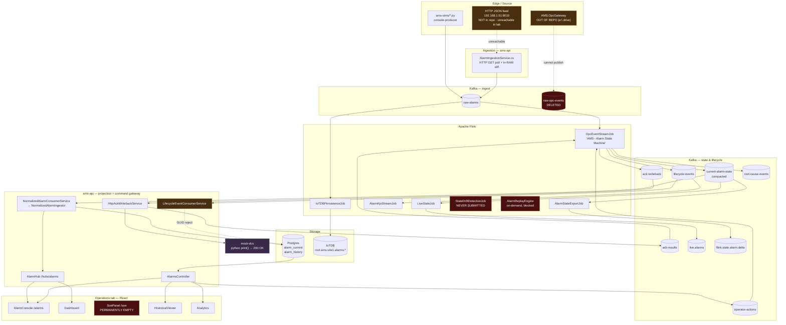
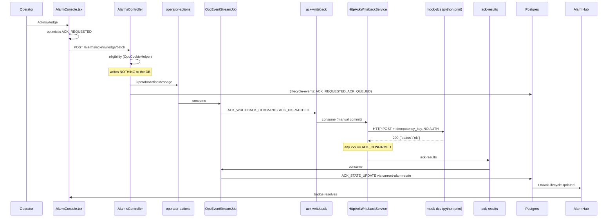

# 11 — Alarm Architecture, Reconstructed From Code

**Method.** Nothing in this file is taken from `architecture_document.md`, `docs/ams-alarm-architecture.md`,
or `CLAUDE.md`. Every edge in every diagram below was traced to a producer call site and a consumer call
site in the working tree at commit `2886ccb`. Where the documented architecture and the code disagree,
the code wins and the delta is recorded in `12-documentation-drift.md`.

**Legend used throughout:**

| Marker | Meaning |
|---|---|
| ✅ **Implemented** | Real code on both ends, wired in the default deployment |
| 🟡 **Partial** | Works, but a documented part of the contract is absent or defective |
| 🟠 **Placeholder** | Code exists and returns success without performing the action |
| 🔴 **Broken** | Both ends exist but cannot interoperate (data is dropped/rejected) |
| ⚫ **Dead** | One end has no counterpart; nothing flows |

---

## 1. The pipeline in one picture

---

## 2. Stage-by-stage reconstruction

### Stage 1 — Source ✅/🔴

There is **no OPC-UA or OPC A&E client in this repository.** Zero OPC packages appear in any
`.csproj`, `pom.xml`, or `package.json`. The three candidate sources:

| Source | Status | Evidence |
|---|---|---|
| HTTP JSON feed at `192.168.1.51:8010` | 🔴 **Broken in every shipped config** — the endpoint is not in this repo and is unreachable from the lab | `AlarmIngestionService.cs:20-21`; `appsettings.Production.json:4-5`; `docker-compose.yml:705` |
| `ams-sims/*.py` simulators | ✅ Work, but produce via `docker exec kafka-console-producer` | `ams-sims/sim_alarm_feed.py:107` |
| `AMS.OpcGateway` | ⚫ **Not in this repository** — absolute path on another drive | `scripts/start-opc-gateway-lab.ps1:10` |

**Net:** in the default `run-all.ps1` stack, the only alarm data that ever reaches Kafka is what a
simulator injects by hand.

### Stage 2 — Ingestion 🟡

`AlarmIngestionService` (`Program.cs:146`, gated by `AlarmIngestion:Enabled`, default true) polls a
JSON endpoint every 1–5 s (clamped, `:100`), diffs the response against an in-memory
`ConcurrentDictionary`, and produces changes to **`raw-alarms`** (`:158`, a compiled-in literal that
bypasses the `Kafka:RawAlarmsTopic` setting the rest of the system honours).

Three structural defects at this boundary:

1. Absent `priority` → `0` → `MapNumericPriority(0)` hits `<=1 => CRITICAL` (`:213-220`).
2. A malformed feed response parses to an **empty list** (`:263,273,276`), which the diff then treats
   as "everything cleared" and synthetically CLEARS every tracked alarm (`:128-137`).
3. The baseline is RAM-only and never pruned (`:50`), so alarms that clear during an ams-api restart
   never emit CLEARED and become permanent ghost rows.

### Stage 3 — Stream processing 🟡

Six alarm jobs run, submitted by `infra/docker/flink-job-supervisor.sh:90-141` (a standing container
with a 60 s reconcile loop). `scripts/ensure_flink_jobs.py` lists the same jobs but **is never invoked
by stack startup.**

| Job | Consumes | Produces | Status |
|---|---|---|---|
| `OpcEventStreamJob` | `raw-alarms`, `operator-actions`, `ack-results` | `current-alarm-state`, `lifecycle-events`, `root-cause-events`, `ack-writeback` | 🟡 |
| `IoTDBPersistenceJob` | `raw-alarms` | IoTDB `root.ams.site1.alarms.*` | ✅ |
| `LiveStateJob` | `current-alarm-state` | `live.alarms`, `live.alarm.metrics` (⚫ no consumer) | 🟡 |
| `AlarmKpiStreamJob` | `lifecycle-events` | `kpi-alarm-rates`, `kpi-standing-snapshots` | 🟡 |
| `AlarmStateExportJob` | `current-alarm-state` | `flink.state.alarm.delta` | 🟡 |
| `StateDriftDetectionJob` | `alarm.events.raw`, `alarm.state.active` — **both producerless** | `system.state.drift.alerts` | ⚫ |
| `AlarmReplayEngine` | `alarm.events.raw` — producerless | `flink.state.alarm.replay` | ⚫ |

**The ISA-18.2 state machine implements three transitions.** `PipelineOperators.LifecycleMap:211-275`,
keyed on `alarmKey`, two `ValueState`s, no TTL:

| From | Trigger | To | Ack handling |
|---|---|---|---|
| (none) | any event | `NEW` / `ACTIVE` | prior ack deliberately not restored |
| `ACTIVE` | `conditionActive` | `ACTIVE` / `ACTIVE` | sticky — `!evt.ack && prevAcked → true` |
| any | `!conditionActive` | `CLEARED` / `CLEARED` | not sticky; both states cleared |

Grep-verified absent: **RTN-Unacknowledged, Shelved, Suppressed-by-design, Out-of-Service, Latched.**
Quality is the literal `192` (`PipelineOperators.java:431`) — no NAMUR NE107 mapping exists.

Named-but-inert operators in the live job: `SoeOrderMap` and `CorrelationMap` are pure pass-throughs
that only draw boxes in the Flink UI; `RootCauseMap` is `contains("CRUSHER"/"CONVEYOR"/"FEEDER"/"MOTOR")`
string matching, not CEP; `KpiMap` is computed and **never sunk** (`OpcEventStreamJob.java:124-129`);
`FloodDetectFilter` *deletes* events with severity ≥950 rather than detecting floods (`:377`).

**There is no Flink DLQ.** Zero `OutputTag`/`sideOutput` matches across the job tree. Every parse
failure returns null and is dropped by the next `.filter` with no log, no metric, no topic — including
malformed operator ACKs (`OpcEventStreamJob.java:239-241`).

### Stage 4 — Projection to Postgres 🟡

`NormalizedAlarmConsumerService` → `NormalizedAlarmIngestor` consumes `current-alarm-state`
(group `ams-backend-2`, Earliest, manual commit after persist, batch 100) and maintains
`alarms.alarm_current`. This is the **read model** — authoritative state lives in Flink keyed state;
there is no JDBC anywhere in `src/flink`.

The load-bearing defect: **`alarm_current` has only 11 columns** (`02_alarm_schema.sql:37-50`), so
`AmsDbContext.cs:70-106` `b.Ignore`s 20 entity properties. That single mismatch is the origin of the
HTTP 500 on priority/category filtering, the absent ack attribution, the hardcoded DTO fields, and the
ack-reset regression at `ActiveAlarm.cs:400-426`.

`LifecycleEventConsumerService` is 🔴 **broken on the live path**: `:57` rejects any `alarmId` that is
not a GUID, and Flink emits the raw feed string (`PipelineOperators.java:403`, e.g. `BB26-BF402|Alarm high`).
Every feed-originated lifecycle event is silently discarded. Its sibling ingestor accepts the same ids
fine. It is also the one alarm consumer still on `EnableAutoCommit = true` (`:38-39`) — at-most-once.

### Stage 5 — API and realtime ✅/🟡

13 alarm endpoints under `/api/v1/alarms` plus analytics, admin and health. `alarm.view` guards
**none** of the read endpoints. SignalR hub `/hubs/alarms`, camelCase, 29-field payload. Seven
server→client methods fire; **six are declared and never invoked** (`OnSoeEvent`, `OnFloodAlert`,
`OnServerStatusChanged`, `OnAnalyticsUpdate`, `OnBulkAlarmsUpdated`, `OnHeartbeat`).

Every alarm is delivered 2–3× — `Clients.All` **plus** the server group **plus** the priority group
(`AlarmHub.cs:303-311`).

### Stage 6 — Operations tab 🟡

| Page | Real data source | Status |
|---|---|---|
| `/dashboard` | `/alarms/active/statistics`, `/alarms/active`, `/analytics/kpi`, MQTT firehose | 🟡 several tiles hardcoded |
| `/alarms` | REST + SignalR, AG-Grid, 15 cols | 🟡 unshelve always 400; SignalR-only alarms unackable |
| `/live-events` | MQTT tab ✅ · SignalR tab ⚫ | 🟡 |
| `/soe` | `alarmStore.recentSoeEvents` ← `OnSoeEvent` — **no publisher, no REST call, stub repo** | ⚫ **permanently empty** |
| `/historical` | `/alarms/historical` + NDJSON stream | 🟡 `cleared_time` is never real |
| `/analytics` | `/analytics/kpi` | 🟡 fleeting-alarm KPI counts every ACK |

### Stage 7 — ACK command path ✅ (to a stub)

This is the **most complete** part of the system. Every hop is real code:

The loop genuinely closes. What it closes **against** is a print statement.

### Stage 8 — DCS write-back 🟠

| Hop | Status |
|---|---|
| UI → API → `operator-actions` → Flink → `ack-writeback` → `HttpAckWritebackService` | ✅ real |
| `HttpAckWritebackService` → HTTP POST | ✅ real HTTP, ⚫ **no protocol** |
| OPC Gateway | ⚫ **not in this repository** |
| Actual target in default compose | 🟠 `mock-dcs`, `docker-compose.yml:413-445,710` |
| `ack-results` → Flink → Postgres → SignalR → UI | ✅ real |
| Shelve → DCS | 🟠 `NoOpOpcDcsGateway` — logs, returns, UI reports success |

**Verdict: write-back is implemented against an HTTP stub, not a DCS.** Any 2xx from any listener is
recorded as `ACK_CONFIRMED` with no body parsing and no read-back.

---

## 3. Path classification summary

### ✅ Implemented and working

- HTTP-feed → `raw-alarms` → Flink → `current-alarm-state` → Postgres → REST → console
- ACK command path, all seven hops, with correlation ids preserved end to end
- `ack-results` → Flink → Postgres → SignalR → UI badge resolution
- `raw-alarms` → `IoTDBPersistenceJob` → IoTDB (with a genuine no-loss `FailLoudIoTDBSink`)
- `current-alarm-state` → `LiveStateJob` → `live.alarms` → Sparkplug edge node → MQTT
- Shelve expiry (`ShelveExpiryService` + `expire_shelved_alarms()`)
- Edge-only auth: the gateway is the sole RS256 validator and strips inbound `X-Auth-*`

### 🟡 Partial

- ISA-18.2 lifecycle (3 of 8 declared states)
- Alarm history (clears never recorded; every ACK writes a fake CLEARED row)
- KPIs (global-only, no area rollup; standing-alarm count drifts upward without bound)
- Notification service (real MailKit/Teams providers, mock policy source, no alarm-triggered path)

### 🟠 Placeholder

- DCS write-back target (`mock-dcs`)
- Shelve write-back (`NoOpOpcDcsGateway`)
- Correlation (`CorrelationMap`), root cause (string matching), SOE ordering (`SoeOrderMap`)
- Alarm detail "History" tab (fabricated rows with invented timestamps)

### 🔴 Broken

- `LifecycleEventConsumerService` GUID rejection — drops every feed-originated lifecycle event
- Unshelve — frontend omits the required `reason`, always 400
- `/alarms/active` filtered or sorted by `priority`/`category` — HTTP 500
- `?isShelved=true` / `?isSuppressed=true` — cannot return a row by construction
- .NET ↔ Flink alarm-id formulas — cannot agree (currently masked)

### ⚫ Dead

- `raw-opc-events` and ~12 validation scripts that assert on it
- `StateDriftDetectionJob`, `AlarmReplayEngine`, and their two .NET consumers
- The entire SOE feature (`/soe`, the `/live-events` SignalR tab, `alarm_state_transitions`, `OnSoeEvent`)
- Flood detection, at every layer simultaneously
- `alarm_state_transitions`, `historical_alarms`, `active_alarms`, `configuration.opc_servers`
- `live.alarm.metrics`, `kpi-bad-actors`, `kpi-health-scores`, `ack-writeback-dlq`
- `database/procedures/alarm_operations.sql` (444 lines, never deployed)
- `AlarmCommands.cs:501-943` (443 lines of commented-out duplicate)

---

## 4. The three findings that most change the mental model

1. **This is not an OPC system.** No OPC client exists in the repository. Alarms arrive over HTTP
   polling from an endpoint that is neither in the repo nor reachable from the lab.
2. **Flink, not Postgres, holds authoritative state** — but Flink implements three lifecycle states,
   has no DLQ, and no configured restart strategy.
3. **The ACK path is the best-engineered part of the system and terminates at a Python print
   statement.** Everything upstream of the final hop is production-quality; the final hop does not exist.

---

*Companion files:* `01`–`10` for the per-area detail, `12-documentation-drift.md` for the doc delta,
`00-executive-summary.md` for the consolidated verdict.
