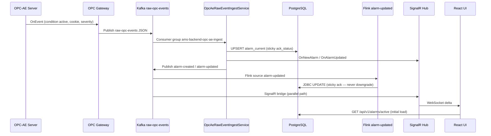
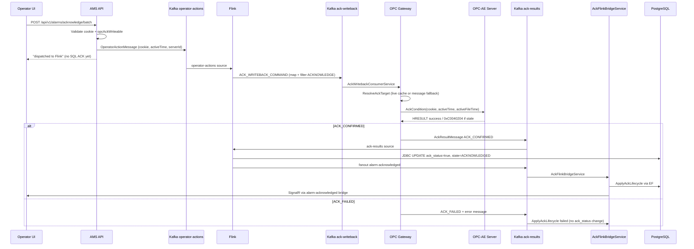

# AMS Alarm Architecture — Full System Reference

This document describes how alarms move through the AMS (Alarm Management System) platform: from OPC-AE sources through Kafka and Apache Flink to PostgreSQL, SignalR, and the React operator UI. It reflects the **current lab deployment** (simplified Flink JAR + dynamic OPC gateway) and how that relates to the **production target** documented in [production-contracts.md](production-contracts.md).

> **Docker run commands (copy-paste):** [docker-run-commands.md](docker-run-commands.md)  
> **Server build, dual-source (OPC + HTTP feed), Kafka topics, and Flink parallelism:** [server-build-kafka-flink-complete-guide.md](server-build-kafka-flink-complete-guide.md).

---

## 1. Executive summary

AMS is an event-driven industrial alarm platform built on:

| Layer | Technology | Role |
|-------|------------|------|
| Field / OT | OPC-AE server (DCS, simulator, OEM) | Source of condition events |
| Edge | AMS OPC Gateway (.NET 8, Windows host) | Subscribe, buffer, publish telemetry; execute `AckCondition` |
| Event bus | Apache Kafka | Immutable event log between services |
| Stream compute | Apache Flink | Lifecycle orchestration, JDBC projection, ACK routing |
| Projection | PostgreSQL (`alarms.alarm_current`) | Materialized active-alarm view for queries |
| API | AMS.Api (.NET 8) | REST queries, ACK commands (Kafka only), health |
| Real-time UI | SignalR + React AG Grid | Live alarm grid, operator ACK |

**Design principle:** Kafka + Flink are the orchestration authority. The API **never** writes ACK state directly to SQL on operator action — it publishes to `operator-actions` and waits for the confirmed pipeline to project state back.

---

## 2. High-level architecture

```text
┌─────────────────────────────────────────────────────────────────────────┐
│                         LEVEL 0 / LEVEL 1 OT                            │
│   DCS · PLC · IntegrationObjects OPC-AE Simulator · OEM OPC-AE Server   │
└─────────────────────────────────────────────────────────────────────────┘
                                    │
                          OPC-AE subscriptions
                                    ▼
┌─────────────────────────────────────────────────────────────────────────┐
│              AMS OPC EDGE GATEWAY  (Windows host :5050)                 │
│  · Native OPC COM (AckCondition, subscriptions)                       │
│  · SQLite WAL store-and-forward                                       │
│  · Publishes: raw-opc-events                                          │
│  · Consumes:  ack-writeback → OPC write → ack-results                 │
│  · Kafka bootstrap: 127.0.0.1:9093 (EXTERNAL listener)                │
└─────────────────────────────────────────────────────────────────────────┘
                                    │
                                    ▼
┌─────────────────────────────────────────────────────────────────────────┐
│                    APACHE KAFKA  (Docker :9093 host / kafka:9092)       │
│  raw-opc-events · operator-actions · ack-writeback · ack-results        │
│  alarm-created · alarm-updated · alarm-cleared · alarm-acknowledged     │
│  lifecycle-events · current-alarm-state (production path)               │
└─────────────────────────────────────────────────────────────────────────┘
          │                                    │
          │ telemetry                          │ lifecycle + ACK
          ▼                                    ▼
┌──────────────────────────┐    ┌────────────────────────────────────────┐
│  AMS API (projection)    │    │   APACHE FLINK JobManager :8082         │
│  OpcAeRawEventIngest     │    │   OpcEventStreamJob (lab JAR)            │
│  → alarm_current + Hub   │    │   · JDBC sinks → PostgreSQL              │
│  AckFlinkBridge          │    │   · operator-actions → ack-writeback     │
│  SignalR bridge          │    │   · ack-results → alarm-acknowledged     │
└──────────────────────────┘    └────────────────────────────────────────┘
          │                                    │
          └────────────────┬───────────────────┘
                           ▼
┌─────────────────────────────────────────────────────────────────────────┐
│              PostgreSQL  (ams-postgres :5433)                           │
│  alarms.alarm_current  ·  alarms.alarm_history                          │
│  configuration.opc_connections                                          │
└─────────────────────────────────────────────────────────────────────────┘
                           │
                           ▼
┌─────────────────────────────────────────────────────────────────────────┐
│   AMS API :8000  ──SignalR──►  React Frontend :3000                     │
│   GET /api/v1/alarms/active  ·  POST acknowledge/batch                  │
│   GET /api/v1/health/pipeline                                           │
└─────────────────────────────────────────────────────────────────────────┘
```

---

## 3. Runtime components and ports

| Component | Container / process | Port | Network |
|-----------|---------------------|------|---------|
| PostgreSQL | `ams-postgres` | 5433 → 5432 | `docker_ams-backend` |
| Kafka | `ams-kafka` | 127.0.0.1:9093 (host), kafka:9092 (Docker) | `docker_ams-backend` |
| Flink JobManager | `ams-flink-jobmanager` | 8082 → 8081 | Docker |
| Flink TaskManager | `docker-flink-taskmanager-*` | internal | Docker |
| AMS API | `ams-api` | 8000 | `docker_ams-backend` |
| AMS Frontend | `ams-frontend` | 3000 | Docker |
| OPC Gateway | Windows process | 5050 | Host → Kafka EXTERNAL |

**Kafka dual-listener (lab):**

- `INTERNAL://kafka:9092` — used by Docker services (API, Flink)
- `EXTERNAL://127.0.0.1:9093` — used by Windows OPC Gateway

---

## 4. Kafka topics — ownership and purpose

| Topic | Primary publisher | Primary consumer(s) | Purpose |
|-------|-------------------|---------------------|---------|
| `raw-opc-events` | OPC Gateway | `OpcAeRawEventIngestService`, telemetry watchdog | Canonical OPC-AE telemetry envelope |
| `operator-actions` | AMS API | Flink (`operator-actions` source) | Operator ACK / shelve commands |
| `ack-writeback` | Flink | OPC Gateway | DCS `AckCondition` command with cookie/activeTime |
| `ack-results` | OPC Gateway | Flink, `AckFlinkBridgeService` | ACK_CONFIRMED / ACK_FAILED from DCS |
| `lifecycle-events` | API, Gateway, Flink | `LifecycleEventConsumerService` | Append-only ACK state machine log |
| `alarm-created` | `OpcAeRawEventIngestService` | Flink, SignalR bridge | New active alarm projection event |
| `alarm-updated` | `OpcAeRawEventIngestService` | Flink, SignalR bridge | Severity/message/state change |
| `alarm-cleared` | Ingest (on condition inactive) | Flink, SignalR bridge | Remove from `alarm_current` |
| `alarm-acknowledged` | Flink, `AckFlinkBridgeService` | Flink JDBC, SignalR bridge | Confirmed operator ACK |
| `current-alarm-state` | Flink (production JAR) | `NormalizedAlarmConsumerService` | Production normalized alarm stream |

---

## 5. Alarm identity and database model

### 5.1 Stable alarm ID

Each alarm instance is keyed by:

```text
{serverId}|{sourceName}|{conditionName}|{subConditionName}
```

This string is hashed (SHA-1 → GUID) to produce the row `id` in `alarms.alarm_current`. The same logical alarm always maps to the same UUID across restarts.

**Example (lab simulator):**

```text
Server:  7ce5ecbf-70c9-498d-b899-5c8bb7add383
Source:  FIC1002
Condition: DEVIATION
Alarm ID: 4041696d-ab90-da63-fffe-e605aa5f2fde
```

### 5.2 Key columns in `alarms.alarm_current`

| Column | Meaning |
|--------|---------|
| `state` | `ACTIVE`, `ACKNOWLEDGED`, `CLEARED`, etc. |
| `ack_status` | Boolean — operator/DCS confirmed acknowledgement |
| `opc_attributes` | JSONB: `cookieOffset`, `activeTimeEpochMs`, `activeFileTime`, `opcAckWriteable` |
| `event_time` | Last OPC event timestamp |
| `last_updated` | Projection write time |

### 5.3 ISA-18.2 state mapping

The API maps DB rows to operator-facing states:

| DB `state` + `ack_status` | UI state |
|---------------------------|----------|
| ACTIVE + ack false | UnacknowledgedUncleared |
| ACKNOWLEDGED + ack true | AcknowledgedUncleared |
| (row deleted) | Cleared |

---

## 6. Alarm activation flow (telemetry path)

This is the path an alarm takes from the field to the operator screen.

### 6.1 Step-by-step



### 6.2 OPC Gateway event publish

When the gateway receives an OPC-AE event:

1. Normalizes fields: `sourceName`, `conditionName`, `subConditionName`, `severity`, `message`, `ackRequired`, `acknowledged`, `cookieOffset`, `activeTimeEpochMs`, `activeFileTime`, `conditionActive`.
2. Buffers to SQLite WAL if Kafka is temporarily unavailable.
3. Publishes to `raw-opc-events` with idempotent Kafka producer settings.

The gateway also maintains an in-memory `_liveAckTargets` cache for conditions currently in an ackable activation window (required for successful `AckCondition`).

### 6.3 AMS API raw ingest (`OpcAeRawEventIngestService`)

**Enabled when:** `OpcGateway:EnableRawEventIngest = true` (lab default).

Consumes `raw-opc-events` and:

1. **Active conditions** (`conditionActive = true`):
   - UPSERT into `alarms.alarm_current`
   - **Sticky ACK rule:** `ack_status = existing_ack OR opc_ack` — operator ACK is never downgraded by a new OPC event
   - Merges `opc_attributes` (cookie, activeTime) for DCS writeback eligibility
   - Pushes SignalR `OnNewAlarm` / `OnAlarmUpdated` with effective ack from DB
   - Publishes `alarm-created` / `alarm-updated` to Kafka (using effective ack, not raw OPC bit)

2. **Cleared conditions** (`conditionActive = false`):
   - DELETE row from `alarm_current`
   - SignalR `OnAlarmCleared`

3. **Dynamic OPC sync** (lab): periodically refreshes `opc_attributes` on unacked rows so UI ACK buttons stay writeable.

**Code:** `src/backend/AMS.Api/BackgroundServices/OpcAeRawEventIngestService.cs`

### 6.4 Why ingest and Flink both write the DB (lab)

In the **lab simplified Flink JAR**, `raw-opc-events` is **not** consumed by Flink. Instead:

- Ingest writes `alarm_current` directly (fast path for simulator testing)
- Ingest also publishes `alarm-*` topics
- Flink JDBC sinks apply the same sticky ACK rules on `alarm-updated` and `ack-results`

In **production**, Flink consumes `raw-opc-events` directly and owns normalization; the API is projection-only. See [flink-only-orchestration.md](flink-only-orchestration.md).

---

## 7. Operator acknowledgement flow (ACK path)

ACK is a multi-hop orchestrated workflow — not a single SQL UPDATE.

### 7.1 ACK lifecycle states

```text
ACK_REQUESTED → ACK_QUEUED → ACK_DISPATCHED → ACK_PENDING_DCS → ACK_CONFIRMED
                                                              ↘ ACK_FAILED
                                                              ↘ ACK_TIMEOUT
```

Defined in `AckLifecycleStates` (`src/backend/AMS.Infrastructure/Kafka/AckLifecycleStates.cs`).

### 7.2 End-to-end ACK sequence



### 7.3 API ACK command (no direct SQL)

`AcknowledgeAlarmHandler` and `BatchAcknowledgeAlarmsHandler`:

1. Load alarm from `alarm_current`
2. Validate `OpcCookieHelper.IsWritebackAckEligible` (cookie > 0, condition active, not snapshot feed)
3. Publish `OperatorActionMessage` to `operator-actions` via `OperatorActionPublisher`
4. Emit `lifecycle-events` (REQUESTED → QUEUED)
5. Return success = "dispatched to Flink" — **not** "alarm acknowledged"

**Code:** `src/backend/AMS.Application/Alarms/Commands/AlarmCommands.cs`, `OperatorActionPublisher.cs`

### 7.4 Flink ACK orchestration (lab JAR)

Job name: **AMS - Simplified Alarm State Machine**  
Entry class: `com.ams.flink.OpcEventStreamJob`  
Source: `src/flink/src/main/java/com/ams/flink/OpcEventStreamJob.java`

Flink handles two ACK-specific pipelines:

#### Pipeline A — Dispatch writeback

```text
operator-actions → map(toAckWriteback) → filter(non-empty) → ack-writeback
```

`toAckWriteback` copies: `alarmId`, `serverId`, `sourceName`, `conditionName`, `cookieOffset`, `activeTimeEpochMs`, `activeFileTime`, `comment`, correlation IDs.

Consumer group: `flink-ams-operator-actions`

#### Pipeline B — Confirm and project

```text
ack-results → filter(ACK_CONFIRMED) → JDBC UPDATE alarm_current
           → map(toAlarmAcknowledged) → alarm-acknowledged topic
```

Consumer group: `flink-ams-ack-results`

### 7.5 OPC Gateway writeback

`AckWritebackConsumerService` (Windows gateway):

1. Consumes `ack-writeback`
2. Emits `ACK_PENDING_DCS` on `lifecycle-events`
3. Resolves cookie/activeTime via `ResolveAckTarget` (prefers live OPC cache, falls back to message fields)
4. Calls `AcknowledgeAsync` → native `AckCondition`
5. Publishes `ack-results` with `ACK_CONFIRMED` or `ACK_FAILED`

**Common failure:** `HRESULT=0xC0040204` — stale cookie or activeTime; operator must ACK during a live simulator alarm window.

**Code:** `e:\AMS\src\opc-gateway\AMS.OpcGateway\Kafka\AckWritebackConsumerService.cs`

### 7.6 AckFlinkBridge (API-side confirmation)

`AckFlinkBridgeService` consumes `ack-results` and:

- On `ACK_CONFIRMED`: calls `ActiveAlarm.ApplyAckLifecycle`, saves EF entity, republishes `alarm-acknowledged`
- On `ACK_FAILED`: records lifecycle only

This provides a second projection path alongside Flink JDBC (at-least-once; sticky ingest rules prevent downgrade).

---

## 8. Apache Flink — job structure and responsibilities

### 8.1 Job topology (current lab JAR)

The simplified job runs **six parallel source pipelines** (parallelism = 1 in lab):

| # | Source topic | Flink operator name | Sink(s) | Action |
|---|--------------|---------------------|---------|--------|
| 1 | `alarm-created` | `alarm-created` | JDBC ×2 | INSERT `alarm_current`, INSERT `alarm_history` |
| 2 | `alarm-updated` | `alarm-updated` | JDBC ×2 | UPDATE `alarm_current` (sticky ack), INSERT history |
| 3 | `alarm-cleared` | `alarm-cleared` | JDBC ×2 | DELETE `alarm_current`, UPDATE history CLEARED |
| 4 | `alarm-acknowledged` | `alarm-acknowledged` | JDBC ×2 | SET ack_status=true on current + history |
| 5 | `operator-actions` | `operator-actions` | Kafka `ack-writeback` | ACK command routing |
| 6 | `ack-results` | `ack-results` | JDBC + Kafka | Confirm ACK, fanout `alarm-acknowledged` |

### 8.2 Checkpointing

```java
env.enableCheckpointing(30_000, CheckpointingMode.EXACTLY_ONCE);
state.checkpoints.dir: file:///flink-checkpoints
```

Checkpoints enable Kafka offset recovery and improve Flink UI metrics reliability.

### 8.3 Sticky acknowledgement in Flink JDBC

The `alarm-updated` sink uses:

```sql
ack_status = COALESCE(ack_status, false) OR ?
state = CASE WHEN COALESCE(ack_status, false) OR ? THEN 'ACKNOWLEDGED' ELSE ? END
```

This prevents OPC telemetry updates from undoing a confirmed operator ACK — a critical lab fix.

### 8.4 Production Flink (target)

The production job (described in [enterprise-cams-production-architecture.md](enterprise-cams-production-architecture.md)) additionally:

- Consumes `raw-opc-events` directly
- Normalizes, deduplicates, enriches, runs CEP/flood detection
- Publishes `current-alarm-state` and `lifecycle-events`
- Does **not** rely on API-side raw ingest for authoritative state

The lab JAR is a **reduced subset** focused on JDBC projection + ACK routing for simulator validation.

### 8.5 Submitting and managing the job

```powershell
# From repo root
.\scripts\stabilize-ams-e2e.ps1          # build JAR + ensure single RUNNING job
.\scripts\stabilize-ams-e2e.ps1 -ForceResubmit -SkipBuild
```

Helper library: `scripts/lib/AmsFlinkJob.ps1` — cancels duplicate jobs, submits `OpcEventStreamJob`, verifies RUNNING state.

Flink UI: http://localhost:8082

---

## 9. UI and real-time projection

### 9.1 Initial load

```http
GET /api/v1/alarms/active?pageSize=500&isAcknowledged=false
Authorization: Bearer dev
```

Reads `alarms.alarm_current` via `AlarmRepositories` — returns `acknowledged`, `alarm_state`, `opcAttributes` (cookie for ACK eligibility).

### 9.2 Live updates (two paths)

| Path | Trigger | Hub method |
|------|---------|------------|
| Ingest | `OpcAeRawEventIngestService` after DB upsert | `OnNewAlarm`, `OnAlarmUpdated` |
| Kafka bridge | `SimpleKafkaSignalRBridgeService` on `alarm-*` topics | Same hub methods |
| Cleared | Either path | `OnAlarmCleared` |

Frontend connects to `/hubs/alarms` (proxied via nginx in Docker).

### 9.3 Operator ACK from UI

UI calls:

```http
POST /api/v1/alarms/acknowledge/batch
{ "alarmIds": ["<guid>"], "comment": "...", "operatorStation": "..." }
```

UI should only enable ACK when `opcAttributes.cookieOffset > 0` and alarm is active/unacked.

---

## 10. Health, metrics, and observability

### 10.1 Pipeline health endpoint

```http
GET /api/v1/health/pipeline
```

Returns subsystem scores and Flink/Kafka telemetry:

| Field | Meaning |
|-------|---------|
| `flink.status` | Running / Stopped |
| `flink.checkpointLatencyMs` | Last checkpoint duration |
| `flink.restartCount` | Task restart count |
| `flink.operatorActionsProcessed` | Sum of committed offsets on `flink-ams-operator-actions` |
| `flink.ackResultsProcessed` | Sum of committed offsets on `flink-ams-ack-results` |
| `telemetryIngest.totalEventsObserved` | raw-opc-events events seen by API watchdog |
| `opcConnections.activeConnections` | Gateway connections from DB config |

**Code:** `PipelineHealthService.cs`

### 10.2 Flink UI metrics

| Location | What to look for |
|----------|------------------|
| Flink UI → Jobs → Running job | State = RUNNING, no failed tasks |
| Vertices `operator-actions`, `ack-results` | `read-records`, `numRecordsIn` (may show 0 in lab without checkpoints — use health API offsets instead) |
| Checkpoints tab | Completed checkpoints every ~30s |

### 10.3 Kafka consumer groups (verification)

```bash
docker exec ams-kafka kafka-consumer-groups --bootstrap-server kafka:9092 \
  --describe --group flink-ams-operator-actions

docker exec ams-kafka kafka-consumer-groups --bootstrap-server kafka:9092 \
  --describe --group flink-ams-ack-results
```

LAG should be 0 when the job is healthy; CURRENT-OFFSET increases as ACK commands flow.

### 10.4 Gateway logs

Windows gateway logs:

```text
e:\AMS\src\opc-gateway\AMS.OpcGateway\bin\Release\net8.0\logs\opc-gateway-YYYYMMDD.txt
```

Key log lines:

- `DCS ACK confirmed FIC1002:DEVIATION` — OPC write succeeded
- `AckCondition failed HRESULT=0xC0040204` — stale timing, retry on fresh alarm
- `No live OPC alarm activation` — outside simulator activation window

---

## 11. Lab vs production configuration

| Setting | Lab (current) | Production target |
|---------|---------------|-------------------|
| `Kafka:UseFlinkOrchestration` | `true` | `true` |
| `Kafka:LabDirectIngest` | `false` | `false` |
| `LabAckSimulator:Enabled` | `false` (real OPC path) | `false` |
| `OpcGateway:EnableRawEventIngest` | `true` (API consumes raw-opc-events) | `false` (Flink owns raw ingest) |
| Flink JAR | Simplified `OpcEventStreamJob` | Full normalization + CEP JAR |
| OPC Gateway Kafka | `127.0.0.1:9093` | Site-specific EXTERNAL listener |
| API ACK path | operator-actions → Flink → gateway | Same |

---

## 12. Failure modes and debugging

| Symptom | Likely cause | Check |
|---------|--------------|-------|
| UI shows Active after ACK | Ingest or Flink overwrote ack_status | DB `ack_status`, ingest sticky SQL, `alarm-updated` JDBC |
| API returns "dispatched" but no OPC change | Gateway not on `127.0.0.1:9093` | Gateway env `Kafka__BootstrapServers` |
| `ACK_FAILED` "No live OPC activation" | Outside simulator alarm window | Wait for fresh "… Alarm" event, ACK immediately |
| `HRESULT=0xC0040204` | Stale cookie/activeTime | New activation cycle in simulator |
| Flink UI all zeros | Vertex metric quirk / job restarting | Health API `operatorActionsProcessed`, consumer group offsets |
| Flink job FAILED | JDBC cannot reach `postgres` | `DB_URL=jdbc:postgresql://postgres:5432/ams` inside Docker |
| No alarms in UI | Gateway disconnected or ingest disabled | `/health/opc`, `EnableRawEventIngest` |

### 12.1 E2E validation script

```powershell
.\scripts\test-full-pipeline-e2e.ps1
```

Tests: GET alarms → select FIC alarm with cookie → batch ACK → monitor Kafka topics → verify DB state.

---

## 13. Key source files reference

| Area | Path |
|------|------|
| Flink job | `src/flink/src/main/java/com/ams/flink/OpcEventStreamJob.java` |
| OPC raw ingest | `src/backend/AMS.Api/BackgroundServices/OpcAeRawEventIngestService.cs` |
| ACK bridge | `src/backend/AMS.Api/BackgroundServices/AckFlinkBridgeService.cs` |
| ACK commands | `src/backend/AMS.Application/Alarms/Commands/AlarmCommands.cs` |
| Operator publish | `src/backend/AMS.Infrastructure/Kafka/OperatorActionPublisher.cs` |
| SignalR bridge | `src/backend/AMS.Api/BackgroundServices/SimpleKafkaSignalRBridgeService.cs` |
| Pipeline health | `src/backend/AMS.Infrastructure/Health/PipelineHealthService.cs` |
| Domain ACK logic | `src/backend/AMS.Domain/Alarms/ActiveAlarm.cs` |
| Gateway writeback | `e:\AMS\src\opc-gateway\AMS.OpcGateway\Kafka\AckWritebackConsumerService.cs` |
| Gateway OPC connection | `e:\AMS\src\opc-gateway\AMS.OpcGateway\OpcAe\OpcAeServerConnection.cs` |
| Docker compose | `infra/docker/docker-compose.yml` |
| Flink job scripts | `scripts/stabilize-ams-e2e.ps1`, `scripts/lib/AmsFlinkJob.ps1` |

---

## 14. Related documentation

- [Flink-only orchestration](flink-only-orchestration.md) — topic ownership and API rules
- [Production contracts](production-contracts.md) — formal correctness guarantees
- [Enterprise production architecture](enterprise-cams-production-architecture.md) — DCS-ready target
- [E2E stabilization](e2e-stabilization.md) — lab bring-up runbook
- [Kafka/Flink stabilization](kafka-flink-stabilization.md) — broker listener fixes

---

---

## 15. Production validation mode (current target)

As of 2026-06-08 the platform runs in **production validation mode**:

- **Flink owns all ingest:** `raw-opc-events` → validation → dedup → enrichment → SOE → lifecycle → PostgreSQL
- **API bypass disabled:** `OpcGateway:EnableRawEventIngest=false`
- **No lab simulator:** `LabAckSimulator:Enabled=false`
- **Flink metrics exposed:** `/api/v1/health/pipeline` returns `recordsReceived`, `recordsSent`, per-operator throughput

See [production-validation-architecture.md](production-validation-architecture.md) for acceptance criteria and validation scripts.

Run: `.\scripts\production-validation-report.ps1`

---

*Document version: 2026-06-08 — production Flink pipeline; API projection-only; sticky ACK rules.*
