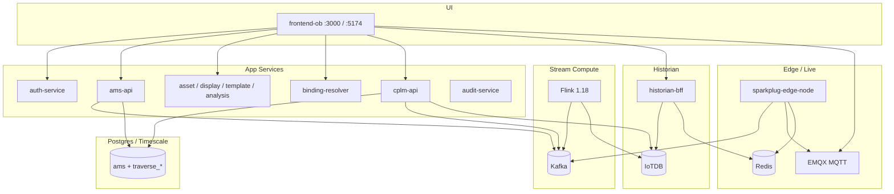

# AMS / Traverse — Architecture Review Pack

**Source of truth:** code + `infra/docker/docker-compose.yml` (not legacy README claims).  
**Audience:** technical product managers / architects onboarding.

| Doc | Contents |
|---|---|
| [01-system-overview.md](./01-system-overview.md) | What the product is, layers, why each tech |
| [02-docker-compose-services.md](./02-docker-compose-services.md) | Every compose service, ports, role |
| [03-microservices-catalog.md](./03-microservices-catalog.md) | `src/services/*` + `src/backend` capabilities |
| [04-data-flows.md](./04-data-flows.md) | End-to-end pipelines (alarm, live, history, CPLM, HMI) |
| [05-flink-jobs.md](./05-flink-jobs.md) | Standing / on-demand / dead Flink jobs |
| [06-iotdb-historian.md](./06-iotdb-historian.md) | Writers, path trees, readers |
| [07-mqtt-sparkplug-live.md](./07-mqtt-sparkplug-live.md) | Kafka → Sparkplug → EMQX → Redis → UI |
| [08-auth-architecture.md](./08-auth-architecture.md) | Why TraverseAuth is copied into every service |
| [09-databases.md](./09-databases.md) | Postgres DBs, init scripts, ownership |
| [10-cleanup-and-reorg.md](./10-cleanup-and-reorg.md) | Unused paths + proposed folder structure |

**Start here if new:** `01` → `04` → `02` → `05` → `08` → `10`.
