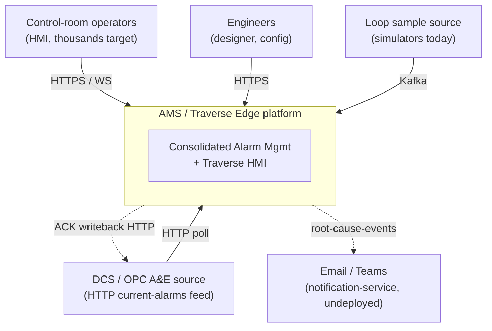
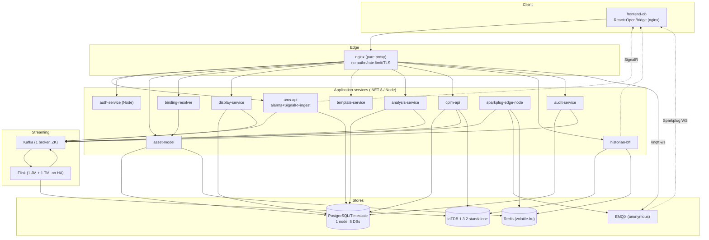
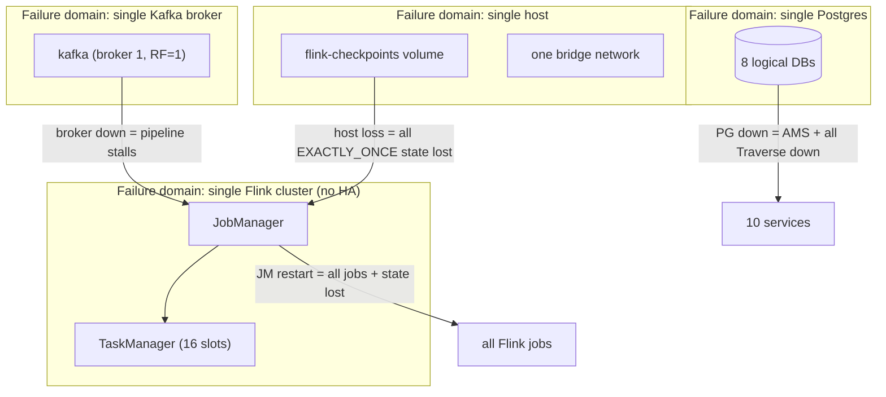

# 01 — Architecture Assessment

**Purpose:** assess the AMS/Traverse system as a microservices architecture — bounded contexts, coupling, CQRS conformance, Twelve-Factor posture, and failure domains — against code, not documentation.
**Reviewed commit:** `4e2758c951df06a170f35d23313824cb57c9ef03`
**Date:** 2026-08-08
**Verification status:** every claim is code-cited or marked; findings trace to [PHASE1-VERIFICATION.md](./PHASE1-VERIFICATION.md) and the gap register.

### Domain summary grades (dual-column)

| Capability | Lab | Prod | Key gaps |
|---|---|---|---|
| Bounded contexts / DB-per-service | A | B | Clean per-service DBs; `alarm_history` has no writer (DATA-06), `traverse_shared` undefined (DATA-12) |
| Independent deployability | B | C | Shared Flink JAR, copied auth module (AUTH-08), single-replica ams-api (SCALE-01), bind-mounted JAR (STR-13) |
| CQRS conformance | B | B | Display purity enforced; UNS single-source-of-truth violated for alarm identity (DATA-07) |
| Twelve-Factor | C | C | Config/secrets in-image (SEC-02), non-durable backing state (STR-02), build/release/run blurred (STR-13) |
| Failure-domain isolation | C | D | One broker/PG/IoTDB/Redis, one network, no HA (STR-03/04, DATA-04/05) |

---

## 1. System context and container diagrams

### C4 L1 — System context

### C4 L2 — Container diagram (as-built)

---

## 2. Microservices maturity — is this microservices or a distributed monolith?

**Verdict: a genuine service decomposition with distributed-monolith coupling at three seams.** The bounded-context and database-per-service discipline is real and better than most brownfield estates; but three couplings prevent independent evolution/deployment.

### Service inventory (bounded context · owned DB · coupling · independent deployability)

| Service | Bounded context | Owns DB | Sync coupling | Async coupling | Independently deployable? |
|---|---|---|---|---|---|
| ams-api | Alarm projection + ACK + ingest | `ams` | none inbound (edge) | raw-alarms/operator-actions/ack-results ↔ Flink | **No** — single replica (SCALE-01) |
| auth-service | Identity/JWT issuer | `traverse_auth` | JWKS pulled by all | — | Yes |
| asset-model | UNS source of truth | `traverse_assets` | called by binding-resolver, cplm-api | asset-events (Redis) | Yes |
| binding-resolver | path+role → transport | none | calls asset-model (X-Service-Key) | — | Yes |
| display-service | Display config (CQRS) | `traverse_displays` | — | audit-events | Yes |
| template-service | Templates | `traverse_templates` | — | — | Yes |
| analysis-service | Analysis design-time | `traverse_analysis` | calls asset-model | analysis.executions/results ↔ Flink | Partly — needs an unsupervised Flink job (STR-07) |
| cplm-api | Loop performance | `traverse_cplm` | calls asset-model | clpm.* ↔ Flink | **No** — single-member consumer constraint (STR-06) |
| historian-bff | Historian read BFF | none | reads IoTDB/Redis | — | Yes |
| audit-service | Audit trail | `traverse_audit` | — | audit-events | Yes |
| sparkplug-edge-node | Kafka→MQTT bridge | none | — | live.* → EMQX/Redis | Yes |

### The three distributed-monolith seams

1. **One shaded Flink JAR for all 15 jobs** (`pom.xml`, single `ams-flink-1.0-SNAPSHOT.jar`, bind-mounted into 7 containers). A change to any one job forces a rebuild-and-redeploy of the artifact every job shares, and the artifact is a working-tree bind mount — a local `mvn package` mutates the running "production" binary (STR-13). Jobs are not independently versioned or deployable.
2. **Byte-copied auth module** (`_shared/TraverseAuth.cs` → 7 copies, plus 2 hand-rolled validators in ams-api and display-service). A security fix must be applied to three independent implementations; only the 7 copies are guarded by the CI `diff` (AUTH-08). This is compile-time coupling masquerading as independence, driven by Docker build-context isolation (each service builds from its own directory and cannot reference a sibling `.csproj`).
3. **Compose-level coupling and single-replica assumptions.** ams-api's SignalR has no backplane and its UI-topic consumers use fixed group ids with `Clients.All` (SCALE-01); cplm-api's consumers must be a single group member by convention (STR-06). Both are pinned to one replica for correctness, so "microservices that scale horizontally" is not achievable for the two most load-bearing services without the fixes in 07/10.

**Smart-endpoints/dumb-pipes:** honored — Kafka carries data, logic lives in services/Flink; no ESB. **Database-per-service:** honored (8 logical DBs), with two blemishes (DATA-06 `alarm_history` has no writer, DATA-12 `traverse_shared` undefined).

---

## 3. CQRS conformance audit (against the project's own settled rules)

Rules from `MIGRATION_LOG.md:288-307` and CLAUDE.md. Each: where enforced, where violated.

| Rule | Enforced in code | Violated / at risk |
|---|---|---|
| **Display config purity** (no process values in snapshots) | `displays.display_versions` CQRS trigger `trg_validate_snapshot` blocks process values (`11_traverse_displays_schema.sql:88-92`); frontend resolves live values at runtime via binding-resolver | None found — **conformant (A)**. |
| **Bind through the UNS** (path+role → transport) | binding-resolver `/resolve` returns live/history/alarm descriptors; asset-model is the path SoT | Partially undermined by DATA-07: the alarm *identity* is not consistent across live (Sparkplug device = sourceName) and history (IoTDB = alarmId), so the browser re-derives the historian path (`iotdbPaths.ts:67-76`) instead of the UNS resolving it. **Violates "one path, many transports."** |
| **Flink-only compute** | `Program.cs:114-125` throws if `UseFlinkOrchestration=false`; the .NET fallback processor was removed | Conformant, but with a drift note (D-7): CLAUDE.md still describes the removed fallback. |
| **Projection-only Postgres writes** (no Flink JDBC) | No JDBC sink in `src/flink` (evidence-E S-F); .NET consumers project Kafka→Postgres | Conformant — but the projection has an integrity hole (DATA-01) and `alarm_history` has no writer at all (DATA-06). |
| **DOM/SVG designer, no Konva** | No konva/canvas dependency; DesignerCanvas renders positioned `
`/SVG | Conformant (A). |
| **Two-tier displays** (controlled vs personal) | `display_versions` + `personal_views` schemas | Conformant. |

**CQRS verdict: B/B.** The read/write separation and display purity are enforced in code; the one substantive violation is the UNS identity inconsistency for alarms (DATA-07), which pushes a join into the client and breaks the single-source-of-truth guarantee.

---

## 4. Twelve-Factor scorecard (dual-column)

| Factor | Lab | Prod | Evidence |
|---|---|---|---|
| I. Codebase | A | A | One monorepo, one deploy topology |
| II. Dependencies | B | C | .NET/npm/Maven declared; Flink JAR bind-mounted not baked (STR-13); dead deps (FE-07) |
| III. Config | C | D | Secrets/config as compose defaults in-image (SEC-02); checked-in connection string wrong port relying on override (H-19) |
| IV. Backing services | B | C | Attached via env, but non-durable checkpoint store (STR-02), single instances |
| V. Build/release/run | C | C | Bind-mounted working-tree JAR blurs build vs run (STR-13) |
| VI. Processes | B | C | Mostly stateless services; ams-api holds SignalR state → single replica (SCALE-01) |
| VII. Port binding | A | A | Each service binds its own port |
| VIII. Concurrency | C | D | Cannot scale ams-api (SCALE-01) or cplm-api (STR-06) horizontally |
| IX. Disposability | C | C | Consumers mostly Close() on stop (H-28), but failure/rebalance paths lose data (DOM-01, STR-09); notification-service blocks startup (AUTH-07) |
| X. Dev/prod parity | C | C | "Production" ingest overlay (StreamPipes) missing (D-10); sims overlay downgrades security (H-05) |
| XI. Logs | C | C | Serilog present; json-file log-rotation anchor defined but applied to nothing (OPS-03) |
| XII. Admin processes | B | B | Schema init via mounted SQL; shelve-expiry admin job never registered (DOM-02) |

---

## 5. Coupling and failure-domain analysis — what fails together and why

**What fails together:**
- **Kafka broker loss (STR-04)** stalls the entire alarm pipeline — one broker, RF=1, so there is no failover; any topic is single-partition-leader on the only broker.
- **JobManager loss (STR-03)** loses every running job; the 60s supervisor brings them back *without state* (empty RBE fingerprints, empty 24h CPLM buffer), and `latest()`-offset jobs skip the gap.
- **Host/volume loss (STR-02)** loses all retained checkpoints — the "EXACTLY_ONCE" guarantee is only as durable as one Docker volume.
- **Postgres loss (DATA-05)** takes down AMS core *and* all seven Traverse services simultaneously — the database-per-service isolation is logical only; they share one physical instance.
- **Redis eviction (DATA-03)** blanks faceplates (paint-on-open contract keys are evictable).
- **ams-api is a singleton (SCALE-01):** its loss drops all SignalR alarm push; it cannot be replicated for HA without a backplane.

**Cross-cutting:** 37 services share one bridge network with no segmentation and every store host-published (evidence-A §1); a compromise of any root-running Traverse container (SEC-01) has network-level reach to every store, all of which are unauthenticated or use default credentials (H-17, H-19, H-20, DATA-03).

**Net:** the architecture is well-decomposed at the domain level but has **no failure isolation** at the infrastructure level — acceptable in a lab, disqualifying for production. All infrastructure SPOFs are resolved in [07-scalability-reliability.md](./07-scalability-reliability.md) §4 and [10-target-architecture.md](./10-target-architecture.md).
