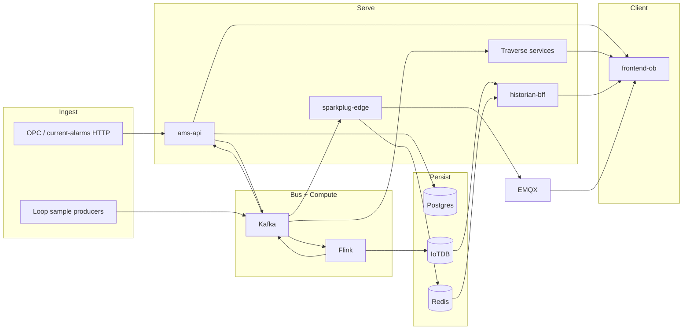

# 01 — System Overview

## Product

Two products share one monorepo and one docker-compose stack:

| Product | Role | Code home |
|---|---|---|
| **AMS / CAMS** | Consolidated Alarm Management (OPC A&E / ISA-18.2 style) | `src/backend`, Flink alarm jobs, `ams` DB |
| **Traverse HMI** | UNS-based designer + runtime (displays, bindings, templates, CPLM) | `src/services/*`, `src/frontend-ob` |

UI: React 18 + OpenBridge (`src/frontend-ob`). Nginx (prod) / Vite (dev) routes `/api/*` to many backends.

## Architectural rules (enforced in code)

| Rule | How it shows up |
|---|---|
| CQRS for displays | Display JSON = config only; no live PV stored (`display-service`) |
| Bind via UNS | Path + role → transport via `binding-resolver` |
| Flink owns stream compute | Alarm SM, live RBE, CPLM features; .NET projects Kafka → Postgres |
| One Postgres cluster, many DBs | `ams`, `traverse_*` per service |
| CPLM not in ams-api | Consumers/mutations in `cplm-api` only (`Cplm__ConsumersEnabled=true`) |
| DOM/SVG designer | No Konva in live path |

## Why each major technology

| Tech | Why | How used now |
|---|---|---|
| **Kafka** | Durable event bus between ingest, Flink, projectors | Topics: `raw-alarms`, `current-alarm-state`, `live.*`, `loop.samples.v1`, `clpm.*`, `audit-events`, … |
| **Flink 1.18** | Stateful stream processing, checkpointed | 7 standing jobs via supervisor; JAR `ams-flink-1.0-SNAPSHOT.jar` |
| **Postgres + Timescale** | Relational SoT for alarms projection + config DBs | Init: `database/scripts/*` mounted into postgres |
| **IoTDB 1.3.2** | Time-series historian (alarms + loops + KPIs) | Session `:6667`, REST `:8181`; BFF reads REST |
| **Redis** | Paint-on-open snapshots + asset/display events | `volatile-lru` (TTL keys only); not a general cache |
| **EMQX 5.6** | MQTT / Sparkplug B broker for HMI live values | TCP 1883, WS 8083; anon allowed in lab |
| **SignalR** | Alarm list / ack UX push | `ams-api` hubs `/hubs/alarms` |
| **RS256 JWT (auth-service)** | Central issuer; services validate JWKS | No OIDC discovery; no nginx gateway auth |

## Runtime layers



## How to run (canonical)

```powershell
.\run-all.ps1                 # build + start full stack
.\run-all.ps1 -SkipBuild      # start without rebuild
.\scripts\build-flink-jar.ps1 # required before Flink submit if JAR missing
```

Wraps `scripts/start-ams-docker-full.ps1` → `infra/docker/docker-compose.yml`.

## Code map (live)

```
src/
  backend/          # AMS.Api + domain/infra
  frontend-ob/      # React UI + nginx.conf
  flink/            # All Flink jobs (one shaded JAR)
  services/         # Traverse microservices + sparkplug + auth
infra/docker/       # compose + Flink submit/supervisor scripts
database/scripts/   # Postgres init (only live schema path)
```
