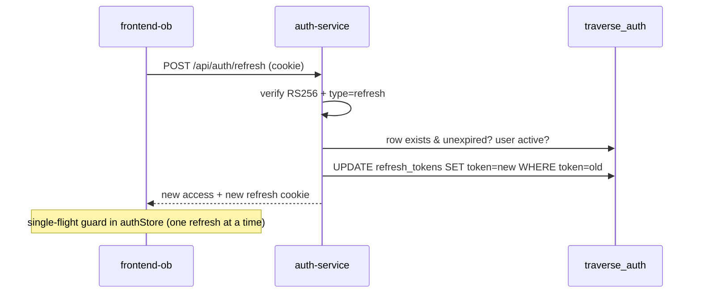

# 02 — Authentication & Security Review

**Purpose:** assess authentication, authorization, service-to-service trust, secrets, and IEC 62443 zoning as-built.
**Reviewed commit:** `4e2758c951df06a170f35d23313824cb57c9ef03`
**Date:** 2026-08-08
**Anchors:** OWASP ASVS 4.0 (V2/V3/V4/V13), RFC 8725 (JWT BCP), RFC 9700 (OAuth 2.0 Security BCP), NIST SP 800-63B, IEC 62443-3-3 SR 1.x/2.x.
**Verification:** all findings CONFIRMED in [PHASE1-VERIFICATION.md](./PHASE1-VERIFICATION.md); evidence in `evidence-B-auth.md`.

### Domain summary grades (dual-column)

| Capability | Lab | Prod | Gap |
|---|---|---|---|
| Token issuance (RS256, TTLs, bcrypt) | A | B | Sound design; no rotation (AUTH-06) |
| Token validation at services | A | B | RS256-pinned, issuer/audience/lifetime checked; 3 copies (AUTH-08) |
| Authorization (permission claims) | B | C | Kill switch (AUTH-02), unauthed observability hub (AUTH-04) |
| Service-to-service trust | C | D | Shared static key = full principal (AUTH-01) |
| Live-plane auth (MQTT) | D | D | Anonymous broker, public WS (AUTH-03) |
| Token revocation | C | C | None (AUTH-05) |
| Secrets management | C | C | Plaintext defaults (SEC-02) |
| IEC 62443 zoning | C | D | Flat network, no conduits |

**Explicit verdict on "is auth-service production grade":** **the issuer is close; the deployment is not.** auth-service itself (RS256, DB-backed single-use refresh rotation, bcrypt, JWKS) is a solid foundation (B). The system around it — a shared full-permission service key with fail-open defaults, an authorization kill switch, an unauthenticated observability hub, an anonymous live plane, no revocation, and no key rotation — is not production grade (D). Itemized in §8.

---

## 1. Auth architecture as-built

### Login

```mermaid
sequenceDiagram
    participant UI as frontend-ob
    participant NG as nginx (proxy)
    participant AU as auth-service (Node)
    participant DB as traverse_auth
    UI->>NG: POST /api/auth/login {user,pass}
    NG->>AU: proxy (no auth at edge)
    AU->>DB: SELECT user; bcrypt.compare (cost 10)
    AU->>AU: sign RS256 access (15m, permission[]) + refresh (7d)
    AU->>DB: INSERT refresh_tokens row
    AU-->>UI: 200 {access} + Set-Cookie refresh_token (httpOnly, /api/auth)
    Note over UI: access token in memory only (Zustand)
```

### Refresh (single-use rotation)



### Service-to-service

```mermaid
sequenceDiagram
    participant BR as binding-resolver
    participant AM as asset-model
    Note over BR: adds header X-Service-Key = Auth:ServiceKey
    BR->>AM: GET /assets/by-path (X-Service-Key)
    AM->>AM: UseTraverseAuth middleware (before authn/authz)
    AM->>AM: constant-time compare; if match → principal role=Service, ALL permissions
    AM-->>BR: 200
```

---

## 2. ASVS-mapped findings

| Control (ASVS) | Status | Evidence | Grades (Lab/Prod) | GAP |
|---|---|---|---|---|
| V2.1 password (bcrypt) | Pass | `auth.service.ts:40` bcrypt cost 10 | A/B | — |
| V2.2 anti-automation (login) | Partial | `express-rate-limit` on `/api/auth`, but compose raises cap to 2000/15min per IP, no per-account lockout | B/C | GW-03 |
| V3.2 session tokens (rotation) | Pass | DB-backed single-use refresh rotation (`auth.service.ts:221-224`) | A/A | — |
| V3.3 session revocation | **Fail** | No access-token revocation; user deactivation leaves ≤15min tokens valid | C/C | AUTH-05 |
| V3.5 token binding | Partial | refresh httpOnly cookie; but `COOKIE_SECURE=false`, `SameSite=lax`, plain HTTP in lab | B/C | SEC-02 |
| V4.1 access control enforced server-side | **Fail** | `Security:DisableApiAuthorization` kill switch; `/hubs/observability` unauthenticated | C/D | AUTH-02, AUTH-04 |
| V4.2 least privilege (service identity) | **Fail** | Service key = every permission (`Perms.All`), one shared secret | C/D | AUTH-01 |
| V13.1 API auth at edge | **Fail** | nginx does no authn; anonymous MQTT-WS | B/D | AUTH-03, GW-01 |
| RFC 8725 (alg pinning) | Pass | `ValidAlgorithms = ["RS256"]` (`_shared/TraverseAuth.cs:139`) — no alg confusion | A/A | — |
| RFC 9700 (key management) | **Fail** | Single keypair, no rotation, one JWKS key | B/C | AUTH-06 |

---

## 3. Token lifecycle

| Property | Value | Evidence | Assessment |
|---|---|---|---|
| Access TTL | 15 min, RS256 | `auth.service.ts:36`, compose:633 | Good |
| Access claims | sub, preferred_username, email, role, permission[] | `auth.service.ts:50-58` | RBAC embedded in token |
| Refresh TTL | 7 days, DB-backed, single-use | `auth.service.ts:37,221-224` | Good |
| Revocation | logout DELETEs row; **no access-token blocklist** | `auth.service.ts:235` | **Gap (AUTH-05)** |
| JWKS cache | no fixed TTL; 30s min-refresh; unknown-`kid` refetch | `_shared/TraverseAuth.cs:33,54-76` | Reasonable; fail-closed on fetch failure (no keys → 401) |
| Key rotation | **absent**; one keypair generated once, refuses overwrite | `generate-keys.ts:19-22`; SO-11 | **Gap (AUTH-06)** |

**JWKS fetch-failure behavior (verified):** on JWKS unreachable, validators log and swallow, leaving no keys → all tokens 401 until recovery (`_shared/TraverseAuth.cs:66-71`). Fail-closed for validation, fail-soft for availability — a good choice.

---

## 4. Service-to-service trust — X-Service-Key vs mTLS/SPIFFE

**As-built:** a single shared secret (`Auth:ServiceKey`, default `traverse-internal-dev-key`) presented as an HTTP header over intra-network PLAINTEXT. A match yields a principal with **every permission** (`_shared/TraverseAuth.cs:203`). The fail-closed guard only throws when `IsProduction()` (AUTH-01); the sims overlay deliberately runs services in Development to bypass it (H-05).

**Risks:** (1) one secret shared across all services — no per-service identity, no least privilege; (2) transmitted in clear on the shared network; (3) source-visible default; (4) no rotation. Anyone who reaches a service port with the key is a full admin-equivalent principal.

**Copied-module drift (AUTH-08):** three independent validators (shared ×7, display-service, ams-api) — a hardening to `_shared` reaches only 7 of them. CI `diff` (`ci-cd.yml:203-205`) guards the 7 copies; the two hand-rolled ones drift silently.

**Target (see 10 §4):** mTLS between services with SPIFFE/SPIRE identities (or a service mesh), replacing the shared header; a single referenced validation library replacing byte-copies; per-service authorization scopes replacing `Perms.All`.

---

## 5. Authorization bypass surfaces

| Surface | Bypass | Evidence | GAP |
|---|---|---|---|
| ams-api REST (all controllers) | `Security:DisableApiAuthorization=true` → `AllowAnonymous()` on every controller | `Program.cs:445-446` | AUTH-02 |
| `/hubs/observability` | No `[Authorize]` — drift/state/replay streams to any client | `ObservabilityHub.cs:35`; SO-15 | AUTH-04 |
| MQTT-WS live plane | Anonymous EMQX + public `/mqtt-ws` — read all live data, inject DDATA/NCMD | docker-compose.yml:149; nginx.conf:150 | AUTH-03 |
| Service endpoints (any) | Present the source-visible default service key → full permissions | `_shared/TraverseAuth.cs:203` | AUTH-01 |
| `/swagger`, `/external-api/` | Publicly proxied; external-api hardcodes a LAN IP | nginx.conf:129,166 | GW-01 |
| analysis-service `/analyses/types` | Anonymous (static enum; low risk) | evidence-B §5 | — |

---

## 6. IEC 62443 zone/conduit conformance

The deployed topology is a **single flat zone**: 37 services on one bridge network (`ams-backend`), every store host-published, no TLS, no conduits between a "supervisory" zone (HMI/app) and a "control" zone (OPC/DCS). The only trust boundary is the OPC feed HTTP poll and the ACK writeback — both unauthenticated HTTP to a hardcoded LAN IP (nginx.conf:129; `AlarmIngestion__FeedUrl` compose:447). Against IEC 62443-3-3:
- **SR 1.1/1.2 (identification/authentication):** failed on the live plane (AUTH-03) and service plane (AUTH-01).
- **SR 3.1 (communication integrity):** no TLS anywhere (SO-4).
- **SR 5.1 (zone/conduit segmentation):** none — flat network.

Target zoning is in [10-target-architecture.md](./10-target-architecture.md) §1/§3 (gateway as the supervisory-zone conduit; mTLS conduits between services; the DCS conduit isolated).

---

## 7. Secrets management posture

Plaintext credential defaults across compose take effect on any fresh clone (SEC-02): `supersecurepassword123` (Postgres, 12 sites), `ChangeMe123!` (bootstrap admin), IoTDB `root/root` (hardcoded, not even env-overridable), Grafana `admin/admin`, EMQX `changeme_emqx`, Prometheus→EMQX `admin/public`. No Docker/K8s secrets mechanism is used (the only key-material volume is `auth-keys` for the generated RS256 PEM). SQL scripts themselves carry no plaintext credentials (DL-7). The live `.env` (gitignored) holds the real DB password in cleartext.

---

## 8. Verdict — is auth-service production grade? (itemized)

| Dimension | Grade (Lab/Prod) | Rationale |
|---|---|---|
| Issuer cryptography (RS256, bcrypt, single-use refresh) | A / B | Sound; needs rotation (AUTH-06) to reach A in prod |
| Token validation (alg pinning, issuer/audience/lifetime, clock skew) | A / B | Correct; de-duplicate to one library (AUTH-08) |
| Authorization enforcement | C / D | Kill switch (AUTH-02) + unauthed hub (AUTH-04) are disqualifying |
| Service identity | C / D | Shared full-permission static key (AUTH-01) |
| Live-plane authentication | D / D | Anonymous broker + public WS (AUTH-03) |
| Revocation & session management | C / C | No access-token revocation (AUTH-05) |
| Secrets & transport | C / D | Plaintext defaults, no TLS (SEC-02) |

**Bottom line:** the *issuer* can become production grade with rotation + de-duplication; the *system's use of it* has multiple S1/S2 authorization and service-identity gaps that must all close (AUTH-01..06 + AUTH-03) before any production candidacy. See the target auth design in [10-target-architecture.md](./10-target-architecture.md) §4.
