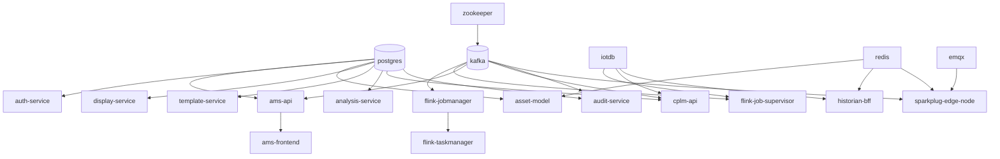

# 02 — Docker Compose Services

File: `infra/docker/docker-compose.yml`  
Network: `ams-backend` (bridge)

## Service inventory

### Data plane

| Service | Image / build | Host ports | Purpose |
|---|---|---|---|
| `postgres` | `timescale/timescaledb:latest-pg15` | `5433→5432` | All logical DBs; mounts `database/scripts` |
| `iotdb` | `apache/iotdb:1.3.2-standalone` | `6667`, `8181`, `9091` | Historian (session + REST) |
| `redis` | `redis:7.2-alpine` | `6380→6379` | Snapshots + pub/sub; AOF; `volatile-lru` |
| `emqx` | `emqx/emqx:5.6.0` | `1883`, `8083`, `8084`, `18083` | MQTT / Sparkplug |
| `zookeeper` | `confluentinc/cp-zookeeper:7.5.3` | (internal) | Kafka coordination |
| `kafka` | `confluentinc/cp-kafka:7.5.3` | `9093` | Event bus (`auto.create.topics=true`) |

### Stream compute

| Service | Role |
|---|---|
| `flink-jobmanager` | JM UI host `8082→8081`; checkpoints volume; JAR mounted |
| `flink-taskmanager` | 16 slots / 2GB (CPLM long state) |
| `flink-job-submit` | One-shot: `OpcEventStreamJob` |
| `flink-job-submit-iotdb` | One-shot: `IoTDBPersistenceJob` |
| `flink-job-submit-live-state` | One-shot: `LiveStateJob` |
| `flink-job-submit-cplm` | One-shot: CPLM short/long/fusion |
| `flink-job-supervisor` | Loop every 60s; re-submits 7 standing jobs if not RUNNING |

### Application

| Service | Build context | Host port | Container |
|---|---|---|---|
| `ams-api` | `src/backend` | `8000` | Alarm API + SignalR + ingest + RawLoop→IoTDB |
| `ams-frontend` | `src/frontend-ob` | `3000→80` | Nginx SPA + API proxies |
| `auth-service` | `src/services/auth-service` | `3002` | JWT issuer (Node) |
| `asset-model` | `…/asset-model` | `5001→5000` | UNS asset SoT |
| `binding-resolver` | `…/binding-resolver` | `5002→5000` | Path+role → transport |
| `display-service` | `…/display-service` | `5003→5000` | Display config CRUD |
| `template-service` | `…/template-service` | `5004→5000` | Templates |
| `analysis-service` | `…/analysis-service` | `5005→5000` | Analysis design-time |
| `cplm-api` | `…/cplm-api` | `5006→5000` | Loop performance API + consumers |
| `historian-bff` | `…/historian-bff` | `8090` | IoTDB + Redis read BFF |
| `audit-service` | `…/audit-service` | `8095→8080` | Audit trail consumer/API |
| `sparkplug-edge-node` | `…/sparkplug-edge-node` | none | Kafka→MQTT + Redis snapshots |

### Ops / tooling

| Service | Port | Purpose |
|---|---|---|
| `pgadmin` | `5050` | Postgres UI |
| `cloudbeaver` | `8978` | SQL UI + IoTDB JDBC driver |
| `kafka-ui` | `8085` | Kafka topics UI |
| `iotdb-init` | — | One-shot TTL setup |
| `iotdb-workbench-*` | `8086` | IoTDB web workbench |
| `prometheus` | `9090` | Metrics |
| `grafana` | `3001` | Dashboards |
| `redis-exporter` / `postgres-exporter` / `kafka-exporter` | scrape only | Exporters |

## Dependency sketch

## Nginx front-door (`src/frontend-ob/nginx.conf`)

| Path | Upstream |
|---|---|
| `/api/auth/` | auth-service:3002 |
| `/api/displays` | display-service |
| `/api/bindings/` | binding-resolver |
| `/api/assets` | asset-model |
| `/api/templates` | template-service |
| `/api/analyses` | analysis-service |
| `/api/v1/cpm` | cplm-api |
| `/api/audit` | audit-service |
| `/api/hist/` | historian-bff |
| `/api/` (catch-all) | ams-api |
| `/hubs/` | ams-api (WS) |
| `/mqtt-ws` | emqx:8083 |

**Auth:** nginx does **not** validate JWTs — each service does.

## Not in compose (code exists)

| Path | Status |
|---|---|
| `src/services/notification-service` | Implemented; not deployed |
| `src/services/opc-connector` | Stub (`.dockerignore` only) |

## Volumes

`postgres-data`, `kafka_0_data`, `zookeeper_data`, `flink-checkpoints`, `iotdb-*`, `redis-data`, `emqx-*`, `prometheus-data`, `grafana-data`, `auth-keys`, workbench/pgadmin/cloudbeaver data.
