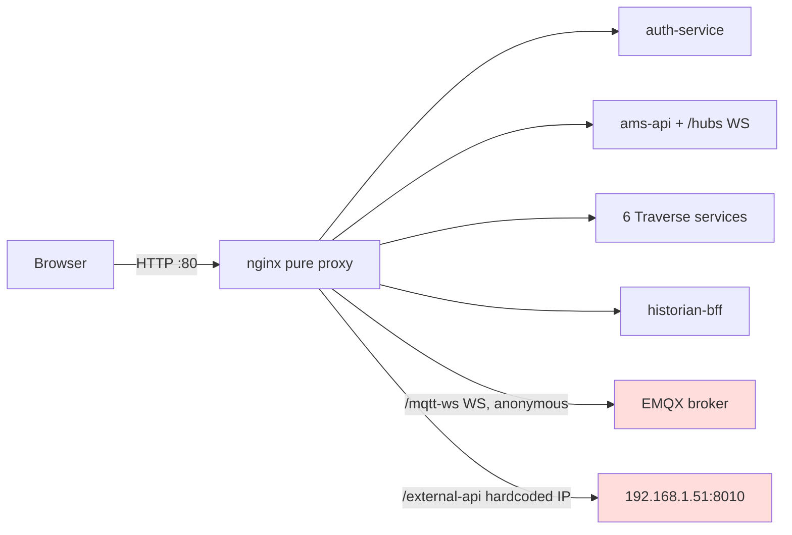
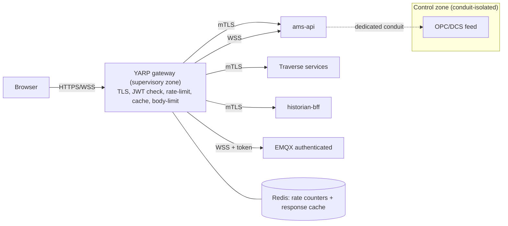

# 03 — API Gateway and Edge

**Purpose:** assess the current edge (nginx) against gateway responsibilities and propose a concrete target gateway.
**Reviewed commit:** `4e2758c951df06a170f35d23313824cb57c9ef03`
**Date:** 2026-08-08
**Anchors:** OWASP API Security Top 10 (2023), rate-limiting patterns (token-bucket / sliding-window), BFF pattern, TLS termination + mTLS zoning per IEC 62443.
**Verification:** H-01, H-02, H-16 CONFIRMED in [PHASE1-VERIFICATION.md](./PHASE1-VERIFICATION.md).

### Domain summary grades

| Capability | Lab | Prod | GAP |
|---|---|---|---|
| Edge routing | A | B | Works; hardcoded LAN IP + exposed /swagger,/mqtt-ws (GW-01) |
| Edge authn/authz | C | D | None at edge (GW-01, AUTH-03) |
| Rate limiting | C | C | None at edge; AMS.Api global-bucket only (GW-03) |
| Response caching | C | C | None at any tier (DATA-08) |
| TLS termination | C | D | Plain HTTP only (GW-01) |
| Gateway existence | C | C | No gateway (GW-02) |

---

## 1. Current edge as-built (nginx route map)

nginx (`src/frontend-ob/nginx.conf`, `listen 80`, no TLS) is a **pure reverse proxy** in front of 11 upstreams. What it does and does not do:

| Route | Upstream | Auth | Rate limit | Cache | Body limit | WS | Timeout |
|---|---|---|---|---|---|---|---|
| `/` (SPA) | static | — | — | — | — | — | — |
| `/api/auth/` | auth-service:3002 | none (fwd cookies) | none | none | none (1m default) | no | — |
| `/api/displays` | display-service | none | none | none | none | no | — |
| `/api/bindings/` | binding-resolver | none | none | none | none | no | — |
| `/api/assets` | asset-model | none | none | none | none | no | — |
| `/api/templates` | template-service | none | none | none | none | no | — |
| `/api/analyses` | analysis-service | none | none | none | none | no | — |
| `/api/v1/cpm` | cplm-api | fwds Authorization | none | none | none | no | — |
| `/api/audit` | audit-service | fwds Authorization | none | none | none | no | — |
| `/api/hist/` | historian-bff | none | none | none | none | no | `read 30s` |
| `/api/` (catch-all) | ams-api:8000 | none | none | none | none | no | — |
| `/hubs/` | ams-api (WS) | none | none | none | none | **yes** | `read 86400` |
| `/mqtt-ws` | emqx:8083 (WS) | **none — public broker** | none | none | none | **yes** | `86400` |
| `/external-api/` | **hardcoded `http://192.168.1.51:8010/api/`** | none | none | none | none | no | — |
| `/swagger` | ams-api | **none — public** | none | none | none | no | — |

**Confirmed absences (CR-3, SO-4):** `limit_req`, `limit_conn`, `auth_request`, `auth_basic`, `proxy_cache`, `client_max_body_size`, `proxy_buffering`, `gzip`, `ssl_` — all zero matches. **No API gateway anywhere** (SO-6; H-02).

---

## 2. Gap analysis vs gateway responsibilities

| Responsibility | Current | Gap |
|---|---|---|
| **Authn offload vs zero-trust retention** | nginx does none; each service validates JWT (zero-trust) | Keep per-service validation (zero-trust is a deliberate, sound decision — CLAUDE.md), but add an edge authn check so unauthenticated traffic never reaches services; the live plane (`/mqtt-ws`) has *no* validation at all (AUTH-03). |
| **Per-client rate limiting** | none at edge; AMS.Api global-bucket fixed-window on 3 endpoints (GW-03) | Per-client + per-route limiting needed; the SCAN-heavy `/api/hist/snapshot` and `/api/auth/login` are unprotected. |
| **Response caching** | none at any tier (DATA-08) | Cacheable read routes (asset tree, display config, binding resolutions, historian trend/summary) should be cached; alarm state, ACK, and live data must never be. |
| **Request size limits** | nginx default 1m only | Explicit per-route body limits (large display JSON vs tiny ACK). |
| **Circuit breaking** | none (RES-01) | Edge and per-service breakers on IoTDB/asset-model/DCS calls. |
| **WebSocket/SSE handling** | `/hubs/` and `/mqtt-ws` upgrade with 86400s timeout | SignalR pass-through fine; MQTT-WS must move behind authn (AUTH-03). |
| **TLS termination** | none (plain :80) | TLS at the edge; WSS for MQTT/SignalR. |

---

## 3. Target design proposal — gateway technology decision record

**Options considered** against a predominantly .NET 8 estate + IEC 62443 zoning:

| Option | Fit | Rationale |
|---|---|---|
| **YARP (Yet Another Reverse Proxy)** — **recommended** | High | Native .NET 8 (`Microsoft.ReverseProxy`), runs as one more service in the estate, first-class SignalR/WebSocket pass-through, integrates the existing JWKS validation and ASP.NET rate-limiter/output-cache middleware directly, config-as-code. Lowest operational and skills delta for a .NET team. |
| Envoy | Medium | Best-in-class L7 features + mTLS/xDS, but adds a non-.NET control plane and a steeper ops/skills burden; overkill unless a full mesh is adopted. |
| Kong OSS | Medium | Rich plugin ecosystem + Lua, but introduces a separate runtime + DB and duplicates auth logic the estate already owns in .NET. |

**Decision: YARP**, deployed as a dedicated `gateway` service that becomes the supervisory-zone conduit (IEC 62443). It terminates TLS, validates JWT once at the edge (services still re-validate — zero-trust retained), enforces per-client rate limits and response caching backed by Redis, applies request-size limits, and fronts SignalR and MQTT-WS with authenticated upgrades. Full request-path diagrams and the responsibilities matrix are in [10-target-architecture.md](./10-target-architecture.md) §3.

---

## 4. Redis-backed gateway caching and rate-limit design

**Rate limiting — sliding-window with Redis counters.** Algorithm: sliding-window-log/counter per (client, route-class).
- Key schema: `rl:{routeClass}:{clientId}:{windowStart}` → INCR with TTL = window length.
- `clientId` = authenticated `sub` claim where present, else client IP (from `X-Forwarded-For` at the gateway).
- Limits (initial): auth/login 10/min/IP; alarm-read 600/min/user; historian 120/min/user; snapshot 30/min/user; mutations 120/min/user; global per-IP ceiling 2000/min.
- **Fail-open vs fail-closed:** fail-**open** on Redis unavailability for read routes (availability over strictness), fail-**closed** for auth/login and mutations (never let a Redis outage remove brute-force/abuse protection on write paths).

**Response caching — Redis + gateway output cache.**
- Cacheable route inventory with per-route TTL and invalidation trigger, and the explicit never-cache list, are specified authoritatively in [10-target-architecture.md](./10-target-architecture.md) §3 (so an implementer reads one table). Summary: cache asset tree / display config / binding resolutions / historian trend+summary (TTL 5–60s, invalidate on the owning service's write); **never cache** current alarm state, ACK endpoints, SignalR, or live MQTT.
- Key schema: `cache:{routeClass}:{normalizedQueryHash}:{userScopeHash}` (userScopeHash folds in permission/asset-scope so cached responses never leak across authorization boundaries).

---

## 5. Migration plan with phase gates

| Step | Action | Gate |
|---|---|---|
| 1 | Deploy YARP gateway alongside nginx; route a copy of read traffic; add TLS termination | Gateway serves all read routes with parity; TLS verified |
| 2 | Move JWT edge check + per-client rate limits (fail-open reads, fail-closed writes) to the gateway | Load test shows limits enforced per client; auth/login limited |
| 3 | Add response caching for the cacheable inventory (10 §3) with write-triggered invalidation | Cache hit-ratio measured; never-cache list verified by test (alarm/ACK/live uncached) |
| 4 | Move `/mqtt-ws` behind authenticated WSS upgrade (with AUTH-03 EMQX authenticator) | Anonymous MQTT-WS rejected; authenticated browser subscribes |
| 5 | Cut nginx to static-SPA only; gateway owns all `/api`, `/hubs`, `/mqtt-ws`; introduce mTLS to services | End-to-end request-path test; IEC 62443 conduit review |

This closes GW-01, GW-02, GW-03, and (with AUTH-03) the live-plane authentication gap. Standards anchor: OWASP API Sec Top-10 (API4 unrestricted resource consumption → rate limits; API5 broken function-level authorization → edge + per-service authz; API8 security misconfiguration → TLS + no public swagger).
