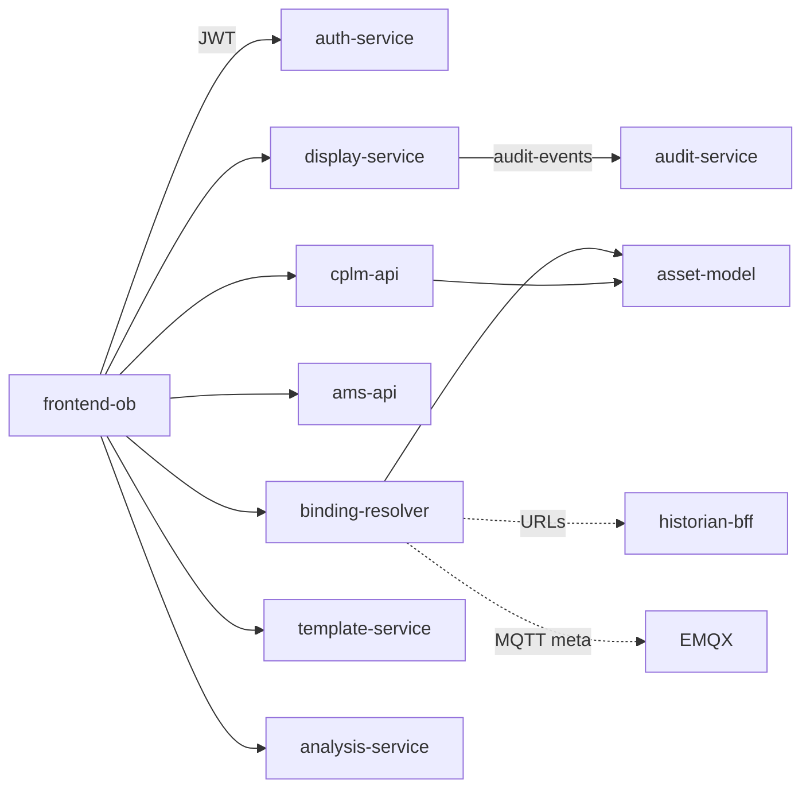

# 03 — Microservices Catalog

Evidence: each service’s `Program.cs` / main + compose env.

## AMS core — `src/backend/AMS.Api`

| Item | Value |
|---|---|
| Port | `8000` |
| DB | `ams` |
| Role | Alarm projection API, SignalR, OPC feed ingest, ACK writeback, loop samples → IoTDB |

**Kafka consume:** `current-alarm-state`, `lifecycle-events`, `ack-writeback`, KPI topics, `loop.samples.v1`, drift/replay topics  
**Kafka produce:** `raw-alarms`, `operator-actions`, `ack-results`  
**Hubs:** `/hubs/alarms`, `/hubs/observability`  
**Key APIs:** `/api/v1/alarms/*`, `/api/v1/opc/*`, `/api/v1/analytics/kpi`, `/api/v1/health/*`  
**Not owned:** CPLM result consumers (moved to `cplm-api`)

Libraries (not containers): `AMS.Application`, `AMS.Domain`, `AMS.Infrastructure`, test projects.

---

## Traverse services — `src/services/*`

### asset-model (`:5001`)

| | |
|---|---|
| DB | `traverse_assets` |
| Purpose | UNS hierarchy SoT; path resolve; aliases |
| Redis | publish `asset-events` |
| Routes | `/assets*`, `/aliases*`, hierarchy/search |

### binding-resolver (`:5002`)

| | |
|---|---|
| DB | none |
| Purpose | `path + role` → live / history / alarm transport descriptors |
| Calls | asset-model, returns historian-bff + MQTT + SignalR endpoints |
| Routes | `GET /resolve`, `POST /resolve/batch`, `/preview` |

### display-service (`:5003`)

| | |
|---|---|
| DB | `traverse_displays` |
| Purpose | Versioned displays, personal views, media, ACL (config only) |
| Kafka | produce `audit-events` |
| Redis | `display-events` |
| Routes | `/displays*`, `/folders*`, `/me/views|favorites|recent` |

### template-service (`:5004`)

| | |
|---|---|
| DB | `traverse_templates` |
| Purpose | Reusable templates + parameterized bindings |
| Routes | `/templates*`, `/publish`, `/instantiate` |

### analysis-service (`:5005`)

| | |
|---|---|
| DB | `traverse_analysis` |
| Purpose | Design-time analysis CRUD; enqueue Flink execution |
| Kafka | `analysis.commands`, `analysis.executions` (results: `analysis.results`) |
| Routes | `/analyses*` |

### cplm-api (`:5006`)

| | |
|---|---|
| DB | `traverse_cplm` |
| Purpose | Loop registry, gate/KPI reads, mutations, Kafka consumers, IoTDB KPI dual-write, Flink recompute |
| Kafka in | `clpm.gate.results.v1`, `clpm.feature.short.v1`, `clpm.feature.long.v1` |
| Kafka out | `ams.metadata.updates`, `audit-events` |
| Flag | `Cplm__ConsumersEnabled=true` — **must be sole consumer group member** |
| Routes | `/api/v1/cpm/*` |

### historian-bff (`:8090`)

| | |
|---|---|
| DB | none |
| Purpose | Read BFF: IoTDB trends/raw + Redis snapshots |
| Routes | `/trend`, `/raw`, `/raw/cursor`, `/summary`, `/series`, `/snapshot` |

### audit-service (`:8095`)

| | |
|---|---|
| DB | `traverse_audit` |
| Purpose | Consume `audit-events` → hash-chained store |
| Routes | `GET /api/v1/audit`, verify/rechain |

### auth-service (`:3002`) — Node

| | |
|---|---|
| DB | `traverse_auth` |
| Purpose | Login, RS256 JWT, refresh cookie, users/roles/permissions |
| Routes | `/api/auth/*`, JWKS `/.well-known/jwks.json` |

### sparkplug-edge-node (no host port)

| | |
|---|---|
| Purpose | Consume `live.alarms` / `live.metrics` → Sparkplug B on EMQX; write Redis snapshots; optional IoTDB REST |
| Group | `ams-sparkplug-edge-node` |
| Sparkplug | group `ams_site1`, edge `ams_edge1` |

### notification-service — **not in compose**

Kafka `root-cause-events` → email/Teams. Exists under `src/services/notification-service` but undeployed.

### opc-connector — **stub**

Only `.dockerignore`. Live OPC path is HTTP feed into `ams-api` `AlarmIngestionService`.

### `_shared`

Canonical `TraverseAuth.cs` synced into services (see [08-auth-architecture.md](./08-auth-architecture.md)).

---

## Frontend — `src/frontend-ob`

| Concern | Mechanism |
|---|---|
| State | Zustand |
| Server data | React Query |
| Alarms | SignalR → ams-api |
| Live PV | MQTT Sparkplug via `/mqtt-ws` |
| Bindings | `/api/bindings/resolve` |
| Auth | `/api/auth` → in-memory access token + refresh cookie |

---

## Interaction map

