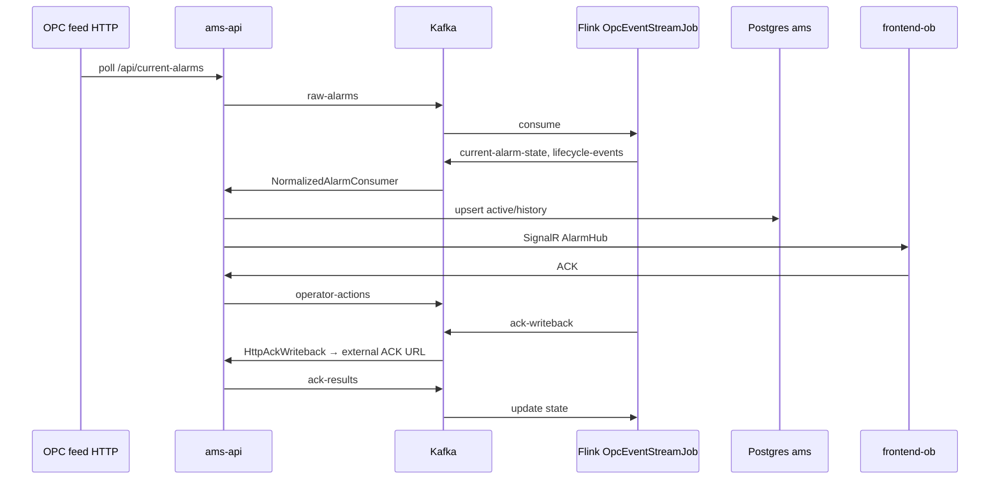
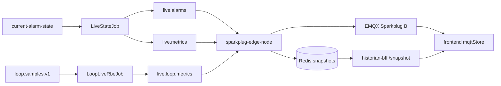
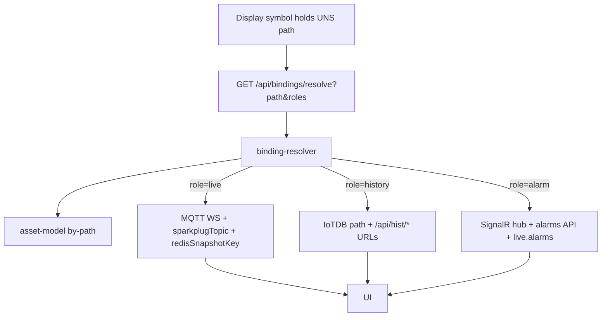
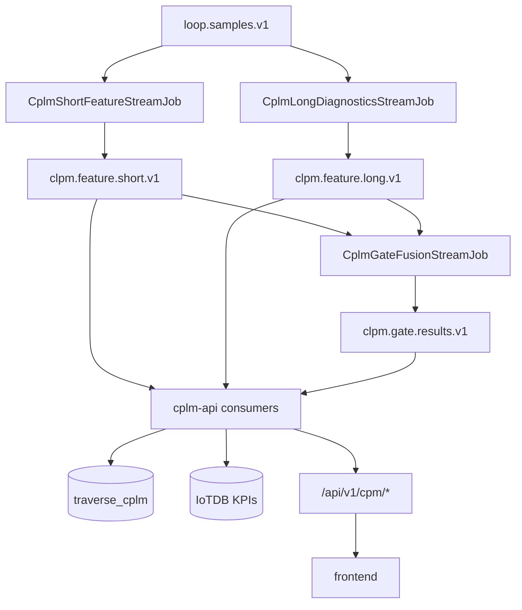

# 04 — Data Flows

## 1. Alarm pipeline (primary AMS path)



| Stage | Component | Topic / store |
|---|---|---|
| Ingest | `AlarmIngestionService` | → `raw-alarms` |
| SM | `OpcEventStreamJob` | → `current-alarm-state`, `lifecycle-events`, `root-cause-events`, `ack-writeback` |
| Project | `NormalizedAlarmConsumerService` | → Postgres `ams` |
| Push | SignalR `/hubs/alarms` | UI |
| ACK | `operator-actions` → Flink → `ack-writeback` → HTTP → `ack-results` | closes loop |

Parallel: `IoTDBPersistenceJob` writes `raw-alarms` → IoTDB `root.ams.site1.alarms.*`.

---

## 2. Live HMI values (Sparkplug)



Paint-on-open: Redis snapshot (TTL) via historian-bff; continuous: MQTT DDATA.

Details: [07-mqtt-sparkplug-live.md](./07-mqtt-sparkplug-live.md).

---

## 3. Binding resolution (how a symbol gets data)



Displays never store process values (CQRS).

---

## 4. Historian path

| Writer | Input | IoTDB tree |
|---|---|---|
| Flink `IoTDBPersistenceJob` | `raw-alarms` | `root.ams.site1.alarms.<id>` |
| `ams-api` `RawLoopIotDbConsumer` | `loop.samples.v1` | `root.site1.cpm.<loop>.{pv,sp,op,…}` |
| `cplm-api` result consumer | gate/feature results | `root.site1.cpm.<loop>.kpi.*` |
| sparkplug-edge-node | live metrics (optional REST) | best-effort device paths |

| Reader | API |
|---|---|
| historian-bff | `/trend`, `/raw`, `/summary`, `/series` (IoTDB REST), `/snapshot` (Redis) |

---

## 5. CPLM path



- Input topic for standing jobs: **`loop.samples.v1`** (default `clpm.normalized.samples.v1` is dead — supervisor overrides).
- Consumer groups `ams-api-cplm-results` / `-frames`: **one process only** (`cplm-api`).
- Recompute: `cplm-api` submits `CplmHistoricalReplayJob` using mounted Flink JAR.

---

## 6. Audit / governance

```
display-service / cplm-api  →  Kafka audit-events  →  audit-service  →  traverse_audit
```

---

## 7. Analysis (optional standing job)

```
analysis-service → analysis.executions → AnalysisExecutionJob → analysis.results
```

In `ensure_flink_jobs.py`; **not** in compose supervisor (gap after JM restart).

---

## Topic cheat sheet (live names)

| Topic | Producers | Consumers |
|---|---|---|
| `raw-alarms` | ams-api ingest | Flink SM + IoTDB job |
| `operator-actions` | ams-api | Flink SM |
| `ack-writeback` | Flink | ams-api HTTP writeback |
| `ack-results` | ams-api | Flink SM |
| `current-alarm-state` | Flink SM | ams-api projector, LiveStateJob |
| `lifecycle-events` | Flink SM | ams-api |
| `live.alarms` / `live.metrics` | LiveStateJob (+ loop RBE) | sparkplug-edge-node |
| `loop.samples.v1` | external / lab | CPLM Flink, RawLoopIotDbConsumer, LoopLiveRbeJob |
| `clpm.feature.*.v1` / `clpm.gate.results.v1` | CPLM Flink | cplm-api |
| `audit-events` | display / cplm | audit-service |
| `root-cause-events` | Flink SM | notification-service (if run) |
