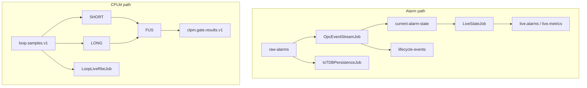

# 05 — Flink Jobs

| Item | Value |
|---|---|
| Module | `src/flink` |
| Artifact | `src/flink/target/ams-flink-1.0-SNAPSHOT.jar` |
| Flink | 1.18.1 / Java 11 |
| Default shade main | `com.ams.flink.OpcEventStreamJob` |
| Build | `.\scripts\build-flink-jar.ps1` or `mvn -f src/flink/pom.xml package` |

**Postgres:** no Flink job writes Postgres. Projection is .NET consumers.  
**IoTDB:** only `IoTDBPersistenceJob` writes from Flink.

---

## Standing jobs (supervisor = source of truth)

Script: `infra/docker/flink-job-supervisor.sh` (every 60s).

| # | Display name | Class | In → Out | Checkpoint |
|---|---|---|---|---|
| 1 | AMS - Alarm State Machine | `OpcEventStreamJob` | `raw-alarms`,`operator-actions`,`ack-results` → `lifecycle-events`,`current-alarm-state`,`ack-writeback`,`root-cause-events` | EXACTLY_ONCE 30s |
| 2 | AMS - IoTDB Alarm Persistence | `IoTDBPersistenceJob` | `raw-alarms` → IoTDB | AT_LEAST_ONCE 60s |
| 3 | AMS - Live State RBE | `LiveStateJob` | `current-alarm-state` → `live.alarms`,`live.metrics` | AT_LEAST_ONCE 30s |
| 4 | AMS - CPLM Short Feature Engine | `CplmShortFeatureStreamJob` | `loop.samples.v1` → `clpm.feature.short.v1` | EXACTLY_ONCE 180s |
| 5 | AMS - CPLM Long Diagnostics Engine | `CplmLongDiagnosticsStreamJob` | same → `clpm.feature.long.v1` | EXACTLY_ONCE 300s |
| 6 | AMS - CPLM Gate Fusion Engine | `CplmGateFusionStreamJob` | short+long → `clpm.gate.results.v1` | EXACTLY_ONCE 180s |
| 7 | AMS - Loop Live RBE Engine | `LoopLiveRbeJob` | `loop.samples.v1` → `live.loop.metrics` | EXACTLY_ONCE 60s |

CPLM args always pass `--input-topic loop.samples.v1` (compiled default topic is dead).



---

## Alarm state machine (`OpcEventStreamJob`)

Pipeline operators (`PipelineOperators.java`):

```
raw-alarms → Validation → Dedup → Enrichment → SOE order → Lifecycle → Correlation → FloodDetect → sinks
```

Keyed state highlights:

| Operator | State | Behavior |
|---|---|---|
| DedupFilter | lastEventTime, active, ack | Drop same-ts dup unless active/ack changes |
| LifecycleMap | prevLifecycle, prevAck | NEW / ACTIVE / CLEARED; OPC ack authoritative |
| FloodDetectFilter | — | Drop severity ≥ 950 |
| RootCauseMap | — | Heuristic → `root-cause-events` |

ACK branch: `operator-actions` → `ack-writeback`; `ack-results` → state update.

---

## How jobs are submitted

| Mechanism | What |
|---|---|
| One-shot containers | `flink-job-submit*` (`restart: "no"`) |
| Supervisor | Heals after JM restart (no HA) |
| Host | `scripts/ensure_flink_jobs.py` (7 + AnalysisExecutionJob) |
| PowerShell | `scripts/lib/AmsFlinkJob.ps1` (manual KPI helpers) |
| cplm-api | Submits `CplmHistoricalReplayJob` on recompute |

Typical:

```text
flink run -d -m ams-flink-jobmanager:8081 -c <Class> /opt/flink/usrlib/ams-flink-1.0-SNAPSHOT.jar --bootstrap.servers kafka:9092 …
```

Cluster defaults (compose `FLINK_PROPERTIES`): RocksDB incremental, checkpoint dir `file:///flink-checkpoints`, interval 60s, mode EXACTLY_ONCE.

**Caveat:** no Kafka sink `setDeliveryGuarantee` in code → Kafka delivery remains at-least-once even when checkpoint mode is EXACTLY_ONCE.

---

## On-demand jobs

| Class | Trigger | Notes |
|---|---|---|
| `CplmHistoricalReplayJob` | cplm-api recompute | BATCH; bounded historical gates |
| `AlarmReplayEngine` | AMS.Api FlinkRestClient | Topics `alarm.events.raw` → `flink.state.alarm.replay` (stale names vs live) |

---

## Present but not auto-submitted

| Class | Status |
|---|---|
| `CplmGateStreamJob` | **Forbidden** — would double-write gate results |
| `AlarmKpiStreamJob` | Manual via AmsFlinkJob.ps1 only |
| `LoopKpiStreamJob` | Manual; superseded directionally by CPLM |
| `AlarmStateExportJob` | No CP; pattern reused by live RBE |
| `StateDriftDetectionJob` | Stale topic names (`alarm.events.raw`) |
| `AnalysisExecutionJob` | ensure script only — **not** supervisor |

CLI-only (not cluster): `SynTic001CliValidator`, `CplmWindowCertificationCli`, `SynTic001ReferenceGenerator`.

---

## Ops checklist

1. Build JAR before `docker compose up` Flink submit/supervisor.
2. UI: http://localhost:8082 — expect 7 RUNNING.
3. After JM crash: supervisor resubmits within ~60s.
4. Never run `CplmGateStreamJob` alongside fusion trio.
5. Never run CPLM consumers in both ams-api and cplm-api.
