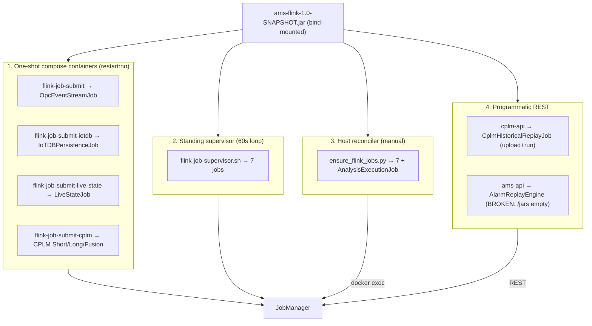

# 05 — Streaming Review (Kafka + Flink)

**Purpose:** the authoritative account of how Kafka and Flink run today — production-readiness, topic catalog, the full Flink build→submit→supervise→upgrade→monitor lifecycle, delivery guarantees, consumer correctness — and the target.
**Reviewed commit:** `4e2758c951df06a170f35d23313824cb57c9ef03`
**Date:** 2026-08-08
**Anchors:** Kafka production checklist (RF≥3, min.insync=2, acks=all, no auto-create, KRaft), Flink HA + durable checkpoints + explicit sink guarantee + savepoint upgrade + state TTL + backpressure monitoring.
**Verification:** H-07..H-11, H-21, H-22, H-41 in [PHASE1-VERIFICATION.md](./PHASE1-VERIFICATION.md); detail in `evidence-C-streaming.md`.

### Domain summary grades

| Capability | Lab | Prod | GAP |
|---|---|---|---|
| Kafka topology | C | D | 1 broker, RF=1, ZK, auto-create (STR-04) |
| Flink delivery guarantee | C | D | Sinks NONE → possible loss (STR-01) |
| Flink HA + checkpoint durability | C | D | No HA, local volume (STR-02/03) |
| Job supervision | C | C | 4 jobs unscheduled, 1 host-only (STR-07/08) |
| Upgrade procedure | C | C | No savepoints (STR-11) |
| Consumer correctness (.NET) | C | D | Stub DLQ, rebalance commit, at-most-once ACK (DOM-01, STR-09/10) |
| Topic hygiene | C | C | Orphan + dead topics (STR-05, STR-08) |

---

## 1. Kafka production-readiness

| Config | Current (docker-compose.yml:262-273) | Required | Grade (Lab/Prod) |
|---|---|---|---|
| Brokers | **1** (`KAFKA_BROKER_ID: 1`) | ≥3 | C/D |
| Coordination | **ZooKeeper** (`cp-zookeeper:7.5.3`) | KRaft | C/C |
| `default.replication.factor` | unset → **1** | ≥3 | C/D |
| `min.insync.replicas` | unset (default 1) | 2 | C/D |
| producer `acks` | not set by producers | all | C/D |
| idempotent producer | not configured | enabled | C/C |
| `auto.create.topics.enable` | **true** | false + provision-as-code | C/D |
| `num.partitions` | 4 | per consumer-parallelism | B/C |
| retention | **24h** on event-sourced `raw-alarms` | ≥7d for replay | C/C |
| listeners | both PLAINTEXT, :9093 host-published | mTLS/SASL, internal | C/D |

Leftover multi-broker residue: kafka-ui bootstraps phantom `kafka-1:9093,kafka-2:9094` that don't exist (evidence-A §4).

---

## 2. Topic catalog audit

Full catalog in [PHASE0-INVENTORY.md](./PHASE0-INVENTORY.md) §3. Key findings:

- **Partitioning vs parallelism:** all topics default to 4 partitions; `parallelism.default: 1`. Flink KafkaSource does **not** use consumer-group coordination — the supervisor's own comment warns that two copies of a job each assign themselves *all* partitions and clobber offsets (`flink-job-supervisor.sh:59-68`). So partition count is not tied to job parallelism; scaling parallelism needs explicit rework.
- **Compaction on `current-alarm-state`:** the topic is a state stream but there is no evidence of log-compaction config (auto-created, default retention). A projection replay past 24h is impossible.
- **Orphan (produced, never consumed) — STR-05:** `lifecycle-alerts` — the deadman + ACK-SLA watchdogs publish here and nothing consumes it (H-22). Safety-critical.
- **Inverse orphans (consumed, never produced):** `loop-raw-data`, `alarm.events.raw`, `alarm.state.active`, `clpm.normalized.samples.v1` — dead inputs to unscheduled/broken jobs.
- **Producer-side dead (STR-08):** `kpi-alarm-rates`, `kpi-standing-snapshots`, `loop-kpis-5m`, `flink.state.alarm.delta`, `system.state.drift.alerts`, `flink.state.alarm.replay` — live ams-api consumers idle forever because the producing Flink jobs are never submitted.
- **Dual-schema:** `live.metrics` carries both alarm-shaped (LiveStateJob) and process-value-shaped (`process_value_sim.py`) records (STR-12).
- **Doc drift:** `raw-opc-events` (docs) is not the code ingress — `raw-alarms` is (D-6). DLQ topics `raw-alarms-dlq`/`ack-writeback-dlq` are config-declared but never published.

---

## 3. Flink lifecycle — build, submit, supervise, upgrade, monitor (the deliverable)

### 3.1 Build

`scripts/build-flink-jar.ps1` runs `mvn -q package` inside `maven:3.9-eclipse-temurin-11` with `src/flink` bind-mounted → `src/flink/target/ams-flink-1.0-SNAPSHOT.jar`. One shaded JAR (Flink 1.18.1, Java 11, `flink-connector-kafka 3.0.1-1.18`, `flink-iotdb-connector 1.3.2`), manifest main `OpcEventStreamJob`; every other job is selected at submit via `flink run -c <class>`. `-RunTests` adds the CPLM golden-loop gate. **The JAR is bind-mounted read-only into 7 containers from the working tree** — a local rebuild silently changes the running binary (STR-13/H-44).

### 3.2 Submission — four parallel mechanisms



### 3.3 Supervision behavior and its gaps

- The supervisor (`flink-job-supervisor.sh`, 60s) restores **7** jobs by display-name match: OpcEventStream, IoTDBPersistence, LiveState, CPLM Short/Long/Fusion, LoopLiveRbe. Its header still says "six" (stale). It refuses to submit over >1 RUNNING copy (the double-assignment hazard).
- **Gap (STR-07):** `AnalysisExecutionJob` is only in `ensure_flink_jobs.py`, invoked solely by validation/e2e scripts — never by stack startup. After a JM restart it stays dead; `analysis.executions` accumulates unconsumed.
- **Gap (STR-08):** four jobs are in *no* mechanism — AlarmKpi, AlarmStateExport, LoopKpi, StateDrift — while ams-api consumers idle on their output topics. AlarmStateExport also has **no checkpointing** and keys on `Id`/`id` while the stream carries `alarmId` (keys everything to "unknown"); StateDrift has no checkpointing and two dead input topics sharing one group.

### 3.4 Delivery-guarantee analysis and per-sink idempotency contract (STR-01)

**No job sets a sink `DeliveryGuarantee` or `setTransactionalIdPrefix`** (KF-2/3) — all 13 `KafkaSink` builders are bare. The pinned connector's default is `DeliveryGuarantee.NONE` (library-anchored), which does not flush pending producer records on checkpoint barriers → possible **loss** on TM failure, even for the 9 jobs declaring `EXACTLY_ONCE` checkpointing.

| Sink | Job | Declared checkpoint | Downstream idempotency? | Contract needed |
|---|---|---|---|---|
| current-alarm-state, lifecycle-events, ack-writeback, root-cause-events | OpcEventStream | EXACTLY_ONCE | projection has no upsert integrity (DATA-01) | **EXACTLY_ONCE** sink (txn) OR at-least-once + fixed DATA-01 |
| live.alarms, live.metrics | LiveState | AT_LEAST_ONCE | edge dedup by alarmId+ts (INFO-01) | AT_LEAST_ONCE sink — currently NONE |
| clpm.feature.*, clpm.gate.results.v1 | CPLM | EXACTLY_ONCE | cplm-api upserts `ON CONFLICT` | AT_LEAST_ONCE sink is sufficient given the upsert |
| live.loop.metrics | LoopLiveRbe | EXACTLY_ONCE | edge idempotent | AT_LEAST_ONCE |
| IoTDB (session) | IoTDBPersistence | AT_LEAST_ONCE | IoTDB (series,ts) idempotent | already safe once sink flushes |

**Fix:** set `AT_LEAST_ONCE` on every Kafka sink at minimum; use `EXACTLY_ONCE` + `setTransactionalIdPrefix` on the alarm-state path unless DATA-01 makes the projection idempotent. State the retained at-least-once contracts explicitly (INFO-01).

### 3.5 Checkpoint durability (STR-02) and HA (STR-03)

- Checkpoints: RocksDB incremental, `state.checkpoints.dir: file:///flink-checkpoints` (local volume), num-retained 3. **Not durable beyond the host** (H-09).
- HA: **none** — no `high-availability` keys (KF-6); JM restart loses every job; the supervisor resubmits stateless (`flink run -d`, no `-s`). The 24h CPLM `ListState` buffer and RBE fingerprints restart empty; `latest()`-offset jobs skip the outage (H-08).
- State TTL: **none anywhere** (KF-5) — LiveState fingerprints for cleared alarms live forever.

### 3.6 Savepoint-based upgrade procedure — current vs target (STR-11)

**Today:** no savepoints (KF-7). Upgrade = rebuild JAR → cancel/lose jobs → supervisor resubmits from empty state (sources resume from committed offsets; keyed state lost). `docs/flink-only-orchestration.md:49` documents the *intent* (`flink stop --savepointPath`) but no script does it.

**Target procedure:**
```
1. flink stop --savepointPath s3://ams-flink-savepoints/<job> <jobId>   # drain + savepoint
2. deploy new versioned JAR (image-baked, not bind-mounted)
3. flink run -d -s s3://ams-flink-savepoints/<job>/<sp> -c <Class> <jar> # restore
4. verify RUNNING + checkpoint success + lag caught up; else roll back to the savepoint
```
Requires durable savepoint storage (co-resolved with STR-02) and job UIDs on all stateful operators (add `.uid()` — currently absent, so savepoint restore would be fragile even if attempted).

### 3.7 Monitoring surfaces

Prometheus reporter on :9249 (JM+TM), scraped by Prometheus. cplm-api proxies Flink REST job state to the UI (`CpmReadinessController.cs`). AMS.Api `PipelineHealthService` computes lag for the alarm consumer groups. **Gaps:** no backpressure/watermark-lag alerting wired (evidence-C §3.5), no per-job checkpoint-failure alert, and the Grafana provisioning dir has zero dashboards (OPS-01).

---

## 4. Consumer correctness in .NET services

| Concern | Finding | GAP |
|---|---|---|
| Offset discipline (projection) | `EnableAutoCommit=false`, commit after `SaveChanges` — correct on the happy path | — |
| **Failure path** | FlushBatch failure → **stub DLQ that only logs**; batch dropped (`KafkaConsumerService.cs:272-291`) | DOM-01 (S1) |
| **Rebalance** | `SetPartitionsRevokedHandler` bare `c.Commit()` commits un-persisted positions (:153-159) | STR-09 (S2) |
| ACK writeback | auto-commit → at-most-once to DCS (H-35) | STR-10 (S2) |
| Graceful shutdown | 7/10 consumers `Close()`; 3 UI consumers dispose-only (H-28) | (folded into STR-09) |
| Single-member (CPLM) | flag/convention only; no static membership/lease (H-21) | STR-06 (S2) |
| notification-service | continues past failed messages with a "DLQ here" comment; blocks Host.StartAsync | AUTH-07 (S3) |

**Single-member enforcement proposal (STR-06):** set `GroupInstanceId` (static membership) per intended member and assert at startup that the assigned partition set == the full topic partition set (a second member would receive a subset → fail fast with an alert); or a leader-lease in Redis/Postgres that only the lease holder consumes.

---

## 5. Prod-grade operating runbook outline

| Scenario | Detection | Mitigation |
|---|---|---|
| Broker loss | Kafka exporter under-replicated-partitions > 0; producer errors | RF≥3 + min.insync=2 tolerates 1 loss; alert; replace broker |
| JobManager loss | Flink HA leader change metric; missing-jobs alert | HA restores leader; jobs restart from checkpoint (post STR-02/03) |
| Lag SLO breach | consumer-group lag > threshold (already computed by PipelineHealthService) | scale parallelism / add partitions; alert; check backpressure |
| Checkpoint failure | checkpoint-failed counter | alert; inspect state size/backpressure; ensure durable store reachable |
| Replay | (post STR-02) restore from savepoint; or reset group offset within retention | documented savepoint restore (§3.6); raise retention (STR-04) |

The consolidated target streaming plane — KRaft RF≥3, explicit per-sink guarantee, HA + remote checkpoints/savepoints, provisioning-as-code, supervisor subordinated to HA — is in [10-target-architecture.md](./10-target-architecture.md) §6.
