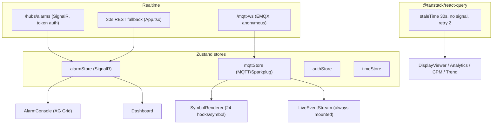

# 06 — Frontend Performance

**Purpose:** assess render architecture, realtime subscription hygiene, and per-route data handling in `src/frontend-ob`.
**Reviewed commit:** `4e2758c951df06a170f35d23313824cb57c9ef03`
**Date:** 2026-08-08
**Anchors:** Core Web Vitals, RAIL, React render hygiene (memoization, list virtualization), subscription lifecycle, debounce/throttle, request cancellation (AbortController), explicit loading/error/empty states.
**Verification:** H-23, H-25, H-26 in [PHASE1-VERIFICATION.md](./PHASE1-VERIFICATION.md); detail in `evidence-F-frontend.md`.

### Domain summary grades

| Area | Lab | Prod | GAP |
|---|---|---|---|
| Alarm grid virtualization | A | A | — (production-grade) |
| MQTT subscription hygiene | C | C | No ref-count, always-on firehose (FE-01, FE-06) |
| Render fan-out / memoization | C | C | Zero React.memo, per-message setState (FE-04) |
| Input debounce | B | C | Absent (FE-02) |
| Request cancellation | B | C | No AbortController (FE-03) |
| Loading/error/empty coverage | B | C | Missing on Dashboard/AlarmConsole (FE-05) |
| Poll-fallback correctness | A | A | Correct (INFO-02) |

---

## 1. Render architecture

---

## 2. Findings per practice area

- **List virtualization — GOOD.** AlarmConsole uses AG Grid client-side row model with virtualization on, `rowBuffer=20`, `getRowId`, and diffed `applyTransactionAsync` + `asyncTransactionWaitMillis={50}` (FE-3) — the correct high-rate pattern. SOE list is store-capped at 500; but `@tanstack/react-virtual` is a declared-but-unused dep and no other long list is virtualized.
- **Memoization — DEFICIENT (FE-04).** **Zero `React.memo` in the entire codebase** (FE-6). `SymbolRenderer` resolves 24 binding slots per symbol, each subscribing to the whole metrics Map (`useBindingResolver.ts:49`); since `handleMessage` replaces `metrics` per MQTT message, **every bound slot-hook on the open display re-renders on every DDATA message from any device**.
- **Debounce/throttle — ABSENT (FE-02).** Only `UserManagementConfig` debounces (FE-1). AlarmConsole quick filter, MqttLiveStream search, LiveEvents filter run per keystroke. `TrendCore` rebuilds and `setOption(notMerge)` on every mousemove via `updateAxisPointer` (`TrendCore.tsx:510-524`) — unthrottled.
- **Loading/error/empty — PARTIAL (FE-05).** Good on DisplayViewer/Analytics/CPM/IoTDBTrend. **Dashboard.tsx has none** — a cold load renders zeros ("all quiet") indistinguishable from a healthy plant; AlarmConsole has no hydration indicator (empty grid ≙ no alarms).
- **Request cancellation — ABSENT (FE-03).** Zero `AbortController` (FE-2); React Query `signal` unused; trend uses discard-stale flags only — superseded historian/binding requests complete and are discarded (wasted BFF load; IoTDBTrendViewer can be overwritten by a stale response).
- **Subscription hygiene — MIXED (FE-01/FE-06).** SignalR lifecycle is clean (single-flight init, disconnect on cleanup, reconnect reconcile, no handler duplication). MQTT is not: `unsubscribeScreen` is **not ref-counted** (`mqttStore.ts:290-328`) → first unmount of a shared device topic starves survivors; `LiveEventStream` is permanently mounted in the shell (`App.tsx:527-529`) so the plant-wide firehose is always on; `mqttStore.disconnect` is never called (socket outlives logout).
- **Poll-fallback (H-26) — CORRECT.** One interval, per-tick Connected guard, cleanup on unmount, no stacking (FE-9). Only gap: `refreshActiveAlarms` lacks an overlap guard.
- **Bundle — ADEQUATE.** 25 routes `React.lazy`-loaded; **no `manualChunks`** so heavy vendors (echarts, ag-grid, d3, mqtt) chunk only on route boundaries. Dead deps: `@tanstack/react-virtual`, possibly `axios`.
- **WebSocket message-rate vs display refresh.** No coalescing between broker DDATA rate and React setState — at flood the UI render rate equals broker rate. The trend ring buffer (2000-cap, outside zustand) is the one place the authors mitigated this; metrics/liveAlarms still pay per-message cost.

---

## 3. Per-route audit

| Route | Data source | Update mechanism | Risks | Lab | Prod |
|---|---|---|---|---|---|
| `/alarms` (AlarmConsole) | alarmStore (SignalR + poll) | AG Grid transactions (50ms) | O(N) stats recalc per message; per-keystroke quick filter; no hydration state | B | C |
| `/live-events` | mqttStore firehose + SOE | per-message setState | firehose always on; no virtualization on MQTT list; per-keystroke filter | C | C |
| `/trend` (TrendCore) | historian-bff | server decimation + 2000-pt ring | per-mousemove setOption; no AbortController | B | C |
| `/dashboard` | alarmStore + mqttStore | store selectors | **no loading/error state** (zeros look healthy); firehose on | C | C |
| `/analytics` | react-query | isLoading/isError branches | covered | A | B |
| `/display` (DisplayViewer) | react-query + MQTT | refetchInterval + stale-banner | good state coverage; 24-hook symbols unmemoized | B | C |

**H-23 (frontend half):** `resolveHistorianPathForLiveAlarm` (`iotdbPaths.ts:67-76`) duplicates the Flink job's path prefix + sanitize regex to bridge Sparkplug device-id (sourceName) to IoTDB alarmId; its consumer `buildTrendViewerUrl` targets `/trend` with params (`series`/`hours`/`auto`) that TrendPage ignores (it reads `tags`/`range`) — the **live→trend deep link dead-ends** (FE-07). Root cause is the namespace divergence (DATA-07).

---

## 4. Remediation list (ranked by user-visible impact)

1. **Scope the MQTT firehose to monitoring routes + coalesce DDATA before setState + memoize `SymbolRenderer`** (FE-01/FE-04) — removes the render storm that degrades every logged-in client on dense displays.
2. **Ref-count per-screen MQTT unsubscribe** (FE-06) — fixes silent stale values after partial navigation.
3. **Add loading/error/empty to Dashboard + AlarmConsole hydration** (FE-05) — stops "all quiet" masking a cold load or API failure on the two most important screens.
4. **Debounce filter/search inputs; throttle trend axis-pointer setOption** (FE-02) — smoother interaction at scale.
5. **Thread AbortController/React Query `signal` into historian/binding fetches** (FE-03) — cancels superseded requests, prevents stale overwrite.
6. **Fix the live→trend deep link + drop dead deps** (FE-07).
7. **Add `manualChunks` for echarts/ag-grid/mqtt** — faster first load per route.

The consolidated frontend performance target (React Query policy, virtualization, subscription hygiene, coalescing) sits in the end-to-end performance map in [10-target-architecture.md](./10-target-architecture.md) §7.
