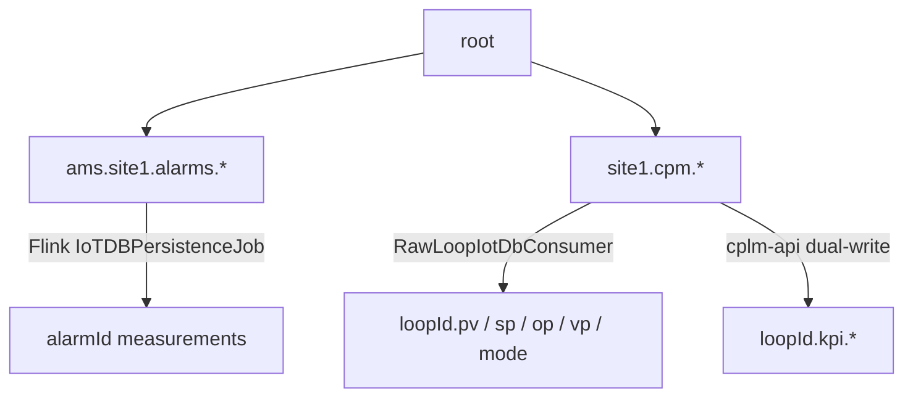

# 06 — IoTDB Historian

| Item | Value |
|---|---|
| Image | `apache/iotdb:1.3.2-standalone` |
| Session | `:6667` (Flink connector) |
| REST v2 | `:8181` (.NET BFF / writers) |
| Metrics | `:9091` |
| Schema | `enable_auto_create_schema=true` |
| Init | `iotdb-init` runs TTL script |

## Why IoTDB

- High-ingest time-series for alarms + control-loop samples + KPIs.
- Separates historian from Postgres (Postgres = config + alarm projection / CPLM analytics tables).
- REST + session APIs fit Flink connector and .NET HttpClient writers/readers.

---

## Path trees (current)



| Tree | Writer | Purpose |
|---|---|---|
| `root.ams.site1.alarms.<alarmId>` | Flink `IoTDBPersistenceJob` + `AlarmIoTSerializationSchema` | Alarm historian |
| `root.site1.cpm.<loop>.{pv,sp,op,vp,mode}` | `ams-api` `RawLoopIotDbConsumer` | Raw loop samples |
| `root.site1.cpm.<loop>.kpi.<family>` | `cplm-api` `IotDbWriteClient` | Gate/KPI dual-write |
| UNS-derived `root.<path…>` | Convention via binding-resolver history role | Process history addressing |
| sparkplug optional | edge-node REST insert | Best-effort live metric persist |

**Important:** alarm tree (`root.ams.*`) and loop tree (`root.site1.cpm.*`) are deliberately separate (`IotDbWriteClient` comments).

---

## Writers

| Component | Protocol | Code |
|---|---|---|
| `IoTDBPersistenceJob` | Session (host/port 6667) | `src/flink/.../IoTDBPersistenceJob.java` |
| `RawLoopIotDbConsumer` | REST | `src/backend/AMS.Api/BackgroundServices/RawLoopIotDbConsumer.cs` |
| `cplm-api` consumers | REST | `src/services/cplm-api/Services/IotDbWriteClient.cs` |
| sparkplug-edge-node | REST `/rest/v2/nonQuery` | `AlarmMetricPublisher.java` (`IOTDB_PERSIST`) |

Write client pattern: `create timeseries` then `INSERT INTO …` via REST (auto-schema also on).

---

## Readers

| Component | Endpoints | Backend |
|---|---|---|
| historian-bff | `/trend`, `/raw`, `/raw/cursor`, `/summary`, `/series` | IoTDB REST |
| historian-bff | `/snapshot` | **Redis** (not IoTDB) |
| IoTDB Workbench UI | host `:8086` | session to `iotdb:6667` |
| CloudBeaver | `:8978` | JDBC IoTDB driver |

Binding history role builds IoTDB path as:

```text
root.{unsPath with / → .}
```

and returns historian-bff URLs (`PathResolver.cs`).

---

## How UI uses history today

1. Symbol asks binding-resolver for `history` role → IoTDB path + `/api/hist/trend|raw|…`.
2. Nginx `/api/hist/` → historian-bff.
3. Faceplate/trend components call BFF with Bearer JWT.
4. Current value paint-on-open often uses `/api/hist/snapshot` (Redis key from live binding).

---

## Ops

| Action | How |
|---|---|
| Query browser | http://localhost:8086 (workbench) or CloudBeaver :8978 |
| Health | compose healthcheck TCP 6667 + 8181 |
| TTL | `infra/docker/iotdb-init-ttl.sh` via `iotdb-init` |
| Config | compose env `enable_rest_service=true` |

## Gaps / notes

- Dual write clients: AMS.Api and cplm-api each have a copy of `IotDbWriteClient` (extraction comment: shared library deferred).
- Sparkplug IoTDB persist is best-effort; primary alarm historian is Flink job.
- `iotdb-ext` volume reserved for connectors/plugins.
