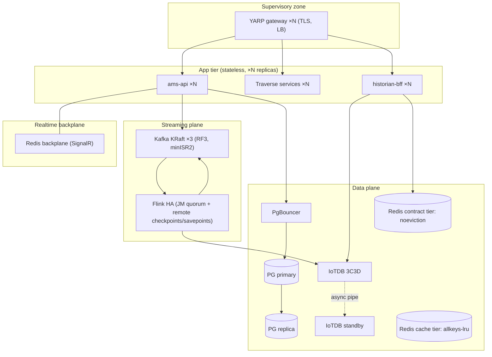

# 07 — Scalability and Reliability

**Purpose:** translate the target of "thousands of concurrent operators" into concrete per-tier numbers, enumerate horizontal-scale blockers and SPOFs, propose the HA/DR target, and define SLOs with measuring metrics.
**Reviewed commit:** `4e2758c951df06a170f35d23313824cb57c9ef03`
**Date:** 2026-08-08
**Anchors:** SRE (SLI/SLO/error budget), health/readiness/liveness separation, chaos assumptions, RED/USE observability, spec §11 NFRs (field-to-HMI ≤1.5s, trend p95 <1s, Kafka RF≥3, IoTDB 3C3D HA).
**Verification:** SCALE-01, DATA-04/05, STR-03/04 in [PHASE1-VERIFICATION.md](./PHASE1-VERIFICATION.md).

### Domain summary grades

| Capability | Lab | Prod | GAP |
|---|---|---|---|
| Horizontal scalability (app) | C | D | ams-api + cplm-api pinned to 1 replica (SCALE-01, STR-06) |
| Streaming HA | C | D | No Flink HA, 1 broker (STR-03/04) |
| Data HA/DR | C | D | Single PG/IoTDB (DATA-04/05) |
| SLO instrumentation | C | C | Partial metrics, no alerting (OPS-01) |
| Failure-mode coverage | C | D | No isolation (01 §5) |

---

## 1. Load model — target operators → per-tier numbers (arithmetic shown)

**Stated assumptions** (chosen to bracket "thousands of operators"; each is a variable an implementer can re-run):

| Symbol | Meaning | Value |
|---|---|---|
| `Op` | concurrent operators | 2,000 |
| `D` | open displays per operator | 2 |
| `T` | live tags per open display | 40 |
| `RBE` | report-by-exception rate per tag | 0.2 updates/s (1 in 5s changes) |
| `A` | plant active-alarm churn | 5 alarms/s (transitions) |
| `Poll` | dashboard/list poll interval when not on push | 30 s |
| `Trend` | trend opens per operator per hour | 6 |

**Derived per-tier load:**

- **SignalR connections** = `Op` = **2,000** concurrent hub connections (one per operator). Alarm push fan-out = `A` × `Op` = 5 × 2,000 = **10,000 messages/s** delivered across the hub (before server-side batching). → **needs a backplane (SCALE-01)**; a single ams-api cannot both hold 2,000 WS connections and fan out 10k msg/s reliably, and cannot be replicated without one.
- **MQTT subscriptions** = `Op` × `D` × `T` (per-screen scoping) = 2,000 × 2 × 40 = **160,000 active topic subscriptions** at the broker (if scoping worked; today the always-on firehose (FE-01) makes every client receive *all* plant DDATA instead).
- **Live DDATA message rate** to each subscribed client (scoped) = `D` × `T` × `RBE` = 2 × 40 × 0.2 = **16 msg/s/client**; plant-wide firehose (current behavior) = (total tags) × `RBE` ≈ (say 20,000 tags) × 0.2 = **4,000 msg/s to every client** — the render-storm root cause (FE-01).
- **BFF QPS (historian):** paint-on-open snapshots = `Op` × `D` (on navigation) plus trend opens = `Op` × `Trend` / 3600 = 2,000 × 6 / 3600 ≈ **3.3 trend queries/s** steady, bursting to `Op` × `D` = 4,000 snapshot reads at shift change. The `/snapshot` Redis SCAN (DATA-09) makes each snapshot read O(keyspace) — untenable at a 4,000-burst.
- **Postgres QPS (alarm reads):** with no API cache (DATA-08), each list poll = 3 query groups; operators viewing the alarm list = `Op` (worst case) / `Poll` × 3 = 2,000 / 30 × 3 = **200 query-groups/s** = ~600 queries/s against one unindexed-on-source instance (DATA-01/10). At shift change or during a flood this multiplies.
- **Kafka throughput (alarm path):** `A` × (fan-out topics ≈ 4) = 5 × 4 = 20 msg/s baseline — low; but a flood (severity storm) can spike `A` to hundreds/s, and 24h retention on one broker (STR-04) bounds replay.

**Conclusion:** the load itself is modest for the infrastructure *if* it scales horizontally — but the two hardest numbers (10k msg/s SignalR fan-out, 160k MQTT subscriptions, 600 q/s Postgres reads) all land on **single, un-replicable** components (ams-api, one broker, one PG, one Redis with SCAN). The blockers below are what prevent scaling to these numbers.

---

## 2. Horizontal-scale blockers per service

| Service | Blocker | Evidence | GAP |
|---|---|---|---|
| ams-api | No SignalR backplane; UI-topic consumers use fixed group ids + `Clients.All` → 2nd replica splits partitions and each hub sees half the deltas | `Program.cs:191`; SO-14 | SCALE-01 |
| cplm-api | Single-member consumer group by convention; 2nd replica silently halves persisted windows | `Program.cs:88-92`; H-21 | STR-06 |
| Flink | KafkaSource ignores consumer-group coordination; 2 copies each take all partitions | `flink-job-supervisor.sh:59-68` | STR-08 |
| Postgres | One instance, default pool, no read replicas | DATA-05 | DATA-05 |
| Redis | Contract keys evictable; `/snapshot` SCAN O(keyspace) | DATA-03/09 | DATA-03, DATA-09 |
| historian-bff | Stateless (scales) but bottlenecked on single IoTDB + no cache | DATA-04/09 | DATA-04, DATA-09 |

---

## 3. Single-point-of-failure inventory (dual-column)

| SPOF | Lab | Prod | Resolution |
|---|---|---|---|
| Single Kafka broker (RF=1) | acceptable | **blocker** | RF≥3 KRaft (STR-04) |
| Single Flink cluster, no HA | acceptable | **blocker** | JM HA + durable checkpoints (STR-02/03) |
| Single Postgres | acceptable | **blocker** | Primary+replica+PgBouncer (DATA-05) |
| Single IoTDB standalone | acceptable | **blocker** | 3C3D + async pipe standby (DATA-04) |
| Single Redis, evictable, no auth | acceptable | **blocker** | Contract tier `noeviction` + auth (DATA-03) |
| ams-api singleton | acceptable | **blocker** | Backplane + replicas (SCALE-01) |
| Single host / one bridge network | acceptable | **blocker** | Multi-node + zone segmentation (10 §1) |
| Checkpoints on local volume | acceptable | **blocker** | Remote object store (STR-02) |

---

## 4. HA/DR target architecture

Kafka RF≥3 + KRaft (tolerates 1 broker loss with `min.insync.replicas=2`); Flink JM HA + remote checkpoints/savepoints (JM restart restores jobs *with* state); IoTDB 3C3D + async pipe to a standby cluster (spec §11); Postgres primary+replica via Patroni + PgBouncer; Redis split into a non-evicting contract tier and an evicting cache tier; EMQX clustering with authenticated per-client ACLs; app services stateless behind the gateway with a SignalR Redis backplane.

---

## 5. SLO proposal

| SLO | Target (spec §11) | SLI (measurement) | Exists in Prometheus today? |
|---|---|---|---|
| Field-to-HMI live latency | ≤ 1.5 s | timestamp delta StreamPipes/Flink RBE → EMQX publish → client receive (add client-side receive-time metric) | Partial — Flink metrics on :9249; no end-to-end trace |
| Trend query p95 | < 1 s (decimated year) | historian-bff request duration histogram p95 | **No** — historian-bff not scraped (evidence-A §11) |
| Alarm-pipeline lag | < 5 s | consumer-group lag (already computed by `PipelineHealthService`) + kafka-exporter | Partial — kafka-exporter present; no SLO alert |
| Availability (alarm push) | 99.9% | SignalR connection success + hub up | **No** — ams-api scraped but no availability SLI |
| Checkpoint success | 100% over window | Flink checkpoint-failed counter | Metric exists; **no alert** |

**Latency budget** (summing to ≤1.5s field-to-HMI) is specified per tier in [10-target-architecture.md](./10-target-architecture.md) §7. Instrumentation gaps (historian-bff scrape, SLO alerts, Alertmanager, dashboards) are OPS-01.

---

## 6. Failure-mode table (extended, each with detection + mitigation)

| Failure | Symptom | Detection | Mitigation (target) |
|---|---|---|---|
| Broker loss | pipeline stall | under-replicated-partitions | RF≥3 tolerates 1 loss (STR-04) |
| JM loss | all jobs gone | missing-jobs alert / HA leader change | HA + checkpoint restore (STR-02/03) |
| TM loss | job restart, possible sink loss | task-failure metric | multi-TM + AT_LEAST_ONCE sinks (STR-01) |
| Postgres down | AMS + all Traverse down | health/readiness fail | replica failover (DATA-05) |
| IoTDB down | no history/trend | health fail | 3C3D quorum (DATA-04) |
| Redis eviction | blank faceplate | snapshot-miss rate | contract tier noeviction (DATA-03) |
| ams-api crash | all alarm push lost | availability SLI | replicas + backplane (SCALE-01) |
| Stalled OPC feed | stale alarms, no alert | **lifecycle-alerts consumer** (once wired) | close the orphan loop (STR-05) |
| Consumer-group split (cplm) | half windows persisted, no error | assignment-count assertion | static membership/lease (STR-06) |
| DB-failure batch drop | silent alarm loss | DLQ-depth alert | real DLQ, no offset advance (DOM-01) |

The consolidated HA/DR topology and the per-tier latency budget are in [10-target-architecture.md](./10-target-architecture.md) §5–§7.
