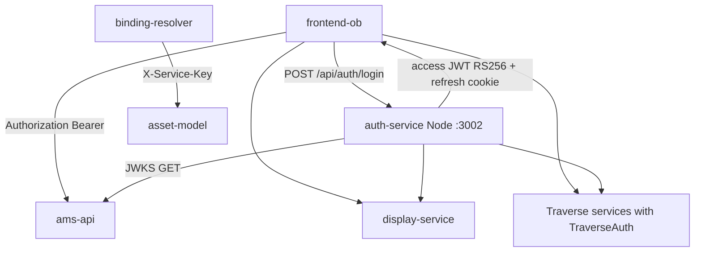

# 08 — Auth Architecture (Why TraverseAuth Is Copied)

## Model



- **Issuer:** only `auth-service`.
- **Validators:** each API validates JWKS itself.
- **Gateway:** nginx/Vite = proxy only (no authn).

---

## auth-service

| Item | Value |
|---|---|
| Path | `src/services/auth-service` |
| Stack | Node / Express / TypeScript |
| DB | `traverse_auth` |
| Alg | **RS256** |
| Issuer / Audience | `traverse-auth` / `ams-services` |
| Access TTL | 15m |
| Refresh | 7d httpOnly cookie `refresh_token` path `/api/auth` |
| JWKS | `/api/auth/.well-known/jwks.json` |
| Keys | volume `auth-keys` → `/app/keys/jwt-private.pem` |

Claims: `sub`, `preferred_username`, `email`, `role`, `permission[]`.  
Roles seed → permission catalog embedded in access token.  
No OIDC discovery document → JwtBearer `Authority` metadata flow **cannot** be used.

---

## Why auth code is copied into every .NET service

**Not** because auth-service is incomplete.  
**Because of Docker build contexts.**

Evidence (`src/services/_shared/TraverseAuth.cs` header + `scripts/sync-auth-module.ps1`):

1. Compose builds each service with `context: ../../src/services/<svc>`.
2. Image restore cannot pull a `.csproj` outside that context.
3. Shared library project under `_shared` is therefore **not** referenceable inside the image.
4. Solution: keep one canonical file in `_shared`, **byte-copy** into each service’s `Auth/TraverseAuth.cs`.

```powershell
.\scripts\sync-auth-module.ps1         # copy
.\scripts\sync-auth-module.ps1 -Check  # CI drift check
```

Synced targets: `asset-model`, `template-service`, `binding-resolver`, `historian-bff`, `analysis-service`, `audit-service`, `cplm-api`.

CI: `.github/workflows/ci-cd.yml` diffs shared vs copies.

### What TraverseAuth does

1. **User JWT** — fetch JWKS, validate RS256, policy per `permission` claim.
2. **Service principal** — header `X-Service-Key` matching `Auth__ServiceKey` → fully permissioned `Service` identity (for binding-resolver → asset-model, cplm → asset-model, etc.).
3. Production fail-closed if insecure default service key is used.

---

## Surfaces that are NOT the synced file

| Component | Auth approach |
|---|---|
| `ams-api` | Own `AMS.Api.Auth.JwksKeyCache` + explicit policies; **no** X-Service-Key |
| `display-service` | Own JwtBearer + `Auth/JwksKeyCache.cs`; display.* policies; no service-key middleware |
| `notification-service` | No JWT wiring found; not in compose |
| `auth-service` | Issuer |

---

## Frontend session

| Piece | Behavior |
|---|---|
| Login | `authApi.ts` → `/api/auth/login` with credentials |
| Access token | Zustand memory only |
| Refresh | cookie + single-flight refresh on 401 |
| Guards | `RequireAuth` / `RequirePermission` |
| SignalR | Bearer or `?access_token=` |

---

## Compose wiring (pattern)

Every secured service gets:

```yaml
Auth__JwksUrl: http://auth-service:3002/api/auth/.well-known/jwks.json
Auth__Issuer: traverse-auth
Auth__Audience: ams-services
Auth__ServiceKey: ${TRAVERSE_SERVICE_KEY:-traverse-internal-dev-key}  # Traverse services
```

`ams-api` also has `Security__DisableApiAuthorization` (compose: `false`).

---

## Alternatives considered (and why not now)

| Approach | Blocker |
|---|---|
| Shared NuGet / project ref | Docker context isolation |
| Multi-stage COPY from monorepo root | Would require changing every Dockerfile context to repo root |
| API gateway auth only | Current design: zero-trust per service; nginx is dumb proxy |
| Duplicate full auth-service | Wrong — issuer is centralized; only **validation module** is copied |

**If reorganizing:** raise docker `context` to `src/services` (or repo root) and mount `_shared` once — then delete the copies and the sync script.

---

## Edit checklist

1. Change **only** `src/services/_shared/TraverseAuth.cs`.
2. Run `.\scripts\sync-auth-module.ps1`.
3. Run `-Check` / let CI verify.
4. Mirror permission keys with auth-service seed if adding perms.
5. Keep `ams-api` / `display-service` policy lists in sync manually if needed.
