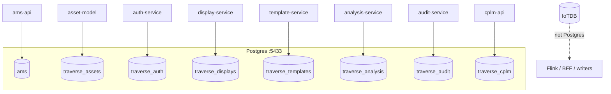

# 09 — Databases

## Topology

One Postgres/Timescale container (`ams-postgres`, host `5433`).  
**Logical database per service** (isolation). IoTDB is separate time-series store.

| Database | Owner service | Init scripts (order matters) |
|---|---|---|
| `ams` | ams-api | `01_init_extensions.sql`, `02_alarm_schema.sql`, `03_apply_ef_migrations.sql`, `25_expire_shelved_alarms.sql` |
| `traverse_assets` | asset-model | `10_…`, `15_…`, `16_…`, `21_…`, `31_…` |
| `traverse_displays` | display-service | `11_…`, `13_…`, `17_display_*`, `18–20`, `22_…` |
| `traverse_templates` | template-service | `12_…` |
| `traverse_analysis` | analysis-service | `14_…`, `23_…` |
| `traverse_auth` | auth-service | `17_traverse_auth_schema.sql` (+ service migrate/seed) |
| `traverse_audit` | audit-service | `24_traverse_audit_db.sql` |
| `traverse_cplm` | cplm-api | `29_…`, `30_…`, `32–34_…`, `33_cpm_permissions.sql` |

Mount: `database/scripts` → `/docker-entrypoint-initdb.d` (runs **once** on empty volume).

---

## `ams` (alarm projection)

- Timescale + extensions (`uuid-ossp`, `pg_trgm`, …).
- Schemas: `alarms`, `soe`, `analytics`, `configuration`, … (see `01_init_extensions.sql`).
- Populated by ams-api consumers from Kafka (`current-alarm-state`, lifecycle, KPIs) — **not** by Flink JDBC.

---

## Traverse config DBs

| DB | Typical contents |
|---|---|
| `traverse_assets` | UNS nodes, paths, Sparkplug/IoTDB metadata, relationships, seed plant |
| `traverse_displays` | Display JSON, versions, folders, personal views, media, ACL |
| `traverse_templates` | Template definitions |
| `traverse_analysis` | Analysis definitions / calc versions |
| `traverse_auth` | users, roles, permissions, refresh_tokens |
| `traverse_audit` | hash-chained audit events |
| `traverse_cplm` | loop registry, gate/feature results, event frames |

---

## Superseded (do not use for fresh install)

| Path | Note |
|---|---|
| `database/migrations/phase0/` | README: superseded; conflicts with `database/scripts` |
| `database/migrations/legacy/` | One-off industrial_vis → assets |
| `scripts/run-all-schemas.ps1` | Still applies phase0 — dangerous |

Live SoT for schema = **`database/scripts/` only**.

---

## IoTDB (not Postgres)

See [06-iotdb-historian.md](./06-iotdb-historian.md). Defaults: user/pass `root`/`root` (lab).

---

## Redis (not a DB of record)

Stores TTL snapshots + pub/sub. Persistence: AOF everysec + RDB. Policy `volatile-lru`.

---

## Credentials (lab defaults)

| Var | Default in compose |
|---|---|
| `POSTGRES_USER` | `ams_user` |
| `POSTGRES_PASSWORD` | `supersecurepassword123` (override via `.env`) |
| Auth bootstrap admin | `admin` / `ChangeMe123!` |

Password comment in compose: postgres init default **must** match all consumers or clone without `.env` breaks.
