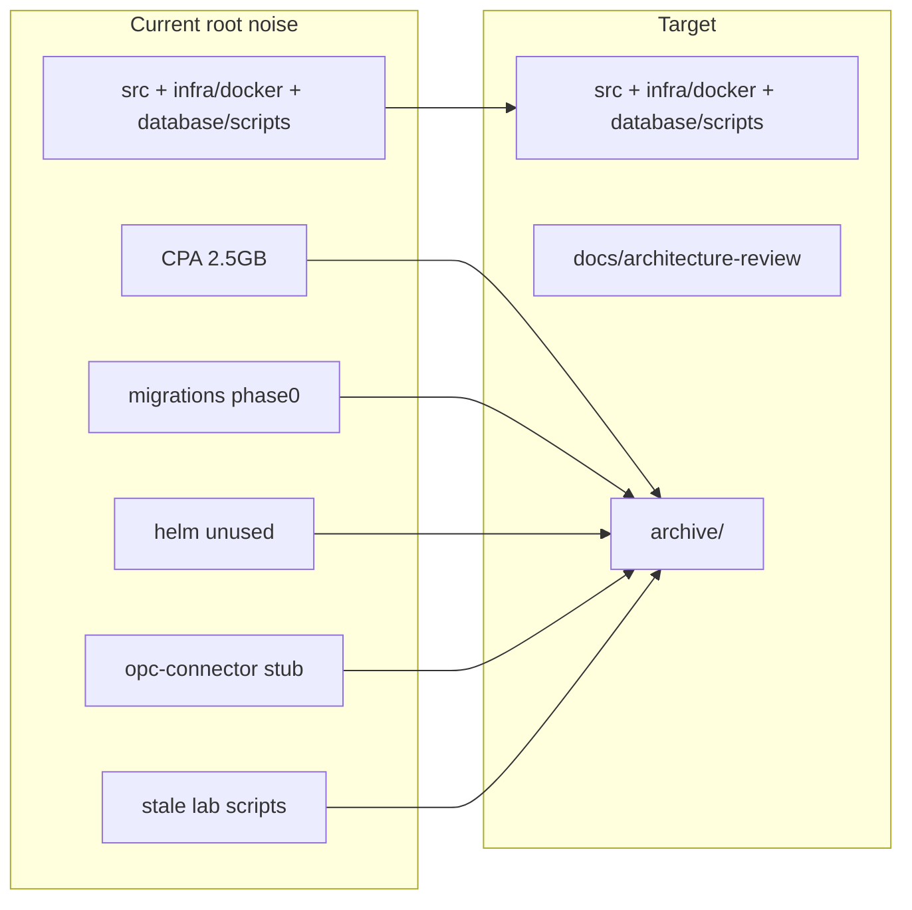

# 10 — Cleanup & Folder Reorganization

Evidence: compose references, CI paths, on-disk trees (2026-08 analysis).

## KEEP — live product path

```
src/backend/
src/frontend-ob/
src/flink/                 # ignore local target/
src/services/{asset-model,binding-resolver,display-service,template-service,
              analysis-service,historian-bff,audit-service,auth-service,
              cplm-api,sparkplug-edge-node,_shared}/
database/scripts/
database/procedures/
infra/docker/              # compose + Dockerfiles + flink-submit* + supervisor
scripts/start-ams-docker-full.ps1, run-all.ps1, build-flink-jar.ps1,
        ensure_flink_jobs.py, sync-auth-module.ps1, lib/, cplm helpers
tests/integration/, tests/cplm-golden/
.github/workflows/         # keep; rewrite stale paths
docs/architecture-review/  # this pack
CLAUDE.md, openbridge-agent-rules.md, .gitignore
```

---

## DELETE-CANDIDATE (strong evidence)

| Path | Evidence |
|---|---|
| `src/services/opc-connector/` | Only `.dockerignore`; not in compose |
| `src/services/sparkplug-edge-node;C/` | Empty Windows path glitch |
| `src/flink/target;T/` | Empty build glitch |
| Root `db.cs` | One-off Npgsql script + hardcoded password |
| Root `ref.exe` | Tiny tracked binary |
| Root empty `package-lock.json` | No root `package.json` |
| `fix-docker-compose.py`, `rewrite-docker-compose.py`, `reset_state.py` | One-off root helpers |
| Root `Image.jpg`, `image.png` | Unreferenced |
| `src/_case_ctx.txt` | Scratch |
| `scripts/run-all-schemas.ps1` | Applies superseded phase0 migrations |
| Local caches | `.m2/`, `.tmpbuild/`, `__pycache__/` (gitignored) |

---

## ARCHIVE (not needed to run compose)

| Path | Why |
|---|---|
| `CPA/` (~2.5GB, gitignored) | Intake reference; nested repos |
| `database/migrations/phase0|legacy/` | Superseded |
| `infra/helm/` | Aspirational; CI refs missing values; Keycloak ≠ live auth-service |
| `infra/windows/` | OPC gateway notes; not compose |
| `docs/cplm-intake/` (post-cutover) | Planning history |
| `docs/migration/` | Batik/PI Vision analysis for deleted trees |
| Root `AUDIT-*.md`, `PHASE_*.md`, large PDF/XLSX dumps | Spec dumps |
| `third-party/opc-core-redist/` | Local OPC extract |
| `backups/` | gitignored dumps |
| Lab/E2E script sprawl referencing missing `src/frontend`, streampipes, lab compose | e.g. `start-ams-lab.ps1` stale paths |

---

## DECIDE (ship or archive)

| Path | Fact |
|---|---|
| `src/services/notification-service` | Real code; **not in compose**; CI skips build |
| Optional Flink KPI/drift jobs | Code present; not supervised |

---

## Already gone (stop documenting as present)

`src/frontend/`, `src/industrial-edge-ui/`, batik import tree, `infra/k8s/`, `monitoring/`, `docker-compose.lab.yml`, `docker-compose.streampipes.yml`.

Stale references still claiming them: root `README.md`, parts of CI (`src/frontend`, `AMS.sln`), `scripts/ci-contract-gate.sh`, `start-ams-lab.ps1`.

---

## Proposed target structure

```text
AMS-open/
├── src/
│   ├── backend/              # restore AMS.sln for CI
│   ├── frontend-ob/
│   ├── flink/
│   └── services/             # compose services + _shared only
├── database/
│   ├── scripts/              # sole live schema
│   └── procedures/
├── infra/
│   └── docker/
├── scripts/
│   ├── lib/
│   ├── cplm/
│   ├── e2e/                  # designer + full-system only
│   ├── start-ams-docker-full.ps1
│   ├── build-flink-jar.ps1
│   ├── ensure_flink_jobs.py
│   └── sync-auth-module.ps1
├── tests/
├── docs/
│   ├── architecture-review/  # this pack
│   ├── operations/           # INSTALL, cutover runbooks
│   └── design/               # OpenBridge, conversion
├── .github/workflows/
├── run-all.ps1
├── README.md
└── .gitignore

# Outside main clone (or gitignored archive/)
archive/
├── CPA/
├── database-migrations-superseded/
├── helm-aspirational/
├── root-specs-and-audits/
├── scripts-lab-legacy/
└── services-optional/
    ├── notification-service/
    └── opc-connector/
```

---

## Reorg that also fixes auth copies

Raise docker build context for .NET Traverse services to `src/services` (or repo root), Dockerfile `COPY _shared` + service folder → **one** `TraverseAuth.cs`, delete per-service copies and `sync-auth-module.ps1`.

Same pattern can unify `IotDbWriteClient` copies (ams-api vs cplm-api).

---

## Priority order

1. Delete/move local junk + empty glitch dirs + `opc-connector` stub.
2. Archive `database/migrations/{phase0,legacy}`; disable `run-all-schemas.ps1`.
3. Fix CI/README → `frontend-ob` (+ restore or drop `AMS.sln`).
4. Decide notification-service: add to compose or archive.
5. Prune scripts to `start-ams-docker-full` graph; archive lab-era sprawl.
6. Optional: move `CPA/` off working SSD.

---

## Diagram — current vs target


