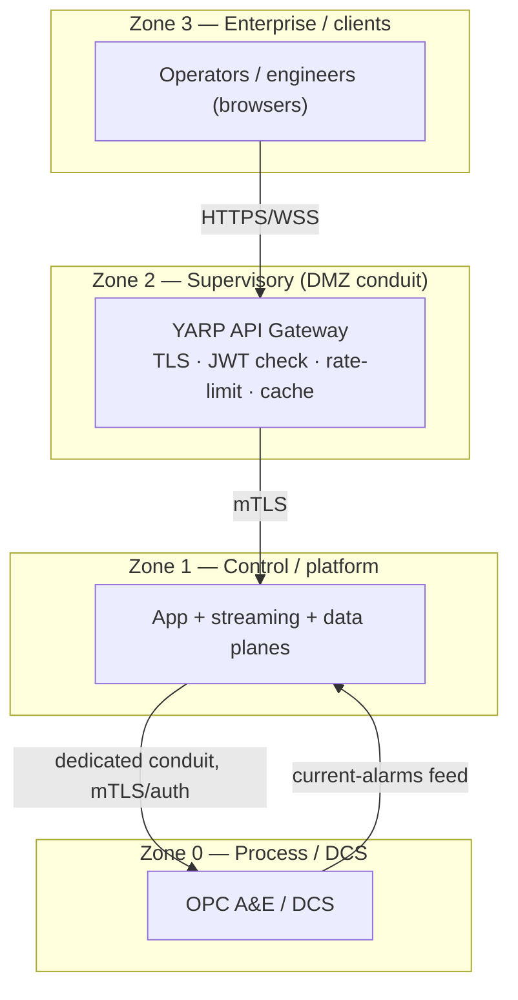
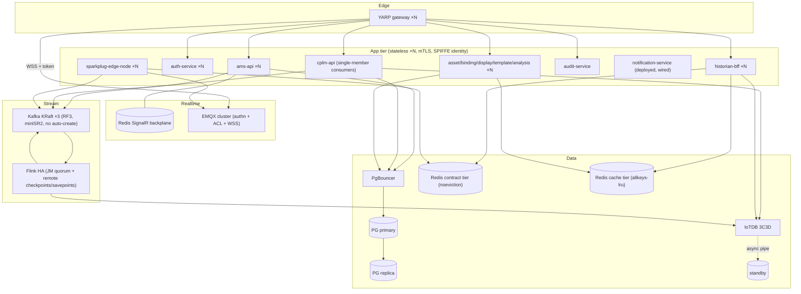
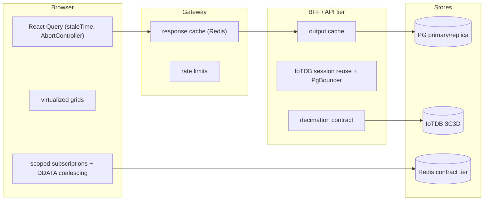

# 10 — Target Architecture (Consolidated To-Be Reference)

**Purpose:** the authoritative, self-sufficient target-state architecture. An implementing engineer can build against this document without reading the findings; GAP-ID references carry rationale only. The domain documents (03/04/05/07) justify these targets; this document consolidates them into one coherent design with no internal contradictions (one gateway decision, one service-identity model, one Redis topology, one streaming plane).
**Reviewed commit (baseline):** `4e2758c951df06a170f35d23313824cb57c9ef03`
**Date:** 2026-08-08
**Register:** same as the Traverse Edge platform specification. This document is design, not findings — it contains no UNVERIFIED markers; its rationale citations point only to verified gaps.

---

## 1. Target system context and container diagrams

### C4 L1 — target context with trust zones (IEC 62443)



### C4 L2 — target containers



---

## 2. Target microservices topology

Final service inventory (bounded context · owned DB · sync/async contracts · deployment). All app services are stateless and horizontally scalable; the two that are not today (ams-api, cplm-api) become so via SCALE-01 and STR-06.

| Service | Context | DB | Sync in | Async | Replicas |
|---|---|---|---|---|---|
| gateway (new) | Edge/BFF | — | all client traffic | — | ×N |
| ams-api | Alarm projection/ACK/ingest | `ams` | via gateway | Kafka alarm loop; SignalR (backplane) | ×N |
| auth-service | Identity | `traverse_auth` | JWKS pulled | — | ×N |
| asset-model | UNS SoT | `traverse_assets` | binding/cplm (mTLS) | asset-events | ×N |
| binding-resolver | path+role→transport | — | asset-model (mTLS) | — | ×N |
| display/template/analysis | Config | `traverse_displays/_templates/_analysis` | — | audit/analysis topics | ×N |
| cplm-api | Loop performance | `traverse_cplm` | asset-model | clpm.* (single-member, enforced) | 1 consumer / ×N API |
| historian-bff | Historian read | — | IoTDB/Redis | — | ×N |
| audit-service | Audit | `traverse_audit` | — | audit-events | ×N |
| notification-service | Alerting | — | — | root-cause-events + **lifecycle-alerts** | ×N |
| sparkplug-edge-node | Live bridge | — | — | live.* → EMQX/Redis | ×N |

**Recommended consolidations/splits:** none of the service boundaries change — they are sound. Two data-model reconciliations: add the `alarm_history` writer or repoint readers to `historical_alarms` (DATA-06); define or remove `traverse_shared` (DATA-12).

**Deployment profiles:** a Compose lab profile (current) and a Helm/Kubernetes production profile. The **four-tier resource-anchor system** maps as: Tier-1 (data plane: PG, IoTDB, Kafka) — largest CPU/mem + guaranteed QoS; Tier-2 (streaming: Flink JM/TM) — high mem, RocksDB disk; Tier-3 (app services) — moderate, HPA-scaled on CPU/RPS; Tier-4 (edge/aux: gateway, exporters, UIs) — small. Every container gets `deploy.resources` limits, non-root `USER`, and digest-pinned images (SEC-01).

**Shared-code resolution (AUTH-08):** raise the Docker build context to `src/services` (or repo root) and reference `_shared/Traverse.Auth.csproj` once from every service; delete the 7 byte-copies and the sync script; fold ams-api and display-service onto the same library.

---

## 3. Target edge and API gateway

**Decision record.** Options: YARP (native .NET), Envoy (mesh-grade, heavier ops), Kong OSS (plugin-rich, separate runtime). **Selected: YARP** — lowest skills/ops delta for a .NET 8 estate, native SignalR/WebSocket pass-through, reuses the existing JWKS validation and ASP.NET rate-limiter/output-cache middleware (full rationale in [03-api-gateway-and-edge.md](./03-api-gateway-and-edge.md) §3).

### Request paths

```mermaid
sequenceDiagram
    participant B as Browser
    participant GW as YARP gateway
    participant S as Service
    B->>GW: HTTPS request + Bearer
    GW->>GW: TLS terminate; validate JWT (edge check); rate-limit (Redis); cache lookup
    alt cacheable + hit
      GW-->>B: cached response
    else
      GW->>S: mTLS + forward Bearer (service re-validates — zero-trust)
      S-->>GW: response
      GW->>GW: cache if route cacheable
      GW-->>B: response
    end
```
SignalR: `GW --WSS+token--> ams-api` (sticky or backplane-agnostic). MQTT-WS: `GW --WSS, authorize upgrade with token--> EMQX` (EMQX authenticator then enforces per-client ACL).

### Gateway responsibilities matrix

| Responsibility | Policy |
|---|---|
| TLS termination | TLS 1.2+ at edge; WSS for SignalR + MQTT |
| Authn | Validate JWT at edge (reject anonymous); services **still** re-validate (zero-trust retained) |
| Rate limiting | Sliding-window, Redis counters (below) |
| Response caching | Per-route inventory (below); never-cache list enforced |
| Request size limits | per-route (ACK ≤4 KB; display JSON ≤2 MB; default 256 KB) |
| Circuit breaking | per-upstream breaker (open on 5xx/timeouts), fail-fast |
| Observability | RED metrics per route; access logs; trace propagation |

**Rate-limit counter key schema (Redis):** `rl:{routeClass}:{clientId}:{windowStart}` (INCR, TTL = window). `clientId` = `sub` claim else client IP. Limits: login 10/min/IP; alarm-read 600/min/user; historian 120/min/user; snapshot 30/min/user; mutations 120/min/user; global 2000/min/IP. **Fail-open** on Redis outage for reads; **fail-closed** for login + mutations.

**Cacheable-route inventory (per-route TTL + invalidation):**

| Route | TTL | Invalidation trigger |
|---|---|---|
| `GET /api/assets` tree/by-path | 60 s | asset-model write (asset-events) |
| `GET /api/displays/{id}` config | 30 s | display-service write |
| `GET /api/bindings/resolve` | 30 s | asset/binding change |
| `GET /api/hist/trend`, `/summary` | 10 s | new IoTDB write window |
| `GET /api/templates/{id}` | 60 s | template publish |

Cache key: `cache:{routeClass}:{queryHash}:{userScopeHash}` — `userScopeHash` folds permission/asset-scope so responses never cross authorization boundaries.

**Explicit never-cache list:** current alarm state (`/api/v1/alarms*`), all ACK/shelve/suppress endpoints, SignalR (`/hubs/*`), live MQTT (`/mqtt-ws`), CPM mutations, auth endpoints.

---

## 4. Target auth architecture

Hardened to production grade:
- **OIDC discovery** document published by auth-service (`/.well-known/openid-configuration`) enabling standard JwtBearer `Authority` metadata flow (removes the bespoke unknown-`kid` machinery) — resolves the H-03 limitation.
- **Key rotation** (AUTH-06): dual-key JWKS with overlapping validity + `kid`; automated rotation; retire old key after grace.
- **Refresh rotation + revocation** (AUTH-05): keep single-use refresh rotation; add access-token revocation via a short-lived reference-token or a `jti` blocklist in Redis checked at the gateway.
- **Service identity** (AUTH-01): replace the shared `X-Service-Key` full-permission header with mTLS + SPIFFE/SPIRE identities (or a service mesh); per-service authorization scopes, not `Perms.All`.
- **Shared validation library** (AUTH-08) replaces byte-copies.
- **Remove the authz kill switch** (AUTH-02); authorize `/hubs/observability` (AUTH-04).
- **Live-plane auth** (AUTH-03): EMQX JWT authenticator + per-client ACLs scoping `spBv1.0/#`; browser presents the access token on the WSS upgrade.
- **Secrets** externalized to a vault (SEC-02).

```mermaid
sequenceDiagram
    participant B as Browser
    participant GW as Gateway
    participant AU as auth-service
    participant S as Service
    participant E as EMQX
    B->>GW: login → AU (rate-limited, fail-closed)
    AU-->>B: access (15m, jti) + refresh cookie (single-use)
    B->>GW: API + Bearer; GW checks jti-not-revoked + validates
    GW->>S: mTLS (SPIFFE id) + Bearer; S re-validates
    B->>GW: WSS /mqtt-ws + Bearer
    GW->>E: authorize upgrade; E authenticator validates; ACL scopes topics
    Note over AU: key rotation → dual-key JWKS overlap
```

---

## 5. Target data layer

- **PostgreSQL:** primary + streaming replica (Patroni), PgBouncer (transaction pooling) in front, explicit Npgsql pool sizing per service (DATA-05). Indexing standard (DATA-01/10): every hot predicate index-backed — `uq_alarm_current_identity(server_id,source,condition,coalesce(sub_condition,''))`, `idx_alarm_current_state_time`, trigram GIN on `source` (both current + history), `idx_alarm_history_state_time`, `idx_alarm_history_time_source`; convert ingest to `INSERT … ON CONFLICT`. Timescale policy set (DATA-02): hypertables + compression (segmentby `source`, after 7 d) + retention (2 y history, per-class for transitions/CPLM) created in mounted SQL, not pre-marked EF migrations. Fix the wrong-DB init scripts (DATA-11) and add the `alarm_history` writer (DATA-06).
- **IoTDB:** 3C3D per spec §6 (3 ConfigNodes Ratis schema-replica-3, 3 DataNodes IoTConsensus data-replica-2) + async pipe to a standby cluster (DATA-04); schema-template cardinality governance; unify alarm identity with the live plane (DATA-07).
- **Redis:** two tiers (DATA-03) — a **contract tier** (`noeviction`, sized to the snapshot working set + headroom, alert at 80% `used_memory`) for paint-on-open keys, and a **cache tier** (`allkeys-lru`) for gateway/API caching; both with `requirepass`/ACL + TLS. Replace `/snapshot`'s keyspace SCAN with a maintained snapshot index set (DATA-09).

---

## 6. Target streaming plane

- **Kafka:** KRaft (no ZooKeeper), 3 brokers, RF≥3, `min.insync.replicas=2`, `acks=all`, idempotent producers, `auto.create.topics.enable=false`; topics provisioned as code with partition counts tied to consumer parallelism; longer retention on event-sourced topics; mTLS/SASL listeners (STR-04).
- **Flink:** JM HA (ZooKeeper or Kubernetes HA services), durable **remote** checkpoint + savepoint storage (S3/MinIO) (STR-02/03); explicit `DeliveryGuarantee` per sink — `AT_LEAST_ONCE` minimum on every Kafka sink, `EXACTLY_ONCE` + `setTransactionalIdPrefix` on the alarm-state path (or at-least-once once DATA-01 makes the projection idempotent) (STR-01); operator `.uid()`s + savepoint-based upgrade procedure (STR-11); the supervisor subordinated to the HA mechanism and extended to cover AnalysisExecutionJob (STR-07); the four unscheduled jobs fixed or deleted with their idle consumers (STR-08); state TTL on RBE fingerprints; `live.metrics` schema split/registry (STR-12); the DLQ made real and rebalance-safe (DOM-01/STR-09); at-least-once ACK writeback (STR-10). Retained at-least-once contracts stated explicitly (INFO-01).
- **Orphan closure (STR-05):** `lifecycle-alerts` consumed by notification-service → operator alert + Prometheus alert.

**Idempotency contract statement (where at-least-once is retained):** IoTDB sink (series,ts dedup); live.* → edge (alarmId+ts dedup); CPLM → cplm-api (`ON CONFLICT` upsert). These are the only sinks permitted to run below exactly-once, and each has a verified idempotent consumer.

---

## 7. Target end-to-end performance architecture



**Per-tier latency budget (field-to-HMI ≤ 1.5 s, spec §11):**

| Tier | Budget | Notes |
|---|---|---|
| Field → StreamPipes/ingest → Kafka | ≤ 300 ms | ingest + produce |
| Kafka → Flink RBE → live topic | ≤ 400 ms | keyed RBE + checkpoint-independent emit |
| Edge node → EMQX publish | ≤ 200 ms | Sparkplug encode + publish |
| EMQX → gateway → browser receive | ≤ 400 ms | WSS delivery |
| Browser render (coalesced) | ≤ 200 ms | rAF-batched setState |
| **Total** | **≤ 1.5 s** | sums to the SLO |

**Trend p95 < 1 s (decimated year):** historian-bff decimates to plot width (≤2000 pts) + Redis cache tier (10 s TTL) + IoTDB 3C3D read replicas; budget: gateway ≤50 ms + BFF decimation query ≤700 ms + transfer/render ≤250 ms.

Frontend contributions to the budget: React Query `staleTime` + AbortController (FE-03), virtualized grids (already good), scoped subscriptions + DDATA coalescing + memoization (FE-01/FE-04/FE-06), input debounce (FE-02).

---

## 8. Cross-cutting target state

- **Observability (OPS-01):** RED (per-route rate/errors/duration at the gateway + services) + USE (broker/DB/IoTDB saturation via exporters); scrape the Traverse services + auth-service + historian-bff; Alertmanager wired; SLO dashboards provisioned; a **pipeline-lag alert** and a **stalled-feed alert** driven off the now-consumed `lifecycle-alerts` (STR-05). Disable/authenticate the Prometheus admin API.
- **Secrets (SEC-02):** vault/K8s secrets; no committed defaults; TLS everywhere.
- **Container hardening (SEC-01):** non-root, digest-pinned, resource-limited, log rotation applied, network segmentation into the three zones.
- **Backup/restore:** PG PITR + replica; IoTDB async pipe standby; Kafka RF≥3 + longer retention; Redis contract tier AOF; documented restore runbook (05 §5).

---

## 9. Gap-to-target traceability matrix

Every S1/S2/S3 GAP maps to a resolving element here.

| GAP | Sev | Resolved by (section) |
|---|---|---|
| STR-01 | S1 | §6 explicit per-sink DeliveryGuarantee |
| STR-02 | S1 | §6 remote checkpoint/savepoint storage |
| STR-03 | S1 | §6 Flink JM HA |
| STR-04 | S1 | §6 Kafka KRaft RF≥3 |
| AUTH-01 | S1 | §4 mTLS/SPIFFE service identity |
| AUTH-02 | S1 | §4 remove kill switch |
| AUTH-03 | S1 | §3/§4 EMQX authn+ACL, authenticated WSS upgrade |
| DATA-01 | S1 | §5 unique identity index + ON CONFLICT |
| DATA-02 | S1 | §5 Timescale hypertables + retention |
| STR-05 | S1 | §6/§8 lifecycle-alerts consumer + alert |
| DOM-01 | S1 | §6 real DLQ, no offset advance |
| SCALE-01 | S2 | §2 SignalR backplane + stateless replicas |
| STR-06 | S2 | §6 single-member enforcement |
| DATA-03 | S2 | §5 Redis contract tier |
| DATA-04 | S2 | §5 IoTDB 3C3D |
| DATA-05 | S2 | §5 PG HA + PgBouncer |
| STR-07/08 | S2 | §6 supervise/fix/retire jobs |
| AUTH-04/05/06 | S2 | §4 authorize hub, revocation, rotation |
| STR-09/10 | S2 | §6 rebalance-safe commit, at-least-once ACK |
| DATA-06 | S2 | §2/§5 alarm_history writer |
| DOM-02 | S2 | §6/§5 register ShelveExpiry + create table |
| FE-01 | S2 | §7 scoped subscriptions + coalescing |
| DATA-07 | S2 | §5 unified alarm identity |
| GW-01/02/03 | S3 | §3 gateway + rate limits |
| DATA-08/09/10 | S3 | §5/§7 caching + indexes + snapshot index |
| SEC-01 | S3 | §2/§8 hardened containers |
| STR-11 | S3 | §6 savepoint upgrade |
| FE-02..06 | S3 | §7 frontend performance targets |
| RES-01 | S3 | §2 resilience handlers (implied in app-tier hardening) |
| DATA-11 | S3 | §5 fix init scripts |
| AUTH-07 | S3 | §2 notification-service auth + deploy |

Forward-looking target elements not tied to a single gap (justified as design): the three-zone IEC 62443 segmentation (§1) and the Helm/K8s production profile (§2) generalize SEC-01/OPS-01 into a coherent deployment model.

---

## 10. Migration sequencing

Aligned to the three remediation phases in [09-gap-register.md](./09-gap-register.md) §4. Each step: precondition · rollback · verification.

1. **Streaming durability + guarantees** (Phase 1): precond = remote object store reachable; add per-sink guarantees, remote checkpoints, JM HA, KRaft RF≥3. Rollback = revert to current supervisor + local volume. Verify = kill-JM chaos test restores jobs *with* state; fault-injection loses zero records.
2. **Auth + edge lockdown** (Phase 1): precond = gateway deployed in shadow; remove kill switch, authorize hub, EMQX authn+ACL, mandatory strong keys. Rollback = keep nginx path. Verify = no unauthenticated path serves alarm/live data.
3. **Projection integrity + retention** (Phase 1): precond = PG backup; add identity index + ON CONFLICT + hypertables/retention + alarm_history writer + real DLQ + lifecycle-alerts consumer. Rollback = restore backup. Verify = duplicate-redelivery + Postgres-outage tests pass; bounded-growth test.
4. **Data/streaming HA** (Phase 2): IoTDB 3C3D, PG primary+replica+PgBouncer, Redis contract tier, single-member CPLM, savepoint upgrades. Rollback = single-instance fallback. Verify = failover drills.
5. **Gateway build-out + caching + resilience** (Phase 2): per-client limits, response cache with invalidation, resilience handlers, hardened containers. Verify = never-cache list test; load test to the 07 §1 numbers.
6. **Frontend performance + hygiene** (Phase 2–3): scoped firehose, coalescing, memoization, ref-counted unsubscribe, loading states, debounce, AbortController. Verify = render-rate test on dense displays.
7. **Observability + secrets + de-dup + cleanup** (Phase 3): Alertmanager + SLO dashboards + pipeline-lag/stalled-feed alerts, vault secrets, single auth library, dead-code/dep removal, doc reconciliation. Verify = SLOs measured; PHASE0 §4 drift list closed.
