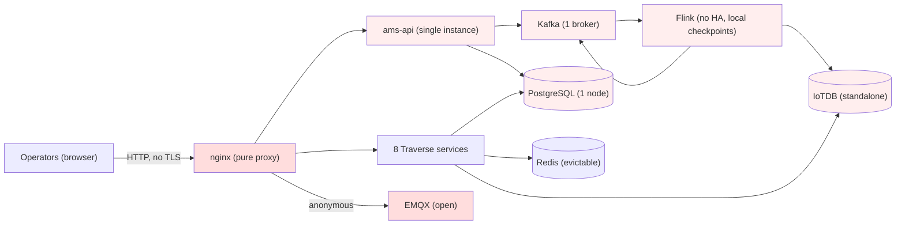
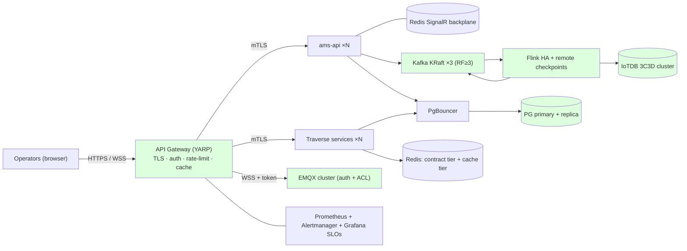

# 11 — Proposed Architecture (Product-Manager Review)

**Audience:** product / engineering management — for review and approval.
**Purpose:** one concise, diagram-led view of what the platform is, why each part exists, the proposed production architecture, and a clear done-vs-pending status with effort sizing. Deep evidence lives in [09-gap-register.md](./09-gap-register.md) and [10-target-architecture.md](./10-target-architecture.md); this document is the executive layer over both.
**Baseline commit:** `4e2758c` · **Date:** 2026-08-09

---

## 1. Executive summary

The platform is a **Consolidated Alarm Management System + Traverse HMI** built on an event-driven stack (OPC/DCS → Kafka → Flink → PostgreSQL/IoTDB → .NET API → SignalR/MQTT → React). The domain design is strong; the **infrastructure is lab-grade**. A full code-verified review found **53 gaps (11 blockers)** that stand between "works in the lab" and "runs in production."

> **Verdict:** capable, well-architected lab platform — **not yet production-ready**. Closing the 11 blockers is a **~2–3 month, 3-phase program**; the single most important item is guaranteeing that alarms are never silently lost or duplicated.

| Metric | Value |
|---|---|
| Services in stack | 13 app/edge + 6 shared infra + Flink (15 jobs) |
| Blockers (S1) | 11 |
| Critical (S2) | 16 |
| Major / Minor / Info (S3/S4/S5) | 16 / 8 / 2 |
| Production-ready today? | **No** — 16 gaps carry a disqualifying (D) production grade |
| Estimated program | 3 phases, ~2–3 months |

---

## 2. Component catalog — what each part does & why we use it

Each row: what it does (working) · why this technology · current status.

| Component | What it does & why we use it (working) | Status |
|---|---|---|
| **Kafka** (event bus) | Durable log that carries every alarm/loop event between ingest, Flink, and the projectors. Chosen as the decoupling backbone so producers and consumers scale and fail independently. | 🟠 Works; **1 broker, no replication** |
| **Apache Flink** (stream compute) | Runs the ISA-18.2 alarm state machine, live report-by-exception, and CPLM loop analytics as checkpointed streaming jobs. Chosen because alarm logic is stateful and must be exactly-once — "Flink-only compute" is a settled rule. | 🟠 Works; **no HA, sinks can lose data** |
| **PostgreSQL / TimescaleDB** (relational + time-series) | System-of-record for the current-alarm projection and per-service config (one DB per service). Timescale intended for time-series history. Chosen for relational integrity + time-series in one engine. | 🟠 Works; **Timescale unused, no HA, index gap** |
| **IoTDB** (historian) | High-ingest time-series store for alarm/loop/KPI history, queried for trends. Chosen to keep heavy historian load off PostgreSQL; tree model fits the UNS path scheme. | 🟠 Works; **standalone (spec wants 3C3D cluster)** |
| **Redis** (snapshot + cache) | Holds "paint-on-open" live snapshots so a faceplate shows a value instantly, plus pub/sub. Chosen for sub-millisecond reads on cold-start. | 🟠 Works; **snapshots evictable, no auth** |
| **EMQX + Sparkplug B** (live transport) | Bridges live values to browsers over MQTT-WebSocket using the industrial Sparkplug namespace. Chosen because MQTT/WS is browser-friendly and Sparkplug is the industrial standard. | 🔴 Works; **fully anonymous, publicly reachable** |
| **SignalR** (realtime push) | Pushes alarm list/ack updates to the HMI without polling. Chosen as the native .NET realtime channel. | 🟠 Works; **single-instance only (no backplane)** |
| **.NET 8 services** (ams-api + 8 Traverse services) | The API/business tier — alarm projection, ACK, ingest, UNS/binding/display/template/analysis/loop-performance/historian/audit. Clean-architecture, one service per bounded context. | 🟠 Works; **auth + resilience + caching gaps** |
| **auth-service** (Node, RS256 JWT) | Central identity issuer — login, token refresh, JWKS. Chosen to centralize issuance; each service validates independently (zero-trust). | 🟠 Sound issuer; **no rotation/revocation** |
| **React + OpenBridge** (HMI/frontend) | The operator UI — alarm console, live events, trends, HMI designer — on the mandated OpenBridge industrial design system. | 🟢 Solid; **render/perf polish pending** |
| **nginx** (edge) | Serves the SPA and proxies API traffic. Today a pure proxy. | 🔴 **No auth / rate-limit / TLS — needs a gateway** |
| **Prometheus / Grafana** (observability) | Metrics + dashboards for the stack. | 🟠 Partial; **no alerting, no dashboards** |

Legend: 🟢 production-ready · 🟠 works, hardening needed · 🔴 blocker-level gap.

---

## 3. Architecture — current vs proposed

### 3.1 Current (as-is)

Red = security-open · pink = single-point-of-failure. Every store is a single instance; the edge and live plane are unauthenticated.

### 3.2 Proposed (to-be)

Green = HA + secured. Adds a gateway (TLS/auth/rate-limit/cache), replicated/clustered stores, Flink HA with durable checkpoints, a SignalR backplane for horizontal scale, and full observability.

> **Biggest single build:** the **API Gateway + production auth** (workstreams #3 and #4). This is the largest net-new piece — it is where TLS, edge authentication, rate limiting, response caching, and the move from a shared service-key to mTLS/token identity all land. Treat it as its own project track.

### 3.3 Cluster sizing — current vs proposed (approval-dependent)

Instance counts today are all **1** (single-node lab). The proposed sizing is the production target; **the exact node counts depend on your approval** of the target scale and availability budget — 3C3D / RF≥3 are the vendor/spec-recommended minimums for HA, not the only option.

| Component | Current | Proposed (for approval) | Why / note |
|---|---|---|---|
| Kafka brokers | **1** (ZooKeeper) | **3** (KRaft, RF≥3, min-ISR 2) | tolerates 1 broker loss; RF≥3 is the standard HA minimum |
| Flink | **1 JM + 1 TM**, no HA | **JM quorum (HA) + ≥2 TM** + remote checkpoints | JM restart no longer loses jobs/state |
| IoTDB | **1** (standalone) | **3C3D** (3 ConfigNodes + 3 DataNodes) per spec §6 | historian HA; matches the platform spec — or a smaller cluster if lower DR is accepted |
| PostgreSQL | **1** | **1 primary + 1 replica** + PgBouncer | failover + connection pooling; add more replicas for read scale |
| Redis | **1** (evictable) | **2 tiers** (contract = non-evicting, cache = LRU); HA optional | protects paint-on-open snapshots; Sentinel/cluster if HA needed |
| EMQX | **1** (anonymous) | **cluster (≥2)** with auth + ACL + WSS | live-plane HA + security |
| App services (ams-api, Traverse) | **1 each** | **≥2 each** (autoscaled) behind the gateway | horizontal scale once stateless |

**Decision needed:** confirm the target scale (≈2,000 operators) and the availability goal — that fixes whether we adopt the full 3C3D / RF≥3 / multi-replica sizing above or a lighter HA footprint. Everything downstream (cost, node count, DR posture) follows from this one call.

---

## 4. Performance & scalability plan

**Target scale:** ~2,000 concurrent operators. Translated to load (full arithmetic in [07-scalability-reliability.md](./07-scalability-reliability.md) §1):

| Tier | Load at target | Bottleneck today | Fix |
|---|---|---|---|
| SignalR (alarm push) | ~2,000 connections, ~10k msg/s fan-out | single-instance ams-api | Redis backplane + replicas |
| MQTT live values | ~160k scoped subscriptions | always-on plant-wide firehose | scope per screen + coalesce updates |
| Historian reads | ~4,000 snapshot reads at shift change | per-request Redis SCAN | snapshot index + cache |
| Postgres alarm reads | ~600 queries/s | no cache, unindexed hot path | API cache + indexes |
| Kafka alarm path | modest, spikes on floods | 1 broker, 24h retention | 3 brokers RF≥3, longer retention |

**Field-to-HMI latency budget (SLO ≤ 1.5 s):** ingest→Kafka 300 ms · Flink RBE 400 ms · edge→EMQX 200 ms · EMQX→browser 400 ms · render 200 ms = **≤ 1.5 s**. Trend query p95 target **< 1 s** via server-side decimation + cache. These SLOs are defined; instrumentation to measure them is part of the observability work.

**Scalability principle:** every app service becomes stateless and horizontally scalable behind the gateway; state moves to the replicated/clustered data tier. The two services pinned to one replica today (ams-api via SignalR, cplm-api via consumer-group) are unblocked by the backplane and single-member enforcement.

### 4.1 Caching strategy (which layer caches what)

Caching is layered so each tier absorbs the load below it. Today only the browser layer exists; the gateway and API layers are the proposed additions.

| Layer | Technology | Caches | Status |
|---|---|---|---|
| Frontend | **React Query** | server responses in the browser (30s stale time) — cuts repeat API calls | 🟢 in place (needs request-cancellation polish) |
| Edge | **Gateway response cache (Redis-backed)** | cacheable GET routes (asset tree, display config, bindings, trend/summary) with per-route TTL | 🔴 proposed (new with the gateway) |
| API | **Output cache** | hot alarm-list reads, invalidated on write | 🔴 proposed |
| Backend live data | **Redis** | paint-on-open live snapshots (contract tier) + gateway/API cache tier | 🟠 exists but single evictable tier — split into two tiers |
| Historian | **IoTDB server-side decimation** | trend queries reduced to plot width before transfer | 🟢 in place |

**Never cached** (correctness-critical): current alarm state, ACK/shelve endpoints, SignalR streams, live MQTT values.

---

## 5. Status — done vs pending (PM decision table)

Grouped by workstream. "Major?" = whether it's an architectural change (**Major**) vs a contained fix (**Minor**). Effort: S ≤ 3 days · M ≤ 3 weeks · L > 3 weeks. Phase per the remediation roadmap.

| # | Workstream | Done today | Pending (to production) | Major? | Effort | Phase |
|---|---|---|---|---|---|---|
| 1 | **Alarm data integrity** | State machine, projection, ACK loop all work | Flink sink guarantees, real DLQ, unique upsert index (no silent loss/dup) | Minor (high-impact) | M | 1 |
| 2 | **Streaming HA** | Jobs run; 60s supervisor auto-heals | Kafka RF≥3 (KRaft), Flink JM HA, durable remote checkpoints | **Major** | L | 1 |
| 3 | **Security — edge & live plane** | Per-service JWT validation works | API gateway (TLS/authn/rate-limit), authenticate EMQX + MQTT-WS, remove authz kill switch | **Major** | L | 1–2 |
| 4 | **Security — identity** | RS256 issuer, refresh rotation | Token revocation, key rotation, replace shared service key with mTLS/SPIFFE | Minor→Major | M | 2 |
| 5 | **Data retention & HA** | Schemas + per-service DBs solid | Enable TimescaleDB retention, PG replica + PgBouncer, IoTDB 3C3D, Redis contract tier | **Major** | L | 1–2 |
| 6 | **Scale-out** | Services mostly stateless | SignalR backplane, single-member CPLM enforcement, HPA | **Major** | M | 1–2 |
| 7 | **Safety alerting** | Deadman + ACK-SLA watchdogs produce alerts | Wire the `lifecycle-alerts` consumer (today it goes nowhere) | Minor | S | 1 |
| 8 | **API performance** | Reads work | API/gateway caching, missing indexes, resilience (retry/circuit-breaker) | Minor | M | 2 |
| 9 | **Frontend performance** | Alarm grid virtualization is production-grade | Scope MQTT firehose, memoize renders, debounce, request cancellation | Minor | M | 2–3 |
| 10 | **Observability** | Metrics scraped for core services | Alerting, SLO dashboards, scrape all services | Minor | M | 3 |
| 11 | **Ops hygiene** | Compose stack runs the whole system | Non-root + resource-limited containers, secrets vault, image pinning | Minor | M | 3 |

**Overall:** the pending work is **mostly hardening and HA, not redesign** — the service boundaries and domain logic stay as-is. Four workstreams (streaming HA, edge security, data HA, scale-out) are genuinely **Major** (new infrastructure/topology); the rest are contained fixes.

---

## 6. Approval ask

1. **Approve the 3-phase remediation program** (Phase 1 = the 11 blockers; Phase 2 = production hardening; Phase 3 = polish) — see [09-gap-register.md](./09-gap-register.md) §4 for entry/exit criteria.
2. **Confirm the target scale (≈2,000 operators) and availability goal** — this single decision fixes the cluster sizing in §3.3 (Kafka 3-broker RF≥3, IoTDB 3C3D, PG primary+replica, etc.); the recommended numbers are HA minimums, and a lighter footprint is possible if a lower DR posture is accepted.
3. **Fund the API Gateway + production auth as a dedicated track** — it is the biggest net-new build (TLS, edge auth, rate limiting, response caching, mTLS/token service identity) and gates most of the security and performance work.
4. **Approve the four Major changes** (gateway+auth, Kafka/Flink HA, data-tier HA, scale-out) as the only architectural additions — everything else is a fix within the current design.
5. **Prioritize Phase 1 workstream #1** (alarm data integrity) — it is the single highest-leverage item and the credibility of every alarm/KPI/audit claim depends on it.

*No service boundaries change. The proposal hardens and makes highly-available an already-sound decomposition; it does not re-architect the product.*
