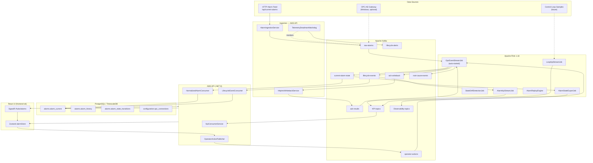
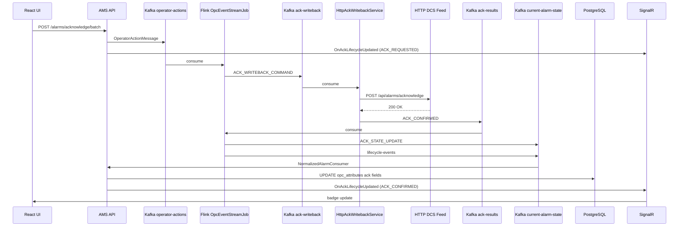

# AMS Complete Project Workflow

> End-to-end reference for the Alarm Management System (AMS): ingestion → Kafka → Flink → PostgreSQL → API/SignalR → React UI.
>
> **Last verified against codebase:** June 2026  
> **Primary runtime stack:** Docker Compose (`infra/docker/docker-compose.yml`)

---

## Table of Contents

1. [Executive Summary](#1-executive-summary)
2. [System Architecture](#2-system-architecture)
3. [Ingestion Layer](#3-ingestion-layer)
4. [Kafka Topic Catalog](#4-kafka-topic-catalog)
5. [Flink Stream Processing](#5-flink-stream-processing)
6. [Data Models by Stage](#6-data-models-by-stage)
7. [Backend Consumers & PostgreSQL Writes](#7-backend-consumers--postgresql-writes)
8. [PostgreSQL Database Schema](#8-postgresql-database-schema)
9. [Operator ACK Lifecycle](#9-operator-ack-lifecycle)
10. [Frontend Consumption](#10-frontend-consumption)
11. [Microservices (`src/services`)](#11-microservices-srcservices)
12. [Infrastructure](#12-infrastructure)
13. [Legacy vs Current Pipeline](#13-legacy-vs-current-pipeline)
14. [Key File Index](#14-key-file-index)

---

## 1. Executive Summary

AMS is an industrial alarm management platform built around **event-driven stream processing**. The design principle is:

> **Kafka + Flink own alarm state orchestration. The API is a projection layer — it does not directly write ACK state to SQL on operator action.**

### Current production path (Docker Compose)

```
HTTP Alarm Feed (DCS/SCADA)
    ↓ poll (2s)
AMS API — AlarmIngestionService
    ↓ publish
Kafka: raw-alarms
    ↓ consume
Flink: OpcEventStreamJob (state machine)
    ↓ publish
Kafka: current-alarm-state | lifecycle-events | root-cause-events | ack-writeback
    ↓ consume
AMS API — Kafka consumer services
    ↓ upsert/delete
PostgreSQL: alarms.alarm_current
    ↓ REST + SignalR
React UI (frontend-ob)
```

### What runs where

| Component | Location | Role |
|-----------|----------|------|
| HTTP ingest | `src/backend/AMS.Api` | Polls external alarm feed, publishes deltas to `raw-alarms` |
| Stream processing | `src/flink` | Alarm state machine, KPIs, drift detection, replay |
| Projection & API | `src/backend` | Kafka consumers → PostgreSQL → REST + SignalR |
| Operator UI | `src/frontend-ob` | React + OpenBridge, Zustand store, live SignalR |
| Standalone services | `src/services` | Audit + notification (not in Docker Compose) |
| Database | `database/` | TimescaleDB/PostgreSQL schema scripts |
| Infrastructure | `infra/` | Docker Compose, Helm, Windows OPC gateway docs |

---

## 2. System Architecture

### 2.1 High-level diagram



### 2.2 Design constraints

- **Flink-only orchestration** is enforced at startup (`Program.cs`). `Kafka:UseFlinkOrchestration` must be `true`; `LabDirectIngest` must be `false`.
- **No Flink JDBC sinks** — Flink writes only to Kafka. PostgreSQL is updated exclusively by API background consumers.
- **At-least-once** delivery to PostgreSQL with **idempotent upserts** keyed on `serverId + sourceName + conditionName + subConditionName`.

---

## 3. Ingestion Layer

### 3.1 Primary ingest: HTTP alarm feed

**Service:** `AlarmIngestionService`  
**File:** `src/backend/AMS.Api/BackgroundServices/AlarmIngestionService.cs`

| Setting | Default | Description |
|---------|---------|-------------|
| `AlarmIngestion:Enabled` | `true` | Enable/disable polling |
| `AlarmIngestion:FeedUrl` | `http://192.168.1.51:8010/api/current-alarms` | External alarm snapshot API |
| `AlarmIngestion:PollIntervalMs` | `2000` | Poll every 2 seconds |
| `AlarmIngestion:ServerId` | `f0af9a6d-85f6-4c9f-a8ad-6de277d1d110` | Fixed server identity for HTTP feed |
| `AlarmIngestion:AckWritebackUrl` | `.../api/alarms/acknowledge` | HTTP endpoint for ACK writeback |

**Process:**

1. Poll HTTP feed for current alarm list (JSON array).
2. Compare each alarm against an in-memory snapshot (`ConcurrentDictionary`).
3. Publish **only deltas** (new alarm, state change, clear) to Kafka topic **`raw-alarms`**.
4. Message key = `alarmId` (feed correlation id, e.g. `BB26-BF402|Alarm high`).

**HTTP feed JSON fields (typical):**

```json
{
  "correlation_id": "BB26-BF402|Alarm high",
  "tag_name": "BB26-BF402",
  "severity": 700,
  "state": "ACTIVE",
  "acknowledged": false,
  "message": "High alarm on BB26-BF402",
  "condition": "Alarm high"
}
```

**Published to `raw-alarms` as `RawAlarmStreamEvent`:**

| Field | Source |
|-------|--------|
| `eventType` | `RAW_ALARM_EVENT` |
| `serverId` | Configured HTTP feed server GUID |
| `sourceName` | `tag_name` |
| `conditionName` | `condition` |
| `severity` / `priority` | Mapped from feed |
| `conditionActive` | `state != "CLEARED"` |
| `acknowledged` | From feed |
| `eventTimeEpochMs` | Current UTC |
| `alarmId` | `correlation_id` |

### 3.2 ACK writeback ingest

**Service:** `HttpAckWritebackService`  
**File:** `src/backend/AMS.Api/BackgroundServices/HttpAckWritebackService.cs`

| Direction | Topic | Action |
|-----------|-------|--------|
| Consume | `ack-writeback` | Receives ACK command from Flink |
| HTTP POST | `AckWritebackUrl` | Writes ACK to external DCS/SCADA |
| Produce | `ack-results` | Publishes `ACK_CONFIRMED` or `ACK_FAILED` |

### 3.3 Telemetry watchdog

**Service:** `TelemetryDeadmanWatchdogService`

- Monitors `raw-alarms` topic for message activity.
- If no messages within configured threshold → publishes `TELEMETRY_STALLED` to **`lifecycle-alerts`**.
- No downstream consumer in the current codebase (alert topic reserved).

### 3.4 OPC-AE gateway (external, optional)

Documented in `infra/windows/opc-gateway-deploy.md`. A Windows x86 service connects to OPC-AE servers and can publish to Kafka's external listener (`localhost:9093`). The **legacy** path used `raw-opc-events`; the **current** path uses `raw-alarms` with the same JSON schema Flink accepts.

### 3.5 Standalone microservices ingest

See [Section 11](#11-microservices-srcservices). `audit-service` and `notification-service` are Kafka consumers only — they do not produce alarm data.

---

## 4. Kafka Topic Catalog

Topics are provisioned by `scripts/kafka-reset-lab-topics.ps1` (19 production topics). Legacy OPC topics are deleted on reset.

### 4.1 Core alarm pipeline (active in Docker Compose)

| Topic | Partitions | Cleanup | Producer | Consumer(s) | Consumer Group |
|-------|------------|---------|----------|-------------|----------------|
| **`raw-alarms`** | 8 | delete | `AlarmIngestionService` | Flink `OpcEventStreamJob`, `TelemetryDeadmanWatchdog` | `flink-ams-raw-alarms`, `ams-backend-telemetry-deadman` |
| **`current-alarm-state`** | 8 | **compact** | Flink `OpcEventStreamJob` | `NormalizedAlarmConsumerService` | `ams-backend` |
| **`operator-actions`** | 4 | delete | `OperatorActionPublisher` (API) | Flink `OpcEventStreamJob` | `flink-ams-operator-actions` |
| **`ack-writeback`** | 2 | delete | Flink `OpcEventStreamJob` | `HttpAckWritebackService` | `ams-backend-http-ack-writeback` |
| **`ack-results`** | 2 | delete | `HttpAckWritebackService` | Flink `OpcEventStreamJob` | `flink-ams-ack-results` |
| **`lifecycle-events`** | 4 | delete | Flink `OpcEventStreamJob`, `LifecycleEventPublisher` | `LifecycleEventConsumerService`, Flink `AlarmKpiStreamJob` | `ams-backend-lifecycle`, `flink-ams-alarm-kpi` |
| **`root-cause-events`** | 2 | delete | Flink `OpcEventStreamJob` | `notification-service` | `notification-service-group` |
| **`lifecycle-alerts`** | — | — | `TelemetryDeadmanWatchdogService` | *(none wired)* | — |

### 4.2 KPI & loop analytics (optional Flink jobs)

| Topic | Partitions | Producer | Consumer |
|-------|------------|----------|----------|
| **`loop-raw-data`** | 16 | External / future | Flink `LoopKpiStreamJob` |
| **`loop-kpis-5m`** | 8 | Flink `LoopKpiStreamJob` | `KpiConsumerService` → SignalR |
| **`kpi-alarm-rates`** | 4 | Flink `AlarmKpiStreamJob` | `KpiConsumerService` |
| **`kpi-standing-snapshots`** | 2 | compact | Flink `AlarmKpiStreamJob` | `KpiConsumerService` |
| **`kpi-bad-actors`** | 4 | *(no producer yet)* | `KpiConsumerService` |
| **`kpi-health-scores`** | 2 | *(no producer yet)* | `KpiConsumerService` |

### 4.3 Observability & drift detection (Phase 2)

| Topic | Partitions | Producer | Consumer |
|-------|------------|----------|----------|
| **`alarm.events.raw`** | 8 | External | Flink `StateDriftDetectionJob`, `AlarmReplayEngine` |
| **`alarm.state.active`** | 4 | compact | Flink `StateDriftDetectionJob` |
| **`flink.state.alarm.delta`** | 4 | Flink `AlarmStateExportJob` | `AlarmStateDeltaConsumerService` → ObservabilityHub |
| **`flink.state.alarm.replay`** | — | Flink `AlarmReplayEngine` | `ReplayResultConsumerService` → ObservabilityHub |
| **`system.state.drift.alerts`** | 2 | Flink `StateDriftDetectionJob` | `DriftAlertConsumerService` → ObservabilityHub |

### 4.4 Microservice & DLQ topics

| Topic | Producer | Consumer |
|-------|----------|----------|
| **`audit-events`** | *(no in-repo producer)* | `audit-service` → PostgreSQL hash chain |
| **`raw-alarms-dlq`** | *(stub — log only)* | — |
| **`ack-writeback-dlq`** | Configured only | — |

### 4.5 Legacy topics (removed on reset)

```
raw-opc-events, raw-opc-events-dlq, current-opc-state, opc-events, opc-ack,
alarm-created, alarm-updated, alarm-cleared, alarm-acknowledged
```

These appear in older docs (`ams-alarm-architecture.md`) but are **not** part of the current pipeline.

### 4.6 Complete topic flow map

```
PRODUCERS                          TOPIC                         CONSUMERS
─────────                          ─────                         ─────────
AlarmIngestionService         →    raw-alarms                →   OpcEventStreamJob
                                                              →   TelemetryDeadmanWatchdog

OperatorActionPublisher       →    operator-actions          →   OpcEventStreamJob

OpcEventStreamJob             →    current-alarm-state       →   NormalizedAlarmConsumer
                                                              →   AlarmStateExportJob (optional)

OpcEventStreamJob             →    lifecycle-events          →   LifecycleEventConsumer
                                                              →   AlarmKpiStreamJob (optional)

OpcEventStreamJob             →    root-cause-events         →   notification-service

OpcEventStreamJob             →    ack-writeback             →   HttpAckWritebackService

HttpAckWritebackService       →    ack-results               →   OpcEventStreamJob

AlarmKpiStreamJob             →    kpi-alarm-rates           →   KpiConsumerService
                              →    kpi-standing-snapshots    →   KpiConsumerService

LoopKpiStreamJob              →    loop-kpis-5m              →   KpiConsumerService

AlarmStateExportJob           →    flink.state.alarm.delta   →   AlarmStateDeltaConsumer

StateDriftDetectionJob        →    system.state.drift.alerts →   DriftAlertConsumer

AlarmReplayEngine             →    flink.state.alarm.replay  →   ReplayResultConsumer

TelemetryDeadmanWatchdog      →    lifecycle-alerts          →   (none)
```

---

## 5. Flink Stream Processing

**Module:** `src/flink` (Maven, Flink 1.18.1, Java 11)  
**Default JAR:** `ams-flink-1.0-SNAPSHOT.jar`  
**Auto-submitted job:** `OpcEventStreamJob` only (via `infra/docker/flink-submit-raw-alarms.sh`)

All jobs use **Kafka sources and Kafka sinks only** — no JDBC/Postgres writes from Flink.

### 5.1 OpcEventStreamJob — Primary Alarm State Machine

**Entry class:** `com.ams.flink.OpcEventStreamJob`  
**Flink job name:** `AMS - Alarm State Machine`  
**Checkpointing:** 30s, EXACTLY_ONCE

#### Kafka subscriptions

| Topic | Group ID | Starting offset |
|-------|----------|-----------------|
| `raw-alarms` | `flink-ams-raw-alarms` | `earliest` or `latest` (env: `RAW_ALARMS_STARTING_OFFSETS`) |
| `operator-actions` | `flink-ams-operator-actions` | `earliest` |
| `ack-results` | `flink-ams-ack-results` | `earliest` |

#### Processing pipeline

```
raw-alarms
  │
  ├─ ValidationMap          Parse JSON → RawOpcAlarmEvent; reject if missing source/condition
  ├─ DedupFilter            Keyed by alarmKey; drop stale duplicates (same timestamp, same state/ack)
  ├─ EnrichmentMap          Map severity → priority; build opcAttributes JSON
  ├─ SoeOrderMap            Pass-through (SOE ordering placeholder)
  ├─ LifecycleMap           Keyed state machine: NEW → ACTIVE → CLEARED; persist ack across events
  ├─ CorrelationMap         Pass-through (CEP placeholder)
  ├─ FloodDetectFilter      Drop events with severity ≥ 950
  │
  ├─ RootCauseMap           → root-cause-events (crusher/conveyor/feeder/motor family)
  ├─ KpiMap                 (computed, no sink wired)
  ├─ toLifecycleJson        → lifecycle-events
  └─ projection builder     → current-alarm-state
                              ├─ ALARM_STATE_UPSERT (active alarms)
                              └─ ALARM_STATE_DELETE (cleared alarms)

operator-actions
  └─ toAckWriteback         → ack-writeback (ACKNOWLEDGE actions only)

ack-results
  ├─ toAckLifecycleEvent    → lifecycle-events (ACK_CONFIRMED / ACK_FAILED)
  └─ toAckConfirmedState    → current-alarm-state (ACK_STATE_UPDATE, acknowledged=true)
```

#### Operator details

| Operator | Keying | State | Logic |
|----------|--------|-------|-------|
| `ValidationMap` | — | — | Detects HTTP feed (`alarmId` + `state`) vs OPC feed (`severity` + `conditionActive`) |
| `DedupFilter` | `alarmKey` | `lastEventTime`, `lastConditionActive`, `lastAcknowledged` | Pass through on state or ack change even if timestamp unchanged |
| `EnrichmentMap` | — | — | Priority: CRITICAL≥900, HIGH≥700, MEDIUM≥400, LOW≥100; sets `opcAckWriteable` |
| `LifecycleMap` | `alarmKey` | `prevLifecycle`, `prevAcknowledged` | Clears state on CLEARED; preserves ack across severity updates |
| `FloodDetectFilter` | — | — | Filters diagnostic flood (severity ≥ 950) |
| `RootCauseMap` | — | — | Emits root-cause for crusher plant equipment tags |

#### Kafka outputs

| Topic | Event types |
|-------|-------------|
| `current-alarm-state` | `ALARM_STATE_UPSERT`, `ALARM_STATE_DELETE`, `ACK_STATE_UPDATE` |
| `lifecycle-events` | `lifecycleState`: NEW, ACTIVE, CLEARED, ACK_CONFIRMED, ACK_FAILED |
| `root-cause-events` | `{ alarmId, rootCause, suppressed[], eventTime }` |
| `ack-writeback` | `ACK_WRITEBACK_COMMAND`, `ackState: ACK_DISPATCHED` |

---

### 5.2 AlarmKpiStreamJob — Alarm KPI Engine

**Entry class:** `com.ams.flink.AlarmKpiStreamJob`  
**Not auto-started** — submit via `scripts/lib/AmsFlinkJob.ps1`

| | |
|---|---|
| **Source** | `lifecycle-events` (group: `flink-ams-alarm-kpi`) |
| **Sink 1** | `kpi-alarm-rates` |
| **Sink 2** | `kpi-standing-snapshots` |

**Processing:**

1. **Alarm rate / flood detection**
   - Filter: `lifecycleState == "ACTIVE"`
   - Window: sliding 10-minute window, 1-minute slide
   - Watermarks: 5s bounded out-of-orderness
   - Flood status: NORMAL (≤10), MINOR_FLOOD (>10), MAJOR_FLOOD (>20), SEVERE_FLOOD (>50)

2. **Standing alarm snapshot**
   - Key: global `"GLOBAL"`
   - Increment on ACTIVE, decrement on CLEARED
   - Emits count on every lifecycle event

---

### 5.3 LoopKpiStreamJob — Control Loop KPIs

**Entry class:** `com.ams.flink.LoopKpiStreamJob`

| | |
|---|---|
| **Source** | `loop-raw-data` (group: `flink-ams-loop-kpi`) |
| **Sink** | `loop-kpis-5m` |

**Processing:**

- KeyBy `tagId`
- Tumbling 5-minute event-time windows
- Per window: IAE = Σ|SP − PV|, ISE = Σ(SP − PV)², dominant mode, sample count
- Output: `eventType: "LOOP_KPI"`

---

### 5.4 StateDriftDetectionJob — Event/State Divergence

**Entry class:** `com.ams.flink.StateDriftDetectionJob`

| Source | Topic |
|--------|-------|
| Raw events | `alarm.events.raw` |
| Active state | `alarm.state.active` |
| **Sink** | `system.state.drift.alerts` |

**Processing:** KeyedCoProcessFunction — if raw event seen but no state update within 10 seconds → emit `DRIFT_MISSING_STATE` alert.

> **Note:** Uses Phase-2 topic names (`alarm.events.raw`), not the production `raw-alarms` path.

---

### 5.5 AlarmStateExportJob — Delta Export for Observability UI

**Entry class:** `com.ams.flink.AlarmStateExportJob`

| Source | Sink |
|--------|------|
| `current-alarm-state` | `flink.state.alarm.delta` |

**Processing:** Compares current vs previous JSON per alarm id; emits `INSERT` / `UPDATE` / `REMOVE` delta envelopes with `current_state` and `previous_state`.

---

### 5.6 AlarmReplayEngine — Historical Replay

**Entry class:** `com.ams.flink.AlarmReplayEngine`  
**Triggered by:** `POST /api/v1/Observability/replay` via `FlinkRestClient`

| Source | Sink |
|--------|------|
| `alarm.events.raw` (seek to timestamp) | `flink.state.alarm.replay` |

Runs the same validation → dedup → enrichment → lifecycle pipeline filtered to a single `correlationId`.

---

## 6. Data Models by Stage

### 6.1 Stage 1: HTTP feed → `raw-alarms`

**C# model:** `RawAlarmStreamEvent` (`StreamMessages.cs`)

```json
{
  "schemaVersion": 1,
  "eventType": "RAW_ALARM_EVENT",
  "eventId": "<uuid>",
  "serverId": "f0af9a6d-85f6-4c9f-a8ad-6de277d1d110",
  "serverName": "Current Alarms Feed",
  "sourceName": "BB26-BF402",
  "conditionName": "Alarm high",
  "subConditionName": "",
  "severity": 700,
  "conditionActive": true,
  "acknowledged": false,
  "eventTimeEpochMs": 1719225600000,
  "activeTimeEpochMs": 1719225600000,
  "cookieOffset": 0,
  "message": "High alarm on BB26-BF402"
}
```

### 6.2 Stage 2: Flink internal model

**Java POJO:** `RawOpcAlarmEvent`

| Field | Description |
|-------|-------------|
| `alarmKey` | `serverId\|source\|condition\|subCondition` |
| `alarmId` | Stable UUID from MD5(alarmKey) or explicit feed id |
| `serverId` | OPC server or HTTP feed GUID |
| `source` | Tag / source name |
| `condition` / `subCondition` | Alarm condition identifiers |
| `severity` | Numeric 0–1000 |
| `priority` | CRITICAL / HIGH / MEDIUM / LOW / DIAGNOSTIC |
| `category` | PROCESS (default) |
| `conditionActive` | true = alarm active |
| `acknowledged` | OPC-authoritative ack bit |
| `lifecycleState` | NEW / ACTIVE / CLEARED |
| `transitionType` | NEW / ACTIVE / CLEARED |
| `eventTimeEpochMs` | Event timestamp |
| `cookieOffset` | OPC-AE cookie for ACK writeback |
| `opcAttributesJson` | Serialized metadata blob |

**Identity:** `AlarmKeys.stableAlarmId(alarmKey)` — MD5 hash → UUID format (matches .NET `AlarmPartitionKeys`).

### 6.3 Stage 3: Flink → `current-alarm-state`

**C# model:** `NormalizedAlarmEvent` (`KafkaConsumerService.cs`)

**`ALARM_STATE_UPSERT`:**

```json
{
  "schemaVersion": 1,
  "eventType": "ALARM_STATE_UPSERT",
  "eventId": "<alarmId>:<timestamp>",
  "alarmId": "<uuid>",
  "serverId": "f0af9a6d-85f6-4c9f-a8ad-6de277d1d110",
  "sourceName": "BB26-BF402",
  "conditionName": "Alarm high",
  "subConditionName": "",
  "message": "High alarm on BB26-BF402",
  "severity": 700,
  "priority": "HIGH",
  "category": "PROCESS",
  "alarmEventKind": "CONDITION",
  "conditionActive": true,
  "acknowledged": false,
  "quality": 192,
  "eventTimeEpochMs": 1719225600000,
  "activeTimeEpochMs": 1719225600000,
  "serverReceivedEpochMs": 1719225601000,
  "cookieOffset": 0,
  "opcAttributes": {
    "feed": "http-current-alarms",
    "ackPath": "http",
    "opcAckWriteable": true,
    "alarmEventKind": "CONDITION"
  }
}
```

**`ALARM_STATE_DELETE`** (alarm cleared):

```json
{
  "schemaVersion": 1,
  "eventType": "ALARM_STATE_DELETE",
  "alarmId": "<uuid>",
  "serverId": "...",
  "sourceName": "BB26-BF402",
  "conditionName": "Alarm high",
  "conditionActive": false,
  "eventTimeEpochMs": 1719225700000
}
```

**`ACK_STATE_UPDATE`** (operator ACK confirmed):

```json
{
  "schemaVersion": 1,
  "eventType": "ACK_STATE_UPDATE",
  "commandId": "<uuid>",
  "correlationId": "<uuid>",
  "alarmId": "<uuid>",
  "acknowledged": true,
  "ackLifecycleState": "ACK_CONFIRMED",
  "opcAttributes": { "feed": "http-current-alarms", "ackPath": "http" }
}
```

### 6.4 Stage 4: `lifecycle-events`

```json
{
  "schemaVersion": 1,
  "alarmId": "<uuid>",
  "serverId": "...",
  "sourceName": "BB26-BF402",
  "conditionName": "Alarm high",
  "lifecycleState": "ACTIVE",
  "transitionType": "NEW",
  "timestampEpochMs": 1719225600000
}
```

ACK lifecycle events add `commandId`, `correlationId`, `lifecycleId`, `detail` (error message on failure).

### 6.5 Stage 5: Operator action messages

**`operator-actions`** — `OperatorActionMessage`:

```json
{
  "schemaVersion": 1,
  "eventType": "OPERATOR_ACK_COMMAND",
  "commandId": "<uuid>",
  "correlationId": "<uuid>",
  "alarmId": "<uuid>",
  "sourceAlarmId": "BB26-BF402|Alarm high",
  "actionType": "ACKNOWLEDGE",
  "userId": "...",
  "username": "operator1",
  "serverId": "...",
  "sourceName": "BB26-BF402",
  "conditionName": "Alarm high",
  "cookieOffset": 0,
  "activeTimeEpochMs": 1719225600000
}
```

### 6.6 KPI output models

**`kpi-alarm-rates`:**

```json
{
  "schemaVersion": 1,
  "kpiType": "ALARM_RATE",
  "windowStartEpochMs": 1719225000000,
  "windowEndEpochMs": 1719225600000,
  "activeCount": 15,
  "floodStatus": "MINOR_FLOOD"
}
```

**`loop-kpis-5m`:**

```json
{
  "schemaVersion": 1,
  "eventType": "LOOP_KPI",
  "tagId": "TIC-101",
  "iae": 42.5,
  "ise": 12.3,
  "dominantMode": "AUTO",
  "sampleCount": 300
}
```

---

## 7. Backend Consumers & PostgreSQL Writes

All Kafka consumers are registered as `IHostedService` in `Program.cs`.

### 7.1 Consumer service matrix

| Service | Topic(s) | PostgreSQL write | SignalR event |
|---------|----------|------------------|---------------|
| `NormalizedAlarmConsumerService` | `current-alarm-state` | `alarms.alarm_current` upsert/delete | `OnNewAlarm`, `OnAlarmUpdated`, `OnAlarmCleared` |
| `LifecycleEventConsumerService` | `lifecycle-events` | Updates ACK lifecycle fields on active alarm | `OnAckLifecycleUpdated` |
| `HttpAckWritebackService` | `ack-writeback` | None (HTTP POST to DCS) | — |
| `KpiConsumerService` | KPI topics | None | `OnLoopKpiUpdate`, `OnAlarmKpiUpdate`, `OnAnalyticsUpdate` |
| `AlarmStateDeltaConsumerService` | `flink.state.alarm.delta` | None | ObservabilityHub |
| `ReplayResultConsumerService` | `flink.state.alarm.replay` | None | ObservabilityHub |
| `DriftAlertConsumerService` | `system.state.drift.alerts` | None | ObservabilityHub |
| `TelemetryDeadmanWatchdogService` | `raw-alarms` (monitor) | None | — |

### 7.2 NormalizedAlarmIngestor — projection logic

**File:** `src/backend/AMS.Infrastructure/Kafka/NormalizedAlarmIngestor.cs`

**Matching key:** `serverId + sourceName + conditionName + subConditionName` (not `activeTime`).

| Event type | PostgreSQL action |
|------------|-------------------|
| `ALARM_STATE_UPSERT` (new) | INSERT into `alarm_current` via `ActiveAlarm.CreateFromOpcEvent` |
| `ALARM_STATE_UPSERT` (existing) | UPDATE condition, severity, message, ack; DELETE if `conditionActive=false` |
| `ALARM_STATE_DELETE` | DELETE matching rows from `alarm_current` |
| `ACK_STATE_UPDATE` | UPDATE ack lifecycle fields only — never changes `conditionActive` |

**Idempotency:** Duplicate Kafka messages produce the same final row state. External OPC acknowledgments (`acknowledged=true` without `commandId`) are reconciled without requiring a UI command.

### 7.3 What is written to PostgreSQL

#### `alarms.alarm_current` (primary runtime table)

Written by `NormalizedAlarmConsumerService` → `NormalizedAlarmIngestor` → `ActiveAlarmRepository`.

| Column | Source field |
|--------|-------------|
| `id` | Deterministic UUID from alarm identity |
| `alarm_id` | Feed correlation id or stable alarm key |
| `source` | `sourceName` |
| `severity` | `severity` |
| `message` | `message` |
| `condition` | `conditionName` |
| `sub_condition` | `subConditionName` |
| `event_time` | `eventTimeEpochMs` |
| `state` | Derived: ACTIVE / ACKNOWLEDGED / CLEARED |
| `ack_status` | `acknowledged` boolean |
| `opc_attributes` | JSONB blob (cookie, feed, ackPath, ackLifecycle, etc.) |
| `last_updated` | UTC now |

**Delete triggers:** `conditionActive=false` or `ALARM_STATE_DELETE` event.

#### `alarms.alarm_history`

**Not written by Kafka consumers in the current pipeline.** Populated by:
- Historical queries may read existing rows
- Analytics controller reads for KPI calculations
- Legacy stored procedures reference `historical_alarms` hypertable

> The live path maintains only `alarm_current` for active alarms. History accumulation depends on deployment configuration and legacy procedures.

#### `alarms.alarm_state_transitions`

Written when transition logging is enabled (EF migration table). Read by `GET /api/v1/alarms/transitions`.

#### `configuration.opc_connections`

Written by OPC Connections REST API (`OpcConnectionsController`). Not fed by Kafka.

#### ACK path — no direct SQL on operator action

When operator clicks ACK:
1. `POST /api/v1/alarms/acknowledge/batch` → publishes to `operator-actions`
2. Flink orchestrates → `ack-writeback` → HTTP writeback → `ack-results`
3. Flink emits `ACK_STATE_UPDATE` → `current-alarm-state`
4. `NormalizedAlarmIngestor` updates `opc_attributes` ack fields
5. `LifecycleEventConsumerService` updates lifecycle badges

---

## 8. PostgreSQL Database Schema

**Bootstrap:** `database/scripts/` mounted into Postgres container at `/docker-entrypoint-initdb.d`.

### 8.1 Schemas

```
alarms, soe, analytics, configuration, security, notifications, audit, keycloak
```

**Extensions:** TimescaleDB, `uuid-ossp`, `pg_trgm`, `btree_gin`, `pgcrypto`

### 8.2 Active runtime tables

#### `alarms.alarm_current` (simplified lab schema)

```sql
CREATE TABLE alarms.alarm_current (
    id              UUID PRIMARY KEY,
    alarm_id        VARCHAR(255) NOT NULL UNIQUE,
    source          VARCHAR(1024) NOT NULL,
    severity        INTEGER NOT NULL,
    message         TEXT,
    condition       VARCHAR(512),
    sub_condition   VARCHAR(512),
    event_time      TIMESTAMPTZ(3) NOT NULL,
    state           VARCHAR(64) NOT NULL,      -- ACTIVE, ACKNOWLEDGED, CLEARED
    ack_status      BOOLEAN NOT NULL DEFAULT FALSE,
    opc_attributes  JSONB NOT NULL DEFAULT '{}',
    last_updated    TIMESTAMPTZ(3) NOT NULL
);
```

**EF mapping:** `AmsDbContext.ActiveAlarms` → this table (not `active_alarms`).

#### `alarms.alarm_history`

```sql
CREATE TABLE alarms.alarm_history (
    id              UUID PRIMARY KEY,
    alarm_id        VARCHAR(255) NOT NULL,
    source          VARCHAR(1024) NOT NULL,
    severity        INTEGER NOT NULL,
    message         TEXT,
    condition       VARCHAR(512),
    sub_condition   VARCHAR(512),
    event_time      TIMESTAMPTZ(3) NOT NULL,
    state           VARCHAR(64) NOT NULL,
    ack_status      BOOLEAN NOT NULL DEFAULT FALSE,
    cleared_time    TIMESTAMPTZ(3),
    last_updated    TIMESTAMPTZ(3) NOT NULL
);
```

#### `configuration.opc_connections` (EF migrations)

Full connection registry: `name`, `protocol`, `endpoint`, `status`, `pipeline_status`, `events_per_sec`, StreamPipes adapter IDs, etc.

#### `alarms.alarm_state_transitions` (EF migration)

Timescale hypertable on `transition_time`. Columns: `alarm_id`, `from_state`, `to_state`, `triggered_by`, `kafka_offset`.

### 8.3 Legacy / coexistence tables

The codebase bridges two schema generations:

| Simplified (runtime) | Full EF schema | Status |
|---------------------|----------------|--------|
| `alarms.alarm_current` | `alarms.active_alarms` | Runtime uses `alarm_current` |
| `alarms.alarm_history` | `alarms.historical_alarms` | Analytics may query both |
| `configuration.opc_servers` | `configuration.opc_connections` | API uses `opc_connections` |

Stored procedures in `database/procedures/alarm_operations.sql` reference legacy tables (`active_alarms`, `alarm_tags`, `audit.action_log`).

### 8.4 Enum types (EF migration)

```sql
alarms.event_type     -- Simple, Tracking, Condition
alarms.alarm_priority -- Critical, High, Medium, Low, Diagnostic
alarms.alarm_category -- Process, Equipment, Instrument, Safety, ...
alarms.alarm_state    -- Normal, UnackedActive, AckedActive, UnackedCleared, Shelved, ...
```

---

## 9. Operator ACK Lifecycle

### 9.1 State machine

```
ACK_REQUESTED → ACK_QUEUED → ACK_DISPATCHED → ACK_PENDING_DCS → ACK_CONFIRMED
                                                              ↘ ACK_FAILED
                                                              ↘ ACK_TIMEOUT
```

### 9.2 Sequence diagram



### 9.3 Key rules

- API **never** sets `acknowledged=true` in SQL on POST acknowledge.
- Flink emits `ACK_STATE_UPDATE` with `conditionActive` omitted so cleared alarms are not resurrected.
- HTTP feed ACK uses `ackPath: "http"`; OPC-AE ACK requires `cookieOffset > 0`.

---

## 10. Frontend Consumption

**App:** `src/frontend-ob` — React 18 + Vite + OpenBridge + Zustand + SignalR

### 10.1 Data hydration flow

```
App mount
  → alarmStore.initialize()
    → GET /api/v1/admin/alarm-feed (resolve connected servers)
    → GET /api/v1/alarms/active/statistics
    → GET /api/v1/alarms/active (paginated, 500/page)
    → SignalR connect to /hubs/alarms
    → SubscribeToServer(serverId)
  → Poll refreshActiveAlarms() every 8 seconds
```

### 10.2 Live updates (SignalR `/hubs/alarms`)

| Hub method | UI effect |
|------------|-----------|
| `OnNewAlarm` | Add row to alarm grid |
| `OnAlarmUpdated` | Update row |
| `OnAlarmCleared` | Remove row |
| `OnAckLifecycleUpdated` | Update ACK badge |
| `OnFloodAlert` | Show flood banner |
| `OnAnalyticsUpdate` | Refresh KPI stats |
| `OnLoopKpiUpdate` / `OnAlarmKpiUpdate` | KPI panels |

### 10.3 REST endpoints used

| Page | Endpoints |
|------|-----------|
| Alarm Console | `GET /alarms/active`, `POST /alarms/acknowledge/batch`, shelve/suppress/OOS |
| Dashboard | Zustand store (fed by above) |
| Historical | `GET /alarms/historical`, `/historical/stream`, `/transitions/stream` |
| Analytics | `GET /analytics/kpi` |
| System Monitor | `GET /health/pipeline` |
| Admin | `GET/POST /admin/alarm-feed` |

### 10.4 Proxy configuration

| Environment | API proxy |
|-------------|-----------|
| Vite dev | `/api` → `localhost:5000` |
| Production nginx | `/api/` → `ams-api:8000`, `/hubs/` → WebSocket |

---

## 11. Microservices (`src/services`)

These are **standalone .NET services not included in Docker Compose**.

### 11.1 audit-service

| | |
|---|---|
| **Path** | `src/services/audit-service/` |
| **Consumes** | `audit-events` |
| **Produces** | None |
| **Output** | PostgreSQL hash-chain audit log |
| **Status** | Consumer implemented; no in-repo producer for `audit-events` |

### 11.2 notification-service

| | |
|---|---|
| **Path** | `src/services/notification-service/` |
| **Consumes** | `root-cause-events` |
| **Produces** | None |
| **Output** | Email / Microsoft Teams notifications |
| **Trigger** | Flink `RootCauseMap` for crusher plant equipment |

### 11.3 opc-connector

**Status:** Stub only (`.dockerignore` file). Real OPC connectivity is via external Windows OPC Gateway or HTTP feed.

---

## 12. Infrastructure

### 12.1 Docker Compose services

**File:** `infra/docker/docker-compose.yml`

| Service | Image | Port | Role |
|---------|-------|------|------|
| `postgres` | `timescale/timescaledb:latest-pg15` | 5433 | Database |
| `pgadmin` | `dpage/pgadmin4` | 5050 | DB admin UI |
| `zookeeper` | `confluentinc/cp-zookeeper:7.5.3` | internal | Kafka coordination |
| `kafka` | `confluentinc/cp-kafka:7.5.3` | **9093** (host), 9092 (internal) | Event bus |
| `kafka-ui` | `provectuslabs/kafka-ui` | 8085 | Topic browser |
| `flink-jobmanager` | `flink:1.18.1-java11` | 8082 | Flink UI |
| `flink-taskmanager` | `flink:1.18.1-java11` | internal | 16 task slots |
| `flink-job-submit` | `flink:1.18.1-java11` | — | One-shot `OpcEventStreamJob` submit |
| `ams-api` | build `infra/docker/api/Dockerfile` | 8000 | .NET API + Kafka workers |
| `ams-frontend` | build `infra/docker/frontend/Dockerfile` | 3000 | React UI |

**Network:** `ams-backend` bridge. Kafka internal listener: `kafka:9092`.

### 12.2 Kafka broker settings (lab)

- Auto-create topics: enabled
- Default partitions: 4
- Retention: 24 hours (Compose) / 7 days (reset script)
- Dual listeners: INTERNAL (`kafka:9092`) + EXTERNAL (`:9093`)

### 12.3 Flink deployment

- JAR: `src/flink/target/ams-flink-1.0-SNAPSHOT.jar` (volume mount)
- Submit script: `infra/docker/flink-submit-raw-alarms.sh`
- Entry class: `com.ams.flink.OpcEventStreamJob`
- Checkpoint dir: `flink-checkpoints` volume
- Env: `RAW_ALARMS_STARTING_OFFSETS=earliest`, `KAFKA_BROKERS=kafka:9092`

### 12.4 Kubernetes / Helm (production target)

**Path:** `infra/helm/ams/`

- Umbrella chart: API, Flink, Bitnami Kafka/PostgreSQL/Redis/Keycloak
- Kafka: 5 brokers, 64 partitions, replication factor 3
- Network policies: API→PG/Redis/Kafka; Flink TM→Kafka/PG/JM
- HPA and PDB templates included

### 12.5 Startup orchestration

```powershell
# Full lab stack
.\scripts\start-ams-production.ps1
# → builds Flink JAR, starts Compose, resets Kafka topics, submits Flink job
```

---

## 13. Legacy vs Current Pipeline

| Aspect | Legacy (documented, removed) | Current (running) |
|--------|------------------------------|-------------------|
| Ingest topic | `raw-opc-events` | `raw-alarms` |
| Per-event topics | `alarm-created`, `alarm-updated`, `alarm-cleared` | Single `current-alarm-state` projection |
| Ingest service | `OpcAeRawEventIngestService` (removed) | `AlarmIngestionService` (HTTP poll) |
| Flink JDBC | Referenced in old docs | Not implemented — API projection only |
| ACK topics | `opc-ack` | `operator-actions` → `ack-writeback` → `ack-results` |

The topic reset script (`kafka-reset-lab-topics.ps1`) explicitly deletes legacy topics on each lab reset.

---

## 14. Key File Index

### Ingestion & API

| File | Purpose |
|------|---------|
| `src/backend/AMS.Api/BackgroundServices/AlarmIngestionService.cs` | HTTP → `raw-alarms` |
| `src/backend/AMS.Api/BackgroundServices/HttpAckWritebackService.cs` | `ack-writeback` → HTTP → `ack-results` |
| `src/backend/AMS.Api/Program.cs` | Service registration, Flink-only enforcement |
| `src/backend/AMS.Api/appsettings.json` | Kafka topic configuration |
| `src/backend/AMS.Infrastructure/Kafka/KafkaConsumerService.cs` | Normalized alarm consumer |
| `src/backend/AMS.Infrastructure/Kafka/NormalizedAlarmIngestor.cs` | PostgreSQL projection logic |
| `src/backend/AMS.Infrastructure/Kafka/StreamMessages.cs` | Kafka message contracts |

### Flink

| File | Purpose |
|------|---------|
| `src/flink/src/main/java/com/ams/flink/OpcEventStreamJob.java` | Main alarm state machine |
| `src/flink/src/main/java/com/ams/flink/PipelineOperators.java` | Validation, dedup, lifecycle, projection |
| `src/flink/src/main/java/com/ams/flink/AlarmKpiStreamJob.java` | KPI computation |
| `src/flink/src/main/java/com/ams/flink/LoopKpiStreamJob.java` | Loop KPI computation |
| `src/flink/src/main/java/com/ams/flink/RawOpcAlarmEvent.java` | Internal alarm model |
| `src/flink/src/main/java/com/ams/flink/AlarmKeys.java` | Alarm identity (MD5 → UUID) |

### Database

| File | Purpose |
|------|---------|
| `database/scripts/01_init_extensions.sql` | Extensions and schemas |
| `database/scripts/02_alarm_schema.sql` | `alarm_current`, `alarm_history` |
| `database/scripts/03_apply_ef_migrations.sql` | Full EF schema (active_alarms, transitions) |
| `database/procedures/alarm_operations.sql` | Legacy stored procedures |

### Frontend

| File | Purpose |
|------|---------|
| `src/frontend-ob/src/store/alarmStore.ts` | Zustand + SignalR hub |
| `src/frontend-ob/src/api/alarmApi.ts` | REST client |
| `src/frontend-ob/src/components/AlarmConsole/AlarmConsole.tsx` | Operator alarm grid |

### Infrastructure

| File | Purpose |
|------|---------|
| `infra/docker/docker-compose.yml` | Full lab stack |
| `infra/docker/flink-submit-raw-alarms.sh` | Auto-submit Flink job |
| `scripts/kafka-reset-lab-topics.ps1` | Topic provisioning |
| `scripts/lib/AmsFlinkJob.ps1` | Optional Flink job management |
| `infra/helm/ams/` | Production Kubernetes chart |

### Documentation

| File | Purpose |
|------|---------|
| `docs/ams-alarm-architecture.md` | Original architecture (partially legacy) |
| `docs/flink-only-orchestration.md` | Flink ownership rules |
| `docs/production-contracts.md` | Formal stream contracts |
| `docs/complete-project-workflow.md` | This document |

---

## Appendix A: Port Reference

| Service | Port |
|---------|------|
| Frontend | 3000 |
| API | 8000 |
| PostgreSQL | 5433 |
| Kafka (external) | 9093 |
| Kafka UI | 8085 |
| Flink UI | 8082 |
| pgAdmin | 5050 |

## Appendix B: Consumer Group Reference

| Group ID | Service / Job |
|----------|---------------|
| `flink-ams-raw-alarms` | Flink OpcEventStreamJob |
| `flink-ams-operator-actions` | Flink OpcEventStreamJob |
| `flink-ams-ack-results` | Flink OpcEventStreamJob |
| `flink-ams-alarm-kpi` | Flink AlarmKpiStreamJob |
| `flink-ams-loop-kpi` | Flink LoopKpiStreamJob |
| `flink-drift-detector` | Flink StateDriftDetectionJob |
| `flink-state-export-job` | Flink AlarmStateExportJob |
| `ams-backend` | NormalizedAlarmConsumerService |
| `ams-backend-lifecycle` | LifecycleEventConsumerService |
| `ams-backend-http-ack-writeback` | HttpAckWritebackService |
| `ams-backend-telemetry-deadman` | TelemetryDeadmanWatchdogService |
| `notification-service-group` | notification-service |
| `audit-service-group` | audit-service |
