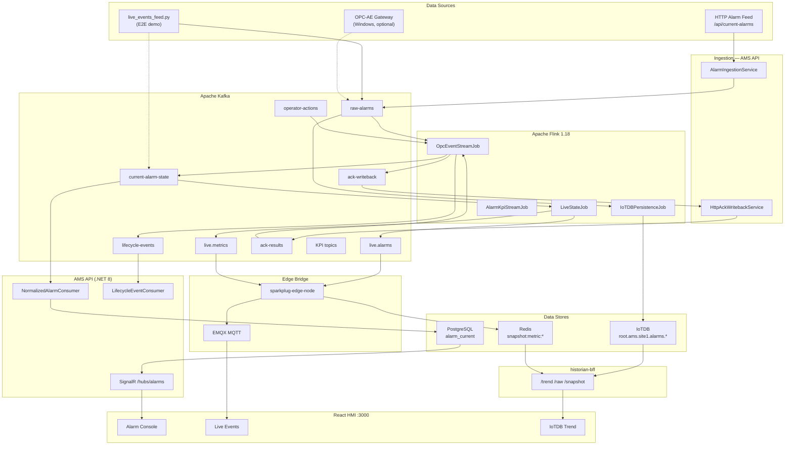
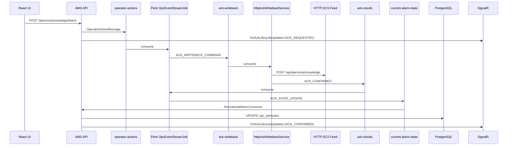

# AMS Complete Project Workflow

> End-to-end reference for the Alarm Management System (AMS): architecture, data flows, technologies, services, and databases.
>
> **Last verified against codebase:** June 2026  
> **Primary runtime stack:** Docker Compose (`infra/docker/docker-compose.yml`)  
> **HMI entry point:** `http://localhost:3000`

---

## Table of Contents

1. [Executive Summary](#1-executive-summary)
2. [Technology Stack](#2-technology-stack)
3. [System Architecture](#3-system-architecture)
4. [Pipeline A — DCS / HTTP Feed → PostgreSQL → SignalR](#4-pipeline-a--dcs--http-feed--postgresql--signalr)
5. [Pipeline B — Edge Live → MQTT → Historian](#5-pipeline-b--edge-live--mqtt--historian)
6. [Kafka Topic Catalog](#6-kafka-topic-catalog)
7. [Flink Stream Processing](#7-flink-stream-processing)
8. [Data Stores](#8-data-stores)
9. [Backend (.NET API)](#9-backend-net-api)
10. [Edge Services](#10-edge-services)
11. [Frontend (React HMI)](#11-frontend-react-hmi)
12. [Operator ACK Lifecycle](#12-operator-ack-lifecycle)
13. [Infrastructure & Docker Compose](#13-infrastructure--docker-compose)
14. [Observability](#14-observability)
15. [Legacy vs Current Pipeline](#15-legacy-vs-current-pipeline)
16. [Key File Index](#16-key-file-index)
17. [Appendices](#17-appendices)

---

## 1. Executive Summary

AMS is an industrial **Alarm Management System** built around **event-driven stream processing**. Two complementary data paths serve different HMI needs:

| Path | Purpose | Primary UI |
|------|---------|------------|
| **Pipeline A** | Authoritative OPC/HTTP alarm state, operator ACK, alarm console | `/alarms` (SignalR + REST) |
| **Pipeline B** | Low-latency live metrics, Sparkplug B MQTT, IoTDB historian | `/live-events`, `/trend`, `/edge` |

### Design principle

> **Kafka + Flink own alarm state orchestration. The API is a projection layer — it does not directly write ACK state to SQL on operator action.**

Flink writes to **Kafka** (and **IoTDB** via a dedicated persistence job). **PostgreSQL** is updated exclusively by API background consumers. **Redis** holds MQTT metric snapshots. **IoTDB** holds time-series alarm history for trend charts.

### Pipeline A — production alarm path

```
HTTP Alarm Feed (DCS/SCADA)
    ↓ poll (2s)
AMS API — AlarmIngestionService
    ↓ publish
Kafka: raw-alarms
    ↓ consume
Flink: OpcEventStreamJob (state machine)
    ↓ publish
Kafka: current-alarm-state | lifecycle-events | ack-writeback | root-cause-events
    ↓ consume
AMS API — Kafka consumer services
    ↓ upsert/delete
PostgreSQL: alarms.alarm_current
    ↓ REST + SignalR
React UI — Alarm Console, Dashboard
```

### Pipeline B — edge live path

```
raw-alarms (or current-alarm-state in fast mode)
    ↓
Flink: OpcEventStreamJob → current-alarm-state
    ↓
Flink: LiveStateJob (Report-by-Exception)
    ↓ publish
Kafka: live.alarms | live.metrics
    ↓ consume
sparkplug-edge-node (Java)
    ↓ Sparkplug B DDATA + Redis snapshots
EMQX MQTT broker
    ↓ WebSocket /mqtt-ws
React UI — mqttStore, Live Events MQTT tab

Parallel historian branch:
raw-alarms → Flink: IoTDBPersistenceJob → Apache IoTDB
    ↓ REST v2
historian-bff (.NET) → /trend, /raw, /snapshot
    ↓ nginx /api/hist
React UI — IoTDB Trend Viewer
```

### What runs where

| Component | Location | Role |
|-----------|----------|------|
| HTTP ingest | `src/backend/AMS.Api` | Polls external alarm feed, publishes deltas to `raw-alarms` |
| Stream processing | `src/flink` | Alarm state machine, live RBE, IoTDB persistence, KPIs |
| Projection & API | `src/backend` | Kafka consumers → PostgreSQL → REST + SignalR |
| Operator UI | `src/frontend-ob` | React 18 + OpenBridge, Zustand, AG Grid, SignalR, MQTT |
| Sparkplug bridge | `src/services/sparkplug-edge-node` | Kafka → Sparkplug B → EMQX + Redis |
| Historian BFF | `src/services/historian-bff` | IoTDB REST + Redis snapshot API |
| Standalone (optional) | `src/services/audit-service`, `notification-service` | Not in Docker Compose |
| Database scripts | `database/` | TimescaleDB/PostgreSQL schema |
| Infrastructure | `infra/` | Docker Compose, Helm, Windows OPC gateway docs |

---

## 2. Technology Stack

### Languages & runtimes

| Layer | Technology | Version (Compose) |
|-------|------------|-------------------|
| Backend API | C# / .NET | 8 |
| Stream processing | Java | 11 (Flink 1.18.1) |
| Edge bridge | Java | 11 (Sparkplug Tahu) |
| Historian BFF | C# / .NET | 8 Minimal API |
| Frontend | TypeScript / React | 18, Vite 5 |
| E2E scripts | Python | 3.x |

### Data & messaging

| System | Image / package | Role |
|--------|-----------------|------|
| **Apache Kafka** | Confluent 7.5.3 | Event bus, compacted alarm state |
| **Apache Zookeeper** | Confluent 7.5.3 | Kafka coordination |
| **Apache Flink** | 1.18.1-java11 | Stateful stream jobs, RocksDB checkpoints |
| **PostgreSQL + TimescaleDB** | timescale/timescaledb pg15 | Active alarms, history, config, analytics |
| **Apache IoTDB** | 1.3.2-standalone | Time-series alarm historian |
| **Redis** | 7.2-alpine | MQTT metric snapshot cache |
| **EMQX** | 5.6.0 | MQTT broker (Sparkplug B) |

### Frontend libraries

| Library | Use |
|---------|-----|
| `@microsoft/signalr` | Live alarm hub (`/hubs/alarms`) |
| `mqtt` | Sparkplug B over WebSocket (`/mqtt-ws`) |
| `zustand` + `immer` | `alarmStore`, `mqttStore` |
| `ag-grid-react` | Alarm Console grid |
| `@oicl/openbridge-webcomponents` | OpenBridge design system |
| `echarts` / `d3` | Analytics & trend charts |
| `@tanstack/react-query` | REST caching |

### Protocols

| Protocol | Where |
|----------|-------|
| HTTP/JSON | DCS feed, REST API, Historian BFF |
| WebSocket | SignalR, MQTT-over-WS (via nginx) |
| Sparkplug B | EMQX topics `spBv1.0/ams_site1/...` |
| Kafka binary | Internal Docker network `kafka:9092` |

---

## 3. System Architecture

### 3.1 Dual-pipeline overview



### 3.2 Design constraints

- **Flink-only orchestration** is enforced at startup (`Program.cs`). `Kafka:UseFlinkOrchestration` must be `true`; `LabDirectIngest` must be `false`.
- **No Flink JDBC sinks to PostgreSQL** — Flink writes to Kafka and IoTDB only. PostgreSQL is updated by API consumers.
- **At-least-once** delivery to PostgreSQL with **idempotent upserts** keyed on `serverId + sourceName + conditionName + subConditionName`.
- **IoTDB writes** are idempotent on `(device path, timestamp)`; Flink `IoTDBPersistenceJob` uses at-least-once checkpoints.
- **MQTT live path** uses Report-by-Exception (RBE) in `LiveStateJob` to minimize payload size.

### 3.3 UI route map

| Route | Data source | Description |
|-------|-------------|-------------|
| `/dashboard` | SignalR + REST stats | KPI overview |
| `/alarms` | SignalR + REST active alarms | Operator alarm console (AG Grid) |
| `/live-events` | SignalR SOE + MQTT Sparkplug | Real-time event streams |
| `/trend` | Historian BFF → IoTDB | Alarm trend charts & raw table |
| `/historical` | REST historical queries | Archived alarm search |
| `/analytics` | REST + KPI SignalR | Analytics dashboards |
| `/edge` | Historian BFF health + Redis | Edge node monitor |
| `/system` | Pipeline health API | Kafka/Flink/SignalR status |
| `/admin/*` | REST | Alarm feed config, OPC connections |

---

## 4. Pipeline A — DCS / HTTP Feed → PostgreSQL → SignalR

### 4.1 Primary ingest: HTTP alarm feed

**Service:** `AlarmIngestionService`  
**File:** `src/backend/AMS.Api/BackgroundServices/AlarmIngestionService.cs`

| Setting | Default | Description |
|---------|---------|-------------|
| `AlarmIngestion:Enabled` | `true` | Enable/disable polling |
| `AlarmIngestion:FeedUrl` | `http://192.168.1.51:8010/api/current-alarms` | External alarm snapshot API |
| `AlarmIngestion:PollIntervalMs` | `2000` | Poll every 2 seconds |
| `AlarmIngestion:ServerId` | `f0af9a6d-85f6-4c9f-a8ad-6de277d1d110` | Fixed server identity for HTTP feed |
| `AlarmIngestion:AckWritebackUrl` | `.../api/alarms/acknowledge` | HTTP endpoint for ACK writeback |

**Process:**

1. Poll HTTP feed for current alarm list (JSON array).
2. Compare each alarm against an in-memory snapshot (`ConcurrentDictionary`).
3. Publish **only deltas** (new alarm, state change, clear) to Kafka topic **`raw-alarms`**.
4. Message key = `alarmId` (feed correlation id, e.g. `BB26-BF402|Alarm high`).

### 4.2 ACK writeback ingest

**Service:** `HttpAckWritebackService`

| Direction | Topic | Action |
|-----------|-------|--------|
| Consume | `ack-writeback` | Receives ACK command from Flink |
| HTTP POST | `AckWritebackUrl` | Writes ACK to external DCS/SCADA |
| Produce | `ack-results` | Publishes `ACK_CONFIRMED` or `ACK_FAILED` |

### 4.3 Telemetry watchdog

**Service:** `TelemetryDeadmanWatchdogService`

- Monitors `raw-alarms` topic for message activity.
- If no messages within threshold → publishes `TELEMETRY_STALLED` to **`lifecycle-alerts`**.

### 4.4 OPC-AE gateway (external, optional)

Documented in `infra/windows/opc-gateway-deploy.md`. A Windows x86 service connects to OPC-AE servers and publishes to Kafka external listener (`localhost:9093`) on topic **`raw-alarms`**.

### 4.5 PostgreSQL projection

**Consumer:** `NormalizedAlarmConsumerService` → `NormalizedAlarmIngestor`

| Kafka topic | PostgreSQL action | SignalR |
|-------------|-------------------|---------|
| `current-alarm-state` UPSERT | Insert/update `alarms.alarm_current` | `OnNewAlarm`, `OnAlarmUpdated` |
| `current-alarm-state` DELETE | Delete from `alarm_current` | `OnAlarmCleared` |
| `lifecycle-events` | Update ACK lifecycle fields | `OnAckLifecycleUpdated` |

**Matching key:** `serverId + sourceName + conditionName + subConditionName` (not `activeTime`).

---

## 5. Pipeline B — Edge Live → MQTT → Historian

### 5.1 LiveStateJob — Report-by-Exception

**Entry class:** `com.ams.flink.LiveStateJob`  
**Auto-submitted:** `infra/docker/flink-submit-live-state.sh`

| Source | Sink | Purpose |
|--------|------|---------|
| `current-alarm-state` | `live.alarms` | Full alarm envelope for HMI list |
| `current-alarm-state` | `live.metrics` | Lightweight numeric metrics for widgets |

**Logic:** Keyed by `alarmId`; Flink `ValueState` holds last published snapshot. Only changed fields are forwarded (RBE). Checkpointing: 30s AT_LEAST_ONCE.

### 5.2 sparkplug-edge-node — Kafka → MQTT

**Path:** `src/services/sparkplug-edge-node`  
**Container:** `ams-sparkplug-edge-node`

| Input | Output |
|-------|--------|
| Kafka `live.alarms`, `live.metrics` | EMQX Sparkplug B topics |
| — | Redis snapshot keys |

**Sparkplug topic pattern:**

```
spBv1.0/ams_site1/NDATA/ams_edge1/{deviceId}
spBv1.0/ams_site1/DDATA/ams_edge1/{deviceId}
```

**Device ID:** Sanitised `sourceName` (not Kafka `alarmId`). The `alarmId` metric is published on DBIRTH/DDATA so the HMI can map MQTT device → IoTDB path.

**Redis keys:**

```
snapshot:metric:ams_site1:ams_edge1:{device}:{metricName}  → JSON {v,q,ts}
alias:ams_site1:ams_edge1                                   → Hash {alias: name}
```

### 5.3 IoTDBPersistenceJob — raw alarm historian

**Entry class:** `com.ams.flink.IoTDBPersistenceJob`  
**Auto-submitted:** `infra/docker/flink-submit-iotdb-persistence.sh`

| Source | Sink |
|--------|------|
| `raw-alarms` | Apache IoTDB |

**Tree path:** `root.ams.site1.alarms.{sanitised_alarmId}`  
**Measurements:** `severity`, `state`, `ack_status`, `condition_active`, `priority`, `source_name`, `condition_name`

> **Important:** IoTDB device paths use **Kafka alarmId** (e.g. `LIVE-04281e-03` → `LIVE_04281e_03`). MQTT device ids use **sanitised sourceName**. Use the `alarmId` Sparkplug metric or `resolveHistorianPathForLiveAlarm()` in the frontend to link them.

### 5.4 historian-bff — query facade

**Path:** `src/services/historian-bff`  
**Container:** `ams-historian-bff` — port **8090**

| Endpoint | Backend | Purpose |
|----------|---------|---------|
| `GET /health` | IoTDB + Redis ping | Health check |
| `GET /series?prefix=` | IoTDB `SHOW TIMESERIES` | Discover alarm device paths |
| `GET /trend?series=&start=&end=&width=` | IoTDB REST v2 | Decimated chart points |
| `GET /raw?series=&start=&end=&maxCount=&offset=` | IoTDB REST v2 | Paginated raw records |
| `GET /snapshot?assets=` | Redis | Current metric values |

**Frontend proxy:** nginx strips `/api/hist/` → `historian-bff:8090`

### 5.5 E2E live demo feeder

**Script:** `scripts/e2e-edge/live_events_feed.py`

| Mode | Path | IoTDB writes |
|------|------|--------------|
| `full` (default) | `raw-alarms` → full Flink chain → MQTT | Yes |
| `fast` | `current-alarm-state` → LiveStateJob → MQTT | Indirect (via existing raw path) |
| `mqtt` | Direct `live.alarms` → edge node → MQTT | **No** |

```powershell
python scripts/e2e-edge/live_events_feed.py --mode full --interval 3
```

---

## 6. Kafka Topic Catalog

Topics are provisioned by `scripts/kafka-reset-lab-topics.ps1`.

### 6.1 Core alarm pipeline (Docker Compose)

| Topic | Cleanup | Producer | Consumer(s) |
|-------|---------|----------|-------------|
| **`raw-alarms`** | delete | `AlarmIngestionService`, E2E feeder | Flink `OpcEventStreamJob`, `IoTDBPersistenceJob`, deadman watchdog |
| **`current-alarm-state`** | **compact** | Flink `OpcEventStreamJob` | `NormalizedAlarmConsumerService`, `LiveStateJob` |
| **`live.alarms`** | delete | Flink `LiveStateJob`, E2E feeder (`mqtt` mode) | `sparkplug-edge-node` |
| **`live.metrics`** | delete | Flink `LiveStateJob` | `sparkplug-edge-node` |
| **`operator-actions`** | delete | `OperatorActionPublisher` | Flink `OpcEventStreamJob` |
| **`ack-writeback`** | delete | Flink `OpcEventStreamJob` | `HttpAckWritebackService` |
| **`ack-results`** | delete | `HttpAckWritebackService` | Flink `OpcEventStreamJob` |
| **`lifecycle-events`** | delete | Flink `OpcEventStreamJob` | `LifecycleEventConsumerService`, `AlarmKpiStreamJob` |
| **`root-cause-events`** | delete | Flink `OpcEventStreamJob` | `notification-service` (optional) |
| **`lifecycle-alerts`** | — | `TelemetryDeadmanWatchdogService` | *(none wired)* |

### 6.2 KPI & observability (optional jobs)

| Topic | Producer | Consumer |
|-------|----------|----------|
| `loop-raw-data` | External / future | Flink `LoopKpiStreamJob` |
| `loop-kpis-5m` | Flink `LoopKpiStreamJob` | `KpiConsumerService` |
| `kpi-alarm-rates` | Flink `AlarmKpiStreamJob` | `KpiConsumerService` |
| `kpi-standing-snapshots` | Flink `AlarmKpiStreamJob` | `KpiConsumerService` |
| `flink.state.alarm.delta` | Flink `AlarmStateExportJob` | `AlarmStateDeltaConsumerService` |
| `system.state.drift.alerts` | Flink `StateDriftDetectionJob` | `DriftAlertConsumerService` |

### 6.3 Complete flow map

```
PRODUCERS                          TOPIC                         CONSUMERS
─────────                          ─────                         ─────────
AlarmIngestionService         →    raw-alarms                →   OpcEventStreamJob
                                                              →   IoTDBPersistenceJob → IoTDB
                                                              →   TelemetryDeadmanWatchdog

OpcEventStreamJob             →    current-alarm-state       →   NormalizedAlarmConsumer → PostgreSQL
                                                              →   LiveStateJob

LiveStateJob                  →    live.alarms               →   sparkplug-edge-node → EMQX → HMI
                              →    live.metrics              →   sparkplug-edge-node

OperatorActionPublisher       →    operator-actions          →   OpcEventStreamJob
OpcEventStreamJob             →    ack-writeback             →   HttpAckWritebackService
HttpAckWritebackService       →    ack-results               →   OpcEventStreamJob
```

### 6.4 Legacy topics (removed on reset)

```
raw-opc-events, alarm-created, alarm-updated, alarm-cleared, opc-ack, ...
```

---

## 7. Flink Stream Processing

**Module:** `src/flink` (Maven, Flink 1.18.1, Java 11)  
**JAR:** `ams-flink-1.0-SNAPSHOT.jar`  
**State backend:** RocksDB, incremental checkpoints to `flink-checkpoints` volume

### 7.1 Auto-submitted jobs (Docker Compose)

| Job | Submit script | Entry class |
|-----|---------------|-------------|
| Alarm state machine | `flink-submit-raw-alarms.sh` | `OpcEventStreamJob` |
| Live RBE | `flink-submit-live-state.sh` | `LiveStateJob` |
| IoTDB historian | `flink-submit-iotdb-persistence.sh` | `IoTDBPersistenceJob` |

### 7.2 OpcEventStreamJob — Primary Alarm State Machine

**Subscriptions:** `raw-alarms`, `operator-actions`, `ack-results`

**Pipeline (simplified):**

```
raw-alarms → ValidationMap → DedupFilter → EnrichmentMap → LifecycleMap
          → projection → current-alarm-state (UPSERT/DELETE)
          → lifecycle-events
          → root-cause-events (optional)
          → ack-writeback (from operator-actions)

ack-results → ACK_STATE_UPDATE → current-alarm-state
           → lifecycle-events (ACK_CONFIRMED/FAILED)
```

**Priority mapping:** CRITICAL≥900, HIGH≥700, MEDIUM≥400, LOW≥100

### 7.3 LiveStateJob

See [Section 5.1](#51-livestatejob--report-by-exception).

### 7.4 IoTDBPersistenceJob

See [Section 5.3](#53-iotdbpersistencejob--raw-alarm-historian).

### 7.5 Optional jobs (manual submit via `scripts/lib/AmsFlinkJob.ps1`)

| Job | Source | Sink |
|-----|--------|------|
| `AlarmKpiStreamJob` | `lifecycle-events` | `kpi-alarm-rates`, `kpi-standing-snapshots` |
| `LoopKpiStreamJob` | `loop-raw-data` | `loop-kpis-5m` |
| `StateDriftDetectionJob` | `alarm.events.raw` + `alarm.state.active` | `system.state.drift.alerts` |
| `AlarmStateExportJob` | `current-alarm-state` | `flink.state.alarm.delta` |
| `AlarmReplayEngine` | `alarm.events.raw` (seek) | `flink.state.alarm.replay` |

---

## 8. Data Stores

### 8.1 PostgreSQL / TimescaleDB

**Container:** `ams-postgres` — host port **5433**  
**Bootstrap:** `database/scripts/` → `/docker-entrypoint-initdb.d`

| Schema | Purpose |
|--------|---------|
| `alarms` | `alarm_current`, `alarm_history`, `alarm_state_transitions`, `active_alarms` (EF) |
| `configuration` | `opc_connections`, OPC server registry |
| `soe` | Sequence-of-events |
| `analytics` | KPI aggregates |
| `audit`, `security`, `notifications` | Supporting domains |

**Primary runtime table:**

```sql
-- alarms.alarm_current (simplified lab schema)
CREATE TABLE alarms.alarm_current (
    id              UUID PRIMARY KEY,
    alarm_id        VARCHAR(255) NOT NULL UNIQUE,
    source          VARCHAR(1024) NOT NULL,
    severity        INTEGER NOT NULL,
    message         TEXT,
    condition       VARCHAR(512),
    sub_condition   VARCHAR(512),
    event_time      TIMESTAMPTZ(3) NOT NULL,
    state           VARCHAR(64) NOT NULL,
    ack_status      BOOLEAN NOT NULL DEFAULT FALSE,
    opc_attributes  JSONB NOT NULL DEFAULT '{}',
    last_updated    TIMESTAMPTZ(3) NOT NULL
);
```

**EF mapping:** `AmsDbContext.ActiveAlarms` → runtime queries use this table.

### 8.2 Apache IoTDB

**Container:** `ams-iotdb`

| Port | API |
|------|-----|
| 6667 | Session (native) |
| 8181 | REST v2 (used by historian-bff, Flink connector) |
| 9091 | Metrics |

**Namespace:** `root.ams.site1.alarms.*`  
**Init:** `iotdb-init` one-shot container sets TTL via `iotdb-init-ttl.sh`

### 8.3 Redis

**Container:** `ams-redis` — host port **6380**

| Key pattern | Content |
|-------------|---------|
| `snapshot:metric:ams_site1:ams_edge1:{device}:{metric}` | Latest Sparkplug metric JSON |
| `alias:ams_site1:ams_edge1` | Metric alias registry |

**Persistence:** AOF enabled, 200MB max memory, LRU eviction.

---

## 9. Backend (.NET API)

**Container:** `ams-api` — port **8000**  
**Structure:** Clean architecture — `AMS.Api`, `AMS.Application`, `AMS.Domain`, `AMS.Infrastructure`

### 9.1 Kafka consumer matrix

| Service | Topic(s) | PostgreSQL | SignalR |
|---------|----------|------------|---------|
| `NormalizedAlarmConsumerService` | `current-alarm-state` | `alarm_current` upsert/delete | Alarm events |
| `LifecycleEventConsumerService` | `lifecycle-events` | ACK lifecycle fields | `OnAckLifecycleUpdated` |
| `HttpAckWritebackService` | `ack-writeback` | — (HTTP to DCS) | — |
| `KpiConsumerService` | KPI topics | — | KPI/analytics events |
| `AlarmStateDeltaConsumerService` | `flink.state.alarm.delta` | — | ObservabilityHub |
| `ReplayResultConsumerService` | `flink.state.alarm.replay` | — | ObservabilityHub |
| `DriftAlertConsumerService` | `system.state.drift.alerts` | — | ObservabilityHub |

### 9.2 Key REST endpoints

| Method | Path | Purpose |
|--------|------|---------|
| GET | `/api/v1/alarms/active` | Paginated active alarms |
| GET | `/api/v1/alarms/active/statistics` | KPI counts |
| POST | `/api/v1/alarms/acknowledge/batch` | Operator ACK → `operator-actions` |
| POST | `/api/v1/alarms/{id}/shelve` | Shelve command |
| GET | `/api/v1/admin/alarm-feed` | Connected feed status |
| GET | `/health`, `/health/pipeline` | Health & pipeline status |

### 9.3 SignalR hub

**URL:** `/hubs/alarms` (WebSocket via nginx)

| Event | Trigger |
|-------|---------|
| `OnNewAlarm` | New active alarm in PostgreSQL |
| `OnAlarmUpdated` | State/severity change |
| `OnAlarmCleared` | Alarm removed |
| `OnAckLifecycleUpdated` | ACK command lifecycle |
| `OnFloodAlert` | Flood detection |
| `OnAnalyticsUpdate` | KPI refresh |
| `OnSoeEvent` | Sequence of events |

---

## 10. Edge Services

### 10.1 In Docker Compose

| Service | Path | Language | Role |
|---------|------|----------|------|
| `sparkplug-edge-node` | `src/services/sparkplug-edge-node` | Java | Kafka → Sparkplug B → EMQX + Redis |
| `historian-bff` | `src/services/historian-bff` | .NET 8 | IoTDB + Redis query API |

### 10.2 Standalone (not in Compose)

| Service | Path | Consumes | Output |
|---------|------|----------|--------|
| `audit-service` | `src/services/audit-service` | `audit-events` | PostgreSQL hash-chain audit |
| `notification-service` | `src/services/notification-service` | `root-cause-events` | Email / Teams |

### 10.3 opc-connector

**Status:** Stub only. Real OPC connectivity is via external Windows OPC Gateway or HTTP feed.

---

## 11. Frontend (React HMI)

**Path:** `src/frontend-ob`  
**Container:** `ams-frontend` — port **3000** (nginx)

### 11.1 nginx reverse proxy

| Path | Target |
|------|--------|
| `/api/` | `ams-api:8000` |
| `/hubs/` | `ams-api:8000` (WebSocket upgrade) |
| `/api/hist/` | `historian-bff:8090` |
| `/mqtt-ws` | `emqx:8083` (MQTT WebSocket) |
| `/external-api/` | External DCS feed (dev) |

### 11.2 State management

| Store | File | Data source |
|-------|------|-------------|
| `alarmStore` | `store/alarmStore.ts` | SignalR + REST `/alarms/active` |
| `mqttStore` | `store/mqttStore.ts` | MQTT Sparkplug + historian BFF |

**Alarm Console hydration:**

```
App mount → alarmStore.initialize()
  → GET /api/v1/admin/alarm-feed
  → GET /api/v1/alarms/active (paginated)
  → SignalR connect /hubs/alarms
  → SubscribeToServer(serverId)
Fallback poll every 30s only when SignalR disconnected
```

**Live Events (MQTT tab):**

```
mqttStore.connect() → WebSocket /mqtt-ws
  → subscribe spBv1.0/ams_site1/DDATA/ams_edge1/#
  → parse Sparkplug metrics → live alarm list
```

**IoTDB Trend Viewer:**

```
GET /api/hist/series?prefix=root.ams.site1.alarms.**
GET /api/hist/trend?series=&start=&end=&width=200
GET /api/hist/raw?series=&start=&end=&maxCount=50&offset=
```

### 11.3 Key UI pages

| Page | Component | Grid / chart |
|------|-----------|--------------|
| Alarm Console | `AlarmConsole.tsx` | AG Grid, incremental transactions |
| Live Events | `LiveEventsPage.tsx` | SignalR SOE + `MqttLiveStream` |
| IoTDB Trend | `IoTDBTrendViewer.tsx` | ECharts + paginated raw table |
| Edge Monitor | `EdgeNodeMonitor.tsx` | BFF/Redis/IoTDB health |
| Dashboard | `Dashboard.tsx` | KPI cards from `alarmStore` |

---

## 12. Operator ACK Lifecycle

### 12.1 State machine

```
ACK_REQUESTED → ACK_QUEUED → ACK_DISPATCHED → ACK_PENDING_DCS → ACK_CONFIRMED
                                                              ↘ ACK_FAILED
                                                              ↘ ACK_TIMEOUT
```

### 12.2 Sequence



### 12.3 Key rules

- API **never** sets `acknowledged=true` in SQL on POST acknowledge.
- Flink emits `ACK_STATE_UPDATE` with `conditionActive` omitted so cleared alarms are not resurrected.
- HTTP feed ACK uses `ackPath: "http"`; OPC-AE ACK requires `cookieOffset > 0`.

---

## 13. Infrastructure & Docker Compose

**File:** `infra/docker/docker-compose.yml`  
**Network:** `ams-backend` bridge

### 13.1 All services

| Service | Image / build | Host port | Role |
|---------|---------------|-----------|------|
| `postgres` | timescale/timescaledb pg15 | 5433 | Primary RDBMS |
| `pgadmin` | dpage/pgadmin4 | 5050 | DB admin UI |
| `iotdb` | apache/iotdb:1.3.2 | 6667, 8181, 9091 | Time-series historian |
| `iotdb-init` | one-shot | — | TTL setup |
| `redis` | redis:7.2-alpine | 6380 | Snapshot cache |
| `emqx` | emqx:5.6.0 | 1883, 8083, 18083 | MQTT broker |
| `zookeeper` | cp-zookeeper:7.5.3 | internal | Kafka coordination |
| `kafka` | cp-kafka:7.5.3 | 9093 | Event bus |
| `kafka-ui` | provectuslabs/kafka-ui | 8085 | Topic browser |
| `flink-jobmanager` | flink:1.18.1 | 8082, 9249 | Flink UI + metrics |
| `flink-taskmanager` | flink:1.18.1 | internal | 16 task slots |
| `flink-job-submit` | one-shot | — | Submit OpcEventStreamJob |
| `flink-job-submit-live-state` | one-shot | — | Submit LiveStateJob |
| `flink-job-submit-iotdb` | one-shot | — | Submit IoTDBPersistenceJob |
| `ams-api` | build backend | 8000 | .NET API + consumers |
| `ams-frontend` | build frontend-ob | 3000 | React HMI (nginx) |
| `sparkplug-edge-node` | build Java | internal | Kafka → MQTT bridge |
| `historian-bff` | build .NET | 8090 | IoTDB/Redis BFF |
| `prometheus` | prom/prometheus | 9090 | Metrics collection |
| `grafana` | grafana/grafana | 3001 | Dashboards |
| `redis-exporter` | oliver006/redis_exporter | 9121 | Redis metrics |
| `postgres-exporter` | postgres-exporter | 9187 | PG metrics |
| `kafka-exporter` | kafka-exporter | 9308 | Kafka metrics |

### 13.2 Kafka broker (lab)

- Auto-create topics: enabled
- Default partitions: 4
- Retention: 24 hours (Compose)
- Listeners: INTERNAL `kafka:9092`, EXTERNAL `:9093`

### 13.3 Flink deployment

- JAR volume-mounted into JobManager
- RocksDB state backend, 60s EXACTLY_ONCE checkpoints (OpcEventStreamJob)
- Prometheus reporter on `:9249`

### 13.4 Startup

```powershell
# Full lab stack
.\scripts\start-ams-production.ps1
# → builds Flink JAR, starts Compose, resets Kafka topics, submits Flink jobs
```

### 13.5 Kubernetes / Helm (production target)

**Path:** `infra/helm/ams/` — umbrella chart with API, Flink, Bitnami Kafka/PostgreSQL/Redis.

---

## 14. Observability

| Tool | Port | Scrapes |
|------|------|---------|
| Prometheus | 9090 | Flink :9249, redis-exporter, postgres-exporter, kafka-exporter |
| Grafana | 3001 | Prometheus datasource (auto-provisioned) |
| Kafka UI | 8085 | Topic inspection |
| Flink UI | 8082 | Job status, checkpoints |
| EMQX Dashboard | 18083 | MQTT clients, topics |
| API `/health/pipeline` | 8000 | End-to-end pipeline health JSON |

**Frontend monitors:** `/system` (SystemMonitor), `/edge` (EdgeNodeMonitor + historian BFF health).

---

## 15. Legacy vs Current Pipeline

| Aspect | Legacy | Current |
|--------|--------|---------|
| Ingest topic | `raw-opc-events` | `raw-alarms` |
| Per-event topics | `alarm-created`, `alarm-updated` | Single `current-alarm-state` projection |
| Live HMI | SignalR only | SignalR + MQTT Sparkplug + IoTDB trends |
| Historian | PostgreSQL history only | IoTDB time-series + PostgreSQL active state |
| Flink JDBC to PG | Referenced in old docs | Not implemented |
| ACK topics | `opc-ack` | `operator-actions` → `ack-writeback` → `ack-results` |

---

## 16. Key File Index

### Ingestion & API

| File | Purpose |
|------|---------|
| `src/backend/AMS.Api/BackgroundServices/AlarmIngestionService.cs` | HTTP → `raw-alarms` |
| `src/backend/AMS.Api/BackgroundServices/HttpAckWritebackService.cs` | ACK writeback loop |
| `src/backend/AMS.Infrastructure/Kafka/NormalizedAlarmIngestor.cs` | PostgreSQL projection |
| `src/backend/AMS.Api/Hubs/AlarmsHub.cs` | SignalR hub |

### Flink

| File | Purpose |
|------|---------|
| `src/flink/.../OpcEventStreamJob.java` | Main alarm state machine |
| `src/flink/.../LiveStateJob.java` | RBE → `live.alarms` / `live.metrics` |
| `src/flink/.../IoTDBPersistenceJob.java` | `raw-alarms` → IoTDB |
| `src/flink/.../PipelineOperators.java` | Validation, dedup, lifecycle |

### Edge & historian

| File | Purpose |
|------|---------|
| `src/services/sparkplug-edge-node/.../AlarmMetricPublisher.java` | Kafka → Sparkplug + Redis |
| `src/services/historian-bff/Program.cs` | BFF endpoints |
| `src/services/historian-bff/IoTDbClient.cs` | IoTDB REST client |

### Frontend

| File | Purpose |
|------|---------|
| `src/frontend-ob/src/store/alarmStore.ts` | SignalR + REST alarm state |
| `src/frontend-ob/src/store/mqttStore.ts` | MQTT + historian fetch |
| `src/frontend-ob/src/components/AlarmConsole/AlarmConsole.tsx` | Operator grid |
| `src/frontend-ob/src/components/LiveEvents/MqttLiveStream.tsx` | MQTT alarm list |
| `src/frontend-ob/src/components/IoTDBTrend/IoTDBTrendViewer.tsx` | Trend viewer |
| `src/frontend-ob/src/utils/iotdbPaths.ts` | IoTDB path helpers |
| `src/frontend-ob/nginx.conf` | API/hist/MQTT proxy |

### Infrastructure

| File | Purpose |
|------|---------|
| `infra/docker/docker-compose.yml` | Full lab stack |
| `infra/docker/flink-submit-raw-alarms.sh` | Submit OpcEventStreamJob |
| `infra/docker/flink-submit-live-state.sh` | Submit LiveStateJob |
| `infra/docker/flink-submit-iotdb-persistence.sh` | Submit IoTDBPersistenceJob |
| `scripts/e2e-edge/live_events_feed.py` | Live demo feeder |
| `scripts/kafka-reset-lab-topics.ps1` | Topic provisioning |

### Related docs

| File | Purpose |
|------|---------|
| `docs/ams-alarm-architecture.md` | Original architecture (partially legacy) |
| `docs/flink-only-orchestration.md` | Flink ownership rules |
| `docs/production-contracts.md` | Formal stream contracts |

---

## 17. Appendices

### Appendix A: Port reference

| Service | Port |
|---------|------|
| Frontend (HMI) | 3000 |
| Grafana | 3001 |
| API | 8000 |
| Historian BFF | 8090 |
| PostgreSQL | 5433 |
| Redis | 6380 |
| Kafka (external) | 9093 |
| Kafka UI | 8085 |
| Flink UI | 8082 |
| Flink metrics | 9249 |
| IoTDB REST | 8181 |
| IoTDB session | 6667 |
| EMQX MQTT | 1883 |
| EMQX WebSocket | 8083 |
| EMQX Dashboard | 18083 |
| Prometheus | 9090 |
| pgAdmin | 5050 |

### Appendix B: Consumer group reference

| Group ID | Service / Job |
|----------|---------------|
| `flink-ams-raw-alarms` | Flink OpcEventStreamJob |
| `flink-ams-live-state` | Flink LiveStateJob |
| `flink-ams-iotdb-persistence` | Flink IoTDBPersistenceJob |
| `flink-ams-operator-actions` | Flink OpcEventStreamJob |
| `flink-ams-ack-results` | Flink OpcEventStreamJob |
| `ams-sparkplug-edge-node` | sparkplug-edge-node |
| `ams-backend` / `ams-backend-2` | NormalizedAlarmConsumerService |
| `ams-backend-lifecycle` | LifecycleEventConsumerService |
| `ams-backend-http-ack-writeback` | HttpAckWritebackService |

### Appendix C: Environment variables (frontend Docker build)

| Variable | Default | Purpose |
|----------|---------|---------|
| `VITE_SIGNALR_HUB_URL` | `/hubs/alarms` | SignalR hub |
| `VITE_MQTT_WS_URL` | `/mqtt-ws` | MQTT WebSocket proxy |
| `VITE_HIST_URL` | `/api/hist` | Historian BFF |
| `VITE_SNAPSHOT_URL` | `/api/hist/snapshot` | Redis snapshots |
| `VITE_SPARKPLUG_GROUP` | `ams_site1` | Sparkplug group id |
| `VITE_SPARKPLUG_EDGE` | `ams_edge1` | Sparkplug edge node id |
