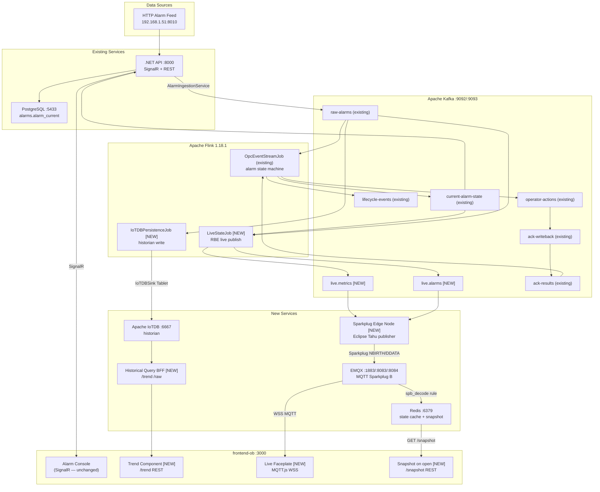

# Edge Platform Implementation Plan
## Traverse Edge — IoTDB + MQTT Sparkplug B Integration

> **Based on:** `Traverse-Edge-Platform-Specification.md` + existing `docs/complete-project-workflow.md`  
> **Date:** June 2026  
> **Author:** Platform Engineering

---

## 1. Executive Gap Analysis

### 1.1 What we already have (working)

| Component | Status | Notes |
|-----------|--------|-------|
| Apache Kafka | ✅ Running | 19 production topics, Confluent 7.5.3 |
| Apache Flink 1.18.1 | ✅ Running | `OpcEventStreamJob` auto-submitted |
| HTTP Alarm Ingest | ✅ Running | Polls `192.168.1.51:8010` → `raw-alarms` |
| PostgreSQL/TimescaleDB | ✅ Running | `alarm_current`, `alarm_history`, `opc_connections` |
| .NET API + SignalR | ✅ Running | `current-alarm-state` → DB → SignalR |
| React UI (OpenBridge) | ✅ Running | SignalR live alarms, REST queries |
| Alarm ACK lifecycle | ✅ Running | `operator-actions` → Flink → `ack-writeback` → DCS |

### 1.2 What is NOT yet built (gap against spec)

| Component | Spec Section | Status |
|-----------|-------------|--------|
| **Apache IoTDB** (historian) | §6, §8.1 | ❌ Not in docker-compose |
| **flink-iotdb-connector** | §8.1 | ❌ Not in pom.xml |
| **Flink IoTDB persistence job** | §5 (Core job 1) | ❌ No job exists |
| **Flink live-state job** (`live.metrics`, `live.alarms`) | §5 (Core job 2) | ❌ No job exists |
| **EMQX MQTT broker** | §8.4 | ❌ Not in docker-compose |
| **Sparkplug Edge Node publisher** | §8.3 | ❌ No service exists |
| **Redis state cache** (snapshot-on-open) | §8.5 | ❌ Not in docker-compose |
| **Historical Query BFF** (`/trend`, `/raw`) | §8.7 | ❌ No service exists |
| **Kafka topics** (`live.metrics`, `live.alarms`) | §8.2 | ❌ Not provisioned |
| **Frontend MQTT.js + sparkplug-payload** | §8.6 | ❌ Not in package.json |
| **Frontend snapshot-on-open** | §8.5/8.6 | ❌ No `/snapshot` call |
| **Frontend trend queries** (`/trend`) | §8.7 | ❌ No BFF integration |

### 1.3 Two data streams — mapping to existing pipeline

```
STREAM 1 — HISTORICAL (pull, IoTDB)
  raw-alarms
    ↓ [NEW] Flink IoTDBPersistenceJob
  Apache IoTDB (root.ams.site1.alarms.<alarm_id>.*)
    ↓ [NEW] Historical Query BFF
  GET /trend?series=&start=&end=&width=
    ↓
  frontend-ob trend component

STREAM 2 — LIVE (push, MQTT Sparkplug B)
  raw-alarms → [existing] OpcEventStreamJob → current-alarm-state
    ↓ [NEW] Flink LiveStateJob → live.alarms, live.metrics
    ↓ [NEW] Sparkplug Edge Node (Eclipse Tahu)
  EMQX MQTT broker (spBv1.0/ams_site1/DDATA/edge1/*)
    ↓ [NEW] Redis state cache (snapshot + alias registry)
    ↓
  frontend-ob (MQTT.js WSS + sparkplug-payload)
```

---

## 2. Architecture Diagram (Target State)



---

## 3. Phase-by-Phase Implementation Plan

---

### PHASE 0 — Infrastructure Bootstrap

**Goal:** Pull all new images, add to Docker Compose, provision new Kafka topics. No business logic yet. Verify connectivity.

**Estimated effort:** 1–2 days

---

#### Step 0.1 — Add volumes and network entries

Edit `infra/docker/docker-compose.yml` — add to the top-level `volumes:` block:

```yaml
iotdb-data:
iotdb-logs:
iotdb-ext:
redis-data:
emqx-data:
emqx-log:
```

---

#### Step 0.2 — Add Apache IoTDB (standalone single-node)

Add this service to `docker-compose.yml` after the `postgres` service:

```yaml
  iotdb:
    image: apache/iotdb:1.3.2-standalone
    container_name: ams-iotdb
    restart: unless-stopped
    deploy:
      resources:
        limits:
          cpus: '1.00'
          memory: 2048M
    environment:
      # Auto-create schema so Flink sink does not need pre-registration
      enable_auto_create_schema: "true"
      # Storage group default TTL — keep all data (alarm historian)
      default_ttl_in_ms: "-1"
      # JVM heap
      IOTDB_HEAP_SIZE: "1G"
    volumes:
      - iotdb-data:/iotdb/data
      - iotdb-logs:/iotdb/logs
      - iotdb-ext:/iotdb/ext
    ports:
      - "6667:6667"    # Thrift / Session API
      - "8181:8181"    # REST API v2
      - "9091:9091"    # Metrics (Prometheus)
    networks:
      - ams-backend
    healthcheck:
      test: ["CMD", "bash", "-c", "echo | nc -w2 localhost 6667"]
      interval: 20s
      timeout: 10s
      retries: 10
      start_period: 120s
```

**Verify:**
```powershell
docker exec -it ams-iotdb /iotdb/sbin/start-cli.sh -h localhost -p 6667 -u root -pw root
# Run: show databases;
```

---

#### Step 0.3 — Add Redis (state cache)

```yaml
  redis:
    image: redis:7.2-alpine
    container_name: ams-redis
    restart: unless-stopped
    deploy:
      resources:
        limits:
          cpus: '0.25'
          memory: 256M
    command: redis-server --save 60 1 --appendonly yes
    volumes:
      - redis-data:/data
    ports:
      - "6379:6379"
    networks:
      - ams-backend
    healthcheck:
      test: ["CMD", "redis-cli", "ping"]
      interval: 10s
      timeout: 5s
      retries: 5
```

---

#### Step 0.4 — Add EMQX MQTT Broker

```yaml
  emqx:
    image: emqx/emqx:5.6.0
    container_name: ams-emqx
    restart: unless-stopped
    deploy:
      resources:
        limits:
          cpus: '0.50'
          memory: 512M
    environment:
      EMQX_NAME: ams-emqx
      EMQX_HOST: 127.0.0.1
      # Allow anonymous connections for dev (tighten in production)
      EMQX_LISTENERS__TCP__DEFAULT__BIND: "0.0.0.0:1883"
      EMQX_LISTENERS__WS__DEFAULT__BIND: "0.0.0.0:8083"
      EMQX_LISTENERS__WSS__DEFAULT__BIND: "0.0.0.0:8084"
      EMQX_ALLOW_ANONYMOUS: "true"
    volumes:
      - emqx-data:/opt/emqx/data
      - emqx-log:/opt/emqx/log
    ports:
      - "1883:1883"    # MQTT TCP
      - "8083:8083"    # MQTT over WebSocket
      - "8084:8084"    # MQTT over WebSocket (TLS — prod)
      - "18083:18083"  # EMQX Dashboard UI
    networks:
      - ams-backend
    healthcheck:
      test: ["CMD", "/opt/emqx/bin/emqx", "ctl", "status"]
      interval: 20s
      timeout: 10s
      retries: 5
      start_period: 60s
```

**EMQX Dashboard:** http://localhost:18083 (admin / public)

---

#### Step 0.5 — Add new Kafka topics to provisioning script

Edit `scripts/kafka-reset-lab-topics.ps1` — add these entries to `$allowedTopics`:

```powershell
# Live state (Report-By-Exception, Flink → Sparkplug Edge Node)
@{ Name = "live.metrics"; Partitions = 8; Config = "retention.ms=$retentionMs,cleanup.policy=delete,compression.type=lz4" },
@{ Name = "live.alarms";  Partitions = 4; Config = "retention.ms=$retentionMs,cleanup.policy=delete,compression.type=lz4" },

# Raw telemetry (harmonised samples if StreamPipes is added later)
@{ Name = "raw.telemetry.site1"; Partitions = 16; Config = "retention.ms=$retentionMs,cleanup.policy=delete,compression.type=lz4" },
```

**Validation checklist for Phase 0:**
- [ ] `docker compose up iotdb redis emqx` — all healthy
- [ ] IoTDB CLI connects: `show databases;` returns OK
- [ ] Redis `PING` returns `PONG`
- [ ] EMQX Dashboard accessible at `:18083`
- [ ] Kafka topics `live.metrics`, `live.alarms` created by reset script
- [ ] Existing stack (`ams-api`, Flink, Postgres) still works after compose file changes

---

### PHASE 1 — Flink → IoTDB (Historical Write Path)

**Goal:** Every alarm event that flows through `raw-alarms` → Flink gets persisted as a time-series record in IoTDB. This is the **historical stream**.

**Estimated effort:** 3–5 days

---

#### Step 1.1 — Add flink-iotdb-connector to pom.xml

Edit `src/flink/pom.xml` — add inside `<dependencies>`:

```xml
<!-- IoTDB Flink connector — spec §8.1 -->
<dependency>
    <groupId>org.apache.iotdb</groupId>
    <artifactId>flink-iotdb-connector</artifactId>
    <version>2.0.3</version>
</dependency>
<!-- IoTDB session (pulled transitively but listed explicitly for version lock) -->
<dependency>
    <groupId>org.apache.iotdb</groupId>
    <artifactId>iotdb-session</artifactId>
    <version>1.3.2</version>
</dependency>
```

> **Note:** `flink-iotdb-connector 2.0.3` is built for IoTDB 1.x series. Ensure the IoTDB server image version matches (`apache/iotdb:1.3.2-standalone`).

---

#### Step 1.2 — Define IoTDB namespace (tree model)

Per spec §7, the tree path convention is:

```
root.<site>.<area>.<unit>.<device>.<measurement>
```

For our alarm data:

```
root.ams.site1.alarms.<alarm_id>.severity
root.ams.site1.alarms.<alarm_id>.state         # TEXT: ACTIVE / CLEARED
root.ams.site1.alarms.<alarm_id>.ack_status    # BOOLEAN
root.ams.site1.alarms.<alarm_id>.condition_active
root.ams.site1.alarms.<alarm_id>.priority      # TEXT
root.ams.site1.alarms.<alarm_id>.event_time_ms # INT64
```

For loop/process tag telemetry (future StreamPipes path):

```
root.ams.site1.<area>.<unit>.<tag_id>.pv
root.ams.site1.<area>.<unit>.<tag_id>.sp
root.ams.site1.<area>.<unit>.<tag_id>.op
root.ams.site1.<area>.<unit>.<tag_id>.mode
```

---

#### Step 1.3 — Create IoTDBPersistenceJob.java

Create file: `src/flink/src/main/java/com/ams/flink/IoTDBPersistenceJob.java`

```java
package com.ams.flink;

import org.apache.flink.api.common.eventtime.WatermarkStrategy;
import org.apache.flink.connector.kafka.source.KafkaSource;
import org.apache.flink.connector.kafka.source.enumerator.initializer.OffsetsInitializer;
import org.apache.flink.streaming.api.CheckpointingMode;
import org.apache.flink.streaming.api.datastream.DataStream;
import org.apache.flink.streaming.api.environment.StreamExecutionEnvironment;
import org.apache.iotdb.flink.IoTDBSink;
import org.apache.iotdb.flink.IoTDBSinkOptions;
import org.apache.iotdb.flink.DefaultIoTSerializationSchema;
import org.apache.flink.api.common.serialization.SimpleStringSchema;
import org.apache.flink.shaded.jackson2.com.fasterxml.jackson.databind.JsonNode;
import org.apache.flink.shaded.jackson2.com.fasterxml.jackson.databind.ObjectMapper;

/**
 * Flink job: raw-alarms → IoTDB time-series historian.
 *
 * IoTDB tree path: root.ams.site1.alarms.<alarm_id>.<measurement>
 *
 * Implements the "Persistence job" from spec §5 Core jobs (1).
 * At-least-once with idempotency via (series, timestamp) overwrite in IoTDB.
 */
public class IoTDBPersistenceJob {
    private static final ObjectMapper MAPPER = new ObjectMapper();
    private static final String IOTDB_PATH_PREFIX = "root.ams.site1.alarms.";

    public static void main(String[] args) throws Exception {
        PipelineConfig cfg = PipelineConfig.fromArgs(args);
        StreamExecutionEnvironment env = StreamExecutionEnvironment.getExecutionEnvironment();

        // At-least-once is sufficient — IoTDB (series, ts) writes are idempotent
        env.enableCheckpointing(60_000, CheckpointingMode.AT_LEAST_ONCE);
        env.getCheckpointConfig().setMinPauseBetweenCheckpoints(20_000);

        KafkaSource<String> rawSource = KafkaSource.<String>builder()
                .setBootstrapServers(cfg.brokers)
                .setTopics("raw-alarms")
                .setGroupId("flink-ams-iotdb-persistence")
                .setStartingOffsets(OffsetsInitializer.earliest())
                .setValueOnlyDeserializer(new SimpleStringSchema())
                .build();

        DataStream<String> rawStream = env
                .fromSource(rawSource, WatermarkStrategy.noWatermarks(), "raw-alarms-iotdb-source");

        // Parse → filter nulls → map to IoTDB Tablet rows → write
        rawStream
            .map(IoTDBPersistenceJob::toIoTDBRow)
            .filter(row -> row != null)
            .addSink(buildIoTDBSink(cfg))
            .name("iotdb-alarm-sink");

        env.execute("AMS - IoTDB Alarm Persistence");
    }

    /**
     * Maps a raw-alarms JSON string to an IoTDBRow (custom DTO for the sink).
     * Returns null for unparseable events.
     */
    private static IoTDBAlarmRow toIoTDBRow(String json) {
        try {
            JsonNode node = MAPPER.readTree(json);
            String source = AlarmJson.text(node, "sourceName", "sourcePath");
            String condition = AlarmJson.text(node, "conditionName", "condition");
            if (source.isEmpty() || condition.isEmpty()) return null;

            String alarmId = AlarmJson.text(node, "alarmId", null);
            if (alarmId.isEmpty()) {
                String serverId = AlarmJson.text(node, "serverId", "opcServer");
                alarmId = AlarmKeys.stableAlarmId(
                        AlarmKeys.alarmKey(serverId, source, condition, ""));
            }
            // Sanitize alarmId for IoTDB path (no dots, no spaces)
            String safePath = alarmId.replaceAll("[^a-zA-Z0-9_-]", "_");

            long ts = AlarmJson.field(node, "eventTimeEpochMs", "activeTimeEpochMs").asLong(System.currentTimeMillis());
            int severity = node.has("severity") ? node.get("severity").asInt(0) : 0;
            String state = AlarmJson.text(node, "state", "lifecycleState");
            if (state.isEmpty()) {
                boolean active = !node.has("conditionActive") || node.get("conditionActive").asBoolean(true);
                state = active ? "ACTIVE" : "CLEARED";
            }
            boolean ackStatus = node.has("acknowledged") && node.get("acknowledged").asBoolean();
            boolean conditionActive = !node.has("conditionActive") || node.get("conditionActive").asBoolean(true);
            String priority = AlarmJson.text(node, "priority", null);

            return new IoTDBAlarmRow(
                IOTDB_PATH_PREFIX + safePath,
                ts, severity, state, ackStatus, conditionActive, priority, source, condition
            );
        } catch (Exception e) {
            return null;
        }
    }

    private static IoTDBSink<IoTDBAlarmRow> buildIoTDBSink(PipelineConfig cfg) {
        IoTDBSinkOptions options = new IoTDBSinkOptions();
        options.setHost(cfg.iotdbHost);          // env: IOTDB_HOST (default: iotdb)
        options.setPort(cfg.iotdbPort);          // env: IOTDB_PORT (default: 6667)
        options.setUser("root");
        options.setPassword("root");

        // Batch writes: commit every 1000 rows or 5 seconds
        return IoTDBSink.<IoTDBAlarmRow>builder()
                .withOptions(options)
                .withSerializationSchema(new AlarmIoTSerializationSchema())
                .withBatchSize(1000)
                .build();
    }
}
```

> **Note:** `IoTDBAlarmRow`, `AlarmIoTSerializationSchema` are small helper classes to be created alongside this job (see Step 1.4).

---

#### Step 1.4 — Create IoTDBAlarmRow.java and AlarmIoTSerializationSchema.java

**`IoTDBAlarmRow.java`** — DTO for one alarm measurement row:

```java
package com.ams.flink;

public class IoTDBAlarmRow {
    public final String devicePath;   // e.g. root.ams.site1.alarms.abc123
    public final long   timestampMs;
    public final int    severity;
    public final String state;
    public final boolean ackStatus;
    public final boolean conditionActive;
    public final String priority;
    public final String sourceName;
    public final String conditionName;

    public IoTDBAlarmRow(String devicePath, long ts, int severity,
                         String state, boolean ack, boolean active,
                         String priority, String source, String condition) {
        this.devicePath      = devicePath;
        this.timestampMs     = ts;
        this.severity        = severity;
        this.state           = state == null ? "" : state;
        this.ackStatus       = ack;
        this.conditionActive = active;
        this.priority        = priority == null ? "" : priority;
        this.sourceName      = source;
        this.conditionName   = condition;
    }
}
```

**`AlarmIoTSerializationSchema.java`** — maps row → IoTDB Tablet:

```java
package com.ams.flink;

import org.apache.iotdb.flink.IoTSerializationSchema;
import org.apache.iotdb.tsfile.file.metadata.enums.TSDataType;
import org.apache.iotdb.tsfile.write.record.Tablet;
import org.apache.iotdb.tsfile.write.schema.MeasurementSchema;
import java.util.Arrays;
import java.util.List;

public class AlarmIoTSerializationSchema implements IoTSerializationSchema<IoTDBAlarmRow> {

    private static final List<MeasurementSchema> SCHEMA = Arrays.asList(
        new MeasurementSchema("severity",         TSDataType.INT32),
        new MeasurementSchema("state",            TSDataType.TEXT),
        new MeasurementSchema("ack_status",       TSDataType.BOOLEAN),
        new MeasurementSchema("condition_active", TSDataType.BOOLEAN),
        new MeasurementSchema("priority",         TSDataType.TEXT),
        new MeasurementSchema("source_name",      TSDataType.TEXT),
        new MeasurementSchema("condition_name",   TSDataType.TEXT)
    );

    @Override
    public Tablet serialize(IoTDBAlarmRow row) {
        Tablet tablet = new Tablet(row.devicePath, SCHEMA, 1);
        int idx = tablet.rowSize++;
        tablet.addTimestamp(idx, row.timestampMs);
        tablet.addValue("severity",         idx, row.severity);
        tablet.addValue("state",            idx, row.state);
        tablet.addValue("ack_status",       idx, row.ackStatus);
        tablet.addValue("condition_active", idx, row.conditionActive);
        tablet.addValue("priority",         idx, row.priority);
        tablet.addValue("source_name",      idx, row.sourceName);
        tablet.addValue("condition_name",   idx, row.conditionName);
        return tablet;
    }
}
```

---

#### Step 1.5 — Add IoTDB env vars to Flink in docker-compose

In both `flink-jobmanager` and `flink-taskmanager` environment blocks, add:

```yaml
      IOTDB_HOST: iotdb
      IOTDB_PORT: "6667"
      IOTDB_USER: root
      IOTDB_PASS: root
```

Also add `iotdb` to `depends_on` for `flink-jobmanager`:

```yaml
    depends_on:
      kafka:
        condition: service_healthy
      iotdb:
        condition: service_healthy
```

---

#### Step 1.6 — Add IoTDBPersistenceJob to PipelineConfig.java

Edit `PipelineConfig.java` to add IoTDB config fields:

```java
public String iotdbHost = "iotdb";
public int    iotdbPort = 6667;
public String iotdbUser = "root";
public String iotdbPass = "root";
```

Read from env in `fromArgs()`:
```java
cfg.iotdbHost = System.getenv().getOrDefault("IOTDB_HOST", "iotdb");
cfg.iotdbPort = Integer.parseInt(System.getenv().getOrDefault("IOTDB_PORT", "6667"));
```

---

#### Step 1.7 — Create flink submit script for IoTDB job

Create `infra/docker/flink-submit-iotdb-persistence.sh`:

```bash
#!/bin/bash
set -e
JOBMANAGER="${FLINK_JOBMANAGER_HOST:-ams-flink-jobmanager}:${FLINK_JOBMANAGER_PORT:-8081}"

echo "[IoTDB] Waiting for Flink JobManager..."
until curl -sf "http://${JOBMANAGER}/overview" > /dev/null 2>&1; do sleep 3; done

echo "[IoTDB] Waiting for IoTDB..."
until nc -z "${IOTDB_HOST:-iotdb}" "${IOTDB_PORT:-6667}" 2>/dev/null; do sleep 3; done

echo "[IoTDB] Submitting IoTDBPersistenceJob..."
flink run \
  -m "http://${JOBMANAGER}" \
  -c com.ams.flink.IoTDBPersistenceJob \
  "${FLINK_JAR_PATH:-/opt/flink/usrlib/ams-flink-1.0-SNAPSHOT.jar}" \
  --bootstrap.servers "${KAFKA_BROKERS:-kafka:9092}" \
  --iotdb.host "${IOTDB_HOST:-iotdb}" \
  --iotdb.port "${IOTDB_PORT:-6667}"

echo "[IoTDB] Job submitted."
```

Add a `flink-job-submit-iotdb` service to `docker-compose.yml`:

```yaml
  flink-job-submit-iotdb:
    image: flink:1.18.1-java11
    container_name: ams-flink-submit-iotdb
    depends_on:
      flink-jobmanager:
        condition: service_started
      flink-taskmanager:
        condition: service_started
      kafka:
        condition: service_healthy
      iotdb:
        condition: service_healthy
    entrypoint: ["/bin/bash", "/opt/flink-submit-iotdb-persistence.sh"]
    environment:
      FLINK_JOBMANAGER_HOST:  ams-flink-jobmanager
      FLINK_JOBMANAGER_PORT:  "8081"
      KAFKA_BROKERS:          kafka:9092
      IOTDB_HOST:             iotdb
      IOTDB_PORT:             "6667"
      FLINK_JAR_PATH:         /opt/flink/usrlib/ams-flink-1.0-SNAPSHOT.jar
    volumes:
      - ./flink-submit-iotdb-persistence.sh:/opt/flink-submit-iotdb-persistence.sh:ro
      - ../../src/flink/target/ams-flink-1.0-SNAPSHOT.jar:/opt/flink/usrlib/ams-flink-1.0-SNAPSHOT.jar:ro
    networks:
      - ams-backend
    restart: "no"
```

**Build and validate Phase 1:**
```powershell
# Build Flink JAR with new IoTDB dependency
cd src/flink
mvn clean package -DskipTests

# Start stack
cd infra/docker
docker compose up -d iotdb
docker compose up -d flink-job-submit-iotdb

# Verify data in IoTDB
docker exec -it ams-iotdb /iotdb/sbin/start-cli.sh -h localhost -p 6667 -u root -pw root
# IoTDB> show devices root.ams.site1.alarms.*;
# IoTDB> select severity, state from root.ams.site1.alarms.* limit 5;
```

**Phase 1 validation checklist:**
- [ ] `mvn package` succeeds with IoTDB connector on classpath
- [ ] `IoTDBPersistenceJob` submits and shows RUNNING in Flink UI (`:8082`)
- [ ] Data appears in IoTDB under `root.ams.site1.alarms.*`
- [ ] No duplicate rows on Flink checkpoint restore (idempotency test)
- [ ] `show timeseries root.ams.site1.alarms.*;` returns all 7 measurements per alarm

---

### PHASE 2 — Flink Live-State Job (Kafka live.alarms + live.metrics)

**Goal:** A new Flink job consumes `current-alarm-state` (already produced by `OpcEventStreamJob`) and republishes as report-by-exception (RBE) to `live.alarms` and `live.metrics`. These topics feed the Sparkplug Edge Node.

**Estimated effort:** 2–3 days

---

#### Step 2.1 — Create LiveStateJob.java

Create: `src/flink/src/main/java/com/ams/flink/LiveStateJob.java`

```java
package com.ams.flink;

import org.apache.flink.api.common.eventtime.WatermarkStrategy;
import org.apache.flink.api.common.state.ValueState;
import org.apache.flink.api.common.state.ValueStateDescriptor;
import org.apache.flink.api.common.functions.RichMapFunction;
import org.apache.flink.configuration.Configuration;
import org.apache.flink.connector.kafka.sink.KafkaSink;
import org.apache.flink.connector.kafka.source.KafkaSource;
import org.apache.flink.connector.kafka.source.enumerator.initializer.OffsetsInitializer;
import org.apache.flink.streaming.api.CheckpointingMode;
import org.apache.flink.streaming.api.environment.StreamExecutionEnvironment;
import org.apache.flink.api.common.serialization.SimpleStringSchema;
import org.apache.flink.shaded.jackson2.com.fasterxml.jackson.databind.JsonNode;
import org.apache.flink.shaded.jackson2.com.fasterxml.jackson.databind.ObjectMapper;
import org.apache.flink.shaded.jackson2.com.fasterxml.jackson.databind.node.ObjectNode;

/**
 * Flink job: current-alarm-state → live.alarms (RBE) + live.metrics (RBE).
 *
 * Report-by-exception (RBE): only publishes when value or state changes.
 * This bounds the MQTT volume per spec §8.2.
 *
 * live.alarms payload: { groupId, edgeNodeId, deviceId, metric, alias, ts, value, quality, dataType }
 * live.metrics payload: same structure for individual measurement metrics
 */
public class LiveStateJob {
    private static final ObjectMapper MAPPER = new ObjectMapper();

    public static void main(String[] args) throws Exception {
        PipelineConfig cfg = PipelineConfig.fromArgs(args);
        StreamExecutionEnvironment env = StreamExecutionEnvironment.getExecutionEnvironment();

        env.enableCheckpointing(30_000, CheckpointingMode.EXACTLY_ONCE);

        KafkaSource<String> casSource = KafkaSource.<String>builder()
                .setBootstrapServers(cfg.brokers)
                .setTopics("current-alarm-state")
                .setGroupId("flink-ams-live-state")
                .setStartingOffsets(OffsetsInitializer.latest())
                .setValueOnlyDeserializer(new SimpleStringSchema())
                .build();

        KafkaSink<String> liveAlarmsSink  = kafkaSink(cfg.brokers, "live.alarms");
        KafkaSink<String> liveMetricsSink = kafkaSink(cfg.brokers, "live.metrics");

        var stream = env
                .fromSource(casSource, WatermarkStrategy.noWatermarks(), "current-alarm-state-live")
                .filter(s -> s != null && !s.isEmpty());

        // live.alarms — full alarm state, keyed by alarmId, RBE on state change
        stream
            .keyBy(s -> extractField(s, "alarmId"))
            .map(new RbeAlarmStateMap("live-alarms-rbe"))
            .filter(s -> s != null && !s.isEmpty())
            .sinkTo(liveAlarmsSink)
            .name("live-alarms-sink");

        // live.metrics — individual measurements (severity, ack_status) for faceplates
        stream
            .keyBy(s -> extractField(s, "alarmId"))
            .map(new RbeMetricsMap("live-metrics-rbe"))
            .filter(s -> s != null && !s.isEmpty())
            .sinkTo(liveMetricsSink)
            .name("live-metrics-sink");

        env.execute("AMS - Live State Publisher");
    }

    /** RBE filter: keyed by alarmId, emits only on state/value change. */
    public static class RbeAlarmStateMap extends RichMapFunction<String, String> {
        private final String name;
        private transient ValueState<String> lastState;

        public RbeAlarmStateMap(String name) { this.name = name; }

        @Override
        public void open(Configuration p) {
            lastState = getRuntimeContext().getState(
                new ValueStateDescriptor<>(name + "-last", String.class));
        }

        @Override
        public String map(String json) throws Exception {
            JsonNode node = MAPPER.readTree(json);
            String stateKey = extractStateKey(node);
            String prev = lastState.value();
            if (stateKey.equals(prev)) return "";      // no change — suppress
            lastState.update(stateKey);

            // Build Sparkplug-ready live.alarms envelope
            ObjectNode out = MAPPER.createObjectNode();
            out.put("groupId",    "ams_site1");
            out.put("edgeNodeId", "ams_edge1");
            out.put("deviceId",   AlarmJson.text(node, "sourceName", "source_name"));
            out.put("metric",     "alarm_state");
            out.put("ts",         node.has("eventTimeEpochMs")
                                  ? node.get("eventTimeEpochMs").asLong()
                                  : System.currentTimeMillis());
            out.put("alarmId",    AlarmJson.text(node, "alarmId", "alarm_id"));
            out.put("state",      AlarmJson.text(node, "eventType", "lifecycleState"));
            out.put("severity",   node.has("severity") ? node.get("severity").asInt(0) : 0);
            out.put("priority",   AlarmJson.text(node, "priority", ""));
            out.put("acknowledged", node.has("acknowledged") && node.get("acknowledged").asBoolean());
            out.put("conditionActive", !node.has("conditionActive") || node.get("conditionActive").asBoolean());
            out.put("quality",    192);
            out.put("dataType",   "alarm");
            return MAPPER.writeValueAsString(out);
        }

        private String extractStateKey(JsonNode node) {
            return AlarmJson.text(node, "eventType", "") + "|"
                 + AlarmJson.text(node, "priority",  "") + "|"
                 + (node.has("acknowledged") ? node.get("acknowledged").asBoolean() : false) + "|"
                 + (!node.has("conditionActive") || node.get("conditionActive").asBoolean());
        }
    }

    /** Emits per-measurement live.metrics records for individual tag/severity updates. */
    public static class RbeMetricsMap extends RichMapFunction<String, String> {
        private final String name;
        private transient ValueState<Integer> lastSeverity;

        public RbeMetricsMap(String name) { this.name = name; }

        @Override
        public void open(Configuration p) {
            lastSeverity = getRuntimeContext().getState(
                new ValueStateDescriptor<>(name + "-sev", Integer.class));
        }

        @Override
        public String map(String json) throws Exception {
            JsonNode node = MAPPER.readTree(json);
            int sev = node.has("severity") ? node.get("severity").asInt(0) : 0;
            Integer prev = lastSeverity.value();
            if (prev != null && prev == sev) return "";
            lastSeverity.update(sev);

            ObjectNode out = MAPPER.createObjectNode();
            out.put("groupId",    "ams_site1");
            out.put("edgeNodeId", "ams_edge1");
            out.put("deviceId",   AlarmJson.text(node, "sourceName", "source_name"));
            out.put("metric",     "severity");
            out.put("alias",      sev);   // alias = severity value for now; proper alias registry in Phase 3
            out.put("ts",         node.has("eventTimeEpochMs")
                                  ? node.get("eventTimeEpochMs").asLong()
                                  : System.currentTimeMillis());
            out.put("value",      sev);
            out.put("quality",    192);
            out.put("dataType",   "Int32");
            return MAPPER.writeValueAsString(out);
        }
    }

    private static String extractField(String json, String field) {
        try { return MAPPER.readTree(json).path(field).asText(""); }
        catch (Exception e) { return ""; }
    }

    private static KafkaSink<String> kafkaSink(String brokers, String topic) {
        return KafkaSink.<String>builder()
                .setBootstrapServers(brokers)
                .setRecordSerializer(
                    org.apache.flink.connector.kafka.sink.KafkaRecordSerializationSchema.builder()
                        .setTopic(topic)
                        .setValueSerializationSchema(new SimpleStringSchema())
                        .build())
                .build();
    }
}
```

---

#### Step 2.2 — Add LiveStateJob submit script

Create `infra/docker/flink-submit-live-state.sh`:

```bash
#!/bin/bash
JOBMANAGER="${FLINK_JOBMANAGER_HOST:-ams-flink-jobmanager}:${FLINK_JOBMANAGER_PORT:-8081}"
until curl -sf "http://${JOBMANAGER}/overview" > /dev/null 2>&1; do sleep 3; done

flink run \
  -m "http://${JOBMANAGER}" \
  -c com.ams.flink.LiveStateJob \
  "${FLINK_JAR_PATH:-/opt/flink/usrlib/ams-flink-1.0-SNAPSHOT.jar}" \
  --bootstrap.servers "${KAFKA_BROKERS:-kafka:9092}"

echo "[LiveState] Job submitted."
```

Add `flink-job-submit-live-state` service to `docker-compose.yml` (same pattern as IoTDB submit).

**Phase 2 validation checklist:**
- [ ] `LiveStateJob` RUNNING in Flink UI
- [ ] Messages appear in `live.alarms` topic (Kafka UI `:8085`)
- [ ] Messages appear in `live.metrics` topic
- [ ] Trigger an alarm change → single message in `live.alarms` within 2s
- [ ] No duplicate messages for unchanged alarms (RBE working)

---

### PHASE 3 — Sparkplug Edge Node Publisher

**Goal:** A new Java service consumes `live.alarms` and `live.metrics` from Kafka and publishes Sparkplug B to EMQX. This is the **real-time MQTT plane**.

**Estimated effort:** 4–6 days

---

#### Step 3.1 — Create service skeleton

Create directory structure:

```
src/services/sparkplug-edge-node/
  pom.xml
  src/main/java/com/ams/sparkplug/
    SparkplugEdgeNode.java       ← entry point
    AlarmMetricPublisher.java    ← Kafka consumer + Tahu publisher
    MetricAliasRegistry.java     ← alias → metric name mapping
    SparkplugConfig.java         ← config from env
  Dockerfile
```

---

#### Step 3.2 — pom.xml for sparkplug-edge-node

```xml
<?xml version="1.0" encoding="UTF-8"?>
<project xmlns="http://maven.apache.org/POM/4.0.0" ...>
  <groupId>com.ams</groupId>
  <artifactId>sparkplug-edge-node</artifactId>
  <version>1.0-SNAPSHOT</version>

  <dependencies>
    <!-- Eclipse Tahu — Sparkplug B client (spec §8.3) -->
    <dependency>
      <groupId>org.eclipse.tahu</groupId>
      <artifactId>tahu-core</artifactId>
      <version>1.0.7</version>
    </dependency>
    <!-- MQTT client (Paho) -->
    <dependency>
      <groupId>org.eclipse.paho</groupId>
      <artifactId>org.eclipse.paho.client.mqttv3</artifactId>
      <version>1.2.5</version>
    </dependency>
    <!-- Kafka consumer -->
    <dependency>
      <groupId>org.apache.kafka</groupId>
      <artifactId>kafka-clients</artifactId>
      <version>3.6.1</version>
    </dependency>
    <!-- JSON -->
    <dependency>
      <groupId>com.fasterxml.jackson.core</groupId>
      <artifactId>jackson-databind</artifactId>
      <version>2.15.3</version>
    </dependency>
    <!-- Redis (Jedis) for state cache push -->
    <dependency>
      <groupId>redis.clients</groupId>
      <artifactId>jedis</artifactId>
      <version>5.1.0</version>
    </dependency>
  </dependencies>
</project>
```

---

#### Step 3.3 — SparkplugEdgeNode.java (entry point)

The service:
1. Connects to EMQX via Paho MQTT client.
2. Publishes `NBIRTH` (node birth) + `DBIRTH` per device (alarm source) declaring all metrics with integer aliases.
3. Consumes `live.alarms` and `live.metrics` from Kafka.
4. On each message: publishes `DDATA` with **alias only** (not metric name) per Sparkplug spec §8.3.
5. On reconnect: republishes `NBIRTH`/`DBIRTH`.
6. Also writes current values to **Redis** for snapshot-on-open (Step 3.4).

```java
package com.ams.sparkplug;

/**
 * Sparkplug Edge Node publisher.
 * Spec §8.3 — thin Eclipse Tahu wrapper around a Kafka consumer.
 *
 * Topic pattern: spBv1.0/ams_site1/<VERB>/ams_edge1/<device_id>
 * Metrics registered on NBIRTH with integer alias for DDATA compression.
 *
 * Redis key pattern:
 *   snapshot:metric:<group>:<edge>:<device>:<metric>  → JSON {v, q, ts}
 *   alias:<group>:<edge>:<alias>                      → metric_name
 */
public class SparkplugEdgeNode {

    public static void main(String[] args) {
        SparkplugConfig cfg = SparkplugConfig.fromEnv();
        AlarmMetricPublisher publisher = new AlarmMetricPublisher(cfg);
        publisher.start();    // Blocks; handles reconnect, birth, DDATA loop
    }
}
```

Key implementation points for `AlarmMetricPublisher`:

| Step | Action | Tahu API |
|------|--------|----------|
| Connect | Paho `MqttClient.connect()` with Last-Will `NDEATH` | `MqttConnectOptions.setWill(...)` |
| NBIRTH | Publish node birth with `bdSeq` | `SparkplugBPayloadEncoder` |
| DBIRTH | Publish device birth per alarm source with metrics + aliases | One `DBIRTH` per unique `deviceId` |
| DDATA | Publish per Kafka message, alias only | `addMetric(alias, value)` |
| Reconnect | On `connectionLost` callback → re-issue NBIRTH + DBIRTH | Tahu birth builder |

**Sparkplug topic structure used:**

```
spBv1.0/ams_site1/NBIRTH/ams_edge1
spBv1.0/ams_site1/DBIRTH/ams_edge1/<sourceName>
spBv1.0/ams_site1/DDATA/ams_edge1/<sourceName>
spBv1.0/ams_site1/NDEATH/ams_edge1
```

---

#### Step 3.4 — Redis state cache writes (from Edge Node)

From inside `AlarmMetricPublisher`, after every `DDATA` publish:

```java
// Jedis pipeline for O(1) Redis writes
try (Jedis jedis = jedisPool.getResource()) {
    Pipeline pipe = jedis.pipelined();
    // Current value per metric
    pipe.setex(
        "snapshot:metric:" + groupId + ":" + edgeNodeId + ":" + deviceId + ":" + metricName,
        3600,    // 1h TTL — stale after 1h of no update
        "{\"v\":" + value + ",\"q\":" + quality + ",\"ts\":" + ts + "}"
    );
    // Alias registry (permanent — cleared only on NBIRTH)
    pipe.hset("alias:" + groupId + ":" + edgeNodeId, String.valueOf(alias), metricName);
    pipe.sync();
}
```

---

#### Step 3.5 — Dockerize sparkplug-edge-node

Create `src/services/sparkplug-edge-node/Dockerfile`:

```dockerfile
FROM maven:3.9-eclipse-temurin-11 AS build
WORKDIR /app
COPY pom.xml .
RUN mvn dependency:go-offline -q
COPY src ./src
RUN mvn package -DskipTests -q

FROM eclipse-temurin:11-jre-alpine
WORKDIR /app
COPY --from=build /app/target/sparkplug-edge-node-1.0-SNAPSHOT.jar app.jar
ENTRYPOINT ["java", "-jar", "app.jar"]
```

Add to `docker-compose.yml`:

```yaml
  sparkplug-edge-node:
    build:
      context: ../../src/services/sparkplug-edge-node
    container_name: ams-sparkplug-edge-node
    restart: unless-stopped
    depends_on:
      kafka:
        condition: service_healthy
      emqx:
        condition: service_healthy
      redis:
        condition: service_healthy
    deploy:
      resources:
        limits:
          cpus: '0.25'
          memory: 256M
    environment:
      KAFKA_BROKERS:     kafka:9092
      LIVE_ALARMS_TOPIC: live.alarms
      LIVE_METRICS_TOPIC: live.metrics
      MQTT_HOST:         emqx
      MQTT_PORT:         "1883"
      MQTT_CLIENT_ID:    ams-edge-node-1
      SPARKPLUG_GROUP:   ams_site1
      SPARKPLUG_EDGE:    ams_edge1
      REDIS_HOST:        redis
      REDIS_PORT:        "6379"
    networks:
      - ams-backend
```

**Phase 3 validation checklist:**
- [ ] `sparkplug-edge-node` container starts and stays healthy
- [ ] EMQX Dashboard shows edge node client connected
- [ ] Subscribe to `spBv1.0/ams_site1/#` in EMQX → receive `NBIRTH`
- [ ] Trigger alarm → `DDATA` message arrives in EMQX within 2s
- [ ] Redis key `snapshot:metric:ams_site1:ams_edge1:*` exists
- [ ] `redis-cli hgetall alias:ams_site1:ams_edge1` returns alias map

---

### PHASE 4 — Historical Query BFF

**Goal:** A thin REST service sits between the UI and IoTDB, providing `/trend` and `/raw` endpoints. This serves the **historical data stream** to the frontend.

**Estimated effort:** 3–4 days

---

#### Step 4.1 — Create service skeleton

```
src/services/historian-bff/
  Program.cs              ← .NET 8 Minimal API
  IoTDbClient.cs          ← IoTDB REST v2 wrapper
  TrendController.cs      ← /trend, /raw endpoints
  SnapshotController.cs   ← /snapshot endpoint (reads Redis)
  Dockerfile
  historian-bff.csproj
```

> Using **.NET 8 Minimal API** for consistency with the existing backend. IoTDB is accessed via its **REST API v2** (`http://iotdb:8181/rest/v2`) to avoid Java session API in .NET.

---

#### Step 4.2 — Endpoints specification

**GET `/trend`**

```
Query params:
  series=root.ams.site1.alarms.abc123   (repeatable)
  start=2026-06-01T00:00:00Z
  end=2026-06-25T00:00:00Z
  width=800                              (pixel width → decimation factor)
  measurements=severity,state,ack_status (optional filter)

Response:
{
  "series": "root.ams.site1.alarms.abc123",
  "points": [
    { "ts": 1719225600000, "severity": 700, "state": "ACTIVE", "ack_status": false },
    ...
  ]
}
```

IoTDB query issued by BFF:
```sql
SELECT avg(severity), last_value(state), last_value(ack_status)
FROM root.ams.site1.alarms.abc123
GROUP BY ([start, end), interval)
```

Interval is computed as `(end - start) / width` — so response is always ≤ `width` points.

**GET `/raw`**

```
Query params:
  series=...
  start=...
  end=...
  maxCount=5000

Response: same structure, raw (non-decimated) records
```

IoTDB query:
```sql
SELECT severity, state, ack_status, condition_name, source_name
FROM root.ams.site1.alarms.*
WHERE time >= start AND time < end
LIMIT maxCount
```

**GET `/snapshot`**

```
Query params:
  assets=BB26-BF402,TIC-101   (asset/source names)

Response (reads Redis, not IoTDB):
{
  "assets": {
    "BB26-BF402": {
      "alarm_state": { "v": "ACTIVE", "q": 192, "ts": 1719225600000 },
      "severity":    { "v": 700,      "q": 192, "ts": 1719225600000 }
    }
  }
}
```

---

#### Step 4.3 — IoTDB REST client (C#)

```csharp
public class IoTDbClient(HttpClient http, IConfiguration cfg)
{
    private readonly string _base = cfg["IoTDB:RestUrl"] ?? "http://iotdb:8181";

    public async Task<JsonElement> QueryAsync(string sql, CancellationToken ct = default)
    {
        // IoTDB REST v2 query endpoint
        var body = JsonSerializer.Serialize(new { sql });
        var resp = await http.PostAsync($"{_base}/rest/v2/query",
            new StringContent(body, Encoding.UTF8, "application/json"), ct);
        resp.EnsureSuccessStatusCode();
        return (await JsonSerializer.DeserializeAsync<JsonElement>(
            await resp.Content.ReadAsStreamAsync(ct), cancellationToken: ct));
    }

    public string BuildTrendSql(string series, DateTimeOffset start, DateTimeOffset end, int width)
    {
        long intervalMs = Math.Max(1, (end - start).Ticks / TimeSpan.TicksPerMillisecond / width);
        return $"SELECT avg(severity), last_value(state), last_value(ack_status) " +
               $"FROM {series} " +
               $"GROUP BY ([{start.ToUnixTimeMilliseconds()},{end.ToUnixTimeMilliseconds()}), {intervalMs}ms)";
    }
}
```

---

#### Step 4.4 — Add historian-bff to docker-compose

```yaml
  historian-bff:
    build:
      context: ../../src/services/historian-bff
    container_name: ams-historian-bff
    restart: unless-stopped
    depends_on:
      iotdb:
        condition: service_healthy
      redis:
        condition: service_healthy
    deploy:
      resources:
        limits:
          cpus: '0.25'
          memory: 256M
    environment:
      ASPNETCORE_URLS:    http://0.0.0.0:8090
      IoTDB__RestUrl:     http://iotdb:8181
      Redis__Host:        redis
      Redis__Port:        "6379"
    ports:
      - "8090:8090"
    networks:
      - ams-backend
    healthcheck:
      test: ["CMD", "curl", "-f", "http://localhost:8090/health"]
      interval: 10s
      timeout: 5s
      retries: 5
```

Also add `/api/hist/` proxy to the nginx configuration:

```nginx
location /api/hist/ {
    proxy_pass http://historian-bff:8090/;
    proxy_http_version 1.1;
    proxy_set_header Host $host;
}
```

**Phase 4 validation checklist:**
- [ ] `historian-bff` container healthy
- [ ] `GET http://localhost:8090/trend?series=root.ams.site1.alarms.*&start=...&end=...&width=200` returns JSON
- [ ] `GET /snapshot?assets=BB26-BF402` returns current values from Redis
- [ ] Response for 1-year window with `width=800` returns ≤ 800 points (decimation working)

---

### PHASE 5 — Frontend MQTT Integration

**Goal:** `frontend-ob` connects to EMQX via MQTT.js over WebSocket, decodes Sparkplug B payloads, paints live faceplates and uses `/snapshot` on screen open. Historical trends call the BFF `/trend` endpoint.

**Estimated effort:** 4–6 days

---

#### Step 5.1 — Install frontend dependencies

```powershell
cd src/frontend-ob
npm install mqtt sparkplug-payload
npm install @types/mqtt --save-dev
```

- `mqtt` — MQTT.js WebSocket client
- `sparkplug-payload` — Sparkplug B protobuf decode/encode

---

#### Step 5.2 — Create MQTT store

Create: `src/frontend-ob/src/store/mqttStore.ts`

```typescript
import mqtt, { MqttClient } from 'mqtt';
import { create } from 'zustand';
import { immer } from 'zustand/middleware/immer';

// sparkplug-payload decoder
// @ts-ignore — no type defs
import * as SparkplugPayload from 'sparkplug-payload/lib/sparkplug-b';

const MQTT_WS_URL   = import.meta.env.VITE_MQTT_WS_URL   ?? 'ws://localhost:8083/mqtt';
const SNAPSHOT_URL  = import.meta.env.VITE_SNAPSHOT_URL  ?? '/api/hist/snapshot';
const SPARKPLUG_VER = 'spBv1.0';

/** Current metric value from MQTT/snapshot */
export interface LiveMetric {
  value:   number | string | boolean;
  quality: number;
  ts:      number;
}

interface MqttStoreState {
  connected:    boolean;
  metrics:      Map<string, LiveMetric>;   // key = "device/metric"
  aliasMap:     Map<number, string>;       // alias → metric name (from DBIRTH)
  subscribed:   Set<string>;               // currently subscribed topic patterns

  connect:    () => Promise<void>;
  disconnect: () => void;
  subscribeScreen:   (devices: string[]) => Promise<void>;
  unsubscribeScreen: (devices: string[]) => void;
  loadSnapshot: (assets: string[]) => Promise<void>;
}

export const useMqttStore = create<MqttStoreState>()(
  immer((set, get) => {
    let client: MqttClient | null = null;

    return {
      connected:  false,
      metrics:    new Map(),
      aliasMap:   new Map(),
      subscribed: new Set(),

      connect: async () => {
        if (client?.connected) return;
        client = mqtt.connect(MQTT_WS_URL, {
          clientId: `ams-hmi-${Math.random().toString(16).slice(2, 8)}`,
          clean: true,
          keepalive: 30,
          reconnectPeriod: 2000,
        });

        client.on('connect', () => {
          set(s => { s.connected = true; });
          // Resubscribe to NBIRTH/DBIRTH to rebuild alias map on reconnect
          client?.subscribe('spBv1.0/ams_site1/NBIRTH/#');
          client?.subscribe('spBv1.0/ams_site1/DBIRTH/#');
        });

        client.on('message', (topic, payload) => {
          handleSparkplugMessage(topic, payload, set, get);
        });

        client.on('offline', () => set(s => { s.connected = false; }));
      },

      disconnect: () => {
        client?.end();
        set(s => { s.connected = false; });
      },

      subscribeScreen: async (devices: string[]) => {
        if (!client?.connected) await get().connect();
        const topics = devices.map(d =>
          `${SPARKPLUG_VER}/ams_site1/DDATA/ams_edge1/${d}`);
        topics.forEach(t => {
          if (!get().subscribed.has(t)) {
            client?.subscribe(t, { qos: 0 });
            set(s => { s.subscribed.add(t); });
          }
        });
      },

      unsubscribeScreen: (devices: string[]) => {
        const topics = devices.map(d =>
          `${SPARKPLUG_VER}/ams_site1/DDATA/ams_edge1/${d}`);
        topics.forEach(t => {
          client?.unsubscribe(t);
          set(s => { s.subscribed.delete(t); });
        });
      },

      loadSnapshot: async (assets: string[]) => {
        const url = `${SNAPSHOT_URL}?assets=${assets.join(',')}`;
        const res = await fetch(url);
        if (!res.ok) return;
        const data = await res.json();
        set(s => {
          for (const [asset, metrics] of Object.entries(data.assets ?? {})) {
            for (const [metric, mv] of Object.entries(metrics as Record<string, LiveMetric>)) {
              s.metrics.set(`${asset}/${metric}`, mv as LiveMetric);
            }
          }
        });
      },
    };
  })
);

function handleSparkplugMessage(
  topic: string,
  payload: Buffer,
  set: any,
  get: () => MqttStoreState
) {
  try {
    const decoded = SparkplugPayload.decodePayload(payload);
    const parts   = topic.split('/');  // spBv1.0 / group / VERB / edge / device
    const verb    = parts[2];
    const device  = parts[4] ?? '';

    if (verb === 'DBIRTH' || verb === 'NBIRTH') {
      // Register alias → metric name from birth certificate
      set((s: MqttStoreState) => {
        for (const m of decoded.metrics ?? []) {
          if (m.alias !== undefined && m.name) {
            s.aliasMap.set(Number(m.alias), m.name);
          }
          // Seed initial values from DBIRTH
          if (m.name && m.value !== undefined) {
            s.metrics.set(`${device}/${m.name}`, {
              value: m.value, quality: m.properties?.quality?.value ?? 192,
              ts: Number(decoded.timestamp ?? Date.now())
            });
          }
        }
      });
    } else if (verb === 'DDATA') {
      set((s: MqttStoreState) => {
        const aliasMap = get().aliasMap;
        for (const m of decoded.metrics ?? []) {
          // Resolve metric name from alias (DDATA uses alias only)
          const name = m.name ?? aliasMap.get(Number(m.alias)) ?? `alias_${m.alias}`;
          s.metrics.set(`${device}/${name}`, {
            value: m.value,
            quality: m.properties?.quality?.value ?? 192,
            ts: Number(decoded.timestamp ?? Date.now())
          });
        }
      });
    }
  } catch {
    // silently skip malformed payloads
  }
}
```

---

#### Step 5.3 — Screen open pattern (snapshot + subscribe)

In any screen component that needs live data (e.g. a future process faceplate):

```typescript
import { useMqttStore } from '../../store/mqttStore';
import { useEffect } from 'react';

const SCREEN_DEVICES = ['BB26-BF402', 'TIC-101'];

export function ProcessFaceplate() {
  const { subscribeScreen, unsubscribeScreen, loadSnapshot, metrics } = useMqttStore();

  useEffect(() => {
    // 1. Paint immediately from cache (O(1))
    void loadSnapshot(SCREEN_DEVICES);
    // 2. Subscribe for live deltas
    void subscribeScreen(SCREEN_DEVICES);

    return () => {
      // Unsubscribe on navigation — bounds fan-out cost (spec §8.6)
      unsubscribeScreen(SCREEN_DEVICES);
    };
  }, []);

  const severity = metrics.get('BB26-BF402/severity');
  return (
    <obi-tag-value label="BB26-BF402 severity" value={severity?.value} />
  );
}
```

---

#### Step 5.4 — Trend component (calls BFF /trend)

```typescript
import { useQuery } from '@tanstack/react-query';

const TREND_URL = import.meta.env.VITE_TREND_URL ?? '/api/hist/trend';

function fetchTrend(series: string, start: Date, end: Date, width: number) {
  const params = new URLSearchParams({
    series, width: String(width),
    start: start.toISOString(),
    end:   end.toISOString(),
  });
  return fetch(`${TREND_URL}?${params}`).then(r => r.json());
}

export function AlarmTrend({ alarmId }: { alarmId: string }) {
  const series = `root.ams.site1.alarms.${alarmId.replaceAll(/[^a-zA-Z0-9_]/g, '_')}`;
  const end    = new Date();
  const start  = new Date(end.getTime() - 24 * 3600_000);   // last 24h

  const { data } = useQuery({
    queryKey: ['trend', series, start, end],
    queryFn:  () => fetchTrend(series, start, end, 800),
    staleTime: 60_000,
  });

  // Render with ECharts (already in use for Analytics.tsx)
  return <TrendChart data={data?.points ?? []} />;
}
```

---

#### Step 5.5 — Add MQTT proxy to Vite and nginx

**`vite.config.ts`** — add proxy entry:
```typescript
'/mqtt-ws': {
  target: 'ws://localhost:8083',
  ws: true,
  rewrite: path => path.replace(/^\/mqtt-ws/, '/mqtt'),
},
'/api/hist': {
  target: 'http://localhost:8090',
  rewrite: path => path.replace(/^\/api\/hist/, ''),
},
```

**`nginx.conf`** (production) — add:
```nginx
location /mqtt-ws/ {
    proxy_pass         http://emqx:8083/mqtt/;
    proxy_http_version 1.1;
    proxy_set_header   Upgrade $http_upgrade;
    proxy_set_header   Connection "upgrade";
}

location /api/hist/ {
    proxy_pass http://historian-bff:8090/;
}
```

**`.env` additions for frontend:**
```
VITE_MQTT_WS_URL=ws://localhost:8083/mqtt
VITE_SNAPSHOT_URL=/api/hist/snapshot
VITE_TREND_URL=/api/hist/trend
```

**Phase 5 validation checklist:**
- [ ] `npm run dev` — no errors from mqtt/sparkplug-payload imports
- [ ] Browser devtools WS tab shows MQTT WS connection to `:8083`
- [ ] `loadSnapshot` returns data from Redis for `BB26-BF402`
- [ ] Trigger alarm change → metric updates in component within 2s
- [ ] Navigate away → EMQX shows client unsubscribed from `DDATA` topics
- [ ] Trend component renders ECharts with IoTDB data from BFF

---

### PHASE 6 — Hardening and Observability

**Goal:** Production-ready security, monitoring, and HA configuration.

**Estimated effort:** 3–5 days

---

#### Step 6.1 — EMQX security (TLS + ACLs)

```yaml
# emqx.conf overrides
listeners.ssl.default.bind = "0.0.0.0:8084"
listeners.ssl.default.ssl_options.keyfile  = "/opt/emqx/certs/server.key"
listeners.ssl.default.ssl_options.certfile = "/opt/emqx/certs/server.crt"

# ACL: Sparkplug Edge Node can publish only to its group
authorization.sources = [{type = built_in_database}]
```

Per-client ACLs in EMQX Dashboard:
- `ams-edge-node-1`: publish `spBv1.0/ams_site1/#`, subscribe `spBv1.0/ams_site1/NCMD/ams_edge1/#`
- `ams-hmi-*`: subscribe `spBv1.0/ams_site1/+/ams_edge1/#`, deny publish

---

#### Step 6.2 — IoTDB production configuration

For production: move from standalone to **3C3D cluster** (spec §6):

```yaml
# Three ConfigNode containers (Ratis consensus, schema replica=3)
# Three DataNode containers (IoTConsensus, data replica=2)
# See IoTDB cluster docker-compose template in official docs
```

For lab: keep standalone, enable **WAL** and **Flush** tuning:

```properties
# iotdb-system.properties
wal_mode=ASYNC
flush_proportion=0.4
storage_query_schema_consensus_protocol_class=org.apache.iotdb.consensus.ratis.RatisConsensus
```

---

#### Step 6.3 — Redis persistence and TTL

```yaml
command: >
  redis-server
  --save 60 1
  --appendonly yes
  --appendfsync everysec
  --maxmemory 200mb
  --maxmemory-policy allkeys-lru
```

TTL for snapshot keys: 1 hour (set in Sparkplug Edge Node). Alarm state keys: no TTL (persist until next update).

---

#### Step 6.4 — Prometheus observability

Add Prometheus scrape targets to `infra/docker/prometheus.yml`:

```yaml
scrape_configs:
  - job_name: 'iotdb'
    static_configs:
      - targets: ['iotdb:9091']
  - job_name: 'emqx'
    static_configs:
      - targets: ['emqx:18083']    # EMQX Prometheus endpoint
  - job_name: 'redis'
    static_configs:
      - targets: ['redis-exporter:9121']
  - job_name: 'historian-bff'
    static_configs:
      - targets: ['historian-bff:8090']
```

**Grafana dashboards to import:**
- IoTDB: [Grafana plugin `grafana-iotdb-datasource`](https://grafana.com/grafana/plugins/apache-iotdb-datasource/)
- EMQX: official EMQX Grafana dashboard (ID: 17446)
- Redis Exporter: dashboard ID 763

---

#### Step 6.5 — Kafka topics for new pipeline (add to reset script)

Add lifecycle-alerts producer for MQTT stall detection:

```powershell
@{ Name = "mqtt.health"; Partitions = 2; Config = "retention.ms=$retentionMs,cleanup.policy=delete" },
```

---

## 4. Component Readiness Tracker

| Component | Phase | Status | Key files to create/edit |
|-----------|-------|--------|--------------------------|
| Apache IoTDB in docker-compose | 0 | ⬜ TODO | `infra/docker/docker-compose.yml` |
| Redis in docker-compose | 0 | ⬜ TODO | `infra/docker/docker-compose.yml` |
| EMQX in docker-compose | 0 | ⬜ TODO | `infra/docker/docker-compose.yml` |
| Kafka `live.metrics`, `live.alarms` topics | 0 | ⬜ TODO | `scripts/kafka-reset-lab-topics.ps1` |
| `flink-iotdb-connector` dependency | 1 | ⬜ TODO | `src/flink/pom.xml` |
| `IoTDBAlarmRow.java` | 1 | ⬜ TODO | new file |
| `AlarmIoTSerializationSchema.java` | 1 | ⬜ TODO | new file |
| `IoTDBPersistenceJob.java` | 1 | ⬜ TODO | new file |
| `PipelineConfig.java` IoTDB fields | 1 | ⬜ TODO | edit existing |
| `flink-submit-iotdb-persistence.sh` | 1 | ⬜ TODO | new file |
| `flink-job-submit-iotdb` compose service | 1 | ⬜ TODO | `docker-compose.yml` |
| `LiveStateJob.java` | 2 | ⬜ TODO | new file |
| `flink-submit-live-state.sh` | 2 | ⬜ TODO | new file |
| `sparkplug-edge-node` service (Java) | 3 | ⬜ TODO | new service dir |
| `sparkplug-edge-node` Dockerfile + compose | 3 | ⬜ TODO | new files |
| `historian-bff` service (.NET) | 4 | ⬜ TODO | new service dir |
| `historian-bff` Dockerfile + compose | 4 | ⬜ TODO | new files |
| nginx `/mqtt-ws/` and `/api/hist/` proxy | 4 | ⬜ TODO | `nginx.conf` |
| `npm install mqtt sparkplug-payload` | 5 | ⬜ TODO | `src/frontend-ob/package.json` |
| `mqttStore.ts` | 5 | ⬜ TODO | new file |
| Snapshot-on-open in screen components | 5 | ⬜ TODO | screen components |
| Trend component + BFF calls | 5 | ⬜ TODO | new component |
| EMQX TLS + ACLs | 6 | ⬜ TODO | EMQX config |
| Prometheus scrape targets | 6 | ⬜ TODO | `infra/docker/prometheus.yml` |
| Grafana dashboards | 6 | ⬜ TODO | Grafana import |

---

## 5. Docker Compose Port Reference (Target State)

| Service | Port | Purpose |
|---------|------|---------|
| `ams-frontend` | 3000 | React UI |
| `ams-api` | 8000 | .NET API + SignalR |
| `historian-bff` | 8090 | Trend / snapshot API |
| `flink-jobmanager` | 8082 | Flink UI |
| `kafka-ui` | 8085 | Kafka topic browser |
| `iotdb` | 6667 | IoTDB Thrift/Session API |
| `iotdb` | 8181 | IoTDB REST API v2 |
| `iotdb` | 9091 | IoTDB Prometheus metrics |
| `emqx` | 1883 | MQTT TCP |
| `emqx` | 8083 | MQTT over WebSocket (browser) |
| `emqx` | 8084 | MQTT over WebSocket TLS (prod) |
| `emqx` | 18083 | EMQX Dashboard |
| `redis` | 6379 | State cache |
| `postgres` | 5433 | Alarm history / event store |
| `kafka` | 9093 | Kafka external listener |

---

## 6. Complete Data Flow (Target State)

### Historical stream (pull)

```
HTTP Alarm Feed
  ↓ poll 2s (AlarmIngestionService)
Kafka: raw-alarms
  ↓ OpcEventStreamJob (existing)        ← alarm state machine
  ↓ IoTDBPersistenceJob (Phase 1) [NEW] ← historian write
Apache IoTDB: root.ams.site1.alarms.*
  ↓ IoTDB REST API v2
Historian BFF: GET /trend?series=...&width=800 (Phase 4) [NEW]
  ↓ decimated ≤ 800 points
frontend-ob: TrendChart / AlarmTrend component (Phase 5) [NEW]
```

### Live stream (push, MQTT Sparkplug B)

```
HTTP Alarm Feed
  ↓ poll 2s
Kafka: raw-alarms
  ↓ OpcEventStreamJob → Kafka: current-alarm-state
  ↓ LiveStateJob (Phase 2) [NEW] → Kafka: live.alarms, live.metrics (RBE)
Sparkplug Edge Node (Phase 3) [NEW]
  ↓ Eclipse Tahu → EMQX MQTT
  ↓ spBv1.0/ams_site1/DDATA/ams_edge1/<device>
  ↓ writes current value to Redis
EMQX MQTT broker: WebSocket :8083
  ↓ MQTT.js WSS subscribe (Phase 5) [NEW]
frontend-ob: Live faceplate / Alarm banner
```

### Snapshot-on-open

```
Screen opens
  ↓ GET /api/hist/snapshot?assets=BB26-BF402,TIC-101 (Phase 4 BFF)
Redis: snapshot:metric:ams_site1:ams_edge1:<device>:<metric> → {v, q, ts}
  ↓ immediate paint (O(1))
Then subscribe to MQTT DDATA for live deltas
```

### Existing alarm management (unchanged)

```
Operator ACK → POST /alarms/acknowledge/batch
  ↓ Kafka: operator-actions → Flink → ack-writeback → HTTP DCS → ack-results
  ↓ Kafka: current-alarm-state (ACK_STATE_UPDATE)
  ↓ PostgreSQL: alarm_current (NormalizedAlarmIngestor)
  ↓ SignalR: OnAckLifecycleUpdated → Alarm Console grid
```

---

## 7. Implementation Order Summary

```
Week 1 — Phase 0: docker-compose: IoTDB, Redis, EMQX; Kafka topics
Week 1 — Phase 1: Flink IoTDB persistence job; validate historian writes
Week 2 — Phase 2: Flink LiveStateJob; validate live.alarms / live.metrics RBE
Week 2–3 — Phase 3: Sparkplug Edge Node Java service; EMQX DBIRTH/DDATA; Redis writes
Week 3 — Phase 4: Historian BFF /trend, /raw, /snapshot; nginx proxy
Week 4 — Phase 5: Frontend MQTT.js, mqttStore, snapshot-on-open, trend component
Week 5 — Phase 6: TLS, ACLs, Prometheus, Grafana dashboards, load test
```

---

## 8. Key Specification Decisions Made

| Spec §  | Decision |
|---------|----------|
| §5 — Flink IoTDB connector | `flink-iotdb-connector:2.0.3` with `enable_auto_create_schema=true` — no pre-registration needed |
| §6 — IoTDB topology | Lab: standalone `apache/iotdb:1.3.2-standalone`; Production: 3C3D cluster |
| §7 — Namespace | `root.ams.site1.alarms.<alarm_id>.<measurement>` — alarmId sanitised to IoTDB path-safe string |
| §8.3 — Sparkplug Edge Node | One logical edge node: `ams_site1/ams_edge1`; one device per alarm `sourceName` |
| §8.4 — MQTT broker | EMQX 5.6.0 OSS; `alias→name` alias registry in Redis (not relying on EMQX `spb_decode` enterprise feature — §12) |
| §8.5 — State cache | Redis hash + string keys written by Sparkplug Edge Node (not EMQX rule engine — avoids edition lock) |
| §8.6 — HMI live data | MQTT.js over WS `:8083`; unsubscribe on navigation; cap ~1s update rate |
| §8.7 — Historical BFF | .NET 8 Minimal API over IoTDB REST v2; decimation = `(end-start) / width` |
| §10 — HPHMI | Existing `frontend-ob` (OpenBridge + React); add MQTT layer alongside existing SignalR (not replace) |
| §13 — Write-back | Read-only monitoring + alarm ACK to PostgreSQL. No supervisory OPC write-back in this scope. |
