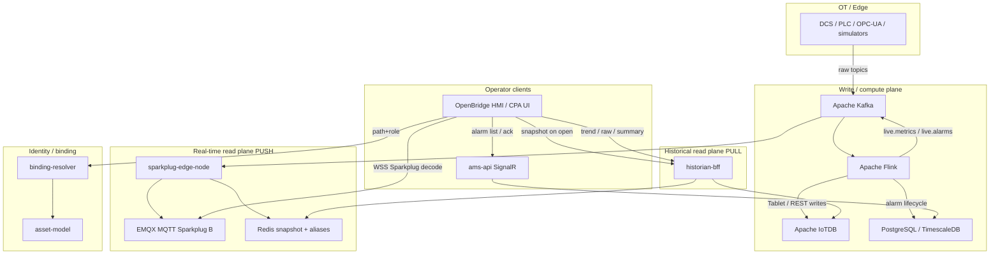
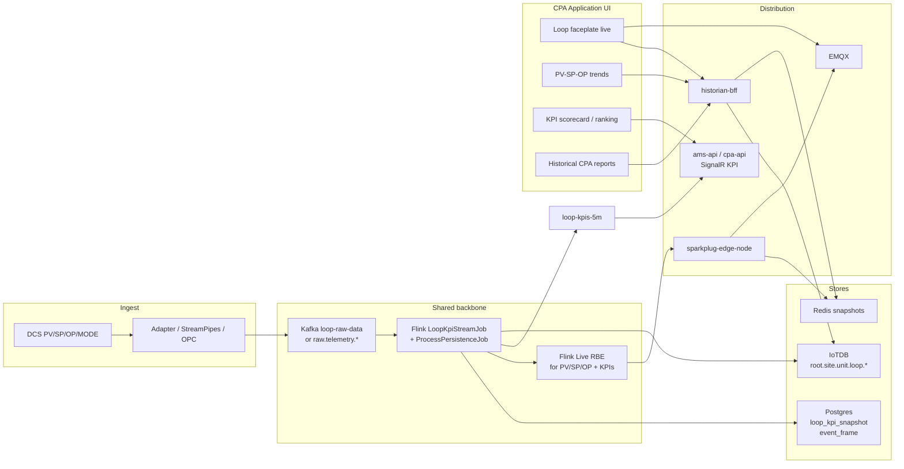

# AMS / Traverse Edge — Complete Architecture  
## Reference Blueprint for Loop Performance CPA Replication

**Document type:** Architectural reference (as-built + replication guide)  
**Audience:** Platform architects, streaming engineers, CPA / loop-performance product teams  
**Source of truth (infra):** `infra/docker/docker-compose.yml`  
**Related specs:** `Traverse-Edge-Platform-Specification.md`, `architecture_document.md`, `docs/migration/uns-namespace-spec.md`, `docs/migration/kafka-topic-catalog.md`, `docs/complete-project-workflow.md`  
**Date:** 2026-08-04  

---

## 1. Purpose

This document describes the **as-deployed architecture** of the AMS + Traverse Edge platform as defined by Docker Compose and the running microservices. It emphasises the two operator-facing data planes that any Loop Performance / CPA (Control Performance Analytics) application must replicate:

1. **Real-time live plane** — push path via Kafka → Sparkplug Edge Node → EMQX (MQTT Sparkplug B) → browser, with Redis snapshot-on-open.
2. **Historical analysis plane** — pull path via Flink (or edge) writes → Apache IoTDB → Historian BFF (`/trend`, `/raw`, `/summary`) → UI.

It then maps those planes onto a **Loop Performance CPA** product shape: PV/SP/OP ingest, Flink KPI windows, derived series in IoTDB, live KPI badges over Sparkplug, and historical CPA dashboards.

---

## 2. System identity (what this monorepo is)

Two systems share one stack:

| System | Role |
|--------|------|
| **AMS / CAMS** | Consolidated Alarm Management (OPC A&E / ISA-18.2). Kafka + Flink state machine → PostgreSQL/TimescaleDB + SignalR dashboard. |
| **Traverse Edge** | HMI designer + UNS asset model + live Sparkplug + IoTDB historian + analysis-on-Flink. OpenBridge React UI in `src/frontend-ob`. |

**Settled architectural rules** (do not violate when replicating CPA):

| Rule | Meaning for CPA |
|------|-----------------|
| **CQRS** | Displays / CPA screens store *configuration only* — never PV/SP/OP samples. |
| **Bind through UNS** | UI addresses `path + role` (`live` / `history` / `alarm`); Binding Resolver picks transport. |
| **Flink-only compute** | Loop KPIs (IAE, ISE, Harris, oscillation, % manual) run in Flink, not in the .NET API. |
| **One shared infra** | One Postgres cluster, one Kafka, one EMQX, one IoTDB; **separate logical DB per service**. |
| **Quality on reopen** | Snapshot/`DDATA` must carry quality (NAMUR NE107 semantics). |

---

## 3. Docker Compose — service catalog (as-built)

Network: `ams-backend` (bridge). All services below are defined in `infra/docker/docker-compose.yml`.

### 3.1 Infrastructure backbone

| Service | Image / build | Host ports | Role |
|---------|---------------|------------|------|
| `postgres` | `timescale/timescaledb:latest-pg15` | **5433→5432** | Relational config + AMS alarms + per-service DBs (`ams`, `traverse_*`, `traverse_auth`) |
| `zookeeper` | `confluentinc/cp-zookeeper:7.5.3` | (internal 2181) | Kafka coordination |
| `kafka` | `confluentinc/cp-kafka:7.5.3` | **9093** (external), 9092 (internal) | Event backbone |
| `kafka-ui` | `provectuslabs/kafka-ui` | **8085** | Topic inspection |
| `flink-jobmanager` | `flink:1.18.1-java11` | **8082→8081**, **9249** metrics | Stream compute JM; RocksDB checkpoints; IoTDB env wired |
| `flink-taskmanager` | `flink:1.18.1-java11` | — | 16 task slots |
| `emqx` | `emqx/emqx:5.6.0` | **1883** MQTT, **8083** WS, **8084** WSS, **18083** dashboard | Sparkplug-capable MQTT broker |
| `redis` | `redis:7.2-alpine` | **6380→6379** | Live snapshot cache + alias registry (AOF, 200MB LRU) |
| `iotdb` | `apache/iotdb:1.3.2-standalone` | **6667** session, **8181** REST v2, **9091** metrics | Time-series historian |
| `iotdb-init` | one-shot | — | Creates `root.ams.*` DBs + TTL (alarms 365d, metrics 90d) |
| `prometheus` / `grafana` | v2.51 / 10.4 | **9090** / **3001** | Observability |
| exporters | redis / postgres / kafka | 9121 / 9187 / 9308 | Metrics scrape |

### 3.2 Historian & live bridging

| Service | Host port | Role |
|---------|-----------|------|
| `historian-bff` | **8090** | `/trend`, `/raw`, `/summary` → IoTDB REST; `/snapshot` → Redis |
| `sparkplug-edge-node` | — | Kafka `live.alarms` + `live.metrics` → Sparkplug B on EMQX; Redis snapshot writes; optional IoTDB metric writes |
| `iotdb-workbench-*` | **8086** | Ad-hoc IoTDB SQL UI |
| `cloudbeaver` | **8978** | JDBC UI (Postgres + IoTDB driver) |
| `pgadmin` | **5050** | Postgres admin |

### 3.3 Application services

| Service | Host port | Database | Role |
|---------|-----------|----------|------|
| `ams-api` | **8000** | `ams` | Alarm REST + SignalR hubs; Kafka consumer/producer for ACK path |
| `ams-frontend` | **3000** | — | OpenBridge React (nginx); proxies MQTT WS + `/api/hist` |
| `auth-service` | **3002** | `traverse_auth` | RS256 JWT + JWKS; RBAC |
| `asset-model` | **5001** | `traverse_assets` | UNS source of truth |
| `binding-resolver` | **5002** | — (Redis + asset-model) | `path + role` → Sparkplug / IoTDB / SignalR |
| `display-service` | **5003** | `traverse_displays` | Versioned HMI displays (config only) |
| `template-service` | **5004** | `traverse_templates` | Reusable symbol/display templates |
| `analysis-service` | **5005** | `traverse_analysis` | Design-time analyses; Flink execution coordination |
| `audit-service` | **8095** | `traverse_audit` | Immutable audit trail from Kafka |

### 3.4 Flink job submitters (one-shot)

| Container | Entry class | Purpose |
|-----------|-------------|---------|
| `flink-job-submit` | `OpcEventStreamJob` | ISA-18.2 alarm state machine |
| `flink-job-submit-iotdb` | `IoTDBPersistenceJob` | `raw-alarms` → IoTDB |
| `flink-job-submit-live-state` | `LiveStateJob` | `current-alarm-state` → `live.alarms` / `live.metrics` (RBE) |

**Optional (manual submit today):** `LoopKpiStreamJob`, `AlarmKpiStreamJob`, `AnalysisExecutionJob`, drift/export jobs.

---

## 4. Three planes (canonical model)



| Plane | Pattern | Latency target | What CPA uses it for |
|-------|---------|----------------|----------------------|
| **Write/compute** | Kafka → Flink → IoTDB + PG | Continuous | Persist PV/SP/OP; compute loop KPIs |
| **Live (push)** | Flink → `live.*` → Edge Node → EMQX → UI | ≤ ~1.5 s field-to-UI | Faceplate PV/SP/OP, mode, live KPI badges |
| **History (pull)** | UI → historian-bff → IoTDB | p95 &lt; 1 s (decimated) | Trends, CPA reports, oscillation spectra windows |

**Invariant:** The UI **never** opens a direct Session/JDBC connection to IoTDB for operator screens. Current values are **never** read from the historian for live paint (snapshot comes from Redis).

---

## 5. Real-time live architecture (MQTT / Sparkplug)

### 5.1 End-to-end path (alarms — production today)

```
Edge / HTTP feed / simulator
        │
        ▼
  Kafka: raw-alarms
        │
        ├──────────────────────────────┐
        ▼                              ▼
 OpcEventStreamJob              IoTDBPersistenceJob
 (ISA-18.2 SM)                  → root.ams.site1.alarms.*
        │
        ▼
 Kafka: current-alarm-state  (compacted)
        │
        ├──────────────────────────────┐
        ▼                              ▼
 NormalizedAlarmConsumer          LiveStateJob (RBE)
 → PostgreSQL                     │
                                  ├─► live.alarms
                                  └─► live.metrics
                                        │
                                        ▼
                              sparkplug-edge-node
                              (Eclipse Tahu / Sparkplug B)
                                        │
                         ┌──────────────┼──────────────┐
                         ▼              ▼              ▼
                      EMQX           Redis         IoTDB (optional
                   MQTT :1883     snapshot:*      process metrics)
                   WS   :8083
                         │
                         ▼
              Browser: MQTT.js + sparkplug-payload
              Topic: spBv1.0/<group>/DDATA/<edge>/#
```

**Compose wiring (edge node):**

- Consumes: `live.alarms`, `live.metrics`
- Publishes: Sparkplug group `ams_site1`, edge `ams_edge1` (env `SPARKPLUG_GROUP` / `SPARKPLUG_EDGE`)
- MQTT: `emqx:1883` (credentials `EMQX_EDGE_USER` / `EMQX_EDGE_PASSWORD`)
- Redis TTL: 3600 s for snapshots

**Frontend env (production image):**

- `VITE_MQTT_WS_URL=/mqtt-ws` (nginx → EMQX WS)
- `VITE_SPARKPLUG_GROUP=ams_site1`
- `VITE_SPARKPLUG_EDGE=ams_edge1`
- `VITE_SNAPSHOT_URL=/api/hist/snapshot`

### 5.2 Why Redis snapshot-on-open is mandatory

Sparkplug data messages use **QoS 0** and **no retained messages**. A newly opened CPA faceplate would otherwise stay blank until the next RBE change, and would lack the **alias → metric name** map from `NBIRTH`/`DBIRTH`.

**Solution (implemented):**

1. Edge node (or host) writes Redis keys:
   - `snapshot:metric:<group>:<edge>:<device>:<metricName>` → `{ v, q, ts }`
   - `alias:<group>:<edge>` → alias registry
2. On screen open: `GET /api/hist/snapshot?assets=...` paints immediately.
3. Then subscribe MQTT `spBv1.0/<group>/+/<edge>/#` for deltas; resolve aliases; update OpenBridge symbols ~1 s.

**Do not** solve blank screens by having thousands of clients issue `NCMD` rebirth storms.

### 5.3 Live path for process / loop tags (CPA)

Today, alarm metrics dominate `LiveStateJob`. For Loop Performance CPA, the same live plane is reused with **process series** on `live.metrics`:

| Step | Contract |
|------|----------|
| Produce | Flink Live-State (or process RBE job) emits `{ groupId, edgeNodeId, deviceId, metric, alias?, ts, value, quality, dataType }` to `live.metrics` |
| Bridge | `sparkplug-edge-node` publishes `DDATA` / `NDATA` by exception (alias-only after birth) |
| Cache | Same Redis snapshot keys |
| Bind | Binding Resolver `role=live` → Sparkplug topic + Redis key |
| UI | Faceplate binds PV/SP/OP/MODE via UNS paths |

**Sparkplug topic pattern:**

```
spBv1.0/<group_id>/<verb>/<edge_node_id>/<device_id>
```

Example: `spBv1.0/houston_crude1/DDATA/edge1/fic101`  
Metric: `fic101/pv` (alias integer after birth).

### 5.4 Binding Resolver — live role

Input: contextual UNS path + `role=live`  
Output includes:

- Sparkplug group / edge / device / metric / topic
- MQTT WS connection hint (`emqx` / port `8083` / `ws`)
- Redis snapshot key

UI must **not** hard-code Sparkplug topics in display JSON — only `path` + `role`.

---

## 6. Historical analysis architecture (IoTDB)

### 6.1 Write path (as-built)

| Writer | Source topic | IoTDB path pattern | Notes |
|--------|--------------|--------------------|-------|
| `IoTDBPersistenceJob` | `raw-alarms` | `root.ams.site1.alarms.<alarmId>` | Flink `flink-iotdb-connector`, Tablet batch, auto schema |
| `sparkplug-edge-node` | `live.metrics` (process) | `root.<site>.<unit>.<device>.<measurement>` | Best-effort REST v2 inserts |
| Future CPA persistence job | `raw.telemetry.*` / `loop-raw-data` | UNS tree under `root.<site>...` | Preferred for high-rate PV/SP/OP |

**IoTDB server (compose):**

- Image: `apache/iotdb:1.3.2-standalone`
- `enable_auto_create_schema=true`
- `enable_rest_service=true`, REST port **8181**
- Session port **6667** (Flink connector)
- TTL init: `root.ams.site1.alarms` = 365 days; `root.ams.site1.metrics` = 90 days

**Idempotency:** IoTDB overwrites on `(series, timestamp)` — Flink at-least-once replays do not duplicate points.

### 6.2 Read path (Historian BFF)

Service: `historian-bff` (`src/services/historian-bff`)  
Auth: JWT (`historian.view`) + asset scope; internal `X-Service-Key`.

| Endpoint | Backend | Purpose |
|----------|---------|---------|
| `GET /trend?series=&start=&end=&width=&measurements=` | IoTDB REST `GROUP BY` | Decimated to ≤ `width` points (10–2000) |
| `GET /raw?series=&start=&end=&maxCount=&offset=` | IoTDB REST | Paginated raw (maxCount ≤ 500 per page) |
| `GET /summary?series=&start=&end=&measurement=` | IoTDB aggregates | min/max/avg/total/count |
| `GET /snapshot?assets=` | **Redis** (not IoTDB) | Current values for open screen |
| `GET /series?prefix=` | `SHOW TIMESERIES` | Discovery |
| `GET /health` | IoTDB + Redis ping | Readiness |

**Frontend proxy:** nginx `/api/hist/*` → `historian-bff:8090` (Vite dev proxies `/api/hist` → `:8090`).

### 6.3 Canonical UNS for history

Preferred contextual tree (Traverse):

```
root.<site>.<unit>.<device>.<measurement>
```

Example: `root.houston.crude1.fic101.pv`

Legacy AMS alarm tree (still written by `IoTDBPersistenceJob`):

```
root.ams.site1.alarms.<alarmId>
```

Migration strategy: alias table in `traverse_assets` + dual-write → deprecate legacy (see `docs/migration/uns-namespace-spec.md`).

### 6.4 Binding Resolver — history role

`role=history` resolves to IoTDB path + historian-bff URL templates. The UI calls `/trend` / `/raw` with the resolved path — never invents IoTDB SQL in the browser.

---

## 7. Unified Namespace (UNS) — one identity, three representations

Defined once in **asset-model**, generated everywhere else:

| Representation | Pattern | Example |
|----------------|---------|---------|
| Contextual path | `<site>/<unit>/<device>.<measurement>` | `houston/crude1/fic101.pv` |
| IoTDB | `root.<site>.<unit>.<device>.<measurement>` | `root.houston.crude1.fic101.pv` |
| Sparkplug | group=`<site>_<unit>`, device=`<device>`, metric=`<device>/<measurement>` | `houston_crude1` / `fic101` / `fic101/pv` |
| Alarm source | `<site>/<unit>/<device>` | `houston/crude1/fic101` |

**CPA loop asset** should be modelled as a device (e.g. `fic101`) with measurements:

| Measurement | Meaning |
|-------------|---------|
| `pv` | Process variable |
| `sp` | Setpoint |
| `op` | Controller output |
| `mode` | AUTO / MAN / CAS / … |
| `iae`, `ise`, `harris`, `oscillation_index`, `pct_manual`, … | Derived KPIs (written by Flink) |

---

## 8. Kafka topic catalog (relevant to both planes + CPA)

### 8.1 Core live / alarm (compose production path)

| Topic | Cleanup | Producer | Consumer |
|-------|---------|----------|----------|
| `raw-alarms` | delete 24h | Ingest / feeders | `OpcEventStreamJob`, `IoTDBPersistenceJob` |
| `current-alarm-state` | compact | `OpcEventStreamJob` | AMS API, `LiveStateJob` |
| `live.alarms` | compact* | `LiveStateJob` | `sparkplug-edge-node` |
| `live.metrics` | compact* | `LiveStateJob` (+ process jobs) | `sparkplug-edge-node` |
| `operator-actions` | 7d | AMS API | Flink ACK orchestrator |
| `ack-writeback` / `ack-results` | 24h / 7d | Flink / gateway | Gateway / Flink |
| `lifecycle-events` | 30d | Flink | KPI / audit consumers |

\*Lab reset scripts may use delete; production intent for `live.*` is compact.

### 8.2 Loop / CPA topics (exist in code; submit Loop job to activate)

| Topic | Producer | Consumer | Payload intent |
|-------|----------|----------|----------------|
| `loop-raw-data` | Edge adapter / StreamPipes / simulator | `LoopKpiStreamJob` | Per-sample `{ tagId, ts, pv, sp, op, mode }` |
| `loop-kpis-5m` | `LoopKpiStreamJob` | `KpiConsumerService` → SignalR `OnLoopKpiUpdate` | 5-minute IAE/ISE/mode KPIs |

### 8.3 Analysis / Traverse topics

| Topic | Role |
|-------|------|
| `analysis.executions` / `analysis.results` | Analysis-service ↔ `AnalysisExecutionJob` |
| `asset.*` / `template.*` / `display.*` | Config domain events |
| `audit-events` | Display governance → audit-service |

---

## 9. Stream compute — Flink jobs map

| Job | Status in compose | Input | Output | CPA relevance |
|-----|-------------------|-------|--------|---------------|
| `OpcEventStreamJob` | Auto-submit | `raw-alarms`, ACK topics | `current-alarm-state`, lifecycle | Alarm correlation next to loops |
| `LiveStateJob` | Auto-submit | `current-alarm-state` | `live.alarms`, `live.metrics` | Pattern for RBE live KPIs |
| `IoTDBPersistenceJob` | Auto-submit | `raw-alarms` | IoTDB alarms | Pattern for historian writes |
| `LoopKpiStreamJob` | Manual | `loop-raw-data` | `loop-kpis-5m` | **Core CPA KPI engine (IAE/ISE/mode)** |
| `AnalysisExecutionJob` | Manual / scripts | analysis executions | `analysis.results` → UNS | Ad-hoc expressions on tags |
| `AlarmKpiStreamJob` | Manual | `lifecycle-events` | alarm rate KPIs | Plant-wide context |

**Runtime guarantees (compose Flink props):**

- RocksDB state backend, incremental checkpoints
- Checkpoint interval 60 s, EXACTLY_ONCE mode on JM
- Env: `IOTDB_HOST=iotdb`, `IOTDB_PORT=6667`

### 9.1 LoopKpiStreamJob (existing CPA seed)

Location: `src/flink/.../LoopKpiStreamJob.java`

- Keyed by `tagId`
- Tumbling **5-minute event-time** windows (10 s bounded out-of-orderness)
- Computes **IAE**, **ISE**, sample count, **dominant mode**
- Publishes JSON to `loop-kpis-5m`
- AMS API `KpiConsumerService` fans out via SignalR `OnLoopKpiUpdate`

This is the starting point for a full CPA suite (add Harris/MV index, oscillation, valve travel, % time in manual as additional measurements / topics).

---

## 10. Storage division of responsibility

| Store | Holds | Does **not** hold |
|-------|-------|-------------------|
| **IoTDB** | Time-series: raw PV/SP/OP, derived KPI series, alarm history series | Relational lifecycle, display JSON, RBAC |
| **PostgreSQL** | Alarm current/history, displays, templates, assets, analysis defs, auth, audit | High-rate tag samples |
| **Redis** | Latest snapshot + Sparkplug aliases | Long-term history |
| **Kafka** | Durable transport / compact state topics | System of record for config |

This is the same split industrial historians use (archive vs AF/event frames vs snapshot).

---

## 11. Frontend / HMI architecture (OpenBridge)

| Concern | Implementation |
|---------|----------------|
| Stack | React 18 + Vite + TypeScript, `src/frontend-ob` |
| Design system | OpenBridge web components (`@oicl/openbridge-webcomponents-react`) |
| Live | MQTT.js over WS + `sparkplug-payload` |
| History | historian-bff `/trend` `/raw` |
| Alarms | SignalR `AlarmHub` + Sparkplug live banner |
| Binding | `binding-resolver` via `useBindingResolver` (path + role) |
| Designer | DOM/SVG (no Konva); displays = config only |
| State | Zustand + React Query |

**Dev ports:** Vite **5174**; proxies `/api`→5000, `/api/bindings`→5002, `/api/displays`→5003, `/api/hist`→8090.

---

## 12. Security & auth (platform)

| Component | Mechanism |
|-----------|-----------|
| User auth | `auth-service` RS256 JWT; JWKS at `/api/auth/.well-known/jwks.json` |
| Issuer / audience | `traverse-auth` / `ams-services` |
| Service-to-service | `X-Service-Key` (`TRAVERSE_SERVICE_KEY`) |
| Historian / asset APIs | Permission policies + asset scope claims |
| MQTT | EMQX credentials for edge node; lab may allow anonymous for E2E |
| Zones | Monitoring plane in IT; OT writes only via dedicated ACK/write-back conduit (not MQTT historian path) |

---

## 13. Observability

| Tool | Port | Use |
|------|------|-----|
| Flink UI | 8082 | Job health, checkpoints |
| Prometheus | 9090 | Scrape Flink :9249, exporters |
| Grafana | 3001 | Ops dashboards |
| Kafka UI | 8085 | Lag / topics |
| EMQX dashboard | 18083 | MQTT clients / Sparkplug |
| CloudBeaver | 8978 | SQL on Postgres / IoTDB |
| IoTDB Workbench | 8086 | Historian SQL |

---

## 14. Loop Performance CPA — replication architecture

This section is the **product blueprint**: reuse the AMS/Traverse planes; add loop-specific ingest, compute, and UI.

### 14.1 Target CPA dataflow



### 14.2 What to reuse unchanged

| Capability | Reuse as-is |
|------------|-------------|
| EMQX + Sparkplug edge node + Redis snapshot | Live faceplates |
| IoTDB + historian-bff | Trends / raw / summary |
| Asset-model + binding-resolver | UNS path+role binding |
| Auth-service RBAC | Operator/engineer scopes |
| Kafka + Flink cluster | Compute + persistence |
| OpenBridge HMI patterns | Faceplates, trends, quality colours |
| Analysis-service | Optional custom expressions |

### 14.3 What to add / extend for CPA

| Workstream | Deliverable |
|------------|-------------|
| **Ingest contract** | Harden `loop-raw-data` schema: `{ loopId, tagId, ts, pv, sp, op, mode, quality }`; partition by `loopId` |
| **Persistence job** | Flink job: samples → IoTDB under UNS (`…fic101.pv|sp|op|mode`); Tablet batch |
| **KPI job** | Extend `LoopKpiStreamJob`: Harris/MV index, oscillation index, valve travel/reversals, % time in manual, saturation time; emit derived series + `loop-kpis-5m` |
| **Live RBE** | Publish KPI + PV/SP/OP changes to `live.metrics` (deadband) for Sparkplug |
| **Event store** | Postgres tables: `loop_kpi_snapshot`, `event_frame` (bad-loop episodes), optional case management |
| **CPA API** | Rankings, worst loops, time-in-mode summaries (read models from PG + historian summary) |
| **CPA UI** | Level-3 loop detail + Level-2 unit scorecard; bind live vs history roles; never store samples in display docs |

### 14.4 Recommended IoTDB layout for a control loop

```
root.<site>.<unit>.<loopId>.pv
root.<site>.<unit>.<loopId>.sp
root.<site>.<unit>.<loopId>.op
root.<site>.<unit>.<loopId>.mode
root.<site>.<unit>.<loopId>.kpi.iae
root.<site>.<unit>.<loopId>.kpi.ise
root.<site>.<unit>.<loopId>.kpi.harris
root.<site>.<unit>.<loopId>.kpi.oscillation
root.<site>.<unit>.<loopId>.kpi.pct_manual
```

TTL suggestion: raw PV/SP/OP longer retention (e.g. 365–730 d); high-rate intermediates shorter; 5-min KPI series retained longer for scorecards.

### 14.5 CPA API surface (suggested)

| Method | Path | Plane |
|--------|------|-------|
| GET | `/api/cpa/loops` | PG catalog + latest KPI snapshot |
| GET | `/api/cpa/loops/{id}/kpis?from&to` | historian-bff `/trend` on `kpi.*` |
| GET | `/api/cpa/loops/{id}/series?role=live` | binding-resolver → MQTT + snapshot |
| GET | `/api/cpa/loops/{id}/series?role=history` | binding-resolver → `/trend` PV/SP/OP |
| GET | `/api/cpa/rankings?window=7d&metric=harris` | PG materialised / Flink rollup |
| WS/SignalR | `OnLoopKpiUpdate` | already in AMS API |

### 14.6 Standards alignment for CPA

| Standard | Application |
|----------|-------------|
| ISA control-loop KPIs | Variability, Harris / minimum-variance, % manual, valve travel |
| ISA-101 | HMI levels: overview → unit → loop detail → diagnostic |
| NAMUR NE107 | Quality on live reopen |
| IEC 62443 | Monitoring plane vs OT write-back segregation |
| Eclipse Sparkplug 3.0 | Live namespace + alias RBE |

### 14.7 Phased build sequence for Loop Performance CPA

| Phase | Goal | Exit criteria |
|-------|------|---------------|
| **C0 Spine** | `loop-raw-data` → Flink persist → IoTDB; `/trend` for PV/SP/OP | Decimated year query &lt; 1 s p95 |
| **C1 Live** | RBE → `live.metrics` → Edge Node → Redis snapshot → faceplate | Snapshot-on-open + live deltas under load |
| **C2 KPIs** | Extend `LoopKpiStreamJob`; SignalR + IoTDB derived series | IAE/ISE/Harris on 5-min windows end-to-end |
| **C3 Scorecard** | Rankings UI + event frames for poor performance | Engineer can sort worst loops by KPI |
| **C4 Harden** | TTL, ACLs, HA IoTDB topology, observability SLOs | Production acceptance script green |

---

## 15. Port map (quick reference)

| Port | Service |
|------|---------|
| 3000 | Frontend (nginx) |
| 3001 | Grafana |
| 3002 | Auth |
| 5001 | Asset model |
| 5002 | Binding resolver |
| 5003 | Display service |
| 5004 | Template service |
| 5005 | Analysis service |
| 5433 | PostgreSQL |
| 6380 | Redis |
| 6667 / 8181 | IoTDB session / REST |
| 8000 | AMS API |
| 8082 | Flink UI |
| 8085 | Kafka UI |
| 8086 | IoTDB Workbench |
| 8090 | Historian BFF |
| 8095 | Audit service |
| 8978 | CloudBeaver |
| 9090 | Prometheus |
| 9093 | Kafka external |
| 18083 / 1883 / 8083 | EMQX dashboard / MQTT / WS |

---

## 16. Invariants checklist (copy into CPA definition of done)

1. UI binds **path + role only**; no hard-coded IoTDB/Sparkplug strings in saved displays.  
2. **Current values** from Redis snapshot + MQTT; **history** from historian-bff only.  
3. **Flink** owns KPI math; API is fan-out / query, not compute.  
4. Sparkplug **QoS 0 / no retain** → snapshot-on-open is non-negotiable.  
5. IoTDB writes are **idempotent** on `(series, ts)`.  
6. Derived KPI series use the **same UNS** as raw PV/SP/OP.  
7. Quality/mode must be visible on reopen (never paint stale Good).  
8. OT supervisory write-back (if any) is a **separate conduit**, not via MQTT monitoring or historian.

---

## 17. Key source pointers

| Area | Path |
|------|------|
| Compose | `infra/docker/docker-compose.yml` |
| Platform spec | `Traverse-Edge-Platform-Specification.md` |
| Alarm architecture | `architecture_document.md` |
| UNS | `docs/migration/uns-namespace-spec.md` |
| Topics | `docs/migration/kafka-topic-catalog.md` |
| Workflow detail | `docs/complete-project-workflow.md` |
| Historian BFF | `src/services/historian-bff/Program.cs` |
| Binding resolver | `src/services/binding-resolver/` |
| Edge node | `src/services/sparkplug-edge-node/` |
| Loop KPI job | `src/flink/.../LoopKpiStreamJob.java` |
| Live RBE job | `src/flink/.../LiveStateJob.java` |
| IoTDB persist | `src/flink/.../IoTDBPersistenceJob.java` |
| KPI → SignalR | `src/backend/AMS.Api/BackgroundServices/KpiConsumerService.cs` |

---

## 18. Summary

The platform already implements the **industrial dual-plane pattern** required by Loop Performance CPA:

- **Live:** Kafka → Flink RBE → Sparkplug Edge Node → **EMQX** → browser, with **Redis** defeating Sparkplug’s no-retain constraint.  
- **History:** Flink/edge → **IoTDB** → **historian-bff** decimated queries.  
- **Identity:** Asset Model UNS + Binding Resolver so one loop identity maps to Sparkplug, IoTDB, and alarms.

Replicating CPA means **feeding PV/SP/OP into that same spine**, extending `LoopKpiStreamJob`, persisting raw + derived series under the UNS tree, and building CPA scorecards/faceplates that bind `live` vs `history` roles — without inventing a second real-time or historian stack.
