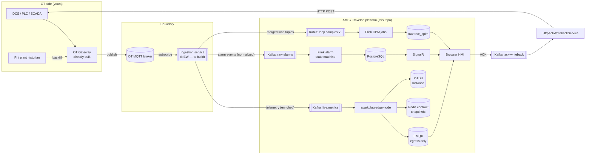

# OT → IT Data Requirements — What This Platform Needs From The Plant

**Audience:** the team wiring the OT-side gateway (already built, publishes to MQTT) into AMS/Traverse.
**Status:** authoritative inventory as of 2026-08-18, derived from the code actually in this repo (not from the aspirational architecture docs — where they disagree, this file follows the code).
**Companion docs:** [02-uns-asset-tag-loop-configuration.md](02-uns-asset-tag-loop-configuration.md) (what to configure, in what order), [03-mqtt-ingestion-enrichment-service.md](03-mqtt-ingestion-enrichment-service.md) (how the new ingestion service maps OT MQTT data into these contracts).

---

## 1. The one-page answer

The platform consumes exactly **three streaming data planes** from OT, plus **one reverse path**, plus **one configuration-time dataset**. Everything the UI shows — HMI displays, trends, alarm lists, loop KPIs — is derived from these five things and nothing else.

| # | Data plane | What it is | Target Kafka topic | Who needs it |
|---|-----------|------------|--------------------|--------------|
| 1 | **Process telemetry** | Current value of every tag you want on a display/trend (analog + discrete) | `live.metrics` | HMI displays (live), IoTDB historian (trends), Redis snapshots (paint-on-open) |
| 2 | **Alarms & events** | DCS/OPC A&E alarm occurrences, state changes, acknowledgements | `raw-alarms` | Alarm list, ISA-18.2 state machine, alarm KPIs, alarm history |
| 3 | **Control-loop samples** | Time-aligned PV/SP/OP(/VP)/MODE tuples per control loop | `loop.samples.v1` | CPM loop-performance diagnostics (all `/cpm` pages), loop trends |
| 4 | **ACK writeback** (reverse: IT → OT) | Operator acknowledges an alarm in AMS → the ACK must reach the DCS | `ack-writeback` → HTTP → DCS → `ack-results` | Closed-loop alarm acknowledgement |
| 5 | **Tag/asset metadata** (configuration-time, not streaming) | Tag list with descriptions, engineering units, ranges, plant hierarchy placement, loop membership | REST → asset-model + cplm-api (no streaming topic) | Asset model (UNS), designer tag picker, loop registry |

**Key structural fact:** the platform's ingestion boundary is **Kafka, not MQTT**. EMQX in this stack is an *egress* broker (platform → browser, Sparkplug B); there is currently **no MQTT→Kafka path and no service subscribing to inbound OT data**. Your OT gateway publishes to MQTT — so the new **ingestion service** is the component that subscribes to that MQTT feed, enriches/normalizes, and produces to the three Kafka topics above. That service does not exist yet; doc 03 designs it. The repo's own decision record says the same thing: *"there is no source… Traverse has no OPC-UA/DCS bridge… treat the edge adapter as a first-class, separately-scoped project."*



---

## 2. Data plane 1 — Process telemetry (`live.metrics`)

### 2.1 What it feeds

One record on `live.metrics` fans out to **three** stores via `sparkplug-edge-node` (`src/services/sparkplug-edge-node/`):

1. **EMQX / Sparkplug B** — republished as `spBv1.0/<group>/DDATA/<edge>/<device>` for live HMI values in the browser.
2. **Redis contract tier** — `snapshot:metric:<group>:<edge>:<device>:<metric>` = `{"v":…,"q":…,"ts":…}` (TTL 1 h) so a display paints instantly on open even when the value hasn't changed recently (report-by-exception upstream).
3. **IoTDB** — `INSERT INTO root.<path-with-dots>` for trend history — **only when the record carries a `path` field**.

### 2.2 Exact wire contract (this is what your ingestion service must produce)

Consumer of record: `AlarmMetricPublisher.processMetricRecord` (sparkplug-edge-node). JSON per record:

```json
{
  "group":   "houston",                              // Sparkplug group  = UNS <site>
  "edge":    "houston_edge1",                        // Sparkplug edge   = <site>_edge1
  "device":  "pump101",                              // Sparkplug device (see trap below)
  "metric":  "discharge_press",                      // measurement name
  "value":   142.7,                                  // number or bool
  "quality": 192,                                    // OPC quality; 192 = Good (default if omitted)
  "ts":      1755500000000,                          // epoch MILLISECONDS, source timestamp
  "type":    "Double",                               // Double | Int32 | Boolean | String
  "path":    "houston/crude1/pump101.discharge_press" // UNS contextual path — REQUIRED for historian write
}
```

Requirements on the OT side per tag update:

| Requirement | Detail | Why |
|---|---|---|
| **Source timestamp** | epoch ms, from the DCS/OPC server, not gateway receive time | trends, sequence-of-events fidelity |
| **Quality code** | OPC-style numeric (Good=192, Uncertain=64, Bad=0) or mappable string | quality is mandatory platform-wide (NAMUR NE107 / ISA-18.2 mapping on reopen) |
| **Value + data type** | numeric preferred; IoTDB write path only handles Double/Int32 today | historian |
| **Stable tag identity** | the OT tag name must be stable so the ingestion mapping (OT tag → UNS path) holds | everything binds by UNS path |
| **Report-by-exception OK** | RBE/deadband publishing is fine — Redis snapshots cover paint-on-open | bandwidth |

> **Trap — device naming is inconsistent in the platform today.** `Asset.SparkplugDevice` computes `crude1_pump101` (unit_device) for 4-segment paths, the binding-resolver fallback computes `unit_device` for ≥3 segments, but the working simulator publishes bare `pump101`. Until this is reconciled, **the ingestion service must derive `group/edge/device/metric` the same way `asset-model` does** (call `GET /api/assets/by-path/...` and use the returned `sparkplugGroup/EdgeNode/Device/Metric` fields) rather than computing its own — that makes asset-model the single authority and keeps bindings resolvable. Details in doc 03 §4.

### 2.3 Which tags?

Every tag you want to (a) see live on an HMI display, (b) trend, or (c) use in a calculation. In practice: start from the display inventory (what screens are being built) and the loop registry (loop signals also surface as displayable tags), not from "export all 50,000 DCS tags." The asset model is the gate — **a tag that has no Measurement asset in the UNS is invisible to the designer** (the tag picker only offers what's in the asset model).

---

## 3. Data plane 2 — Alarms & events (`raw-alarms`)

### 3.1 What it feeds

`raw-alarms` → Flink `OpcEventStreamJob` (the ISA-18.2 alarm state machine: validation, dedup, enrichment, lifecycle, correlation, flood detection) → `current-alarm-state` → PostgreSQL + SignalR to the alarm UI, plus `IoTDBPersistenceJob` → alarm history at `root.ams.site1.alarms.<alarmId>`.

### 3.2 Exact wire contract

Consumer of record: `PipelineOperators.ValidationMap` (`src/flink/.../PipelineOperators.java`). It accepts **two dialects**, discriminated by `alarmId`+`state` presence:

**Dialect A — "HTTP feed" style** (what the current lab poller produces; simplest for a gateway):

```json
{
  "alarmId":       "corr-8842",                  // stable per alarm occurrence; else derived
  "sourceName":    "FIC101",                     // REQUIRED — tag/point that alarmed
  "conditionName": "PVHIGH",                     // REQUIRED — alarm condition
  "state":         "ACTIVE",                     // ACTIVE | CLEARED | ...
  "priority":      "HIGH",                       // CRITICAL|HIGH|MEDIUM|LOW|DIAGNOSTIC → severity band
  "message":       "Flow high",
  "acknowledged":  false,
  "timestamp":     "2026-08-18T10:00:00Z",
  "eventTimeEpochMs": 1755500000000
}
```

**Dialect B — OPC A&E style** (fuller; use if your gateway fronts an OPC A&E server):

| Field | Required | Notes |
|---|---|---|
| `sourceName` (alias `sourcePath`) | **yes** — empty ⇒ record dropped | the alarming point |
| `conditionName` (alias `condition`) | **yes** — empty ⇒ record dropped | e.g. `HI`, `HIHI`, `DEV` |
| `subConditionName` | no | sub-condition |
| `serverId` (alias `opcServer`) | no (defaulted) | identifies the A&E server |
| `severity` | no (default 300) | OPC 1–1000 |
| `conditionActive` | no (default true) | false ⇒ alarm cleared |
| `acknowledged`, `ackRequired` | no | ACKs from a parallel HMI are honored |
| `eventTimeEpochMs` / `activeTimeEpochMs` / `activeFileTime` | strongly recommended | else ingest-time is stamped |
| `cookieOffset` (or `opcAttributes.cookieOffset`) | needed for ACK writeback | OPC A&E ack handle |
| `sourceEventId`, `message`, `quality` | no | `quality` currently unread by the validator |

Alarm identity when `alarmId` is absent: derived as a stable hash of `(serverId, sourceName, conditionName, subConditionName)`. **Addressing is name-based** — there is no OPC NodeId anywhere in the pipeline, so your gateway needs to emit *names*, not node ids.

### 3.3 What the OT side must guarantee

- **Every state transition is an event**: ACTIVE, CLEARED (or `conditionActive:false`), and acknowledgement changes. The state machine is event-sourced — a missed CLEAR leaves a standing alarm.
- **Either a delta stream or a snapshot feed**: the existing lab ingester polls a full "current alarms" snapshot and diffs it (disappearance ⇒ synthetic CLEARED). A gateway that publishes true events over MQTT is strictly better; a periodic full-snapshot topic as a **safety net** for missed events is a good idea (doc 03 §5.4).
- **Priority mapping agreed up front**: platform bands are `CRITICAL=900 / HIGH=700 / MEDIUM=400 / LOW=100 / DIAGNOSTIC=50` (default 300). Map DCS priorities into these once, in the ingestion service.
- **ACK round-trip support** if the site wants ACK-in-AMS to be the ACK of record — see §5.

---

## 4. Data plane 3 — Control-loop samples (`loop.samples.v1`)

This is the plane people most often get wrong, because it is **not a per-tag stream**.

### 4.1 The contract is a merged tuple, one record per loop per sample instant

Consumer of record: `CplmNormalizedSample.fromJson` (Flink). Key = `loop_id` (16 partitions). Payload:

```json
{
  "loop_id":     "FIC10409",          // REQUIRED — must match cpm.loop_registry.loop_id
  "event_ts_ms": 1755500000000,       // REQUIRED — epoch ms, event time
  "pv":  42.1,                        // REQUIRED numeric — missing ⇒ record discarded
  "sp":  42.0,                        // REQUIRED numeric
  "op":  37.6,                        // REQUIRED numeric (controller output %)
  "vp":  37.2,                        // optional (valve position); absent ⇒ diagnostics capped at 0.89 confidence
  "mode": "AUTO",                     // controller mode string
  "quality": "GOOD",                  // or OPC numeric ≥192, or is_good_quality: true
  "loop_type": "FIC"                  // optional but recommended — engine infers from loop_id otherwise
}
```

Hard rules enforced in code:

- `pv`/`sp`/`op` missing or non-numeric ⇒ the record is **silently filtered** (deliberately not defaulted to 0.0).
- `mode` must fall in the engine's vocabulary — AUTO set: `AUTO, AUT, A, AUTOMATIC, NORMAL, NORM, CAS, CASC, CASCADE, RSP, DDC, SUP, SUPERVISORY`; MANUAL set: `MAN, MANUAL, M, IMAN, ROUT, LO, LOCAL, OFF, TRACK`. **DCS-specific mode strings (e.g. Honeywell `AUT`) must be mapped in the ingestion service.**
- Late data is dropped: watermarks allow only 2 min out-of-orderness and window lateness of 30 s–3 min. **Historical backfill must NOT go through this topic** — it goes to IoTDB + the recompute API instead (doc 03 §6).

### 4.2 The alignment problem — this is ingestion-service work

Your OT gateway will naturally publish **per-tag** updates (PV changed, OP changed…), each on its own cadence. The CPM engine needs them **joined into one row on a common time grid**. The platform's own real-plant validation (loop B2_027PIC, Honeywell data) did exactly this: PV at ~5 s cadence, SP/OP/MODE on-change → merged onto a **5-second grid** with forward-fill of the slower signals.

So the ingestion service must, per registered loop:

1. Know which OT tags are that loop's PV/SP/OP/VP/MODE (from `cpm.loop_tag_map` — see doc 02).
2. Hold last-known-value per signal, resample onto the loop's grid (5 s is the proven default), forward-filling on-change signals.
3. Emit one merged tuple per grid tick, keyed by `loop_id`.
4. Mark quality bad/omit the tick when a required signal is stale beyond a threshold.

### 4.3 Volume/window expectations

- The long-diagnostics engine needs **≥32 samples per window** and ≥12 h of event time before the first fused verdict — at 5 s cadence that's trivially satisfied; the constraint that matters is *continuity* (gaps ⇒ `INSUFFICIENT_DATA`).
- Sample period is **inferred** by the engine per window — there is no configured scan rate. Keep the grid steady per loop.
- No VP signal ⇒ valve-diagnosis gate reports `INSUFFICIENT_EVIDENCE` and overall confidence is permanently capped at 0.89. Wire VP wherever the valve has a positioner.

---

## 5. Reverse path — Alarm ACK writeback (IT → OT)

When an operator acknowledges in AMS, the platform emits to `ack-writeback`; `HttpAckWritebackService` POSTs the ACK to the DCS endpoint; the DCS result comes back on `ack-results` and closes the loop in the state machine.

What the OT side must provide **if ACK-in-AMS must reach the DCS**:

- An HTTP endpoint (today's integration mode — the lab uses `mock-dcs`; production used the Windows `AMS.OpcGateway` speaking OPC Classic A&E) that accepts an ACK for `(sourceName, conditionName, cookieOffset/activeFileTime)`.
- The **ACK handle** (`cookieOffset`, `activeFileTime`) must have been present on the original alarm event — your gateway needs to pass these through from the A&E server if OPC ACK is required.
- If the DCS is ACK-authoritative in the other direction too (operator ACKs at the DCS console), those ACK state changes must appear as events on the alarm stream (`acknowledged: true`) — the pipeline accepts ACKs from all sources.

If the site decides AMS ACKs are *advisory only* (no writeback), this whole plane can be deferred — the alarm list still works; the ACK state just won't sync to the DCS.

---

## 6. Configuration-time dataset — tag & asset metadata

This is the **one-time (plus change-managed) export** you need from the OT/engineering side before any streaming data is useful. It is not a topic; it is loaded through REST (asset-model, cplm-api) — and today there is **no bulk import UI**, so it lands via scripts/API calls (doc 02 §6 covers the practical loading routes).

Per tag, collect:

| Field | Used for | Where it lands |
|---|---|---|
| OT tag name (exact, stable) | ingestion mapping OT→UNS | `assets.alias_mapping` (legacy_path) and/or ingestion map |
| Description | designer, alarm display | `assets.assets.description` |
| Engineering unit | faceplates, trends, gauges | `assets.assets.engineering_unit` |
| Range lo/hi | gauge/trend scales, limit inheritance | `assets.assets.lo_eng_limit / hi_eng_limit` |
| Plant placement: site / area / unit / device | the UNS path itself | `assets.assets.contextual_path` + hierarchy rows |
| Data type | ingestion typing (Double/Int32/Bool) | ingestion map (assets have no data-type column) |
| Loop membership + signal role (PV/SP/OP/VP/MODE of which controller) | CPM loop registry | `cpm.loop_registry` + `cpm.loop_tag_map` |
| Alarm conditions configured at DCS (optional) | expectation-setting for alarm rationalization | (no store today — ISA-18.2 master alarm DB is out of scope of this repo) |

**You do not need the PI AF database.** The asset model *is* this platform's AF-equivalent (see doc 02 §5 for the designer-binding story and what the `.pdix` importer does with PI paths). What you need from PI-land, at most, is: (a) a tag list export as above, and (b) if you import PI Vision displays, the AF attribute paths referenced by those displays so they can be alias-mapped to UNS paths.

---

## 7. Where each kind of data comes from in a typical OT estate

| Platform need | Best OT source | Alternative |
|---|---|---|
| Process telemetry | OPC-UA server on DCS / SCADA (subscription, RBE) | plant historian (PI) scan — adds latency; polling driver in gateway |
| Alarm events | OPC A&E / OPC-UA A&C server on DCS | DCS alarm printer/journal feed; historian alarm log (degraded: no live ACK state) |
| Loop signals (PV/SP/OP/VP/MODE) | same OPC-UA server — these are ordinary tags; VP needs the positioner's feedback tag | historian backfill for history-only analysis (recompute path) |
| Loop inventory (which controllers exist, their tag quads) | DCS engineering/configuration export (control builder export, e.g. Honeywell EB/CB export, Yokogawa builder files) | manual entry per loop in the `/cpm/registry` wizard or its CSV import |
| Tag metadata (EU, ranges, descriptions) | DCS engineering export or PI point/AF export | manual |
| Time sync | NTP-disciplined DCS + gateway; source timestamps end-to-end | gateway stamps receive-time (degrades SOE + CPM accuracy) |

---

## 8. Sizing quick reference

| Plane | Topic | Partitions | Retention | Ordering key |
|---|---|---|---|---|
| Telemetry | `live.metrics` | 8 | 7 d, lz4 | none required (device-level ordering desirable) |
| Alarms | `raw-alarms` | 8 | 7 d, lz4 | alarmId (producer key) |
| Loop samples | `loop.samples.v1` | 16 | 7 d, lz4 | **loop_id — mandatory** (Flink keys by it) |
| ACK out/in | `ack-writeback` / `ack-results` | 2 / 2 | 7 d | — |

Broker auto-create is **off** — topics are provisioned by `scripts/kafka-reset-lab-topics.ps1`; an unprovisioned topic fails loudly. IoTDB retention: `root.ams` (alarms) 365 d, `root.site1` (loop/CPM) 90 d.

---

## 9. Minimum viable OT payload checklist (hand this to the gateway team)

For **every telemetry publish**: stable tag name • value • data type • OPC-style quality • source timestamp (epoch ms or ISO-8601 with zone).
For **every alarm event**: source (tag) name • condition name • state or conditionActive • priority/severity • event time • acknowledged flag • (if OPC ACK round-trip needed) cookieOffset/activeFileTime.
For **loops**: the per-tag streams above for PV/SP/OP/(VP)/MODE **plus** an engineering export telling us which tags form which loop.
For **everything**: consistent site/area/unit placement so tags can be mapped into `site/[area/]unit/device.measurement` UNS paths.
