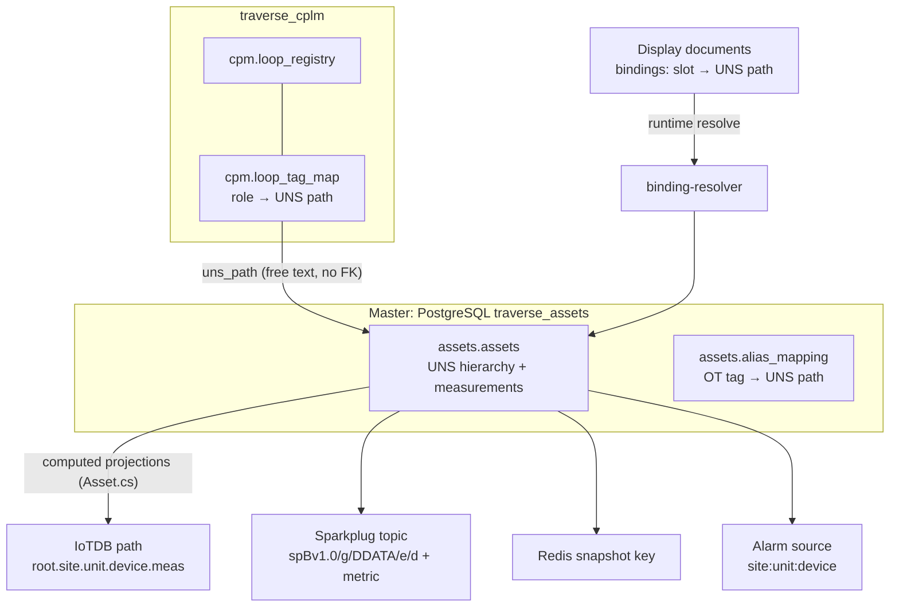
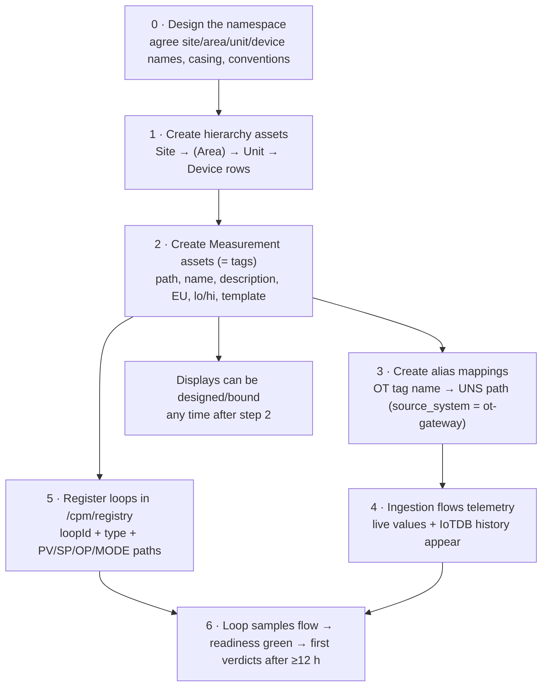
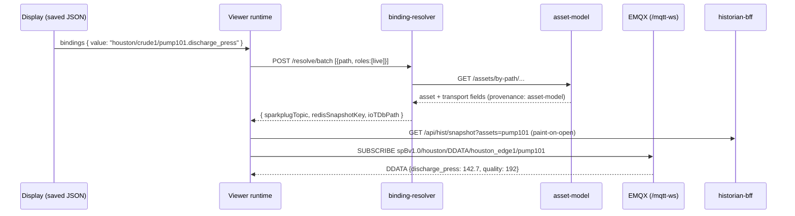

# UNS, Asset Model, Tag & Loop Configuration — What To Configure, In What Order

**Audience:** whoever sets up the plant model (tags, hierarchy, loops) before/while the OT data starts flowing.
**Status:** verified against the code, 2026-08-18.
**Companion docs:** [01-ot-data-requirements.md](01-ot-data-requirements.md) (what data OT must supply), [03-mqtt-ingestion-enrichment-service.md](03-mqtt-ingestion-enrichment-service.md) (the service that consumes it).

This doc answers four questions directly:

1. *Do we configure tags first or loops first?* → §3 (short answer: **hierarchy → tags → aliases → loops**, but loops have an auto-projection escape hatch)
2. *Does the designer need PI System assets/attributes to bind?* → §5 (short answer: **no — the asset model replaces PI AF entirely**)
3. *How do we manage the UNS in IoTDB?* → §7 (short answer: **you don't — IoTDB paths are a computed projection of the Postgres asset model**)
4. *How do we map OT data to our model?* → §6 here + doc 03 §4 (short answer: **the** `alias_mapping` **table is the bridge**)

---


## 1. Mental model — three configuration stores, one namespace

There is **no separate "tag database"** in this platform. A tag *is* an asset — specifically a **Measurement asset (type 5)** in the UNS asset model. Everything else references tags by their **contextual path** string.


| Store                                    | Database          | What it holds                                                                                                      | Owner service |
| ---------------------------------------- | ----------------- | ------------------------------------------------------------------------------------------------------------------ | ------------- |
| `assets.assets`                          | `traverse_assets` | The UNS: sites, areas, units, devices, **measurements (= tags)**, with EU/ranges/description + transport overrides | asset-model   |
| `assets.alias_mapping`                   | `traverse_assets` | OT/legacy tag name → UNS path (the ingestion mapping)                                                              | asset-model   |
| `cpm.loop_registry` + `cpm.loop_tag_map` | `traverse_cplm`   | Control loops: identity, type, criticality + **signal role (PV/SP/OP/VP/MODE) → UNS path**                         | cplm-api      |


Design rule that explains everything else (recorded decision #2): **everything binds through the UNS by path + role**. Displays store paths, never values; the binding-resolver turns `path + role(live|history|alarm)` into a concrete transport at runtime. So the asset model is the single point where "what exists in the plant" is declared — the designer's tag picker, the ingestion mapping, the historian paths, and the live MQTT topics all hang off it.




---


## 2. The UNS and the asset model


### 2.1 Path grammar

```
contextual_path  =  site/[area/]unit/device[.measurement]
                    houston/crude1/pump101.discharge_press
                    dallas/blend1/tank02.level
```

Five hierarchy levels, each its own asset row: `Site=1, Area=2, Unit=3, Device=4, Measurement=5`. The area level is optional in the path. The dotted-`root.` form (`root.houston.crude1...`) is only the IoTDB projection, not the canonical form.

Naming conventions (documented in `docs/migration/uns-namespace-spec.md`; **not enforced by code**, so enforce them by discipline or in your load scripts): all lowercase, `snake_case` for multi-word, no spaces or special characters, max depth 6. The API only enforces non-blank + unique-active-path; garbage paths will happily persist and then poison the designer's picker — curate on the way in.

### 2.2 What an asset row carries


| Field                                                | Notes                                                                                                                                   |
| ---------------------------------------------------- | --------------------------------------------------------------------------------------------------------------------------------------- |
| `contextual_path`, `name`, `asset_type`, `parent_id` | identity + hierarchy (hierarchy is stored twice: `parent_id` and the path string — keep both consistent)                                |
| `description`                                        | shows in the tag picker search                                                                                                          |
| `engineering_unit`                                   | free text (`PSI`, `degC`, `%`…) — faceplates, trends, gauges read this                                                                  |
| `lo_eng_limit` / `hi_eng_limit`                      | scale limits; displays can inherit them (`inheritLimits`)                                                                               |
| `template`                                           | free-text type label (`Tank`, `Pump`, `CpmLoopSignal`) — powers collection/comparison queries and asset-relative display swap           |
| 5 transport overrides                                | `iotdb_path_override`, `sparkplug_{group,edge,device,metric}_override` — per-asset escape hatches when the computed projection is wrong |


**What an asset row does NOT carry** — plan around these:

- **No data type.** Type coercion lives in the ingestion mapping (doc 03 §4.4).
- **No alarm limits.** Alarm configuration is DCS-side; the platform consumes alarm *events*.
- **No signal role.** PV/SP/OP is a loop concept and lives only in `cpm.loop_tag_map` (deliberate — six services read the assets table and the role concept was kept out of it).


### 2.3 The transport projection (why paths must be right)

`asset-model` computes, per asset, the physical addresses everything else uses (override-aware):


| Derived field       | Rule                                                         | `houston/crude1/pump101.discharge_press`                        |
| ------------------- | ------------------------------------------------------------ | --------------------------------------------------------------- |
| IoTDB path          | `root.` + path with `/`→`.`, ``→`_`                          | `root.houston.crude1.pump101.discharge_press`                   |
| Sparkplug group     | site                                                         | `houston`                                                       |
| Sparkplug edge node | `<site>_edge1`                                               | `houston_edge1`                                                 |
| Sparkplug device    | `<unit>_<device>` when path has ≥4 segments, else `<device>` | `pump101` (3 segments here)                                     |
| Sparkplug metric    | text after the `.`                                           | `discharge_press`                                               |
| DDATA topic         | `spBv1.0/<group>/DDATA/<edge>/<device>`                      | `spBv1.0/houston/DDATA/houston_edge1/pump101`                   |
| Redis snapshot key  | `snapshot:metric:<g>:<e>:<d>:<m>`                            | `snapshot:metric:houston:houston_edge1:pump101:discharge_press` |
| Alarm source        | `<site>:<unit>:<device>`                                     | `houston:crude1:pump101`                                        |


> **Trap (known, in-code documented):** when an asset is missing, the binding-resolver falls back to deriving these from the path string — and its device rule differs (`unit_device` at ≥3 segments vs asset-model's ≥4). A binding can look `resolved: true` yet point at a topic nobody publishes. `provenance: "asset-model"` is the only trustworthy signal; the CPM readiness page already checks exactly this. Practical consequences: (a) register assets before expecting live data, (b) the ingestion service must take its transport fields from asset-model, never derive its own (doc 03 §4.2).

---


## 3. Configuration order — the dependency chain


### 3.1 The order




**So: tags (measurement assets) before loops — yes.** A loop definition references its signals as UNS paths, and the CPM readiness check wants those paths to resolve with `provenance: "asset-model"`. And **hierarchy before tags**, because each measurement needs its device parent (and the tree browser walks parent links).

Displays don't gate on any of this ordering beyond step 2: the designer stores paths, so you can bind a display to a tag whose data hasn't started flowing yet — it renders with no live value until ingestion catches up. That makes display building parallelizable with the OT integration.

### 3.2 The loop escape hatch — you do NOT strictly need pre-existing tag assets for loops

Loop activation runs a **signal-asset projection**: for each mapped role in `{PV, SP, OP, VP, MODE}`, cplm-api checks whether an asset exists at the mapped path — and if not, **creates it** (type 5, template `CpmLoopSignal`, no parent) with transport overrides pointing at the loop data plane (`root.site1.cpm.<loopId>.<role>` in IoTDB, loop-id device on Sparkplug). If the asset already exists, only the overrides are added.

This gives you two legitimate routes per loop signal:


| Route                                                                                                                                                         | When to use                                                                                            | Result                                                                                                                         |
| ------------------------------------------------------------------------------------------------------------------------------------------------------------- | ------------------------------------------------------------------------------------------------------ | ------------------------------------------------------------------------------------------------------------------------------ |
| **A — model the tag first** (steps 1–2 above), then reference it in the loop                                                                                  | The signal is a real plant tag you also want on displays/trends under its own device (`.../fic101.pv`) | One asset, properly placed in the hierarchy, loop overrides layered on top                                                     |
| **B — loop-first**: register the loop with paths like `root.{site}.unit1.{loopId}.pv` (the wizard's placeholder pattern) and let projection create the assets | Fast CPM-only onboarding; signals nobody will browse in the plant tree                                 | Auto-created parentless `CpmLoopSignal` assets — they resolve and trend, but don't appear under any device in the tree browser |


Recommendation: **Route A for production, Route B for pilots.** Route B is how you get a loop running this week; Route A is what you migrate to as the UNS matures (the projection ledger `cpm.loop_signal_asset` records which assets it created, and retiring a loop deletes only those).

### 3.3 What loop activation actually validates (and doesn't)

- Validates: `loopId` matches `^[A-Za-z][A-Za-z0-9_]*$` (no dashes/dots — historian sanitization collides them), site present, loop type ∈ `FIC PIC PIC_GAS PIC_VAPOUR LIC TIC UNKNOWN`, criticality lowercase ∈ `low medium high critical`, and — when monitoring is enabled — **all four of PV/SP/OP/MODE mapped** (else HTTP 422).
- Does **not** validate: that the mapped UNS paths exist, parse, or receive data. That surfaces later in the readiness check (`GET /api/v1/cpm/loops/{id}/readiness`): blockers are the registry row, monitoring flag, the four required tags, and the four CPLM Flink jobs running; warnings include VP missing, no peer links, and `binding_provenance != asset-model`.

---


## 4. Loop configuration deep dive


### 4.1 What defines a loop

```jsonc
// POST /api/v1/cpm/loops/activate   (permission: cpm.manage; Cpm__EnableMutations must be true)
{
  "loopId": "FIC10409",             // ^[A-Za-z][A-Za-z0-9_]*$ — case-insensitively unique
  "displayName": "Column feed flow",
  "site": "houston", "area": "crude", "unit": "crude1",
  "loopType": "FIC",                // drives dynamics profile selection
  "criticality": "high",            // lowercase!
  "assetId": "<uuid of the loop's Device asset, optional>",
  "tags": [
    { "signalRole": "PV",   "unsPath": "houston/crude1/fic10409.pv",   "sourceSystem": "ot-gateway", "sourceTag": "45FIC109.PV" },
    { "signalRole": "SP",   "unsPath": "houston/crude1/fic10409.sp",   "sourceSystem": "ot-gateway", "sourceTag": "45FIC109.SP" },
    { "signalRole": "OP",   "unsPath": "houston/crude1/fic10409.op",   "sourceSystem": "ot-gateway", "sourceTag": "45FIC109.OP" },
    { "signalRole": "MODE", "unsPath": "houston/crude1/fic10409.mode", "sourceSystem": "ot-gateway", "sourceTag": "45FIC109.MODE" },
    { "signalRole": "VP",   "unsPath": "houston/crude1/fic10409.vp",   "sourceSystem": "ot-gateway", "sourceTag": "45FIC109.VP" }
  ],
  "enableMonitoring": true,
  "stepTestApproved": false,
  "engineering": { "opMin": 0, "opMax": 100 }
}
```

Notes that matter for the OT integration:

- `sourceSystem` **/** `sourceTag` **are stored but unused today** — populate them anyway: they are the natural join key for the ingestion service's loop joiner (doc 03 §5.2), letting OT tag names map straight to (loop, role) without a second lookup.
- Roles beyond the five stored ones (`STATUS QUALITY UPSTREAM UTILITY`) are accepted into `loop_tag_map` but not projected or consumed — future-proofing only.
- **No sampling rate, no PID parameters, no per-loop thresholds** are configured. Sample period is inferred from data; diagnostic thresholds come from the Flink-side dynamics profile YAML keyed by loop class; `thresholdProfileId` is stored-but-dead today.
- `assetId` (optional) links the loop to its Device asset so **peer/cascade relationships** from the asset graph project into `cpm.loop_link` (feeds the interaction gate G13). Create asset relationships first, or call `POST /loops/{id}/republish-evidence` after adding them. The UI wizard currently never sends `assetId` — set it via API/CSV route if G13 matters.
- Ways to register: the `/cpm/registry` 5-step wizard (one loop at a time), its **CSV bulk import** (headers `tag, service, site, area, loop_type, criticality, pv_tag, sp_tag, op_tag, mode_tag, vp_tag, profile`), or scripted `POST /loops/activate` (recommended for volume — it's the only route that can set `assetId`, `sourceTag`, `engineering`).


### 4.2 How many loops, and when?

You do **not** need to configure all loops up front. Loops are independent: each becomes useful the moment its four signals flow. A sane rollout is: pilot 2–3 loops end-to-end (registration → ingestion joiner → readiness green → first verdicts after ≥12 h of samples) → then batch-import the rest via CSV/API per unit. The engine holds per-loop state only for registered+flowing loops, so there's no penalty for incremental onboarding.

---


## 5. Designer binding — do we need PI AF? No.


### 5.1 The asset model *is* the AF replacement

The designer needs exactly one thing to bind: **Measurement assets in the asset model**. Its tag picker (`TagPicker`/`AssetBrowser`) browses `GET /api/assets` — sites → units → devices → measurements — and search; picking (or dragging) a measurement writes its `contextualPath` string into the display document:

```jsonc
// inside the saved display snapshot
{ "type": "obc.readout-unit",
  "bindings": { "value": "houston/crude1/pump101.discharge_press" },
  "alarmSource": "houston:crude1:pump101" }
```

At view time the chain is: display JSON → `POST /api/bindings/resolve/batch` (role `live`) → binding-resolver asks asset-model → returns Sparkplug topic + Redis snapshot key + IoTDB path → the viewer subscribes MQTT over `/mqtt-ws`, paints the snapshot, and trends via `/api/hist/trend`. No PI anywhere in the chain.




So the answer to "do we need to fetch all PI system assets/attributes to bind?" is: **no fetching from PI at runtime, ever.** What you *may* want from PI-land is one-time, configuration-side input:

1. **Tag metadata** (descriptions, EUs, ranges) to enrich the asset rows — from a DCS or PI point-database export (doc 01 §6).
2. **AF attribute paths referenced by imported PI Vision displays** — see below.


### 5.2 What the `.pdix` importer does with PI paths

The PI Vision display importer (`src/frontend-ob/src/services/import/pdixImport.ts`) already normalizes `pi:\\...` / `af:\\...` references into UNS-shaped paths (strip prefixes/GUIDs, slug segments, last segment becomes the measurement): `pi:\\SRV\Kiln\AI_PV_Out#Value` → `srv/kiln.ai_pv_out`. These paths are shape-valid but **unverified** — the import report marks every binding `bindingsUnresolved` until the referenced assets exist.

To make an imported display live, per referenced path either:

- create the Measurement asset at that normalized path (renaming to your real UNS layout means editing the display's bindings — do the naming design *before* mass imports), or
- create the asset at the *correct* UNS path and an `alias_mapping` row (`source_system: "PI-AF"`) from the normalized/legacy path — the resolver has an alias endpoint (`GET /api/bindings/resolve/alias`), though note the display runtime resolves paths directly today, so aliases help ingestion and tooling more than the viewer; prefer fixing the binding path itself during import cleanup.


### 5.3 Reusable/parameterized displays (so you don't bind 500 pumps by hand)

Two mechanisms exist:

- **Asset-relative displays** (`{{element}}`): bindings like `{{element}}.discharge_press` are substituted client-side against the asset selected via `?asset=` or the viewer's asset dropdown, with peer discovery by `template` (all assets with `template: "Pump"` can share one display). This is the PI Vision "element-relative display" equivalent and is fully wired.
- **Template-service parameters** (`{{basePath}}` etc.): server-side substitution at instantiate time. The backend is complete but the designer's `TemplatePalette` is **not wired into the UI yet** — treat as future.

Practical consequence for the asset load: **populate** `template` **on Device assets** (`Pump`, `Tank`, `Valve`…) — it's what makes asset-relative displays, collections, and comparison tables work.

---


## 6. Practical loading routes (there is no import UI today)

Verified gap: the frontend has **zero asset write calls** and there is **no bulk-import endpoint** — assets get created by SQL seed scripts, REST calls, or the two auto-creators (analysis-service derived measurements, CPM loop projection). So plan the initial load as an engineering-handoff spreadsheet + a load script.

### 6.1 The handoff spreadsheet (one row per tag)


| Column                                              | → lands in                               |
| --------------------------------------------------- | ---------------------------------------- |
| `site, area, unit, device`                          | hierarchy assets + the path              |
| `measurement` (leaf name, snake_case)               | Measurement asset path                   |
| `name, description`                                 | asset fields                             |
| `engineering_unit, range_lo, range_hi`              | asset fields                             |
| `device_template` (Pump/Tank/…)                     | Device asset `template`                  |
| `data_type` (Double/Int32/Bool/String)              | ingestion mapping (assets can't hold it) |
| `ot_tag` (exact gateway tag name)                   | `alias_mapping.legacy_path`              |
| `loop_id, signal_role` (blank unless a loop signal) | loop CSV / activate payload              |


### 6.2 Load script pattern (PowerShell, consistent with `scripts/`)

Per row, idempotently:

1. Ensure ancestors: `POST /api/assets` for site → (area) → unit → device (check `GET /api/assets/by-path/...` first — it returns 200 with `null` body when absent; remember to escape each path segment). Set `parentId` correctly and `template` on the device.
2. `POST /api/assets` for the measurement (`type: 5`, EU, lo/hi, description).
3. `POST /api/aliases` `{ legacyPath: <ot_tag>, canonicalPath: <path>, sourceSystem: "ot-gateway" }`.
4. Loop rows grouped by `loop_id` → one `POST /api/v1/cpm/loops/activate` each (with `sourceTag` populated).

Auth: a service/API token with `asset.edit` + `cpm.manage`; run against the gateway (`:8081`). The existing seed scripts (`database/scripts/15_...`, `16_...`) show the SQL alternative — fine for a first fixed site model, but the REST route keeps `asset-events` cache invalidation and audit behavior intact, so prefer REST once the stack is live.

### 6.3 Or: discovery-driven (often the fastest real-world route)

Skip the perfect up-front export. Start the ingestion service in parking mode (doc 03 §4.3): every OT tag that actually publishes lands in the unknown-tag inventory with live sample values. Engineers then map *that* list — which is the ground truth of what the gateway really sends — through the same spreadsheet/script. Combine: seed the hierarchy up front (small, stable), let measurements be mapped from discovery.

---


## 7. How the UNS is managed in IoTDB

**IoTDB is not the UNS master and needs no namespace administration.** The Postgres asset model is the master; IoTDB paths are a *write-time projection* of it. Nobody creates the IoTDB tree ahead of data — writers create series as they write (the loop consumer issues explicit `CREATE TIMESERIES`; the metric path relies on insert-time auto-creation). Reads are validated (`^root(\.[A-Za-z0-9_]+)+$`) and scoped by the user's asset scope, and always arrive via historian-bff — no component reads IoTDB directly.

### 7.1 The three trees

```
root.<site>.<unit>.<device>.<measurement>     ← process telemetry (UNS projection)
│   e.g. root.houston.crude1.pump101.discharge_press
│   writer: sparkplug-edge-node (from live.metrics records carrying `path`)
│   database root.<site>… lives under the site's own tree; lab TTL: root.site1 = 90 d
│
root.site1.cpm.<safeLoopId>.{pv,sp,op,vp,mode}    ← loop plane (keyed by LOOP, not device)
root.site1.cpm.<safeLoopId>.kpi.<family>.…        ← CPM KPI series (gate/short/long per window)
│   writers: RawLoopIotDbConsumer (raw), cplm-api result consumer (KPIs)
│   one device per loop so multi-signal trend reads align for free
│
root.ams.site1.alarms.<safeAlarmId>.{severity,state,ack_status,condition_active,priority,source_name,condition_name}
    ← alarm history; writer: Flink IoTDBPersistenceJob; TTL 365 d
```

Why loops live in their own tree instead of under their process tags: the CPM plane keys by loop id so PV/SP/OP/VP/MODE share one device row per timestamp. The projection (§3.2) bridges the two — a loop-signal asset's `iotdb_path_override` points its history binding at the `cpm` tree, so trends "just work" from the designer even though the physical path isn't the UNS-derived one. **This is the pattern to copy whenever physical storage differs from the logical path: keep the UNS path canonical, use the override.**

### 7.2 Sanitization rules (two planes, two rules — deliberate)


| Plane                   | Rule                                                | `FIC-104.09` becomes |
| ----------------------- | --------------------------------------------------- | -------------------- |
| IoTDB node (`SafeNode`) | non-alphanumeric → `_`, prefix `_` if digit-leading | `FIC_104_09`         |
| Sparkplug device        | `[^a-zA-Z0-9_-]` → `_` (keeps `-`)                  | `FIC-104_09`         |


Consequence: keep loop ids and path segments to `[a-z0-9_]` from day one (the loop-id regex already forces this for loops) and sanitization never bites. Note `FIC-101` / `FIC.101` would collide post-sanitization in the alarm tree — the job logs but doesn't resolve collisions.

### 7.3 Retention

Set by `infra/docker/iotdb-init-ttl.sh`: `root.ams` (alarms) 365 days, `root.site1` (loops/CPM) 90 days. New site trees (`root.houston`…) currently get **no TTL** — add a TTL statement per site database to the init script when real sites onboard, or IoTDB grows unbounded.

---


## 8. Worked example — one loop + one display, end to end

Scenario: flow controller `FIC10409` on unit `crude1` at site `houston`; OT gateway publishes tags `45FIC109.PV/.SP/.OP/.MODE/.VP`, plus standalone tag `45TI222.PV` (a temperature for the same unit).

1. **Hierarchy** (once per plant area): `POST /assets` → `houston` (Site) → `houston/crude1` (Unit) → devices `houston/crude1/fic10409` (template `ControlLoop`) and `houston/crude1/ti222` (template `Transmitter`).
2. **Measurements**: `houston/crude1/fic10409.pv|sp|op|vp|mode` (EU `%`/`m3/h` as appropriate) and `houston/crude1/ti222.temperature` (EU `degC`, 0–400).
3. **Aliases**: `45FIC109.PV → houston/crude1/fic10409.pv` … `45TI222.PV → houston/crude1/ti222.temperature`, all `source_system: "ot-gateway"`.
4. **Ingestion** (doc 03) now resolves those OT tags; `live.metrics` records flow; `ti222.temperature` is trendable and live.
5. **Loop**: `POST /api/v1/cpm/loops/activate` with the five role mappings (+ `sourceTag` filled, `assetId` = the `fic10409` device's UUID if peer analysis is wanted). Projection layers `cpm`-tree overrides onto the five measurement assets. The ingestion joiner picks the loop up on its next registry sync and starts emitting merged tuples to `loop.samples.v1`.
6. **Readiness**: `GET /loops/FIC10409/readiness` → blockers green (tags, monitoring, Flink jobs); after ≥12 h of samples the first fused verdicts appear on `/cpm` pages.
7. **Display**: in the Designer, drag `ti222.temperature` onto the canvas (readout auto-created), drop a trend symbol and bind pens to `fic10409.pv`/`.sp`; set `alarmSource: houston:crude1:fic10409` on the faceplate for alarm borders. Publish. The viewer resolves everything with `provenance: "asset-model"` — no fallback warnings.

---


## 9. Known gaps & bugs to budget for (all verified in code)


| Item                                                                                                         | Impact                                                                            | Where                                                      |
| ------------------------------------------------------------------------------------------------------------ | --------------------------------------------------------------------------------- | ---------------------------------------------------------- |
| No asset write UI / bulk import                                                                              | initial load is script-only (§6)                                                  | frontend + asset-model                                     |
| `AssetBrowser` tree-expansion bug: reads `data.children` but the API returns a bare array                    | designer tree browsing broken (search + typeahead still work)                     | `src/frontend-ob/src/components/Designer/AssetBrowser.tsx` |
| Device-id derivation divergence (asset-model ≥4 segs vs resolver fallback ≥3 vs sims publishing bare device) | fallback bindings point at dead topics; keep everything `provenance: asset-model` | asset-model / binding-resolver                             |
| Loop wizard omits `assetId`, `engineering`, `stepTestApproved`                                               | UI-created loops never get peer links (G13) or OP ranges — use the API route      | `LoopRegistry.tsx`                                         |
| `cpm.loop_tag_catalog`, `cpm.threshold_profile` unused                                                       | don't build against them without also building their read paths                   | `traverse_cplm`                                            |
| `unit_conversion` JSONB never consumed                                                                       | EU conversion must happen in the ingestion service if needed                      | `cpm.loop_tag_map`                                         |
| No TTL on new per-site IoTDB trees                                                                           | unbounded growth — extend `iotdb-init-ttl.sh` per site                            | infra                                                      |
| Path conventions unenforced                                                                                  | validate casing/charset in the load script                                        | asset-model API                                            |


