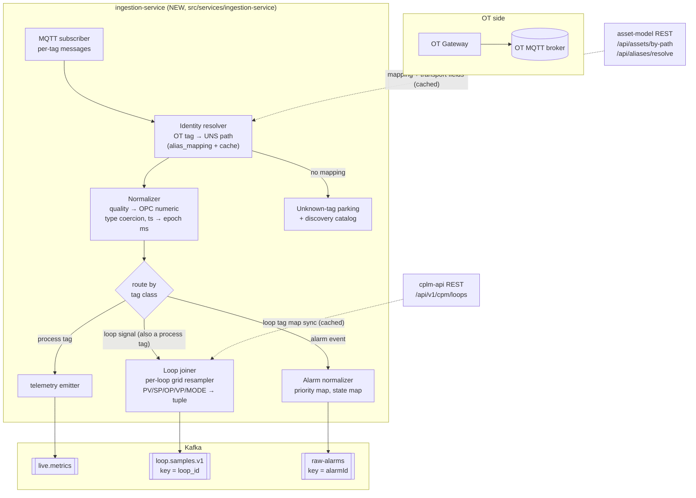
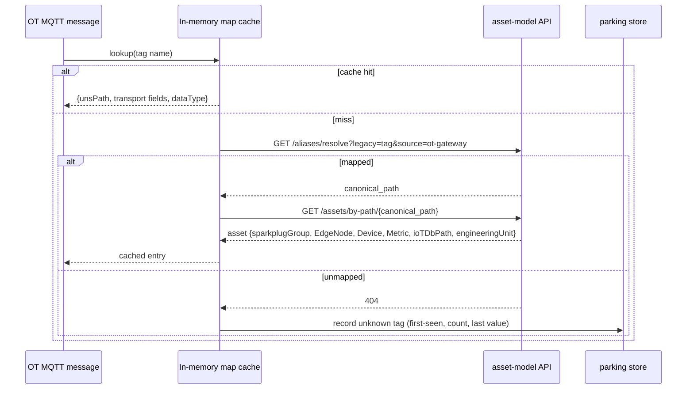
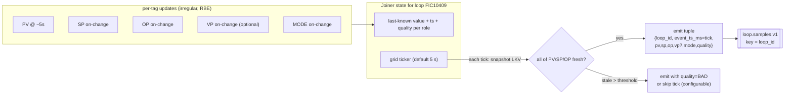
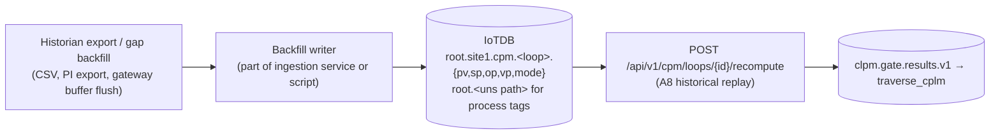

# OT MQTT → Ingestion & Enrichment Service — Design

**Audience:** the team building the new ingestion service that subscribes to the OT gateway's MQTT feed and lands data in the platform.
**Status:** design proposal, 2026-08-18. Grounded in the current code; every named contract here is verified against a consumer in this repo.
**Companion docs:** [01-ot-data-requirements.md](01-ot-data-requirements.md) (the target contracts), [02-uns-asset-tag-loop-configuration.md](02-uns-asset-tag-loop-configuration.md) (the configuration that must exist first).

---

## 1. Starting point — what the platform has and doesn't have

Verified facts about the current repo:

- **There is no inbound MQTT path.** The platform's EMQX broker is egress-only: its ACL allows exactly one identity (`ams_edge`, the sparkplug-edge-node) to publish `spBv1.0/#`, denies publish to everyone else, and browsers are subscribe-only. No EMQX rule engine, no MQTT→Kafka bridge exists.
- **The ingestion boundary is Kafka.** Every processing component (Flink jobs, consumers) reads Kafka. Whatever gets OT data into `live.metrics`, `raw-alarms`, and `loop.samples.v1` has done its job; everything downstream already works.
- **Today's producers are stopgaps:** alarms come from an HTTP snapshot-poller (`AlarmIngestionService` in ams-api, polling a lab feed), telemetry and loop samples come from simulators only. `loop.samples.v1` has **no production producer** — the repo's decision record explicitly scopes "the edge adapter" as a separate project. **This service is that project.**
- Kafka **auto-create is off** — all target topics already exist via `scripts/kafka-reset-lab-topics.ps1`; the service must not assume it can create topics.

So the new service's contract is narrow and stable:

> **Subscribe** to the OT gateway's MQTT broker → **normalize + enrich** → **produce** to `live.metrics`, `raw-alarms`, `loop.samples.v1`.



---

## 2. Transport route decision

Three possible routes for OT data to reach the service; **Option A is recommended.**

### Option A — subscribe to the OT broker directly (recommended)

The service connects as an MQTT client to the **OT gateway's broker** (the one you already built), not to platform EMQX.

- Pros: zero changes to platform EMQX and its locked-down ACL; OT and IT brokers stay independently owned; the browser-facing `spBv1.0/#` namespace never carries unmodeled raw OT data; the OT broker can buffer (persistent sessions / retained last values) while the platform is down.
- Cons: one more connection to operate (MQTT client with reconnect + resubscribe).
- Requirements on the OT broker: QoS 1 for alarms and loop signals (at-least-once), persistent session for the ingestion client, and ideally retained last-value per tag topic so a restart repaints state.

### Option B — OT gateway publishes into platform EMQX

Possible, but requires: a new EMQX credential + ACL rows for an inbound namespace (e.g. `ot/#`), and care that browsers can never subscribe to it. It couples OT publishing availability to the platform broker and mixes two trust domains on one broker. Only worth it if the operations team insists on a single broker to run. The ingestion service design is unchanged either way — only the broker address differs.

### Option C — OT gateway produces straight to Kafka

Cleanest data path on paper, but discards the MQTT investment already made, puts Kafka client + platform credentials on the OT side, and widens the network exposure of the broker. Not recommended given the gateway is already MQTT-based.

### Payload format on the OT topics

Whatever the gateway already emits can work, as long as each message carries **tag identity, value, quality, and source timestamp**. Two common shapes:

1. **Plain JSON per tag** (e.g. topic `ot/<site>/<tag>` payload `{ "tag": "45FIC109.PV", "value": 42.1, "quality": "GOOD", "ts": "2026-08-18T10:00:00.000Z" }`) — simplest; identity mapping is fully the ingestion service's job (§4).
2. **Sparkplug B from the gateway** — self-describing (DBIRTH carries names, aliases, properties like engineering units), standard store-and-forward semantics. If the gateway speaks it, the ingestion service uses the birth certificates to seed its tag inventory automatically. Do **not** point it at platform EMQX just because it's Sparkplug — Option A still applies (subscribe on the OT broker).

Don't block on format debates: the enrichment stages below are identical for both; only the decoder differs.

---

## 3. Service skeleton

Follow the established Traverse service pattern so it inherits the platform's operational model:

- **.NET 8 worker service** in `src/services/ingestion-service/` (BackgroundService hosts; same layout as `sparkplug-edge-node`'s consumer loop and `cplm-api`'s consumer services).
- **No inbound HTTP API surface** except `/health` (+ optionally `/metrics`); it is a data mover, so it does not need gateway routes, `TraverseAuth`, or JWT anything. If it later grows admin endpoints (mapping reload, joiner inspection), those go behind the gateway like every other service.
- **Configuration** via env: OT broker address/credentials/topic filters, Kafka bootstrap, mapping refresh interval, per-loop grid default.
- **Compose entry** in `infra/docker/docker-compose.yml` on the platform network; it needs reachability to the OT broker (likely a host network route or an extra bridge — an ops decision to settle early).
- Internal calls to asset-model use the existing internal service-call mechanism (asset-model is the one service that accepts `X-Service-Key` calls today); calls to cplm-api ride the gateway with a service token, or the loop map can be read directly from the `traverse_cplm` database — **prefer REST** (`GET /api/v1/cpm/loops`) so the registry service remains the single owner of its schema.

---

## 4. Identity resolution — mapping OT tags to the UNS

This answers "how do we map data coming from OT MQTT." The platform already has the right structure for it; use it rather than inventing a parallel one.

### 4.1 The mapping store is `assets.alias_mapping`

The asset model ships a purpose-built table (`assets.alias_mapping`: `legacy_path`, `canonical_path`, `source_system`, `is_active`) with REST endpoints already implemented and gateway-routed:

- `POST /api/aliases` — create a mapping (`asset.edit` permission)
- `GET /api/aliases/resolve?legacy=<ot-tag>&source=<system>` — resolve one (`asset.view`)

Use `source_system = "ot-gateway"` (or one per DCS if there are several), `legacy_path` = the exact OT tag name as it appears on MQTT, `canonical_path` = the UNS contextual path (`site/[area/]unit/device.measurement`). This is exactly the "intended values" pattern the model documents (`"PI-AF"`, `"OPC-DA"` are listed as expected source systems).

### 4.2 Resolution flow inside the service



Two rules that keep the rest of the platform consistent:

1. **Never derive Sparkplug `group/edge/device/metric` yourself.** The platform currently has *three* divergent derivations (asset-model, binding-resolver fallback, and the simulators). Asset-model's computed transport fields (returned on every asset DTO, override-aware) are the authority — copy them into the `live.metrics` record verbatim. That guarantees what the ingestion service publishes is exactly what a display binding resolves to.
2. **Refresh, don't restart.** Subscribe to the asset-model's Redis channel `asset-events` (`asset.created/updated/deleted`) to invalidate cache entries, with a periodic full refresh (e.g. 5 min) as backstop.

### 4.3 Unknown tags — the discovery workflow

Messages whose tag has no alias mapping must **not** be dropped silently and must **not** be auto-created as assets (the UNS is curated — auto-creating garbage paths poisons the designer's tag picker). Instead:

- Count + park them: keep an "unknown tags" inventory (tag name, first/last seen, sample value, message rate). A small table in the service's own DB, surfaced on `/health` details or a future admin page.
- An engineer reviews the inventory, creates the proper Measurement asset (doc 02 §3) and the alias row; the tag starts flowing on the next cache refresh with **no gateway change**.
- Optionally emit parked messages to a `raw.telemetry.site1`-style holding topic (that topic already exists, reserved and unused, 16 partitions) so early data is replayable once mapped. Retention there is the replay window.

This gives you *tag discovery driven by actual traffic* — usually far more accurate than a big up-front DCS export, and it converges fast: the day the gateway goes live, the parking list **is** your real tag list.

### 4.4 Quality, types, timestamps

| Concern | Rule |
|---|---|
| Quality | Normalize once, here: map the gateway's quality representation to OPC numeric (`GOOD→192`, `UNCERTAIN→64`, `BAD→0` — the exact map the edge node already uses). Everything downstream expects numeric-or-`GOOD`-string. |
| Timestamps | Convert to **epoch milliseconds** at ingestion. Prefer source timestamps; if the gateway stamps receive-time, record that fact per source (it degrades SOE and CPM). Reject/flag timestamps in the future or > retention in the past. |
| Types | Coerce to the mapped data type. The historian write path handles Double/Int32; booleans map to Int32/Boolean for Sparkplug; strings pass through for MODE-class tags. The asset model has **no data-type column**, so the mapping cache carries the type (from the gateway's metadata or the alias-load spreadsheet). |
| Deadband | Optional at this layer — the gateway may already RBE. Don't double-apply aggressive deadbands before the loop joiner (it forward-fills anyway, but PV compression distorts oscillation diagnostics; keep loop-signal deadbands at 0 or minimal). |

---

## 5. Routing and the three emitters

A single normalized internal record (`tag identity + UNS path + transport fields + value + quality(int) + ts(ms)`) feeds three emitters. Tag class comes from the mapping cache (a tag can be both a process tag and a loop signal — it then goes to both §5.1 and §5.2).

### 5.1 Telemetry emitter → `live.metrics`

One output record per input update — stateless:

```json
{ "group": "...", "edge": "...", "device": "...", "metric": "...",
  "value": 42.1, "quality": 192, "ts": 1755500000000, "type": "Double",
  "path": "houston/crude1/pump101.discharge_press" }
```

Always include `path` — it is what makes the sparkplug-edge-node also persist the value to IoTDB (`root.<path with / → .>`), i.e. it is the difference between "live-only" and "trendable". No Kafka key required; keying by `device` is a nice-to-have for per-device ordering.

### 5.2 Loop joiner → `loop.samples.v1`

The stateful heart of the service. The engine consumes **merged tuples**, not per-tag updates (doc 01 §4).

**Loop map sync:** every N minutes (and on demand), `GET /api/v1/cpm/loops` from cplm-api; each loop's `tags` carry role → UNS path. Build the inverse index `UNS path → (loop_id, role)`. The `cpm.loop_tag_map` rows also have `source_system`/`source_tag` columns (currently unpopulated) — populate them at loop-registration time (doc 02 §4) and the joiner can map straight from OT tag → (loop, role) without the alias hop.

**Per-loop state machine:**



Rules (each one traces to an engine behavior):

- **Grid default 5 s** per loop (configurable per loop later). The engine infers sample period per window — keep the grid steady; don't emit event-driven irregular tuples.
- **Forward-fill** SP/OP/VP/MODE from last known value; that's how on-change signals become grid samples (validated with real Honeywell data in the repo's own E2E report).
- **Never emit a tuple missing PV/SP/OP** — the engine silently discards it. If a required signal is stale beyond a threshold (e.g. 3× its expected cadence), either skip the tick or emit with `quality: "BAD"` (bad-quality samples count toward exclusion gates instead of vanishing — preferable for diagnosability).
- **MODE vocabulary mapping happens here**: translate the DCS's mode strings onto the engine's sets (`AUTO/AUT/A/CAS/RSP/...` = auto; `MAN/M/IMAN/TRACK/...` = manual) at ingestion so the wire carries canonical values.
- **Kafka key = `loop_id`, exactly as registered** (case matters — the registry enforces case-insensitive uniqueness but the engine keys by the exact string). Emit `event_ts_ms` = grid tick time.
- **Watermark discipline:** tuples must be near-real-time. The Flink jobs tolerate 2 min out-of-orderness; anything older is dropped. If the OT link was down for an hour, do **not** replay that hour into this topic — route it to backfill (§6).
- Include `loop_type` from the registry in each tuple — otherwise the engine guesses the loop class from the loop-id prefix.

### 5.3 Alarm normalizer → `raw-alarms`

If the gateway exposes DCS alarm/event messages, normalize each to the HTTP-feed dialect (doc 01 §3.2), key by `alarmId`:

- Map DCS priority → `CRITICAL/HIGH/MEDIUM/LOW/DIAGNOSTIC` once, in config.
- Emit every transition (ACTIVE, CLEARED, ACK changes). If the gateway can only give a current-alarms snapshot, replicate the existing poller's diff logic (snapshot diff, disappearance ⇒ synthetic CLEARED) inside this service — the pattern already exists in `AlarmIngestionService` and can be lifted almost verbatim, then the ams-api poller is retired for that source.
- Preserve `cookieOffset`/`activeFileTime` if OPC ACK writeback is in scope.

### 5.4 Snapshot safety net (recommended)

Ask the gateway team for a low-frequency (e.g. 60 s) retained "current values + current alarms" snapshot topic in addition to event streams. The ingestion service uses it to (a) self-heal missed events after reconnects, (b) seed the joiner's last-known values on restart without waiting for slow on-change signals to tick.

---

## 6. Historical / late data — the second door

The streaming door has a strict watermark; late data is *dropped silently* (measured in the repo's own E2E: ~81k late records dropped per window operator when replaying 13-day-old data). The platform's sanctioned route for anything older than ~2 minutes:



- Process-tag history → write IoTDB directly at the asset's `ioTDbPath` (REST `POST /rest/v2/nonQuery`, same mechanism the edge node and `RawLoopIotDbConsumer` use). Trends work immediately.
- Loop history → write the loop device `root.site1.cpm.<safeLoopId>` with measurements `pv,sp,op,vp,mode`, then trigger **recompute** per loop. Caveats (verified): recompute produces **gate results only** (no short/long feature rows, so `/kpis` stays empty for history-only loops), and IoTDB node sanitization differs from Sparkplug sanitization — use the platform's `SafeNode` rule (non-alphanumeric → `_`, digit-prefix guard).
- Alarm history backfill has no replay engine hook from IoTDB today; treat pre-cutover alarm history as out of scope or import to `root.ams.site1.alarms.*` for trend-style viewing only.

**Store-and-forward guidance for the gateway:** buffer during platform outages, but on reconnect deliver only the last ≤2 minutes to the live topics; hand anything older to the backfill door. Simplest robust policy: gateway keeps a rolling on-disk buffer; ingestion service, on detecting a gap, pulls the gap window from the buffer via the snapshot/backfill route.

---

## 7. Delivery semantics, ordering, idempotency

| Aspect | Policy |
|---|---|
| MQTT QoS | 1 (at-least-once) for alarms + loop signals; 0 acceptable for high-rate telemetry if the snapshot net (§5.4) exists |
| Kafka producer | `acks=all`, idempotent producer on; at-least-once end-to-end |
| Duplicates | Downstream is tolerant by design: alarm state machine dedups by alarm key; IoTDB writes are timestamp-keyed upserts; CPM windows tolerate duplicate samples (same ts overwrites in the historian, in-window dupes marginally weight stats — keep the joiner emitting each grid tick once) |
| Ordering | Only `loop.samples.v1` strictly needs per-key order (key = loop_id gives it); keep one producer instance per loop key-space or partition-affine workers |
| Backpressure | If Kafka is unavailable, pause MQTT consumption (persistent session holds QoS-1 messages at the broker) — mirrors the edge node's pause-while-MQTT-down pattern in reverse |
| Scaling | Stateless stages scale horizontally; the loop joiner is sharded by loop_id (consistent hashing) so one loop's state lives in one worker |

---

## 8. Observability & fail-loud rules

Follow the platform's established fail-loud posture:

- **Metrics** (Prometheus, like other services): messages in/out per topic, unknown-tag count, mapping-cache size + age, per-loop tuple emit rate, per-loop staleness, Kafka delivery failures, MQTT reconnect count.
- **Deadman integration:** the platform already runs `TelemetryDeadmanWatchdogService` on `raw-alarms` (silence ⇒ `lifecycle-alerts` ⇒ notification-service). Add equivalent deadman expectations for `live.metrics` and `loop.samples.v1` (either extend that watchdog or emit heartbeat tags through the normal path).
- **No silent drops:** every discarded message increments a labeled counter (`unmapped`, `bad_ts`, `stale_skip`, `late`); the unknown-tag inventory is reviewable.
- **CPM readiness ties in automatically:** once loops flow, `GET /api/v1/cpm/loops/{id}/readiness` and `/pipeline-status` become the acceptance check — they verify samples, Flink jobs, and binding provenance end-to-end.

---

## 9. Build order

| Phase | Deliverable | Acceptance |
|---|---|---|
| 0 | Compose service + MQTT subscribe + raw message counter; parking store for 100% of traffic (nothing mapped yet) | unknown-tag inventory fills with the real OT tag list |
| 1 | Alias mappings loaded for a pilot unit (doc 02 §6); telemetry emitter → `live.metrics` | pilot tags live on an HMI display + Redis snapshot + IoTDB trend (compare against `scripts/sim/process_value_sim.py` behavior) |
| 2 | Loop joiner for 1–2 pilot loops registered in `/cpm/registry` | `readiness` all green; first gate verdicts after ≥12 h; KPI pages populate |
| 3 | Alarm normalizer for the gateway's alarm feed; retire the HTTP poller for that source | alarm list live; state machine transitions correct; deadman quiet |
| 4 | Backfill door + gap handling; snapshot safety net; deadman coverage for all three topics | kill-the-link chaos test: no silent loss, gaps land via recompute |
| 5 | Scale-out + multi-site naming review (group/edge per site vs the current `ams_site1` defaults) | second site onboards with config only |

Existing assets to reuse while building: `ams-sims/sim_loop_samples.py` and `scripts/sim/process_value_sim.py` are reference producers for the exact target contracts; `scripts/cplm-replay-csv-live.ps1` and the B2_027PIC E2E report document the proven backfill+recompute path; `mock-dcs` stands in for the ACK endpoint.

> **Status update (2026-08-31):** the **loop plane of phase 2 is implemented** — the
> `MQTT_LOOP_SAMPLES` subscriber pipeline (topic/payload validation → loop-registry
> resolution → enrichment → 5 s joiner → `traverse.cpa.loop.samples.v1`, with
> `traverse.ingestion.ot-dlq` + `ingestion.unknown_sources` parking) now lives in
> `src/services/ingestion-service/Pipeline/`. The real gateway hierarchy differs from
> the `ot/loops/#` sketch above — see [08-ot-mqtt-loop-ingestion-assessment.md](08-ot-mqtt-loop-ingestion-assessment.md)
> (decisions/evidence), [09-ot-mqtt-loop-mapping.md](09-ot-mqtt-loop-mapping.md)
> (field contract) and [10-ot-loop-ingestion-runbook.md](10-ot-loop-ingestion-runbook.md)
> (operations). Telemetry/alarm/PRM profiles remain per this design.
