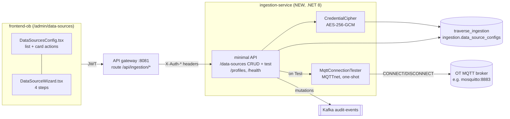

# MQTT Data-Source Configuration — End-to-End Implementation Plan

**Phase scope:** configuration mechanism only (storage → service → gateway → UI → tests). Subscriber pipeline deferred.
**Prereq reading:** [04-mqtt-source-config-analysis.md](04-mqtt-source-config-analysis.md) (decisions + spec mapping), the spec itself for §4/§6/§10 details.
**Date:** 2026-08-21.

---

## 0. Component overview



---

## 1. Database (2 scripts + self-heal)

### 1.1 `database/scripts/45_traverse_ingestion_db.sql`

Mirrors `29_traverse_cplm_db.sql`: create database `traverse_ingestion` owner `ams_user` (guarded, idempotent).

### 1.2 `database/scripts/46_ingestion_data_sources.sql`

`\c traverse_ingestion`, `CREATE SCHEMA IF NOT EXISTS ingestion`, then the spec §2 table adapted:

```sql
CREATE TABLE IF NOT EXISTS ingestion.data_source_configs (
    config_id              UUID PRIMARY KEY DEFAULT gen_random_uuid(),
    source_type            VARCHAR(50)  NOT NULL DEFAULT 'MQTT' CHECK (source_type IN ('MQTT')),
    profile_type           VARCHAR(50),
    name                   VARCHAR(255) NOT NULL,
    description            TEXT,
    connection_url         TEXT         NOT NULL,
    username               VARCHAR(255) NOT NULL,
    password_encrypted     TEXT         NOT NULL,
    timeout_seconds        INTEGER      DEFAULT 30 CHECK (timeout_seconds > 0),
    insecure_skip_verify   BOOLEAN      DEFAULT FALSE,
    profile_config         JSONB        DEFAULT '{}',
    is_active              BOOLEAN      DEFAULT TRUE,
    last_connection_test   TIMESTAMPTZ,
    last_connection_status VARCHAR(20)  CHECK (last_connection_status IN ('SUCCESS','FAILED','PENDING')),
    last_connection_error  TEXT,
    last_data_received     TIMESTAMPTZ,
    created_at             TIMESTAMPTZ  NOT NULL DEFAULT NOW(),
    created_by             VARCHAR(100) NOT NULL,
    updated_at             TIMESTAMPTZ  NOT NULL DEFAULT NOW(),
    updated_by             VARCHAR(100),
    version                INTEGER      NOT NULL DEFAULT 1
);
CREATE INDEX IF NOT EXISTS idx_dsc_is_active    ON ingestion.data_source_configs(is_active);
CREATE INDEX IF NOT EXISTS idx_dsc_profile_type ON ingestion.data_source_configs(profile_type);
-- touch trigger: updated_at = NOW(), version = OLD.version + 1  (spec §2, verbatim logic)
```

### 1.3 `database/scripts/47_ingestion_permissions.sql`

Mirrors `33_cpm_permissions.sql`: `\c traverse_auth`; insert `ingestion.view` / `ingestion.manage` (category `ingestion`); **Admin-only** (user decision) — the Admin catch-all re-run grants both, no Engineer rows. Idempotent (`ON CONFLICT DO NOTHING`).

### 1.4 Startup self-heal DDL (required)

Init scripts run only on an **empty** Postgres volume — every existing lab/prod environment gets the schema from the service instead. `Program.cs` executes the §1.2 DDL (CREATE SCHEMA/TABLE/INDEX/trigger IF NOT EXISTS) at startup, exactly like asset-model does for `asset_relationships`. The permissions script has no self-heal (auth-service owns that DB); for existing volumes it is applied manually or via the ops runbook — same story as scripts 33/37 had.

---

## 2. RBAC catalog sync (3 places + CI guard)

1. `src/services/auth-service/src/rbac/permission-catalog.ts` — add both keys (canonical source).
2. `src/services/auth-service/database/schema.sql` — same inserts.
3. Script `47` (§1.3) for existing volumes.
4. Run `node scripts/verify-permission-catalog.mjs` — must pass, it fails CI on divergence.
5. Frontend gate: [App.tsx](../../src/frontend-ob/src/App.tsx) `/admin/*` route — extend `anyOf` to `['admin.users.edit','admin.audit.view','rbac.manage','ingestion.view','ingestion.manage']`.

---

## 3. The service — `src/services/ingestion-service/`

Skeleton copied from `asset-model` (closest shape: minimal API + EF-less is fine here — use Npgsql directly for the dynamic partial UPDATE, or EF Core with explicit SQL for that one statement; recommendation: **Npgsql + parameterized SQL**, the spec's own idiom, small surface).

```
src/services/ingestion-service/
├── Program.cs                    # endpoints, self-heal DDL, DI, health
├── ingestion-service.csproj      # net8.0; Npgsql, MQTTnet(v4), Confluent.Kafka (audit), prometheus-net
├── Auth/TraverseAuth.cs          # byte-identical copy — add this path to scripts/sync-auth-module.ps1's target list
├── Models/DataSourceConfig.cs    # row model + redacted DTO + request DTOs
├── Services/CredentialCipher.cs  # AES-256-GCM + PBKDF2 (spec §4 port; 12-byte nonce)
├── Services/MqttConnectionTester.cs  # spec §6 port on MQTTnet
├── Services/ProfileRegistry.cs   # static registry; phase 1: MQTT_PRM metadata only
├── Services/AuditEmitter.cs      # audit-events producer (copy cplm-api's emitter pattern)
├── appsettings.json
└── Dockerfile                    # copy asset-model's, swap project name
```

### 3.1 Endpoints (service-local; public = prefix `/api/ingestion`)

| Method + route | Policy | Behavior |
|---|---|---|
| `GET /health` | anonymous | DB reachability + `ENCRYPTION_KEY` presence check (`degraded` w/ 503 pattern like asset-model) |
| `GET /data-sources` | `ingestion.view` | List, redacted DTOs, ordered by name |
| `GET /data-sources/active` | `ingestion.view` | `is_active = true` only, redacted |
| `GET /data-sources/{id:guid}` | `ingestion.view` | One, redacted; 404 if missing |
| `POST /data-sources` | `ingestion.manage` | Validate (§3.3) → encrypt password → INSERT → audit → 201 + redacted row |
| `PUT /data-sources/{id:guid}` | `ingestion.manage` | Partial update: only provided fields in the SET list; **`password` absent or `""` ⇒ `password_encrypted` untouched** (spec INVARIANT); audit |
| `DELETE /data-sources/{id:guid}` | `ingestion.manage` | Hard delete (spec behavior) + audit |
| `POST /data-sources/{id:guid}/test` | `ingestion.manage` | Decrypt → MQTTnet one-shot connect (§3.4) → persist `last_connection_test/status/error` → return `{ ok, error?, latencyMs }` + audit |
| `POST /data-sources/{id:guid}/activate` / `/deactivate` | `ingestion.manage` | Set `is_active`; audit |
| `GET /profiles` | `ingestion.view` | Registered profiles: `[{ profileType: "MQTT_PRM", displayName: "PRM (MQTT Gateway)", transport: "MQTT", description: "OT gateway pushes one MQTT message per PRM diagnostic row…" }]` |

Redacted DTO rule (INVARIANT): the row's `password_encrypted` never leaves the service in any form; DTO carries `hasPassword: true` instead. `created_by`/`updated_by` = username from the gateway's `X-Auth-*` identity headers.

### 3.2 CredentialCipher

Port of spec §4: `ENCRYPTION_KEY` env (fail startup if unset or < 32 chars — fail-loud beats limping without the ability to save sources), PBKDF2(SHA-256, 100k, salt 64) → AES-256-GCM, output `base64(salt‖nonce(12)‖tag(16)‖ct)`. Key-rotation caveat documented in appsettings comment: rotating orphans stored passwords.

### 3.3 Validation matrix (server-side; UI mirrors it)

| Field | Rule |
|---|---|
| `name` | required, ≤255 |
| `connection_url` | required; must match `^(mqtt|mqtts)://[^/:\s]+(:\d+)?$`; help mirrors spec (mqtts→8883, mqtt→1883) |
| `username` | required (spec column NOT NULL) |
| `password` | required on create; on update blank = keep |
| `profile_type` | must exist in ProfileRegistry |
| `profile_config.mqtt.topics` | ≥1 non-blank after trim; each filter: `#` only as the **last** character; `+` allowed as a full level |
| `qos` | 0/1/2, default 1 |
| `session_expiry_seconds` | ≥0, default 86400 |
| `keepalive_seconds` | >0, default 60 |
| `timeout_seconds` | >0, default 30 |
| `client_id` | optional; if set: 1–64 chars, `[A-Za-z0-9_-]`; blank ⇒ derived `ingestion-<config_id>` (derivation helper is the single source, surfaced in the DTO as `effectiveClientId`) |
| TLS coherence | at most one of `ca_cert_pem` / `ca_cert_path` set; `ca_cert_pem` must contain `-----BEGIN CERTIFICATE-----`, must NOT contain `PRIVATE KEY`, ≤64 KB; `insecure_skip_verify=true` ⇒ both CA fields must be empty |

400s carry `{ error, field }` so the wizard can highlight the offending step.

### 3.4 MqttConnectionTester (spec §6 on MQTTnet)

- Client id `test-<unix-ms>`, clean session, MQTT 5, **no reconnect**, timeout = row's `timeout_seconds`.
- `mqtts://` ⇒ TLS options: custom CA chain validation when `ca_cert_pem`/`ca_cert_path` present; `insecure_skip_verify` ⇒ accept-all callback; `tls.servername` → SNI/target host override.
- Error mapping preserves the spec's operational hint: a bare protocol/handshake error appends *"…usually means the broker's TLS certificate does not list '<host>' in its SANs"*.
- Always disconnect/dispose; measure latency; persist the three columns in one UPDATE.

---

## 4. Gateway + compose wiring

1. **Gateway** `src/services/gateway/appsettings.json`: routes `api-ingestion` (`/api/ingestion/{**rest}`) + `api-ingestion-bare`, transform `PathRemovePrefix: /api/ingestion`, `AuthorizationPolicy: default`, new cluster `ingestion` → `http://ingestion-service:5000`. (Specific routes outrank the `/api/*` catch-all — same as every other service.)
2. **Compose** `infra/docker/docker-compose.yml`: service `ingestion-service` — build context `src/services/ingestion-service`, no published ports, networks like asset-model, healthcheck `/health`, env: `ConnectionStrings__Db` → `traverse_ingestion`, `Auth__*` (JWKS/issuer/audience/ServiceKey per sibling services), `ENCRYPTION_KEY: ${INGESTION_ENCRYPTION_KEY}`, `Kafka__BootstrapServers` + `Kafka__AuditTopic: audit-events`. Add `INGESTION_ENCRYPTION_KEY` to `.env`/`.env.example` (≥32 chars).
3. **`scripts/sync-auth-module.ps1`**: add the new `Auth/TraverseAuth.cs` copy to its sync list.
4. **Docs**: add the route to [docs/api-gateway.md](../api-gateway.md) route table; note the service in `architecture_document.md`'s service inventory if it lists services.

No nginx/frontend-proxy change needed: `/api/*` already rides to the gateway from both the dev Vite proxy and the SPA nginx.

---

## 5. Frontend — Administration "Data Sources" tab

New files under `src/frontend-ob/src/components/Administration/`:

```
DataSourcesConfig.tsx      # tab content: list page + wizard host (pattern: AlarmFeedConfig)
DataSourceWizard.tsx       # 4-step wizard (create + edit modes)
dataSourcesApi.ts          # typed fetch layer + react-query hooks (list/get/create/update/delete/test/activate/profiles)
```

Wiring:

- `Administration.tsx`: add `{ path: '/admin/data-sources', label: 'Data Sources', Icon: <obi database-ish icon from custom-elements.json>, permission: 'ingestion.view' }` to `TABS` + a `<Route path="data-sources" …/>` gated on the permission like Users/Roles.
- `App.tsx`: extend the `/admin/*` `anyOf` list (§2.5).

**Mandatory:** load the `openbridge` skill before writing these components; resolve any icon from `custom-elements.json` (no guessing); all colors/spacing via tokens — follow the existing `T`-token idiom of the Administration shell; lint must stay clean (`--max-warnings 0`).

### 5.1 List page (screenshot 5)

Card per config: name; pills for `Active/Off` (`is_active`), transport (`MQTT`), first topic filter; fields: Connection URL, Username, QoS + keepalive, Timeout, Last Connection Test (status icon + timestamp; error text on FAILED, truncated with title), Last Data Received ("—" until phase 2). Actions: **Test** (spinner while running; refreshes row), **Edit** (opens wizard prefilled), **Off/On** (deactivate/activate with confirm), **Delete** (confirm dialog). Header button **+ New Configuration**. Empty state text points at the wizard.

### 5.2 Wizard (screenshots 1–4)

Stepper header (4 steps, check-marked when valid, matching the screenshot layout):

1. **Profile Selection** — profile select fed by `GET /profiles`, description under the field; read-only Transport Type derived from the profile.
2. **Basic Information** — Name (required), Description.
3. **Connection Settings** — Broker URL (placeholder + scheme/port help text), Username, Password (edit mode: *"leave blank to keep current password"*).
4. **Advanced Options** — Topic Filters repeatable rows (+ Add topic, delete per row; wildcard help text from the spec), QoS select (default 1 + queueing help), Client ID (placeholder shows `effectiveClientId`; stability help text), Session Expiry (default 86400 + the amber MQTT-5-defaults-to-0 warning), Keepalive (60), Clean session checkbox (default off + loss warning), **TLS block** — rendered only when URL is `mqtts://`: three-way radio (Upload CA → FileReader → client-side validation per spec §10 → `ca_cert_pem`; Server CA path → `ca_cert_path` + server-relative warning; Don't verify → `insecure_skip_verify` + explicit warning) with mode-switch clearing the other modes; when `mqtt://`, the informational "plaintext, nothing here applies — use mqtts:// outside a trusted network" note (screenshot 1). Timeout (30). **Next-steps info box**: (1) click Test; (2) *ingestion runtime arrives in a later phase — configs take effect then*; (3) OT tags must be mapped in the asset model / alias table before data can land. **Create Configuration** / **Save Changes** submit.

Per-step validation gates Next; server 400 `{field}` routes focus back to the owning step. Mutations via react-query with list invalidation; Test uses a mutation returning `{ok,error,latencyMs}` and refetches the row.

---

## 6. Audit events

Emit to `audit-events` (existing topic, consumed by audit-service) on create/update/delete/activate/deactivate/test — event shape copied from the cplm-api emitter (actor from `X-Auth-*`, action `ingestion.datasource.<verb>`, resource `config_id`, details: name + broker host **only** — never username+password together, never password ever).

---

## 7. Build order (each step leaves the tree green)

| # | Step | Verify |
|---|---|---|
| 1 | DB scripts 45/46/47 + RBAC catalog 3-way sync | `node scripts/verify-permission-catalog.mjs` passes |
| 2 | Service skeleton: csproj, Program.cs w/ self-heal DDL, health, TraverseAuth copy, Dockerfile | `dotnet build`; `dotnet run` + `GET /health` OK against lab Postgres |
| 3 | CredentialCipher + unit tests | round-trip, tamper, short-key tests green |
| 4 | CRUD endpoints + validation + redaction + audit | unit/integration tests green |
| 5 | MqttConnectionTester + `/test` endpoint | integration test vs disposable Mosquitto |
| 6 | Gateway route + compose service + sync-auth-module + `.env` | stack up; `curl :8081/api/ingestion/data-sources` with a token → 200/403 correctly |
| 7 | Frontend api layer + list page + wizard + tab/route gating | `npm run lint` (0 warnings), `npm run build`; manual flow vs screenshots |
| 8 | E2E script + docs | §8 script green |

---

## 8. Test plan

### 8.1 Unit (new `src/services/ingestion-service.Tests` or the repo's service-test convention)

- **CredentialCipher**: encrypt→decrypt round-trip; tampered ciphertext throws; key <32 chars refuses; two encryptions of one plaintext differ (salt/nonce fresh).
- **Blank-password rule**: PUT with `password: ""` and with password absent ⇒ `password_encrypted` byte-identical; PUT with a value ⇒ changed.
- **Validation**: URL scheme/host cases; topic `#` placement (`a/#` ok, `a/#/b` rejected, `#` ok); TLS coherence (pem+path together rejected; skip-verify + CA rejected; key-material-in-pem rejected).
- **Redaction**: serialize every DTO path; assert no `password` substring.
- **Partial update**: only provided columns in SET; version bumps via trigger.

### 8.2 Integration (service against real broker)

Disposable broker (spec §13's command): `docker run -d --name mqtt-test -p 1883:1883 eclipse-mosquitto sh -c "echo -e 'listener 1883\nallow_anonymous true' > /mosquitto/config/mosquitto.conf && mosquitto"`

- Test endpoint vs live broker ⇒ `SUCCESS` persisted with timestamp; vs stopped broker ⇒ `FAILED` + timeout error persisted; vs wrong-port ⇒ FAILED fast. (TLS-path test optional now: self-signed mosquitto + CA upload — include if time allows, else covered manually.)

### 8.3 End-to-end — `scripts/test-ingestion-config-e2e.ps1`

Against the running stack (gateway :8081, admin token): create config (mqtt://host.docker.internal:1883, topic `prm/data/#`) → GET list shows redacted row → POST test ⇒ SUCCESS on row → PUT rename with blank password → POST test still SUCCESS (credential survived the edit — the spec's classic regression) → deactivate/activate → RBAC probe: viewer-role token gets 403 on POST, 403 on GET (no `ingestion.view`) → delete → 404 on GET. Cleanup broker container. Print PASS/FAIL per step, exit non-zero on any failure (house E2E-script style).

### 8.4 Frontend

`npm run lint` + `npm run build` clean; manual walkthrough against the four screenshots (create mqtt://, create mqtts:// with CA upload validation messages, edit-keeps-password, Off/On, Test success + failure rendering, wizard step validation blocking Next).

---

## 9. Acceptance checklist (definition of done for this phase)

- [ ] Config CRUD + test + activate/deactivate working end-to-end through the gateway with edge-auth permissions enforced
- [ ] Passwords AES-256-GCM at rest; never in any response, log line, or audit event; blank-on-edit keeps current
- [ ] Test button: throwaway client id, one attempt, result persisted + shown on the list card
- [ ] Wizard matches the four screenshots (fields, defaults, help/warning texts, TLS three-way with CA-upload validation)
- [ ] `verify-permission-catalog.mjs` green; users with only ingestion permissions can reach `/admin/data-sources`
- [ ] `dotnet build` + unit/integration tests green; `npm run lint`/`build` clean; E2E script green
- [ ] Scripts 45–47 idempotent; service self-heals schema on an existing volume
- [ ] docs/api-gateway.md updated; audit events visible in the Audit Log tab
- [ ] No subscriber code — but `profile_type`/`profile_config`/`last_data_received`/`effectiveClientId` all in place for phase 2
