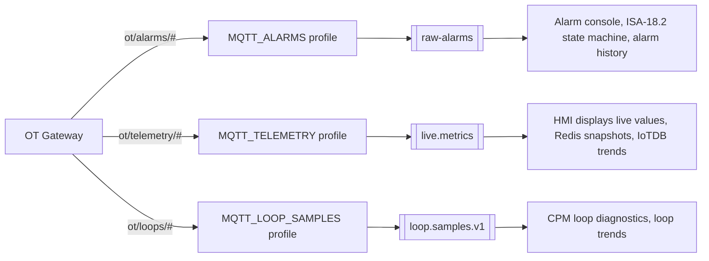

# MQTT Topic & Payload Contracts — What the OT Gateway Must Publish Per Module

**Audience:** the OT gateway team. This is the publishing contract for the three data-source profiles the ingestion service consumes: **Alarms**, **Process Telemetry (HMI displays & trends)**, and **Control-Loop Signals (CPA/CPM)**.
**Status:** 2026-08-23. Every "the platform requires…" statement below is traced to a verified consumer contract in this repo (doc [01-ot-data-requirements.md](01-ot-data-requirements.md) has the file-level evidence); the MQTT topic/payload shapes are the recommended gateway-side encoding of those requirements — field names on MQTT may differ, but every **required** item must be present and mappable.
**Companion docs:** [03-mqtt-ingestion-enrichment-service.md](03-mqtt-ingestion-enrichment-service.md) (how ingestion maps these onto Kafka), [04](04-mqtt-source-config-analysis.md)/[05](05-mqtt-source-config-implementation-plan.md) (the configuration feature).

---

## 0. How this fits together

One data-source configuration per module (picked in the wizard's profile dropdown). Each subscribes its own topic family and — in phase 2 — routes through its own parser to its own pipeline:



**"Display and design" has no MQTT feed of its own.** The Designer binds symbols to UNS paths (configuration only); what displays *show at runtime* is the **Process Telemetry** stream — so "data for displays" = telemetry for every tag anyone will bind, plus the configuration-time tag metadata in §2.4.

### 0.1 Conventions that apply to every module

| Concern | Rule |
|---|---|
| **Timestamps** | Source timestamp (from DCS/OPC server, not gateway receive time), as epoch **milliseconds** or ISO-8601 **with timezone**. Never local time without zone. NTP-sync the gateway. |
| **Quality** | Every value/sample carries quality: OPC numeric (`192` Good, `64` Uncertain, `0` Bad) or the strings `GOOD`/`UNCERTAIN`/`BAD`. Omitted quality is treated as Good — only omit if the gateway genuinely cannot know. |
| **Tag identity** | The exact, stable OT tag name (e.g. `45FIC109.PV`). It is the join key to the platform's UNS via the alias mapping — renames break the mapping. Name-based only; the platform uses no OPC NodeIds. |
| **QoS / sessions** | QoS 1 on alarms and loop signals (broker queues during ingestion downtime); QoS 0 acceptable for high-rate telemetry *if* a snapshot topic (§0.2) exists. Payloads ≤ 256 KB (broker default limits). |
| **Topic naming** | Lowercase, `/`-separated, no spaces, `+`/`#`-safe (no `+` or `#` inside level names). One logical record per message — no multi-record batch arrays unless stated (loops Option B). |
| **JSON** | UTF-8 JSON objects. Unknown extra fields are fine (ingestion preserves them); missing **required** fields dead-letter the message. |
| **Retained** | Retain the last value per telemetry topic (paint-on-open after restarts). Do **not** retain alarm event messages (a retained stale event replays as a live transition). |

### 0.2 Snapshot safety net (strongly recommended, all modules)

Alongside the event streams, publish a low-frequency (30–60 s) **retained** snapshot per module:

- `ot/snapshot/alarms` — the complete current-alarm list (array). Lets ingestion self-heal a missed CLEAR after a link outage (disappearance from the snapshot ⇒ synthetic clear).
- `ot/snapshot/telemetry/<site>` — current value of every published tag (or rely on per-topic retained values).

---

## 1. Module 1 — Alarms (`MQTT_ALARMS` → `raw-alarms` → CAMS)

### 1.1 What the platform does with it

Every message becomes an event into the ISA-18.2 alarm state machine (validation → dedup → enrichment → lifecycle → correlation → flood detection), then the alarm console, KPIs, and alarm history at `root.ams.site1.alarms.*`. The state machine is **event-sourced**: it only knows what you tell it — a missed CLEARED leaves a standing alarm forever, which is why every transition must be an event and the snapshot net (§0.2) matters.

### 1.2 Topic structure

```
ot/alarms/<site>/<source_tag>          one message per alarm state transition
ot/snapshot/alarms                     retained current-alarm list, every 30–60 s
```

Example: `ot/alarms/houston/45FIC109`. Site level lets one subscription (`ot/alarms/houston/#`) scope a plant.

### 1.3 Payload — one message per **transition** (ACTIVE, CLEARED, ACK change, priority change)

```jsonc
{
  // ── REQUIRED ──────────────────────────────────────────────
  "source_tag":    "45FIC109",               // the alarming point (tag NAME, stable)
  "condition":     "PVHIGH",                 // alarm condition: HI, HIHI, LO, DEV, PVHIGH, …
  "state":         "ACTIVE",                 // ACTIVE | CLEARED  (or send "active": true/false)
  "event_time":    "2026-08-23T10:00:00.000Z", // when it happened at the DCS (or event_ts_ms epoch)

  // ── STRONGLY RECOMMENDED ──────────────────────────────────
  "priority":      "HIGH",                   // see the band table below
  "message":       "Column feed flow high",  // operator-facing text
  "acknowledged":  false,                    // current ack state; send a message when it CHANGES too
  "event_id":      "b2f6…",                  // gateway-unique id per occurrence (dedup/traceability)

  // ── OPTIONAL / SITUATIONAL ────────────────────────────────
  "sub_condition": "TRIP",                   // OPC A&E sub-condition if the DCS has them
  "severity":      700,                      // raw OPC severity 1–1000, if available
  "quality":       192,
  "value":         142.7, "unit": "m3/h",    // process value at alarm time (shown in console if present)
  "server_id":     "centum-a",               // which DCS/A&E server (multi-server sites)
  "ack_handle":    { "cookieOffset": 12345, "activeFileTime": "…" }  // ONLY if OPC ACK write-back is in scope
}
```

**Priority mapping** — agree it once; ingestion translates DCS priorities into the platform bands:

| Platform band | Severity | Typical DCS meaning |
|---|---|---|
| `CRITICAL` | 900 | Emergency / trip |
| `HIGH` | 700 | High |
| `MEDIUM` | 400 | Medium (platform default when absent: 300) |
| `LOW` | 100 | Low / advisory |
| `DIAGNOSTIC` | 50 | System/diagnostic |

### 1.4 Hard rules

1. **`source_tag` + `condition` are the alarm's identity** — empty either and the platform drops the record. Together (+ optional `sub_condition`, `server_id`) they must uniquely and *stably* identify one alarm; the platform derives a stable alarm id from them when the gateway doesn't send one.
2. **CLEARED must be sent** (or `active:false`) — return-to-normal is an event, not an absence of events.
3. **ACK changes are events in both directions**: if an operator acks at the DCS console, publish `acknowledged: true`; the platform honours external acks. If AMS acks must reach the DCS, the original event must have carried the `ack_handle` and the gateway/DCS must expose the ACK endpoint (doc 01 §5).
4. Cadence: event-driven (no polling artifacts). Expected volume ~0.5–2 events/s steady state, design for 50+/s flood bursts (the platform has flood detection; don't rate-limit at the gateway).

---

## 2. Module 2 — Process Telemetry for Displays & Trends (`MQTT_TELEMETRY` → `live.metrics` → HMI/Historian)

### 2.1 What the platform does with it

Each tag update fans out three ways: live value on HMI displays (Sparkplug/EMQX → browser), Redis snapshot (instant paint when a display opens), IoTDB history (trends). **A tag that is not in the UNS asset model is invisible** — the designer's tag picker only offers modelled measurements, and unmapped inbound tags are parked, not auto-created. So the scope question is not "all 50,000 DCS tags" but *"every tag someone will put on a display or trend"* — driven by the display inventory.

### 2.2 Topic structure

```
ot/telemetry/<site>/<unit>/<tag>       one message per tag value change (RBE), RETAINED
```

Example: `ot/telemetry/houston/crude1/45TI222.PV` (retained ⇒ new subscribers get the last value immediately). If the gateway can't split site/unit into topic levels, `ot/telemetry/<tag>` is acceptable — the UNS placement comes from the alias mapping anyway; topic structure just makes scoped subscriptions and debugging easier.

### 2.3 Payload — one message per tag update

```jsonc
{
  // ── REQUIRED ──────────────────────────────────────────────
  "tag":       "45TI222.PV",            // exact stable OT tag name (the alias-mapping key)
  "value":     87.4,                     // number | boolean | string (numeric preferred)
  "ts":        1755940000000,            // source timestamp, epoch ms (or ISO-8601+zone)

  // ── STRONGLY RECOMMENDED ──────────────────────────────────
  "quality":   192,                      // OPC numeric or GOOD/UNCERTAIN/BAD
  "type":      "Double",                 // Double | Int32 | Boolean | String — historian handles Double/Int32

  // ── OPTIONAL ──────────────────────────────────────────────
  "unit":      "degC",                   // helps discovery; authoritative EU lives in the asset model
  "site":      "houston", "area": "crude" // traceability only — the UNS placement is authoritative
}
```

### 2.4 Report-by-exception & cadence

- **RBE is expected and welcome**: publish on change (with a sensible deadband) plus a **max-age republish every ~60 s** per tag so staleness is detectable and the retained value stays fresh.
- Analog deadbands: small enough not to flatten trends (rule of thumb ≤ 0.5% of range). Discrete/status tags: every transition.
- Sizing reference: a 500-tag pilot at RBE is typically < 50 msg/s; the pipeline comfortably takes thousands/s.

### 2.5 The configuration-time half (what "display & design" additionally needs — NOT streamed)

Per tag, delivered once as an engineering export (spreadsheet/CSV per doc 02 §6): exact OT tag name • description • engineering unit • range lo/hi • site/unit/device placement • data type • device template (Pump/Tank/…). This builds the UNS measurement assets + alias mappings that (a) make the tag pickable in the Designer and (b) let ingestion map `tag` → UNS path → Sparkplug/IoTDB addresses. **Without the mapping, telemetry for that tag parks in the unknown-tag inventory** — which is itself a legitimate discovery workflow (publish first, map from the observed list).

---

## 3. Module 3 — CPA / Control-Loop Signals (`MQTT_LOOP_SAMPLES` → `loop.samples.v1` → CPM)

### 3.1 What the platform does with it

The CPM engine diagnoses each loop from **time-aligned tuples** — one record per loop per sample instant containing PV, SP, OP (and ideally VP, MODE) together, keyed by the loop id registered in the CPM Loop Registry. Verified hard rules that shape everything below:

- A tuple missing a numeric **PV, SP or OP is silently discarded** (deliberately not defaulted to 0).
- **No VP** ⇒ valve diagnostics report `INSUFFICIENT_EVIDENCE` and overall confidence is capped at 0.89 — wire VP wherever a positioner exists.
- **MODE strings must land in the engine's vocabulary** — AUTO set: `AUTO, AUT, A, AUTOMATIC, NORMAL, NORM, CAS, CASC, CASCADE, RSP, DDC, SUP, SUPERVISORY`; MANUAL set: `MAN, MANUAL, M, IMAN, ROUT, LO, LOCAL, OFF, TRACK`. Anything else counts as unknown and hurts eligibility. Ingestion maps site-specific strings, but publish the raw DCS mode string consistently.
- **Late data is dropped by the streaming engine** (~2 min tolerance). After an outage, do not replay old samples onto the live topic — history goes through the backfill door (IoTDB + recompute, doc 03 §6).
- The engine wants a **steady grid** (5 s proven with real Honeywell data) and ≥ 12 h of continuous samples before first verdicts; ≥ 32 samples per long window.

### 3.2 Two publishing options — pick per gateway capability

**Option A — per-tag (default expectation).** The gateway publishes each loop signal as an ordinary telemetry-style message; the **ingestion service joins** them onto the loop's 5 s grid (forward-filling on-change signals) using the loop registry's role map.

```
ot/loops/<site>/<loop_id>/<role>          role ∈ pv | sp | op | vp | mode
```
```jsonc
// topic ot/loops/houston/FIC10409/pv
{ "tag": "45FIC109.PV", "loop": "FIC10409", "role": "PV",
  "value": 42.1, "ts": 1755940000000, "quality": 192 }
```
Requirements: PV at a steady cadence (≤ 5 s); SP/OP/VP/MODE at least on-change **plus a ~60 s max-age republish** (so the joiner can prove freshness); `loop` + `role` explicit on the topic or in the payload (if the gateway can't, plain telemetry topics work too — the loop registry's `sourceTag` mapping does the join, one more mapping to maintain).

**Option B — pre-merged tuple (preferred if the gateway can do it).** The gateway (or its historian read) already aligns the signals and publishes one tuple per loop per grid tick — ingestion then only validates/translates:

```
ot/loops/<site>/<loop_id>                 one tuple per 5 s tick
```
```jsonc
{
  // ── REQUIRED ──────────────────────────────────────────────
  "loop_id":  "FIC10409",          // MUST equal the CPM Loop Registry id (case-sensitive on the wire)
  "ts":       1755940000000,       // grid tick, epoch ms
  "pv": 42.1, "sp": 42.0, "op": 37.6,   // numeric — a missing one discards the tuple downstream

  // ── STRONGLY RECOMMENDED ──────────────────────────────────
  "vp":   37.2,                    // valve position feedback (confidence cap without it)
  "mode": "AUT",                   // raw DCS mode string, consistently
  "quality": "GOOD",               // worst-of the member signals; BAD ticks are better than absent ticks

  // ── OPTIONAL ──────────────────────────────────────────────
  "loop_type": "FIC"               // else the engine infers the loop class from the id prefix
}
```
Rules: steady 5 s grid per loop (forward-fill on-change signals into every tick); emit the tick with `quality:"BAD"` rather than skipping when a member signal is stale; never emit with PV/SP/OP null.

### 3.3 Prerequisites on the platform side (order matters — doc 02 §3)

1. The loop exists in the **CPM Loop Registry** (`/cpm/registry` or `POST /api/v1/cpm/loops/activate`) with PV/SP/OP/MODE role→UNS-path mappings — populate `sourceTag` with the OT tag names so ingestion can join without a second lookup.
2. Loop ids on MQTT must match registry ids exactly. Registry ids keep the plant's own tag (`45FIC-109` is fine); the only naming rule is that no two loops may differ solely in punctuation — the historian sanitises `-`, `.` and space to `_`, so `45FIC-109` and `45FIC.109` would share one device (the registry rejects the second with 409).
3. First verdicts appear only after ≥ 12 h of continuous samples per loop — pilot 2–3 loops end-to-end before bulk onboarding.

---

## 4. Per-module summary card (pin this)

| | **1 · Alarms** | **2 · Telemetry (displays/trends)** | **3 · CPA / Loops** |
|---|---|---|---|
| Profile / destination | `MQTT_ALARMS` → `raw-alarms` | `MQTT_TELEMETRY` → `live.metrics` | `MQTT_LOOP_SAMPLES` → `loop.samples.v1` |
| Topic family | `ot/alarms/<site>/<tag>` | `ot/telemetry/<site>/<unit>/<tag>` | `ot/loops/<site>/<loop>[/<role>]` |
| Message = | one **state transition** | one **tag value change** (RBE) | one signal update (A) / one aligned **tuple** (B) |
| Required fields | source tag, condition, state/active, event time | tag, value, timestamp | loop_id, ts, pv, sp, op |
| Identity key | tag + condition (stable names) | tag name (alias-mapping key) | loop_id = CPM registry id |
| Cadence | event-driven; must send CLEAR + ACK changes | on-change + 60 s max-age; retained | 5 s grid (PV ≤ 5 s; others on-change + republish) |
| QoS / retain | QoS 1 / **never retained** | QoS 0–1 / retained last value | QoS 1 / not retained |
| Quality | optional (severity carries weight) | strongly recommended | required-in-spirit: bad beats missing |
| Platform prerequisite | priority-band mapping agreed | tag in UNS asset model + alias mapping | loop registered in CPM registry |
| Deadly sin | missing CLEARED (standing alarm) | renaming tags (breaks mapping) | replaying old data onto the live topic (silently dropped) |

**Open items to settle with the gateway team:** final topic prefixes (the `ot/…` families above are the wizard defaults — the real ones go into each data-source configuration), the DCS priority→band table, the mode-string list actually emitted, loop-id naming (registry-safe charset), whether ACK write-back is in scope (decides `ack_handle`), and Option A vs B for loops.
