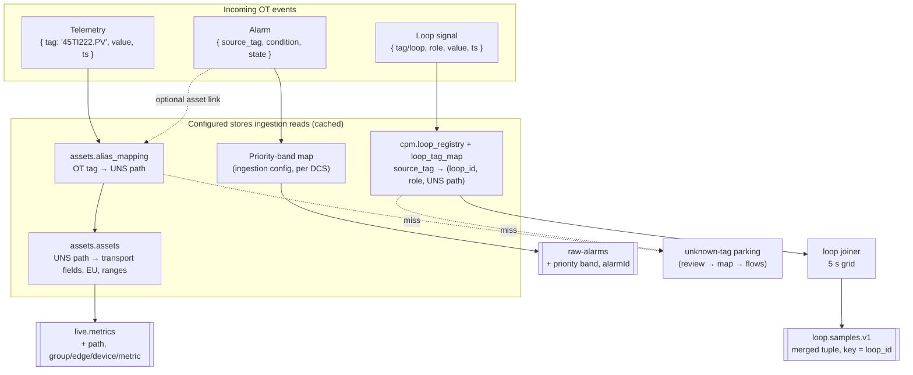
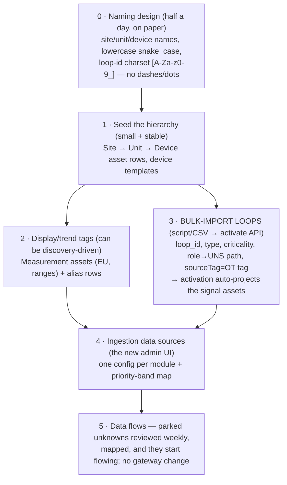

# Pre-Ingestion Configuration & UNS Bootstrap — What Must Exist Before Events Can Be Enriched

**The two questions this doc answers (2026-08-23):**

1. *What must be configured in our application first, so ingestion can map an incoming OT event, enrich it, and publish it to the right module? E.g., must the loop already be configured?*
2. *How is the UNS managed here — what comes first? Should control loops be bulk-imported with proper UNS so that when an event arrives with a loop/tag name, we already have the UNS for it?*

**Short answers up front:**

1. **Yes for loops — the CPM Loop Registry is the joiner's routing table; an unregistered loop's signals cannot be enriched into tuples.** For telemetry, the tag's asset + alias mapping must exist or the event *parks* (soft-fail, recoverable). For alarms, almost nothing must pre-exist — only the priority-band map; UNS linkage is optional enrichment.
2. **The UNS master is the Postgres asset model, and yes: bulk-import loops (script/CSV) with proper UNS paths + OT source tags *before* loop data flows.** Loop activation then auto-creates the signal assets (the projection), so when an event arrives carrying a loop or tag name, every lookup it needs already resolves. The recommended order is: naming design → hierarchy → (tags+aliases) → loops → ingestion configs.

**Companions:** [02](02-uns-asset-tag-loop-configuration.md) (full config-order guide), [03](03-mqtt-ingestion-enrichment-service.md) (enrichment pipeline design), [06](06-mqtt-topic-payload-contracts.md) (what OT publishes).

---

## 1. The mapping chain — what ingestion looks up, per event

Every inbound MQTT message goes through the same shape of flow: **decode → look up identity in a platform store → enrich → publish to the module's Kafka topic**. Which store, and what happens when the lookup misses, differs per module — and that's exactly what "configure first" means:



### 1.1 Per-module prerequisite table (the direct answer to question 1)

| Module | Must exist BEFORE the event arrives | Lookup ingestion performs | Enrichment added to the published event | On lookup miss |
|---|---|---|---|---|
| **Telemetry** | ① UNS hierarchy asset rows (site→unit→device), ② the **Measurement asset** for the tag (EU, ranges), ③ an **alias row** `OT tag → UNS path` | `alias_mapping[tag]` → `assets by-path` (cached; invalidated by `asset-events`) | UNS `path`, Sparkplug `group/edge/device/metric` (taken from asset-model — the single authority), normalized quality/type, data type | **Parks** in the unknown-tag inventory — reviewable, mapped later, flows on next cache refresh. Soft-fail by design; never auto-created |
| **Alarms** | ① the **priority-band map** (DCS priority → CRITICAL/HIGH/MEDIUM/LOW/DIAGNOSTIC — static config on the data source), ② mode of feed agreed (events vs snapshot-diff) | mostly none — alarm identity is name-based (`source_tag`+`condition`), carried through as-is | banded `priority`/severity, stable `alarmId`, normalized state/timestamps | n/a — alarms flow without any UNS entry. *Optional:* an alias row per alarming tag lets the platform link the alarm to an asset (`alarmSource` on display symbols); missing it degrades linkage, not the alarm |
| **CPA / Loops** | ① the **loop registered in the CPM Loop Registry** with role→UNS-path map **and `sourceTag` = the OT tag names**, ② (auto) signal assets — created by activation's projection, ③ mode-string map confirmed | `loop_tag_map[source_tag]` → `(loop_id, role, uns_path)`; registry sync feeds the joiner's per-loop state | membership in the merged 5 s tuple `{loop_id, ts, pv, sp, op, vp, mode, quality}` keyed by `loop_id`, + `loop_type` from the registry | **Parks.** A signal that maps to no registered loop cannot be joined — there is no tuple to put it in. This is why loops must be configured first |

Two design rules worth stating explicitly, because they answer "can we just send data and sort it out later?":

- **Telemetry: yes, partially.** The parking inventory *is* the discovery workflow (doc 03 §4.3) — publish first, then map from the observed list. The cost of mapping later is only lost history for the unmapped period.
- **Loops: no.** The joiner is registry-driven; and even though the Flink engine would technically compute on any `loop_id` that appears on the topic, an unregistered loop has no readiness checks, no evidence (peer links/step test), no UI listing, and a guessed loop class — so ingestion only emits tuples for registered loops, and registration is a hard prerequisite.

### 1.2 What the enriched event looks like (telemetry example)

```
IN  (MQTT ot/telemetry/houston/crude1/45TI222.PV):
    { "tag": "45TI222.PV", "value": 87.4, "ts": 1755940000000, "quality": 192 }

LOOKUPS: alias_mapping["45TI222.PV"] → "houston/crude1/ti222.temperature"
         assets by-path → { sparkplugGroup: "houston", edge: "houston_edge1",
                            device: "ti222", metric: "temperature", eu: "degC" }

OUT (Kafka live.metrics):
    { "group": "houston", "edge": "houston_edge1", "device": "ti222",
      "metric": "temperature", "value": 87.4, "quality": 192,
      "ts": 1755940000000, "type": "Double",
      "path": "houston/crude1/ti222.temperature" }   ← this field = trendable in IoTDB
```

The loop case is the same idea with one extra hop: `45FIC109.PV` → `loop_tag_map` → `(FIC10409, PV)` → held in the joiner's last-known-value state → emitted inside the next 5 s tuple for `FIC10409`.

---

## 2. How the UNS is managed here, and the bootstrap order (question 2)

### 2.1 Where the UNS lives (recap of the mechanics that matter)

- **Master = PostgreSQL `traverse_assets` (asset-model service).** One row per node; a "tag" is a Measurement asset (type 5). IoTDB paths, Sparkplug topics, Redis keys are *computed projections* of the contextual path — nobody administers a namespace anywhere else (doc 02 §7).
- **`alias_mapping` is the OT bridge** — it's how an OT tag name becomes a UNS path without renaming anything on the DCS.
- **Loops live in `traverse_cplm`**, referencing the UNS by path strings; `loop_tag_map.source_tag/source_system` columns exist precisely to also carry the OT tag names.
- There is **no asset bulk-import UI today** — initial load is script-driven (spreadsheet → REST), which is fine and repeatable.

### 2.2 The bootstrap order



**So, to the specific question — "with the control loops, should we ingest/bulk import them with the proper UNS first?" Yes, exactly that, via the scripted activate route:**

1. Build one **loop worksheet** (engineering handoff, one row per loop):
   `loop_id · display_name · site · area · unit · loop_type (FIC/PIC/LIC/TIC…) · criticality · pv_ot_tag · sp_ot_tag · op_ot_tag · mode_ot_tag · vp_ot_tag · [device asset for peer analysis]`
2. Decide each loop's **UNS paths by convention** — recommended: `{site}/{unit}/{loop_id_lowercase}.{role}` (e.g. `houston/crude1/fic10409.pv`) so paths are derivable from the worksheet, no hand-editing.
3. **Script → `POST /api/v1/cpm/loops/activate` per row** (the API route, not the UI wizard — only the API sets `sourceTag`, `assetId`, and `engineering`), with each tag entry carrying `unsPath` *and* `sourceTag` (the OT tag) *and* `sourceSystem: "ot-gateway"`.
4. Activation's **signal-asset projection** then creates the five Measurement assets per loop automatically (template `CpmLoopSignal`, transport overrides pointing at the loop data plane) — so the UNS entries exist without step 2 covering them.
5. Optionally, the same script writes **alias rows** for the loop signals too (`45FIC109.PV → houston/crude1/fic10409.pv`) — not required for the joiner (it uses `sourceTag`), but it makes the loop signals resolvable through the same telemetry path and keeps one uniform OT→UNS mapping story.

**Result:** when a loop event arrives carrying either the loop name (`FIC10409`) or the OT tag name (`45FIC109.PV`), every hop resolves — registry row, role, UNS path, signal asset with transport/history addresses — and the enriched tuple publishes with nothing manual left to do.

### 2.3 Route A vs Route B for loop signal assets (when to pre-model instead)

The projection (Route B above) is the fast default. Pre-model a loop's signals as ordinary tags under their device (Route A, step 2) only when the same signals will also be **browsed/bound on HMI displays under their real device** (`houston/crude1/fic10409` as a Device asset with children) — then reference those existing paths in the loop import and the projection just layers the loop-plane overrides on top instead of creating parentless assets. Mixed is fine per loop.

### 2.4 What deliberately does NOT need pre-configuration

- **Alarms** — no per-alarm setup in our app; the DCS's alarm configuration stays authoritative. Our side needs only the band map and, later, optional alias rows for asset-linking.
- **Every DCS tag** — only what displays/trends/loops actually use. The unknown-tag inventory converges the rest.
- **IoTDB namespace** — projections create themselves at write time (only per-site TTLs need adding, doc 02 §7.3).
- **The subscriber runtime** — data-source configs created now (phase 1) simply take effect when the phase-2 subscriber ships.

---

## 3. Readiness checklists (use before going live per module)

**Telemetry ready when:** hierarchy seeded · pilot tags have Measurement assets with EU/ranges · alias rows exist (`source_system: "ot-gateway"`) · data-source config (Process Telemetry profile) tested against the broker · unknown-tag parking being reviewed.

**Alarms ready when:** priority-band table agreed and configured · gateway sends every transition incl. CLEARED + ACK changes (or snapshot-diff mode chosen) · data-source config (Alarms profile) tested · (if in scope) ACK write-back endpoint + `ack_handle` pass-through confirmed.

**Loops ready when:** loop ids follow the registry charset · loop worksheet complete with OT source tags · bulk activate script run — registry rows + tag maps + projected signal assets verified (`GET /api/v1/cpm/loops`, per-loop `readiness` blockers green except samples) · mode-string map confirmed · data-source config (Control-Loop Signals profile) tested · pilot of 2–3 loops planned for the ≥ 12 h first-verdict soak.

**One-line summary:** *configure the three mapping stores — aliases for telemetry, the band map for alarms, the loop registry (with source tags) for CPA — in that bootstrap order, and every OT event that arrives can be resolved, enriched, and delivered to its module; anything unmapped parks visibly instead of vanishing.*
