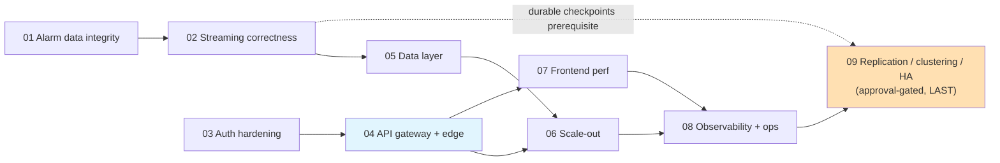

# Remediation Plans — Index

**Source:** [docs/architecture-review/09-gap-register.md](../architecture-review/09-gap-register.md) (53 gaps) and [11-proposed-architecture.md](../architecture-review/11-proposed-architecture.md).
**Baseline commit:** `4e2758c` · **Created:** 2026-08-09

Each plan groups **related changes** into one implementable unit. Plans are ordered by dependency and risk. **All replication / clustering / HA work is deliberately deferred to Plan 09**, which is approval-gated and runs last.

---

## Plan set

| Plan | Title | Phase | Effort | Gaps | Approval needed |
|---|---|---|---|---|---|
| [01](./01-alarm-data-integrity.md) | Alarm data integrity (no silent loss or duplication) | 1 | M | 7 | No |
| [02](./02-streaming-correctness-durability.md) | Streaming correctness & checkpoint durability | 1 | M | 8 | No |
| [03](./03-auth-security-hardening.md) | Auth & security hardening (non-edge) | 1–2 | M | 8 | No |
| [04](./04-api-gateway-and-edge.md) | API gateway & edge security | 2 | L | 4 | **Yes — funded track** |
| [05](./05-data-layer-retention-indexes-caching.md) | Data layer: retention, indexes, caching | 2 | M | 9 | No |
| [06](./06-scale-out-enablement.md) | Scale-out enablement (SignalR backplane) | 2 | M | 1 | No |
| [07](./07-frontend-performance.md) | Frontend performance & subscription hygiene | 2–3 | M | 7 | No |
| [08](./08-observability-and-ops.md) | Observability, secrets & container hardening | 3 | M | 5 | No |
| [09](./09-replication-clustering-ha.md) | **Replication, clustering & HA** | 4 | L | 4 | **Yes — gating decision** |

**Coverage check:** 7+8+8+4+9+1+7+5+4 = **53 gaps** — the full register, no orphans.

### Expansion plans (beyond the gap register)

| Plan | Title | Notes |
|---|---|---|
| [AUTH-rbac](./AUTH-rbac-phased-plan.md) | Full RBAC auth (custom roles, permission matrix, revocation, admin UI) | Product-driven expansion of Plan 03 (AUTH-05/08); role matrix + rationale in [AUTH-full-rbac-build-plan.md](./AUTH-full-rbac-build-plan.md). 4 phases. |

---

## Sequencing and dependencies

**Parallelizable:** Plans 01+02 (streaming/data team) can run alongside Plan 03 (security team). Plan 07 (frontend) is independent of the backend track apart from the gateway route change.

---

## Deferred-by-decision: what Plan 09 holds back

Per direction, **every replication/clustering item is postponed to Plan 09 pending approval**. This is a deliberate risk acceptance that must be visible:

| Deferred item | Gap | Severity | Risk while deferred |
|---|---|---|---|
| Kafka 3-broker KRaft, RF≥3, min-ISR 2 | STR-04 | **S1** | One broker restart still stalls the whole alarm pipeline |
| Flink JobManager HA | STR-03 | **S1** | A JM restart still drops all jobs (state now recovers from durable checkpoints after Plan 02, but the outage remains) |
| IoTDB 3C3D cluster | DATA-04 | S2 | Historian remains a single point of failure |
| PostgreSQL primary + replica + PgBouncer | DATA-05 | S2 | Database loss still takes down AMS + all Traverse services |

> **Consequence to state at approval:** Plans 01–08 close **9 of the 11 S1 blockers**. The remaining two (STR-03, STR-04) are in Plan 09. **Production sign-off is not achievable until Plan 09 completes.** Plans 01–08 materially reduce data-loss and security risk but do not deliver availability.

Plan 02 deliberately lands **durable remote checkpoint storage** (single-node MinIO/S3 — storage, not replication) early, because it is the prerequisite that makes Flink HA in Plan 09 a configuration change rather than a redesign.

---

## Plan format

Every plan uses the same structure so they can be picked up independently:

1. **Header** — phase, effort, gaps closed, dependencies
2. **Why** — the risk being retired
3. **Work items** — table of task → gap → file/location → effort
4. **Implementation steps** — concrete, file-level
5. **Exit criteria** — testable checkboxes
6. **Rollback** — how to revert safely
7. **Risks & notes**

Effort key: **S** ≤ 3 days · **M** ≤ 3 weeks · **L** > 3 weeks.
