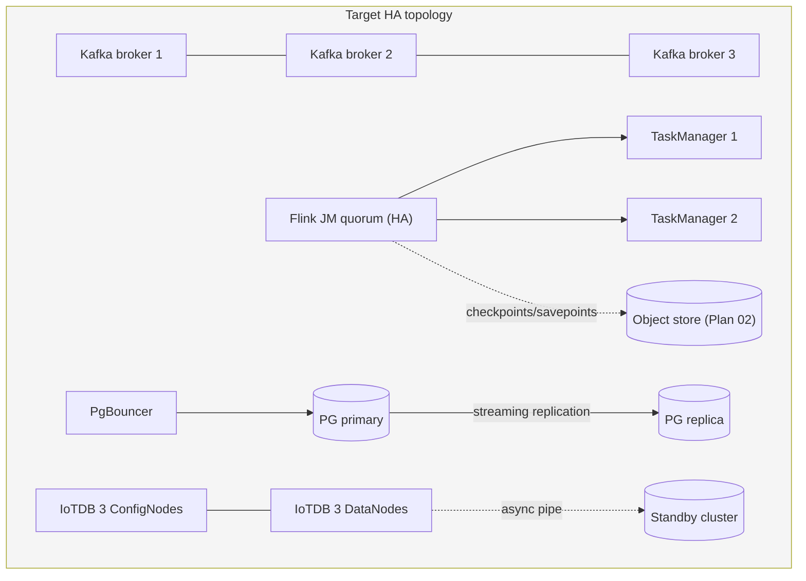

# Plan 09 — Replication, Clustering & High Availability

**Phase:** 4 (**LAST**) · **Effort:** L · **Depends on:** Plan 02 item 1 (durable remote checkpoints), Plan 06 (stateless app tier), Plan 08 (monitoring to observe failover)
**Gaps closed:** STR-03, STR-04, DATA-04 (reduced scope), DATA-05
**Status:** ✅ **APPROVED 2026-08-12 and executed as a drilled overlay.** Decisions:
Kafka 3 brokers **with ZooKeeper** (matches the existing production estate; KRaft
deliberately not taken) · Flink as recommended (2 JM ZK-HA + 2 TM) · IoTDB one main +
one async-pipe replica (DR, not consensus — reduced-scope DATA-04 by explicit decision) ·
Postgres primary + one streaming replica + PgBouncer · EMQX left single-node.
Topology lives in `infra/docker/docker-compose.ha.yml`; all four failover drills passed
in the lab (broker kill, JM kill with keyed-state restore in 9 s, replica promote, pipe
replication). Procedures, drill evidence, and the two traps found are in
[docs/ha-production-guide.md](../ha-production-guide.md). Production-remaining: SASL/mTLS
listeners, 3-node ZK, Patroni/PITR, IoTDB credential rotation — listed in the guide.

**Objective:** convert every single-instance store and compute cluster into a replicated, fault-tolerant topology so the platform survives the loss of any one node.

---

## Approval gate

Per direction, **all replication work is deferred to this plan and runs after everything else.** Nothing here starts until product/infrastructure approves:

| Decision | Options | Impact |
|---|---|---|
| **Target scale** | ≈2,000 concurrent operators (assumed) — confirm or revise | Fixes broker count, replica counts, node sizing |
| **Availability goal** | Full HA (survive any one node) vs. reduced (fast restore, accept downtime) | Determines whether the full topology below is adopted or a lighter footprint |
| **DR posture** | Standby cluster + async replication, or backup/restore only | Determines the IoTDB standby and PG PITR scope |
| **Budget / node count** | ~9–12 additional nodes for the full topology | Infrastructure cost |

The numbers below are the **vendor/spec-recommended HA minimums**, not the only viable option. A reduced footprint is legitimate if the business accepts a longer recovery time — but it must be an explicit, recorded decision.

> **Consequence of the deferral, stated plainly:** Plans 01–08 close **9 of the 11 S1 blockers**. The two that remain — Flink JobManager HA (STR-03) and Kafka replication (STR-04) — are in this plan. **Production sign-off is not achievable until this plan completes.** Until then a single broker restart still stalls the alarm pipeline and a JobManager restart still interrupts stream processing (state now survives, thanks to Plan 02, but the outage does not disappear).

---

## Current vs target topology

| Component | Current | Target (for approval) | Gap |
|---|---|---|---|
| Kafka | **1 broker**, ZooKeeper, RF=1, auto-create on | **3 brokers, KRaft**, RF≥3, `min.insync.replicas=2`, `acks=all`, auto-create off | STR-04 |
| Flink | **1 JM + 1 TM**, no HA, local checkpoints | **JM HA quorum + ≥2 TM**, remote checkpoints (from Plan 02) | STR-03 |
| IoTDB | **1 standalone** | **3C3D** (3 ConfigNodes Ratis, schema replica 3; 3 DataNodes IoTConsensus, data replica 2) + async pipe to standby | DATA-04 |
| PostgreSQL | **1 node**, no pooler | **Primary + replica** (Patroni) + **PgBouncer**, PITR backups | DATA-05 |
| Redis | 1 instance (two logical tiers after Plan 05) | Sentinel/cluster per tier if HA required | (optional) |
| EMQX | 1 node | Cluster ≥2 with shared auth/ACL | (optional, folded into Plan 04 hardening) |

---

## Work items

| # | Task | Gap | Effort |
|---|---|---|---|
| 1 | Kafka → 3-broker KRaft cluster, RF≥3 | STR-04 | L |
| 2 | Flink JobManager HA | STR-03 | M |
| 3 | PostgreSQL primary + replica + PgBouncer | DATA-05 | L |
| 4 | IoTDB 3C3D cluster (+ optional standby) | DATA-04 | L |
| 5 | Failover drills and runbooks | all | M |

## Implementation steps

### 1. Kafka cluster (STR-04)

- Migrate ZooKeeper → **KRaft** and scale to 3 brokers (do the KRaft migration and the scale-out as separate, verified steps — not one change).
- Set `default.replication.factor=3`, `min.insync.replicas=2`, `offsets.topic.replication.factor=3`; producers to `acks=all` with idempotence enabled.
- Turn **off** `auto.create.topics.enable` and provision every topic as code, with partition counts tied to consumer parallelism (today everything is the default 4 while `parallelism.default` is 1).
- Increase retention on the event-sourced topics — 24 h currently bounds replay to one day.
- Increase existing topics' RF via partition reassignment; verify no under-replicated partitions remain.
- Enable mTLS/SASL on the listeners (both are PLAINTEXT today, with the external one published to the host).

### 2. Flink HA (STR-03)

Prerequisite: durable remote checkpoint/savepoint storage from Plan 02 — HA without it buys nothing.

- Enable HA services (ZooKeeper quorum, or Kubernetes HA if the production profile is K8s) with `high-availability.storageDir` on the object store.
- Run ≥2 TaskManagers so a TM loss has somewhere to reschedule.
- **Subordinate the 60 s supervisor to the HA mechanism**: HA becomes the recovery path; the supervisor is reduced to a reconciliation safety net that only submits genuinely missing jobs (it must not fight HA-initiated restarts).
- Confirm jobs restore *with* keyed state after a JM kill — the acceptance test that distinguishes this from today's stateless resubmit.

### 3. PostgreSQL HA (DATA-05)

- Deploy primary + streaming replica under Patroni (or equivalent) with automated failover.
- Put **PgBouncer** (transaction pooling) in front; set explicit Npgsql pool sizes per service — every connection string currently uses defaults, with ~12 client processes sharing one instance.
- Pin the image by digest (currently the floating `latest-pg15` tag).
- Configure PITR/WAL archiving and rehearse a restore.
- Optionally route read-only analytics to the replica once replication lag is monitored.

### 4. IoTDB 3C3D (DATA-04)

- Deploy per platform specification §6: 3 ConfigNodes (Ratis, schema replica 3) + 3 DataNodes (IoTConsensus, data replica 2).
- Migrate existing series from the standalone node; validate the alarm (`root.ams.*`) and loop (`root.site1.cpm.*`) trees and the TTL policies survive the move.
- Move credentials off `root/root` (they are hardcoded in compose today, not even env-overridable).
- If DR is approved, configure async pipe replication to a standby cluster per spec §11.
- Add schema-template governance to cap series cardinality (auto-create-schema is on with no limits).

### 5. Drills and runbooks (all)

Prove each failure mode, with monitoring from Plan 08 observing it:

- Kill one Kafka broker → pipeline continues, no under-replicated partitions after recovery.
- Kill the JobManager → jobs restore with state; measure the interruption window.
- Fail over Postgres → services reconnect through PgBouncer within the target RTO.
- Kill one IoTDB DataNode → reads and writes continue.
- Document each with detection signal, expected behaviour, and manual steps if automation fails.

## Exit criteria

- [ ] Killing any single Kafka broker does not stall the alarm pipeline; zero under-replicated partitions after recovery.
- [ ] `auto.create.topics.enable=false`; every topic exists because it was provisioned as code.
- [ ] Killing the JobManager restores all jobs **with keyed state** from the remote checkpoint, automatically.
- [ ] Postgres failover completes within the agreed RTO with no service requiring a manual restart.
- [ ] Killing one IoTDB DataNode leaves trend queries and historian writes working.
- [ ] A restore-from-backup drill succeeds for Postgres and IoTDB.
- [ ] Failure-mode runbooks exist and have each been exercised at least once.
- [ ] **All 11 S1 blockers are closed** — production sign-off criteria met.

## Rollback

Each component migrates independently, so rollback is per-component:
- Kafka: keep the single-broker configuration until the 3-broker cluster passes its drill; the KRaft migration is the one step that is **not** trivially reversible — rehearse on a copy and take a full topic backup first.
- Flink: HA is configuration; disable to return to supervisor-only recovery.
- Postgres: promote the primary and detach the replica; PgBouncer can be bypassed by reverting connection strings.
- IoTDB: keep the standalone node until the cluster passes validation, then decommission.

## Risks & notes

- **Sequencing matters:** Kafka RF and Flink HA should land before the data-store migrations, because they carry the S1 severity and the smaller blast radius.
- **The KRaft migration is the highest-risk single step** in the entire programme — plan a maintenance window, rehearse on a copy of production data, and have the rollback tested.
- Migrating IoTDB and Postgres moves live historical data; both need a data-integrity verification step, not just a "service is up" check.
- Node count and cost follow directly from the approval decisions at the top of this document — settle those before any infrastructure is provisioned.
