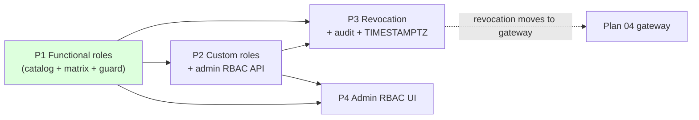

# Full RBAC Auth — Phase-wise Implementation Plan

**Companion to** [AUTH-full-rbac-build-plan.md](./AUTH-full-rbac-build-plan.md) (role matrix + rationale). **Expands** Plan 03 (AUTH-05, AUTH-08).
**Confirmed decisions:** shared roles, single role per user, custom roles supported, admin edits role→permission mappings, permissions are code-owned, **`system.manage` is Admin-only**.
**Baseline:** `4e2758c` · **Date:** 2026-08-10 · **Effort:** M (≈3–4 weeks across 4 phases)

Effort key: **S** ≤ 3 days · **M** ≤ 3 weeks. Each phase is independently shippable and validated.

---

## Phase summary

| Phase | Title | Delivers | Depends on | Effort |
|---|---|---|---|---|
| 1 | Functional roles | Complete catalog + default role matrix + drift guard → Engineer/Operator/Viewer actually work | — | S |
| 2 | Custom roles & admin API | Role CRUD, `rbac.manage`, reset-to-default, permission-gated admin | 1 | M |
| 3 | Propagation, audit, hardening | Token revocation on change, RBAC audit trail, TIMESTAMPTZ | 1, 2 | M |
| 4 | Admin RBAC UI | Role editor + permission matrix + user→role assignment (OpenBridge) | 2 | M |

---

## Phase 1 — Functional roles (catalog + matrix + drift guard)

**Objective:** every permission the services enforce is in the DB catalog and mapped to roles per the matrix, so non-admin roles become usable. Backend/data only — the highest-value, lowest-risk phase.

**Why first:** today only Admin (catch-all) can use the HMI; Engineer/Operator/Viewer are alarm-only because 12 enforced keys aren't in the catalog. This phase alone makes the role tiers real.

### Work items

| # | Task | Where |
|---|---|---|
| 1 | Canonical permission manifest (single source of truth) | `src/services/auth-service/src/rbac/permission-catalog.ts` (+ generated SQL) |
| 2 | Idempotent migration: add 12 missing keys + `rbac.manage`; extend role mappings to the matrix | new `database/scripts/37_rbac_catalog.sql` + mirror `auth-service/database/schema.sql` |
| 3 | CI drift guard: DB catalog == code-enforced keys | new `scripts/verify-permission-catalog.*` + `.github/workflows/ci-cd.yml` |
| 4 | Resolve the Personal-Views nuance (`display.personal.edit`?) | verify against `display-service` |

### Implementation steps

1. **Manifest** — one authoritative list of `{key, description, category, defaultRoles[]}` covering all ~25 keys (§2 of the build plan). Everything else derives from it: the SQL seed is generated from it, and the CI guard checks code against it.
2. **Migration `37_rbac_catalog.sql`** (`\c traverse_auth`, idempotent):
   - `INSERT … ON CONFLICT DO NOTHING` the 12 missing keys (`asset.*`, `binding.resolve`, `historian.view`, `display.*`, `template.*`, `analysis.*`) + `rbac.manage`.
   - **Additive** role→permission grants per the matrix (`INSERT … ON CONFLICT DO NOTHING`) — grant the new keys to Viewer/Operator/Engineer/Admin as the matrix dictates, **without removing** any existing custom grant. (Full realignment is the Phase 2 reset action, which is opt-in.)
   - Mirror into `auth-service/database/schema.sql` (the header says the two are kept in sync).
3. **Drift guard** — a script that extracts enforced keys from code (`RequireClaim("permission", …)` and `AddPolicy` across `src/backend` + `src/services`, plus display-service's `display.*`) and asserts the set equals the manifest; a second check asserts the SQL seed equals the manifest. Wire into CI as a gate. This is the mechanism that stops the drift that caused the missing 12.
4. **Personal Views** — check whether display-service gates personal-view CRUD under `display.edit`. If so, add `display.personal.edit` to the catalog and grant it to Operator, so operators manage their own views without controlled-display edit rights.

### Exit criteria
- [ ] Every code-enforced permission key exists in the DB catalog; the CI guard fails on any divergence.
- [ ] Fresh-bootstrap + existing-DB migration both land the matrix (tested against a throwaway Postgres, per Plan 01's pattern).
- [ ] A user with the Engineer role receives every Engineer permission in their token; Operator and Viewer likewise per the matrix.
- [ ] End-to-end: an Engineer (not Admin) can open the designer and save a display; an Operator can acknowledge but not suppress; a Viewer can open a trend but not acknowledge.

### Rollback
Migration is additive → reversible by deleting the added rows. The guard is CI-only. No app behaviour changes until roles are reassigned.

### Risks
Grants are additive so an existing custom mapping is never clobbered; the trade-off is that an already-initialised system role keeps any extra grants until an admin runs Phase 2's reset. Acceptable and documented.

---

## Phase 2 — Custom roles & admin RBAC API

**Objective:** admins create and manage custom roles; every admin action is gated by a permission, not a hardcoded role.

### Work items

| # | Task | Where |
|---|---|---|
| 1 | Role CRUD: `POST/PUT/DELETE /api/auth/roles` | `permission.controller.ts`, `permission.service.ts`, `auth.routes.ts` |
| 2 | System-role protection (no delete/rename; permissions editable) | `permission.service.ts` |
| 3 | `POST /roles/:role/permissions/reset` → matrix default | uses the Phase 1 manifest |
| 4 | Permission-gate admin endpoints (retire `requireAdmin`) | `rbac.middleware.ts` (`requirePermission` already exists, unused) |
| 5 | Delete-safety: block deleting a role that has users | `permission.service.ts` |

### Implementation steps

1. **Role CRUD** — create sets `is_system_role = FALSE`; `PUT` updates description (system roles) or renames (custom only); `DELETE` returns `409` for system roles and for roles with assigned users (or requires a reassign-target).
2. **Reset** — `POST /roles/:role/permissions/reset` restores a system role's mapping to the manifest default (the escape hatch for Phase 1's additive-only grants).
3. **Permission gating** — replace `requireAdmin` with `requirePermission('rbac.manage')` on role endpoints and `requirePermission('admin.users.edit')` on user endpoints. `requirePermission` is already written but unused. `hasElevatedRole` stays only as the bootstrap fallback for the seed admin.
4. Reuse the existing atomic `setRolePermissions` (validated, transactional) for both system and custom roles.

### Exit criteria
- [ ] Admin creates a custom role, assigns a permission subset, assigns a user to it, and that user's token carries exactly those permissions.
- [ ] System roles cannot be deleted or renamed (`409`); their permissions are editable and resettable to the matrix.
- [ ] Deleting a role with assigned users is refused (or requires reassignment).
- [ ] Every role/user admin endpoint is permission-gated; a non-admin with `rbac.manage` can manage roles, a plain Admin-role user still works via the mapped permission.

### Rollback
New endpoints are additive; the gating change reverts to `requireAdmin` by config/redeploy. Custom roles created during trial are deletable.

---

## Phase 3 — Prompt propagation, audit & schema hardening

**Objective:** role/permission/user changes take effect in seconds (not the 15-min token TTL), every change is auditable, and `traverse_auth` timestamps are timezone-aware.

### Work items

| # | Task | Gap | Where |
|---|---|---|---|
| 1 | `jti` + Redis revocation set; revoke on change | AUTH-05 | `auth.service.ts`, `_shared/TraverseAuth.cs` |
| 2 | Revoke affected users on role/permission edit | AUTH-05 | `permission.service.ts` |
| 3 | Emit RBAC changes to audit-service | — | auth-service → `audit-events` |
| 4 | `traverse_auth` → TIMESTAMPTZ | DATA-12 | new `database/scripts/38_auth_timestamptz.sql` |

### Implementation steps

1. **Revocation** — add `jti` to access tokens; on logout, password change, user deactivation, user role change, and any role→permission edit, write the affected `jti`(s) (or a per-user "tokens issued before T are invalid" marker) to a Redis set with TTL = remaining token lifetime. Validators check it. **Enforcement point:** the shared validation module now; moves to the gateway when Plan 04 lands (single check point). A role→permission edit revokes every live token for users holding that role, so they re-mint with the new set on next request.
2. **Audit** — auth-service emits `audit-events` (role created/deleted/renamed, mapping changed with before/after, user role changed, user deactivated) to the tamper-evident audit-service. `setRolePermissions` currently logs to app log only.
3. **TIMESTAMPTZ** — convert the five `traverse_auth` tables' timestamp columns; idempotent, tested against a throwaway Postgres.

### Exit criteria
- [ ] Editing the Engineer role's permissions changes what a logged-in engineer can do within seconds (verified), not after 15 min.
- [ ] Deactivating a user invalidates their live token within seconds.
- [ ] Every RBAC change appears in the audit trail with actor + before/after.
- [ ] `traverse_auth` timestamps are `TIMESTAMPTZ`.

### Rollback
Revocation set empty = current behaviour (fail-open to TTL expiry). Audit emit is fire-and-forget. TIMESTAMPTZ migration: snapshot first, reversible column-type change.

### Dependency note
Full gateway-enforced revocation lands with Plan 04; Phase 3 enforces via the shared module in the interim so it is not blocked.

---

## Phase 4 — Admin RBAC UI

**Objective:** admins manage roles, permissions, and user assignments from the HMI (OpenBridge), not curl.

### Work items

| # | Task |
|---|---|
| 1 | Role list + create/edit/delete custom role; reset system role |
| 2 | Permission matrix editor — checkboxes grouped by domain, from `GET /permissions` |
| 3 | User → role assignment (extend existing user-management screen) |
| 4 | Guard the screens behind `rbac.manage` / `admin.users.edit` |

### Implementation steps
1. Role editor screen using OpenBridge components per `openbridge-agent-rules.md` (load the `openbridge` skill before building UI). Permission checkboxes grouped by the catalog `category`.
2. Save via the existing `PUT /roles/:role/permissions`; create/delete via the Phase 2 endpoints.
3. Extend the existing user CRUD UI with a role dropdown fed by `GET /roles`.
4. `RequirePermission` guards on the routes.

### Exit criteria
- [ ] An admin performs the full lifecycle (create custom role → assign permissions → assign users → edit → reset/delete) entirely in the UI.
- [ ] The permission matrix editor reflects the live catalog and role mappings.
- [ ] Screens are hidden/denied without `rbac.manage` / `admin.users.edit`.
- [ ] UI passes `npm run lint` (max-warnings 0) and uses only OpenBridge components.

---

## Cross-cutting

- **Testing:** SQL migrations validated against a throwaway Postgres (Plan 01 pattern); auth-service API tested per its existing setup; a token-claims test proving each role yields the matrix; the drift guard as a CI gate.
- **Sequencing:** Phase 1 ships on its own and should go first — it converts the roles from decorative to functional. Phases 2–3 can overlap (different surfaces). Phase 4 follows Phase 2's API.
- **Out of scope here (tracked elsewhere):** key rotation (AUTH-06), OIDC discovery, mTLS service identity — Plan 03/10. Not blockers for RBAC.
